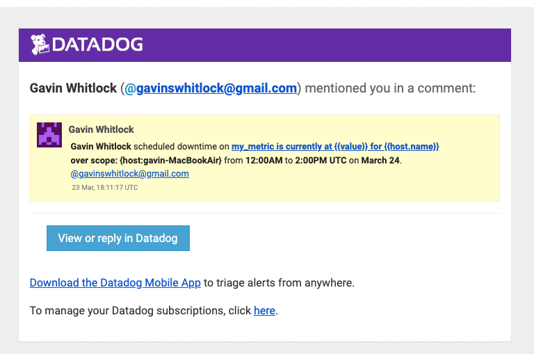
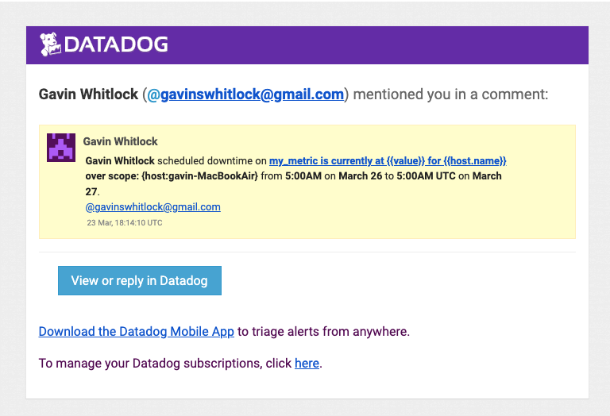

# Roy Kiesler Hiring Exercise

## Prerequisites

Verify that the Ubuntu Linux VM uses minimum `v.16.04` to avoid dependency issues:

```bash
vagrant ssh
Welcome to Ubuntu 18.04.3 LTS (GNU/Linux 4.15.0-58-generic x86_64)
```

## Collecting Metrics

1. I defined the following tags in the Agent config file (`/etc/datadog-agent/datadog.yaml`) and restarted the agent to apply the changes. **Figure 1** shows the updated Host Map page.

   ```yaml
   tags:
     - environment: dev
       owner: Roy Kiesler
       owner_email: rkiesler@gmail.com
       owner_phone: 925-876-6323
   ```

   
   **Figure 1:** Host Map with Tags

2. I installed both MySQL and PostgresSQL on the VM and configured the Agent to collect the basic performance metrics using the default configuration options. **Figure 2** and **Figure 3** show the respective database dashboard pages.

   
   **Figure 2:** MySQL Dashboard

   
   **Figure 3:** PostgreSQL Dashboard

3. I created a custom check using the instructions on https://docs.datadoghq.com/developers/write_agent_check/?tab=agentv6v7.

   The check implementation code (`/etc/datadog-agent/checks.d/my_check.py`) is as follows:

   ```python
   from datadog_checks.base import AgentCheck
   from random import randint

   # content of the special variable __version__ will be shown in the Agent status page
   __version__ = "1.0.0"

   class MyCheck(AgentCheck):
      def check(self, instance):
         random_val = randint(1, 1000)
         self.gauge('rkiesler.my_metric', random_val)
   ```

   
   **Figure 4:** Custom Metrics Dashboard

4. **Bonus Question:** In order to change the collection interval to only submit the metric every 45 seconds _without_ changing the Python code, I added the `min_collection_interval` setting to the check configuration file (`/etc/datadog-agent/conf.d/my_check.yaml`):

   ```yaml
   init_config:

   instances:
     - min_collection_interval: 45
   ```

## Visualizing Data

1. Using the [Timeboard API](https://docs.datadoghq.com/dashboards/guide/timeboard-api-doc/?tab=bash), I used the following script to create a timeboard:

   ```bash
   #!/bin/bash
   api_key=<My API Key>
   app_key=<My Application Key>

   curl -X POST 'https://api.datadoghq.com/api/v1/dash?api_key=${api_key}&application_key=${app_key}' \
   -H 'Content-Type: application/json' \
   -d '{
       "graphs": [
          {
             "title": "Custom Metric Scoped Over Host",
             "definition": {
                "events": [],
                "requests": [
                   {
                      "q": "avg:rkiesler.my_metric{host:vagrant}"
                   }
                ],
                "viz": "timeseries"
             }
          },
          {
             "title": "PostgresSQL Metric w/ Anomaly Function",
             "definition": {
                "events": [],
                "requests": [
                   {
                      "q": "anomalies(avg:postgresql.bgwriter.checkpoints_timed{host:vagrant}, '\''basic'\'', 3)"
                   }
                ],
                "viz": "timeseries"
             }
          },
          {
             "title": "Custom Metric w/ Rollup Function",
             "definition": {
                "events": [],
                "requests": [
                   {
                      "q": "rkiesler.my_metric{host:vagrant}.rollup(sum, 3600)"
                   }
                ],
                "viz": "timeseries"
             }
          }
       ],
       "title": "Hiring Exercise",
       "description": "Visualizing Data",
       "read_only": "True"
   }'
   ```

   * The first graph in this timeboard displays the average value of the custom `rkiesler.my_metric` metric scoped over the host.

   * The second graph applies the `anomalies` function to the `ostgresql.bgwriter.checkpoints_timed` metric (scoped over the host) using the basic anomaly detection algorith and a threashold of 3 standard deviations above the average value.

   * The third graph shows the custom `rkiesler.my_metric` metric scoped over the host and rolled up to sum all the data points in the past hour.

   **Note:** the following timeboard screenshot includes a fourth graph not described above, which I added when working on the Monitoring Data section of this exercise. Details provided in that section.

   
   **Figure 5:** Timeboard ([direct link](https://app.datadoghq.com/dashboard/ufp-vd5-3wz/hiring-exercise?from_ts=1584566399471&live=true&tile_size=m&to_ts=1584580799471))

2. Below is the snapshot I sent to myself using the `@` notation:

   
   **Figure 6:** E-mail Snapshot

3. **Bonus Question:** the anomaly graph is showing repeated anomalies for the `postgresql.bgwriter.checkpoints_timed` metric every 5 minutes. Checkpoints are periodic maintenance operations that Postgres  performs to ensure that all data that's been cached in memory has been synchronized with the disk in order to reduce recovery time should a crash occur.

   
   **Figure 7:** 1-hr Snapshot

   The even distribution of anomalies is due to the zero activity of the database on my VM. Since there is no query/insert/update activity, the checkpoints happen every 5 minutes. Normally, you’d want a checkpoint to happen no more than every five minutes. On a busier database serving demanding application(s), the interval might need to be increased in order to keep up. Anomalous values, i.e., either too frequent checkpoints or too long checkpoint intervals can be indicators of a performance problem or a need to tune the database.

## Monitoring Data

1. **Clarification:** This assignment for this section states:

   > Since you’ve already caught your test metric going above 800 once, you don’t want to have to continually watch this dashboard to be alerted when it goes above 800 again.

   The way I initially read this sentence was that I was to apply the `anomalies` function to my custom metric `rkiesler.my_metric`; however, the 2nd bullet instruction on the previous Visualizing Data section indicated that I should use a database metric:

   > Any metric from the Integration on your Database with the anomaly function applied.

   To ensure I did not misinterpret these instructions, I added a 4th graph to my timeboard with the `anomalies` function applied to my custom metric. I modified the API call by adding the following definition to the `graphs` array in the JSON request body:

   ```json
   {
      "title": "Custom Metric w/ Anomaly Function",
      "definition": {
         "events": [],
         "requests": [
            {
               "q": "anomalies(avg:rkiesler.my_metric{host:vagrant}, 'basic', 3)"
            }
         ],
         "viz": "timeseries"
      }
   }
   ```

   The new graph shows multiple deviations above and below the tolerance band (not exactly at 800, but reasonably close). ***Figure 5** above shows the updated timeboard with the 4 graphs.

   
   **Figure 8:** Custom Metric Anomalies

2. Next, with the new graph in place, I created the metric monitor with conditions for alert, warning, and no data, along with respective notifications. I was pleased to learn about the no data alert option, as it can prevent a false sense that everything is working fine since no alerts are triggered, while the real reason for the lack of alerts could be an issue with the agent preventing it from sending metrics.

   
   **Figure 9:** Custom Metric Monitor ([direct link](https://app.datadoghq.com/monitors/16983486))

   The following shows a alert notification generated using the Test Notification feature:

   
   **Figure 10:** Custom Metric Monitor Notification

3. **Bonus Question:** To avoid being alerted outside office hours, I created two scheduled monitor downtimes:

   
   **Figure 11:** Monitor Weekday Downtime ([direct link](https://app.datadoghq.com/monitors#downtime?id=769390119))

   
   **Figure 12:** Monitor Weekend Downtime ([direct link](https://app.datadoghq.com/monitors#downtime?id=769392310))

   When the daily downtime kicked in at 7:00PM, I received the following notification:

   
   **Figure 13:** Monitor Downtime Notification

## Collecting APM Data

1. In order to run the Flask app, I first had to install `pip3` and use it to install the `flask` dependency. I then ran and tested the API endpoints using:

   ```bash
   curl http://localhost:5050
   Entrypoint to the Application

   curl http://localhost:5050/api/apm
   Getting APM

   curl -X POST http://localhost:5050/api/trace
   <!DOCTYPE HTML PUBLIC "-//W3C//DTD HTML 3.2 Final//EN">
   <title>405 Method Not Allowed</title>
   <h1>Method Not Allowed</h1>
   <p>The method is not allowed for the requested URL.</p
   ```

   Reading the code, I used the POST call for the `/api/trace` endpoint expecting the response `Posting Traces`, but realized the endpoint was still configured to accept GET requests, so I modified the Flask annotation to:

   ```python
   @app.route('/api/trace', methods = ['POST'])
   ```

   Now, the `curl` call returned successfully:

   ```bash
   curl -X POST http://localhost:5050/api/trace
   Posting Traces
   ```

2. Next, I installed `ddtrace` and configured the trace environment variables as follows:

   ```bash
   export DATADOG_ENV=dev
   export DATADOG_SERVICE_NAME=hiring_flask_app
   ```

3. Finally, I ran the Flask app using the command `ddtrace-run python3 flask_app.py` and repeated the `curl` commands from step 1 a few times. The following show a sample metric over the `dev` environment and the new `hiring_flask_app` service (both variables defined in step 2).

   
   **Figure 14:** Flask App Trace

   
   **Figure 15:** Flask Service View ([direct link](https://app.datadoghq.com/apm/service/hiring_flask_app/flask.request?hostGroup=&selectedEnv=dev&start=1584576840972&end=1584580440972&paused=false&env=dev))

4. **Bonus Question:** as per the [APM Glossary](https://docs.datadoghq.com/tracing/visualization/), services are defined as logical groupings of resources such as an API endpoints (e.g., the `/api/trace` endpoint in the Flask app), queries (e.g., a SQL `SELECT` statement in a MySQL or Postgres database), or jobs (e.g., Spark). Modern day applications commonly leverage microservices architecture, and being able to monitor the health of application and drill-down into each individual service and its respective resources is required to be able to maintain SLAs and ensure optimal application performance and quick resolution of any issues that might arise.

## Final Question

Rather than coming up with a novel and creative use for Datadog, I decided to take a more practical approach and extend this exercise by monitoring the [Lucidworks Fusion](https://lucidworks.com/products/fusion/) search platform using the Datadog Kubernetes agent. For the purpose of this extra task, I am using my personal K8s namespace named `rkiesler-sandbox-51` in a GKE cluster.

1. To start, I installed the Datadog K8s agent using the following [Helm](https://docs.datadoghq.com/agent/kubernetes/?tab=helm) command:

   ```bash
   helm install rkiesler-datadog-agent -f datadog-values-config.yaml --set datadog.apiKey=<my_api_key> stable/datadog
   NAME: rrkiesler-datadog-agent
   LAST DEPLOYED: Thu Mar 19 07:44:13 2020
   NAMESPACE: rkiesler-sandbox-51
   STATUS: deployed
   REVISION: 1
   TEST SUITE: None
   NOTES:
   Datadog agents are spinning up on each node in your cluster. After a few
   minutes, you should see your agents starting in your event stream:
       https://app.datadoghq.com/event/stream
   ```

   Looking at the event stream, I could see the agent is successfully deployed. My Vagrant VM was no longer the only spot of color on the host map view, and drilling down into the new nodes I could see the various Docker containers running on that host. Monitoring this K8s-orchestrated infrastructure using Datadog was a very smooth and easy experience. **Very cool!**

   
   **Figure 16:** Datadog K8s Agent Deployed

   
   **Figure 17:** Updated Host Map

   
   **Figure 18:** Docker Containers
