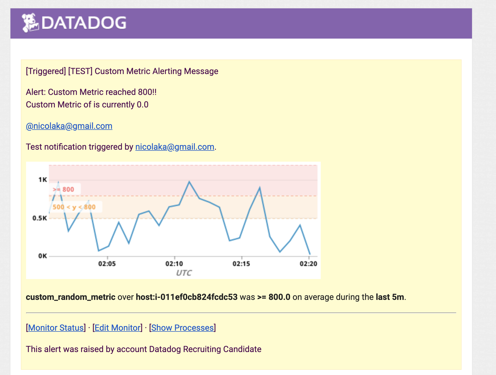

## Nicola Kabar's Answers

### Collecting Metrics

- I went with the Dockerized agent route so I added tags using the `-e DD_TAGS=environment:aws` environment variable when launching the agent container using the following command:

```

docker run -d \
--name dd-agent \
-v /var/run/docker.sock:/var/run/docker.sock:ro \
-v /proc/:/host/proc/:ro \
-v /sys/fs/cgroup/:/host/sys/fs/cgroup:ro \
-v /opt/datadog-agent/conf.d:/conf.d:ro \
-v /opt/datadog-agent/checks.d:/checks.d:ro \
-e DD_API_KEY=XXXXXXXXX \
-e DD_TAGS=environment:aws \
-e DD_APM_ENABLED=true \
-p 8126:8126/tcp \
datadog/agent:latest


```


- I also installed MongoDB on the host(natively) and went through the Datadog console to configure the MongoDB integration


Also to confirm I checked the agent status:

```
~# docker exec -it dd-agent agent status
<snip>
    mongo (1.8.0)
    -------------
      Instance ID: mongo:1ec1f3649b117f44 [OK]
      Total Runs: 11
      Metric Samples: Last Run: 334, Total: 3,674
      Events: Last Run: 0, Total: 0
      Service Checks: Last Run: 1, Total: 11
      Average Execution Time : 29ms
<snip>
```

-For the custom check, I followed https://docs.datadoghq.com/developers/write_agent_check/?tab=agentv6 and installed the python script here:

```
root@ip-10-99-31-215:/opt/datadog-agent-conf.d# cat conf.d/custom_random_metric.yaml
instances: [{}]
root@ip-10-99-31-215:/opt/datadog-agent-conf.d# cat checks.d/custom_random_metric.py
import random

# the following try/except block will make the custom check compatible with any Agent version
try:
    # first, try to import the base class from old versions of the Agent...
    from checks import AgentCheck
except ImportError:
    # ...if the above failed, the check is running in Agent version 6 or later
    from datadog_checks.checks import AgentCheck

# content of the special variable __version__ will be shown in the Agent status page
__version__ = "1.0.0"


class MyRandomCheck(AgentCheck):
    def check(self, instance):
        self.gauge('custom-random-metric', random.randint(0,1000))
```
-  Following https://docs.datadoghq.com/developers/write_agent_check/#collection-interval, I adjusted the `min_collection_interval` to 45 to have it send the random metric every 45s.

```
init_config:

instances:
  - min_collection_interval: 30
```

- Bonus Question: I did not have to change the interval time from the python script itself. I did it using the agent configuration option. Below is a confirmation:

```
  custom_random_metric (1.0.0)
    ----------------------------
      Instance ID: custom_random_metric:5ba864f3937b5bad [OK]
      Total Runs: 2
      Metric Samples: Last Run: 1, Total: 2
      Events: Last Run: 0, Total: 0
      Service Checks: Last Run: 0, Total: 0
      Average Execution Time : 0s
```

### Visualizing Data:

Below is the resulting dashboard along with the JSON representation of it. Using CURL, I was able to create the dashboard( from https://docs.datadoghq.com/api/?lang=bash#dashboards).


```

api_key=XXXX
curl  -X POST -H "Content-type: application/json" \
-d '{
      "title" : "Nico's Custom Dashboard",
      "widgets" : [
{
  "viz": "timeseries",
  "requests": [
    {
      "q": "avg:custom_random_metric{host:i-011ef0cb824fcdc53}",
      "type": "line",
      "style": {
        "palette": "dog_classic",
        "type": "solid",
        "width": "normal"
      },
      "aggregator": "avg",
      "conditional_formats": []
    }
  ],
  "autoscale": true
},
{
  "viz": "timeseries",
  "requests": [
    {
      "q": "avg:mongodb.dbs{host:i-011ef0cb824fcdc53} by {service,environment}",
      "type": "area",
      "style": {
        "palette": "dog_classic",
        "type": "solid",
        "width": "normal"
      },
      "aggregator": "avg",
      "conditional_formats": []
    }
  ],
  "color_by_groups": [],
  "autoscale": true,
  "xaxis": {
    "scale": "linear",
    "min": "auto",
    "max": "auto",
    "includeZero": true,
    "label": ""
  },
  "yaxis": {
    "scale": "linear",
    "min": "auto",
    "max": "auto",
    "includeZero": true,
    "label": ""
  }
},
{
  "viz": "query_value",
  "requests": [
    {
      "q": "sum:custom_random_metric{host:i-011ef0cb824fcdc53}",
      "type": null,
      "style": {
        "palette": "dog_classic",
        "type": "solid",
        "width": "normal"
      },
      "aggregator": "sum",
      "conditional_formats": [
        {
          "comparator": ">",
          "palette": "white_on_red",
          "value": null
        },
        {
          "comparator": ">=",
          "palette": "white_on_yellow",
          "value": null
        },
        {
          "comparator": "<",
          "palette": "white_on_green",
          "value": null
        }
      ]
    }
  ],
  "autoscale": true,
  "precision": "undefined"
}],
      "layout_type": "ordered",
      "description" : "Custom Dashboard",
      "is_read_only": true,
      "notify_list": ["nico@example.com"],]
}' \
"https://api.datadoghq.com/api/v1/dashboard?api_key=${api_key}&application_key=${app_key}"

```


### Monitoring Data

Below is the notification I got when testing the Monitor Alert I created.



For the bonus question:


### Collecting APM Data

I tried enabling APM in the Docker DataDog container using the `-e DD_APM_ENABLED=true ` however it is still shows up as 

```
# Enable APM by setting the DD_APM_ENABLED envvar to true, or override this configuration
apm_config:
  enabled: false
```

within the dd-agent container. I went through launching the Flask app using `/app# ddtrace-run python app.py &`, however it did not show up under the `APM` section in the dashboard. I'm not sure if i'm missing a step here but the docs made it sound that these were the only requirements to start seeing the tracing data in the dashboard.

### Final Question

I would use Datadog to monitor all Kubernetes admission controller and/or operator API calls. From a security perspective, it can be extremely useful to correlate between Kubernetes application deployments and the corresponding operator/admission controller calls associated with them.
