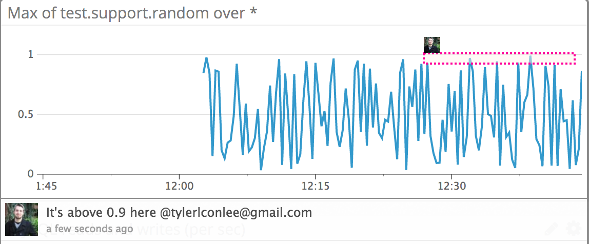

## Level 1 - Collecting your Data

**Bonus question: In your own words, what is the Agent?**
The agent is a daemon process that resides on your server, collecting metrics and sending them to DataDog. The three part approach of a system metric collector, a custom metric collector and the forwarder, which sends metrics to DataDog, allows for customization of exactly what gets collected and sent.

## Level 2 - Visualizing your Data

https://app.datadoghq.com/dash/249972/support-engineering-dashboard

**Bonus question: What is the difference between a timeboard and a screenboard?**
A timeboard shows modules that utilize the same time window, often used for viewing real time data. Integration dashboards look to be comprised mostly of timeboards by default. Screenboards, however, have modules with individual time windows, or even static data that doesn't rely on time. 

## Level 3 - Alerting on your Data 

https://app.datadoghq.com/monitors#1631294

