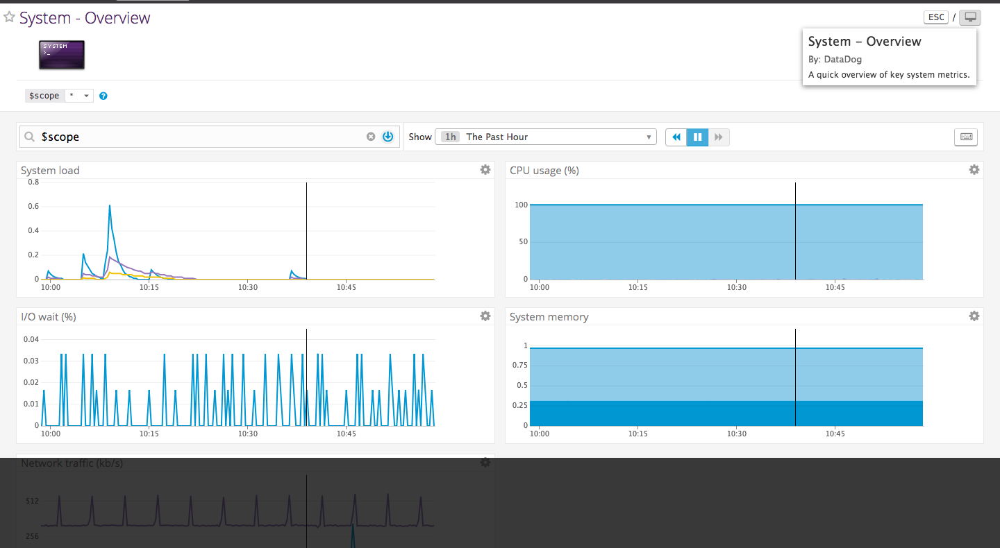
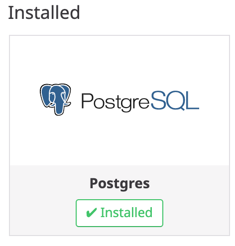
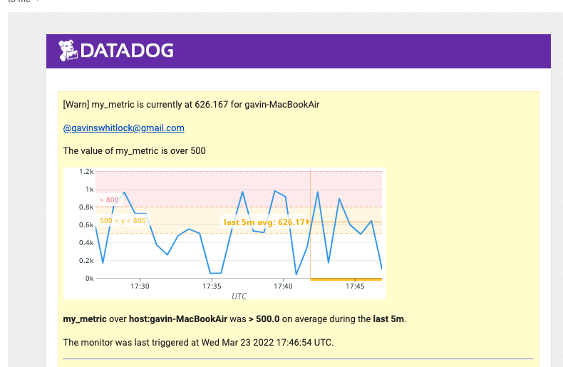

##### _The first thing I did was..._
I set up the Vagrant Ubuntu VM:


Then, I installed the Datadog Agent for Ubuntu:


and got the Agent reporting [system metrics](https://app.datadoghq.com/dash/integration/1/system---overview?live=true&page=0&is_auto=false&from_ts=1531317665377&to_ts=1531321265377&tile_size=m):



---
#### _The next thing I did was..._

I added some tags. Here they are on the Host Map page in Datadog:


Then, I successfully installed the PostgreSQL integration:


---

**my_metric.py**

This file is the Agent Check which submits a metric named `my_metric` with a random integer between 0 and 1000.

```python
from checks import AgentCheck
from random import randint

class RandomMetric(AgentCheck):
    def check(self, instance):
        self.gauge('my_metric', randint(0, 1000))
```

**my_metric.yaml**

This file controls the submission interval for `my_metric` and it is set to 45 seconds using the `min_collection_interval` key.

```yaml
init_config:

instances:
  - min_collection_interval: 45
```
---
#### Bonus Question:

Can you change the collection interval without modifying the Python check file you created?

#### Bonus Answer:

Yes, you can change the min_collection_interval in the **.yaml** file for the metric that you created to whatever interval you'd like. If you don't set it then it defaults to approximately 15-20 seconds.

---

#### Visualizing Data answers

I used POSTMAN to access the Datadog API. I made a POST request to:
https://api.datadoghq.com/api/v1/dash?api_key=848bc620be9c697d90db8e52e85eb55d&application_key=d84eb73de427ce7f3319fd9c6a73380beb04c450

I used the following JSON in the body of the POST request.

```json
{
    "dash": {
        "read_only": true,
        "graphs": [
            {
                "definition": {
                    "viz": "timeseries",
                    "requests": [
                        {
                            "q": "avg:my_metric{*} by {ubuntu-xenial}"
                        }
                    ],
                    "events": []
                },
                "title": "Average of my_metric"
            },
            {
                "definition": {
                    "viz": "timeseries",
                    "requests": [
                        {
                            "q": "anomalies(avg:postgresql.rows_fetched{*}, 'basic', 2)"
                        }
                    ],
                    "events": []
                },
                "title": "Anomolies for bgwriter.checkpoints_timed Metric on postgresQL integration"
            },
            {
                "definition": {
                    "viz": "timeseries",
                    "requests": [
                        {
                            "q": "my_metric{*}.rollup(sum, 3600)"
                        }
                    ],
                    "events": []
                },
                "title": "Roll up sum for my_metric"
            }
        ],
        "template_variables": [
            {
                "default": "host:ubuntu-xenial",
                "prefix": "host",
                "name": "Gianpaul Rachiele"
            }
        ],
        "description": "Datadog Hiring Exercise",
        "title": "Solutions Engineer Timeboard",
        "created": "2018-07-10T18:59:29.243575+00:00",
        "id": 857060,
        "created_by": {
            "disabled": false,
            "handle": "gianpaul817@gmail.com",
            "name": "Gianpaul Rachiele",
            "is_admin": true,
            "role": null,
            "access_role": "adm",
            "verified": true,
            "email": "gianpaul817@gmail.com",
            "icon": "https://secure.gravatar.com/avatar/84ab1cbaca27169d45c21a29ebab1c71?s=48&d=retro"
        },
        "modified": "2018-07-10T18:59:29.277563+00:00"
    },
    "url": "/dash/857060/solutions-engineer-timeboard",
    "resource": "/api/v1/dash/857060"
}
```

This POST request, with the JSON above as the body, created the following charts in my dashboard. They each display a 5 minute timeframe. The graphs below are the result of sending myself a email using the @ notation in a comment on the graph.

### Here's a link to my custom [timeboard](https://app.datadoghq.com/dash/857060/solutions-engineer-timeboard?live=true&page=0&is_auto=false&from_ts=1531283492073&to_ts=1531287092073&tile_size=m)

##### average_my_metric


##### Roll up sum for my_metric


##### Anomalies graph on postgreSQL Integration.


---

#### Bonus Question:

What is the Anomaly graph displaying?

#### Bonus Answer:

The anomaly graph is displaying a range of expected results based on past values output by the metric of the integration. So anything outside of the expected range **(the gray area)** is going to be shown as an anomaly **(a red line)**.

---

## Monitoring Data

The following Metric Monitor has a:
* Warning threshold of 500
* Alerting threshold of 800
* And notifies me if there is No Data for this query over the past 10m.


There was an issue where I kept getting "No Data is being reported." I fixed the issue by setting a value in the "Delay evaluation by `x` seconds." I set the value to 1200 seconds because I noticed that there was a delay of about 15 to 20 minutes for the metric being reported.

I configured the monitor’s message so that it will:

* Send you an email whenever the monitor triggers.
* Create different messages based on whether the monitor is in an Alert, Warning, or No Data state.
* Include the metric value that caused the monitor to trigger and host ip when the Monitor triggers an Alert state.


#### Metric Monitor Emails

**Warning email**



**Alert email**


**Bonus Question**:


  * A monitor downtime that silences the monitor from 7pm to 9am daily on M-F

  

  * And a monitor downtime that silences it all day on Sat-Sun

  

## Collecting APM Data:

#### Fully Instrumented App
```python
from flask import Flask
import blinker as _
import logging
import sys

from ddtrace import tracer
from ddtrace.contrib.flask import TraceMiddleware

# Have flask use stdout as the logger
main_logger = logging.getLogger()
main_logger.setLevel(logging.DEBUG)
c = logging.StreamHandler(sys.stdout)
formatter = logging.Formatter('%(asctime)s - %(name)s - %(levelname)s - %(message)s')
c.setFormatter(formatter)
main_logger.addHandler(c)

app = Flask(__name__)

traced_app = TraceMiddleware(app, tracer, service="my-flask-app", distributed_tracing=False)

@app.route('/')
def api_entry():
    return 'Entrypoint to the Application'

@app.route('/api/apm')
def apm_endpoint():
    return 'Getting APM Started'

@app.route('/api/trace')
def trace_endpoint():
    return 'Posting Traces'

if __name__ == '__main__':
    app.run(host='0.0.0.0', port='5050')
```
---

**Bonus Question**: What is the difference between a Service and a Resource?

A service is a set of processes that carry out a particular job and a resource is an action for a service.

[source](https://docs.datadoghq.com/tracing/visualization/)

---

Provide a link and a screenshot of a Dashboard with both APM and Infrastructure Metrics.


[link to dashboard](https://app.datadoghq.com/dash/857060/solutions-engineer-timeboard?live=true&page=0&is_auto=false&from_ts=1531277211699&to_ts=1531280811699&tile_size=m)


## Final Question:

Datadog has been used in a lot of creative ways in the past. We’ve written some blog posts about using Datadog to monitor the NYC Subway System, Pokemon Go, and even office restroom availability!

Is there anything creative you would use Datadog for?

I would use Datadog for tracking airport statistics. I would like to see what times of day airports have the most on-time departures and arrivals. I would also like to track what type of weather causes the most delays into and out of airports. This could be a good way for consumers to know which timeframes generally have the best on time percentages and help them to book their itineraries accordingly.

## Sidenote:

I initially had a lot of trouble getting everything up and running. I chose not to use a VM that ran Ubuntu and instead opted to run the datadog-agent on my OSX. That choice ended up causing some issues where certain metrics were not reporting i.e. the I/O metric. In the end, I read through the docs very carefully and started all over from scratch and used the VM running Ubuntu 16.04 and was able to fully complete the exercise.

I want to thank you for the opportunity to complete this hiring exercise. It was a great learning experience and extremely gratifying to see completed!

Thank you so much!
