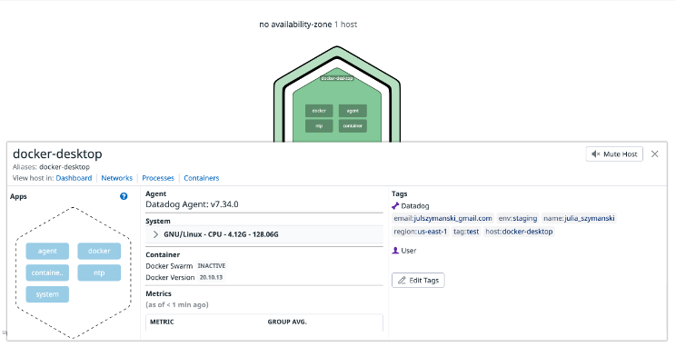
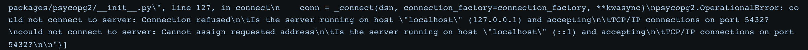
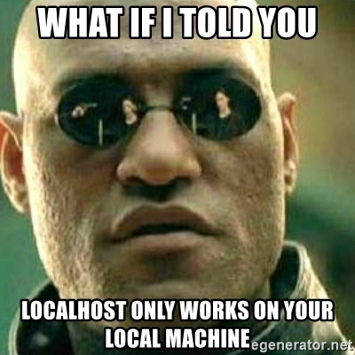
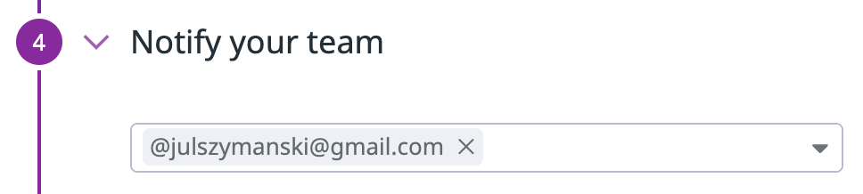
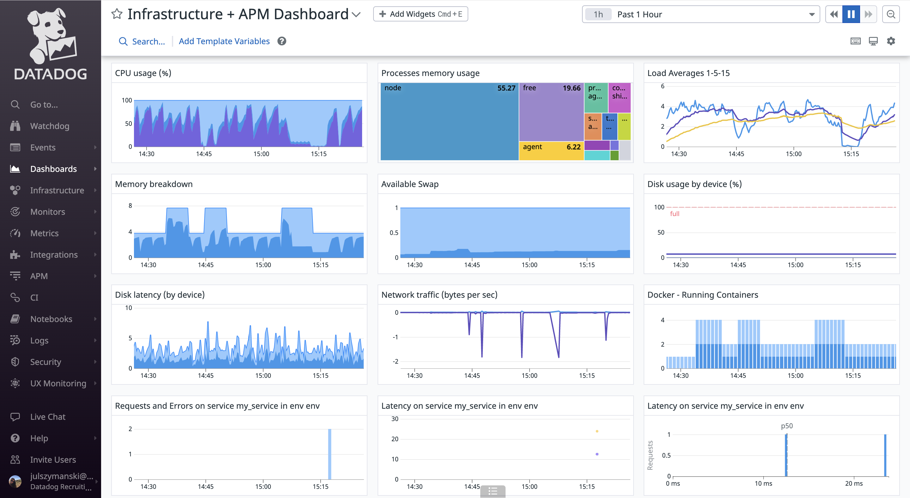

<h1>Julia Szymanski Datadog Technical Assessment</h1>

<h2>Notes on Prerequisites:</h2>
<h3>I took this assessment as a great opportunity to learn about Docker and opted for the Containerized approach using Docker for Desktop (Mac M1) and the dockerized Datadog agent.</h3>


<h2>📈 Collecting Metrics:</h2>
<h3>1. I added tags in the datadog.yaml file and was very happy to see that they showed up in the Host Map on the UI. Encouraging so far!</h3>
<p></p>

<h3>Code block: datadog.yaml with tags</h3>


```
apm_config:
  apm_non_local_traffic: true

jmx_use_container_support: true

tags:
    - "name:Julia Szymanski"
    - "email:julszymanski@gmail.com"
    - "region:us-east-1"
    - "tag:test"
    - "env:staging"
```
<p></p>
<h3>Host map with tags</h3>



<p></p>
<h3>2. Next, I updated PostgreSQL on my machine and installed the PostgreSQL Datadog integration.
<p></p>

At first, this is the error I was seeing in the root terminal and dd-agent log:</h3>
<p></p>


<p></p>



<p></p>




<h3>The issue was that I had set host to localhost in postgres.d/conf.yaml in the container. So, how did I need to change host in the container to point to Postgres on my machine? I reset the host value to be host.docker.internal. This enabled the connection of the container with the database service on the host by forwarding to the internal IP address used by the host.</h3>
<h3>Click here to see the docs --> <a href="https://docs.docker.com/desktop/mac/networking/#use-cases-and-workarounds">Networking features in Docker Desktop for Mac</a></h3>

<h3>Postgres on Agent status report</h3>


<h3>3. Next, I created a custom Agent check that submits a metric named my_metric with a random value between 0 and 1000.</h3>

<h3>Code block: checks.d/custom_my_metric.py</h3>

```
import random

try:
    from datadog_checks.base import AgentCheck
except ImportError:
    from checks import AgentCheck

__version__ = "1.0.0"

class HelloCheck(AgentCheck):
    def check(self, instance):
        self.gauge('my_metric', random.randint(0,1000), tags=["host:docker-desktop"] + self.instance.get('tags', []))
```
<h3>Custom_my_metric on Agent status report</h3>


<h3>4. Finally, I changed my check's collection interval so that it only submits the metric once every 45 seconds by modifying the respective yaml file.</h3>


<p>An important note on min_collection_interval: If the min_collection_interval is set to 45, it does not mean that the metric is collected every 45 seconds, but rather that it could be collected as often as every 45 seconds. The collector tries to run the check every 45 seconds but the check might need to wait in line, depending on how many integrations are enabled on the same Agent. Also if the check method takes more than 45 seconds to finish, the Agent skips execution until the next interval.</p>


<h3>Code block: conf.d/custom_my_metric.yaml</h3>

```
init_config:

instances:
  - min_collection_interval: 45
```


<h3><b>Bonus Question</b>: By modifying custom_my_metric.yaml that lives in the conf.d folder, I already changed the collection interval without modifying custom_my_metric.py. 🙌</h3>

<h2>📈 Visualizing Data:</h2>

<h3>To start, I created an Application Key and verified that the App Key and the API Key are valid via Postman. Then I wrote the script for a timeboard importing the Datadog API.</h3>

<h3>Code block: Complete script in timeboard.py</h3>


```
"""
Create a new dashboard returns "OK" response
"""

from datadog_api_client.v1 import ApiClient, Configuration
from datadog_api_client.v1.api.dashboards_api import DashboardsApi
from datadog_api_client.v1.model.dashboard import Dashboard
from datadog_api_client.v1.model.dashboard_layout_type import DashboardLayoutType
from datadog_api_client.v1.model.log_query_definition import LogQueryDefinition
from datadog_api_client.v1.model.log_query_definition_group_by import LogQueryDefinitionGroupBy
from datadog_api_client.v1.model.log_query_definition_group_by_sort import LogQueryDefinitionGroupBySort
from datadog_api_client.v1.model.log_query_definition_search import LogQueryDefinitionSearch
from datadog_api_client.v1.model.logs_query_compute import LogsQueryCompute
from datadog_api_client.v1.model.timeseries_widget_definition import TimeseriesWidgetDefinition
from datadog_api_client.v1.model.timeseries_widget_definition_type import TimeseriesWidgetDefinitionType
from datadog_api_client.v1.model.timeseries_widget_request import TimeseriesWidgetRequest
from datadog_api_client.v1.model.widget import Widget
from datadog_api_client.v1.model.widget_sort import WidgetSort

body = Dashboard(
    layout_type=DashboardLayoutType("ordered"),
    title="my_metric Dash",
    widgets=[
        Widget(
            definition=TimeseriesWidgetDefinition(
                type=TimeseriesWidgetDefinitionType("timeseries"),
                title="Avg of My_Metric",
                requests=[
                    TimeseriesWidgetRequest(
                        q="avg:my_metric{host:docker-desktop}")
                        ],
                    )
                ),
        Widget(
            definition=TimeseriesWidgetDefinition(
                type=TimeseriesWidgetDefinitionType("timeseries"),
                title="Database + Anomaly - Avg of PostgreSQL Connections",
                requests=[
                    TimeseriesWidgetRequest(
                        q="anomalies(avg:postgresql.connections{db:julia}, 'basic', 2)"
                        )
                    ],
                )
            ),
        Widget(
            definition=TimeseriesWidgetDefinition(
                type=TimeseriesWidgetDefinitionType("timeseries"),
                title="My_Metric with Rollup Function - Sum of All Points in Last Hour",
                requests=[
                    TimeseriesWidgetRequest(
                        q="my_metric{host:docker-desktop}.rollup(sum, 3600)"
                        )
                    ], 
                )
            )
    ]
)


configuration = Configuration()
with ApiClient(configuration) as api_client:
    api_instance = DashboardsApi(api_client)
    response = api_instance.create_dashboard(body=body)

    print(response)
    
```

<p></p>

<h3>Let's take a closer look at the code displayed above.</h3>

<h3>1. I used the generic timeseries widget to graph my_metric over time. Widgets are building blocks for timeboards and dashboards.</h3>


<h3>2. I applied an anomaly function using the postgres.connections metric as an argument.</h3>


<h3>3. The rollup function is used to aggregate metrics data. The two arguments passed to the rollup function are the aggregator (min, max, in this case sum) and the optional time interval. In my rollup function, I sum all my_metric values collected in the last hour. In the graph below, the sum value is 28.71K.


</h3>


<h3>4. I zoomed in on the timeframe to view metrics collected over the past five minutes.</h3>


<h3>5. Finally, I took a snapshot of the graph and used the @ notation to email it to myself. 📸 📧</h3>


<h3><a href="https://p.datadoghq.com/sb/ed061656-ad77-11ec-8f93-da7ad0900002-a5b873d8ff693982e6baaa49f52b461d">Link to My_Metric Dashboard</a></h3>
<p></p>


<h3><b>Bonus Question:</b>
Anomaly detection is an algorithmic feature that identifies when a metric is behaving differently than it has in the past. A metric is considered to be anomalous (deviating from what is standard, normal, or expected) if it is outside of the gray anomaly band in the anomaly graph.</h3>


<h2>📈 Monitoring Data:</h2>

<h3>1. I created a new Metric Monitor that watches the average of my_metric and will alert if it's above the following values over the past 5 min:

<h3>• Warning threshold of 500 </h3>
<h3>• Alerting threshold of 800 </h3>
<h3>• And also ensure that it will notify me if there is No Data for this query over the past 10m.</h3>


<h3>2. I set the monitor to send me an email whenenever it is triggered.</h3>


<h3>3. I created different messages based on whether the monitor is in an Alert, Warning, or No Data state.</h3>


<h3>4. I included the metric value that caused the monitor to trigger as well as the host name and IP for an Alert state trigger.</h3>


<h3>5. Here is a screenshot of an email notification for the Alert state sent by the monitor.</h3>


<h3><b>Bonus question:</b> I set up two scheduled downtimes for this monitor.</h3>

<p></p>

<h3>1. The first one silenced the monitor from 7pm to 9am daily Monday-Friday. 💤</h3>


<p></p>

<h3>2. The second one silenced the monitor all day on Saturday and Sunday. 🌴 🏄 🏖️</h3>


<p></p>

<h3>3. 📧 My email was notified when I scheduled the downtimes.</h3>


<h2>📈 Collecting APM Data:</h2>

<h3><b>Bonus Question</b>: Difference between a Service and a Resource
<p></p>
<h3>Referred to <a href="https://docs.datadoghq.com/tracing/visualization">APM Glossary & Walkthrough</a></h3>

<h3>
<b>Services</b> are the building blocks of microservice architectures. A service groups together endpoints, queries, or jobs for the purposes of building your application. For example, a database service groups resources such as database queries. Resources belong to services.
<p></p>
<b>Resources</b> are actions for your services - they are typically an instrumented web endpoint, database query, or background job.</h3>

<p></p>

<h3>Code block: Flask app my_app.py</h3>

```
from flask import Flask
import logging
import sys

# Have flask use stdout as the logger
main_logger = logging.getLogger()
main_logger.setLevel(logging.DEBUG)
c = logging.StreamHandler(sys.stdout)
formatter = logging.Formatter('%(asctime)s - %(name)s - %(levelname)s - %(message)s')
c.setFormatter(formatter)
main_logger.addHandler(c)

app = Flask(__name__)

@app.route('/')
def api_entry():
    return 'Entrypoint to the Application'

@app.route('/api/apm')
def apm_endpoint():
    return 'Getting APM Started'

@app.route('/api/trace')
def trace_endpoint():
    return 'Posting Traces'

if __name__ == '__main__':
    app.run(host='0.0.0.0', port='5050')

```



<a href="https://p.datadoghq.com/sb/ed061656-ad77-11ec-8f93-da7ad0900002-bd8c8a622986bb7cf5b5414c9e7ac6dc">Click here to see Integrations + APM Dashboard</a>

<h2>Final Question:</h2>

<h3>Datadog has been used in a lot of creative ways in the past. We’ve written some blog posts about using Datadog to monitor the NYC Subway System, Pokemon Go, and even office restroom availability!

Is there anything creative you would use Datadog for?</h3>

<h3>When I first moved to Atlanta, I moved into an older house with a rodent problem. I measured rodent activity in the house by taking mental notes of the frequency of the scuttling sounds in the ceilings and walls.
<p></p>
It would be interesting to place sensors in the ceilings and walls of my house to measure rodent activity. These sensors could be accelerometers that detect vibrations, thermal cameras, or scanners. I can integrate the sensors with a microcontroller like Raspberry Pi with the Datadog Agent installed on it. Then I can write an Agent check to collect metrics from the sensor's data. Using dashboard widgets, I can display the scanner metrics for each sensor location. From there, I can map where rodent activity is highest. The next time I hire Critter Stoppers, they could use these dashboards to place traps in the areas with the highest measured rodent activity. I can be alerted if rodent activity drops, meaning that the exterminator did a great job.</h3>