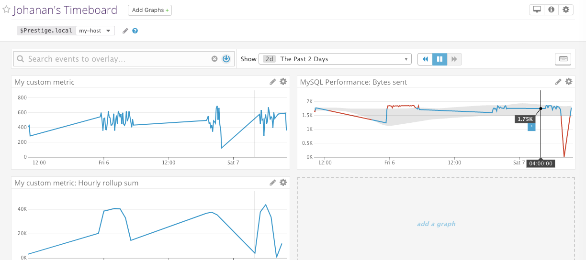

# Answers

## Prerequisites

### Setup

I chose to use Docker since containers are much more lightweight than VMs. To do this, I created a container using the `datadog/agent` image, and followed Datadog's [Docker setup documentation](https://docs.datadoghq.com/agent/basic_agent_usage/docker).

Afterwards, I installed [Datadog Agent v6](https://app.datadoghq.com/account/settings#agent/mac) on my host machine, which runs OS X.

## Collecting Metrics

### Adding tags and visualizing on the Host Map page
To add host tags, I needed to edit the config file then verify that the tags were properly added by checking the web UI. I used vim to open `~/.datadog-agent/datadog.yaml` (which is a symlink to the real location in `/opt/datadog-agent/`) and added the following lines:

```yaml
tags:
  - testtag1
  - env:prod
  - name:johanan_lai
  - role:database:mysql
```

I then checked the my Host Map page on Datadog's web UI to make sure that the tags showed up in the "Tags" section when inspecting my host machine.


### Installing a database and Datadog integration

For this part, I chose to use MySQL, since I am more familiar with it than other databases. I spun up a MySQL Docker instance with

```bash
docker run --name mysql01 -e MYSQL_ROOT_PASSWORD=password -p 3306:3306 -d mysql:5.6
```

and used `telnet localhost 3306` to ensure that the Datadog Agent would be able to connect to my container, a quick "sanity check" to verify the Docker container had the port exposed correctly.

Then, I connected to my MySQL container and set up the server according to the instructions [here](https://docs.datadoghq.com/integrations/mysql/). However, the agent gave me an error saying that it "Can't connect to MySQL server". I tried:

* Using different MySQL versions/images
* Changing the `server` IP in the `conf.yaml` file from `127.0.0.1` to `localhost`, `172.17.0.1`
* Granting all privileges to the `datadog` user as a last resort

but to no avail.

After some struggling, I found out that this was an issue specific to Docker, and that I had to change all instances of `localhost` to the IP address endpoint of my MySQL container, which I got promptly using `docker inspect mysql01`.

For example, instead of

```sql
mysql> GRANT PROCESS ON *.* TO 'datadog'@'localhost';
```

I used

```sql
mysql> GRANT PROCESS ON *.* TO 'datadog'@'172.17.0.1';
```

To confirm that the agent was now correctly getting metrics from my MySQL container, I checked the status of the agent with `datadog-agent status | grep mysql`, double-checking by looking at whether it showed up on both the Host Map page and the agent web UI.


### Creating a custom Agent check and changing the interval

The last part of this section required me to write a custom agent check. I headed over to the [agent documentation](https://docs.datadoghq.com/developers/agent_checks/) which showed a simple example check, which I modified to send a random value between 0 and 1000. To do this, I needed to create two files, `conf.d/mymetric.yaml` and `checks.d/mymetric.py`.

For `conf.d/mymetric.yaml`:

```yaml
init_config:

instances:
    [{}]
```

For `checks.d/mymetric.py`:

```python
from checks import AgentCheck
from random import randint

class MyMetricCheck(AgentCheck):
    def check(self, instance):
        self.gauge('my_metric', randint(0, 1000))
```

I quickly checked that this was working by filtering by `my_metric` in the web UI:


The graph looked fine, but I let it run a little longer to ensure that the value never went outside the range of 0 to 1000.

I also needed to change the collection interval to be at least 45 seconds, which I did by modifying `conf.d/mymetric.yaml`:

```yaml
init_config:

instances:
    - min_collection_interval 45
```

**Bonus Question:** Editing the config file allows me to avoid having to change the Python check file and hardcodeit to send a metric exactly every 45 seconds.

Once again, I verified that the interval had correctly changed by checking the graph in the web UI:


The width between each spike in the graph increased, so it was quite clear the interval had been successfully changed to 45, since the default is 15-20 seconds.

## Visualizing Data

### Creating a Timeboard using DataDog API

I decided to use Python, the language I am the most familiar with, to create a timeboard. First, however, I had to install the [DataDog Python library](https://github.com/DataDog/datadogpy), which I did with `pip install datadog`.

Next, using the [Python API docs](https://docs.datadoghq.com/api/?lang=python#timeboards), I modified the API request example to display my custom metric on the timeboard, which I did through

* Creating an application key [here](https://app.datadoghq.com/account/settings#api) and copying both API keys to my timeboard Python file
* Getting the name of my host with `datadog-agent status | grep host` to put in `template_variables` 
* Editing the `graphs` variable to include the 3 metrics to be shown on the timeboard

To learn the syntax for requesting metrics, I played around with the JSON editor in the web UI (pictured below), which made it much easier to edit in vim.


The request for displaying `my_metric` scoped over my host was as simple as

`{"q": "avg:my_metric{host:Prestige.local}"}`.

though at first, I had unknowingly averaged by host instead of scoping it over my host computer by writing

`{"q": "avg:my_metric{*} by {host}"}`.

While the graphs looked identical on the timeboard in the web UI, I realized this subtle mistake in the JSON editor, which had two separate inputs, one for "from" and one for "avg by"; the former was what I was supposed to be using.

For graphing a metric from my MySQL integration, I chose bytes sent, since it would show data without the need for me to do anything else. I then applied `anomalies` using the [anomaly documentation](https://docs.datadoghq.com/monitors/monitor_types/anomaly/), which looked like this:

`{"q": "anomalies(mysql.performance.bytes_sent{*}, 'basic', 3)"}`

Lastly, I had to sum up all of the values of `my_metric` into 1-hour buckets. I did this with the help of the [rollup function docs](https://docs.datadoghq.com/graphing/#aggregate-and-rollup), once again using the JSON editor to verify that my request was formatted correctly.

`{"q": "avg:my_metric{host:Prestige.local}.rollup(sum, 3600)"}`

I ran the file with `python timeboard1.py` and checked the timeboard in the web UI to see whether all 3 metrics were correctly displayed.



### Changing my Timeboard from the web UI

At first, I could not figure out how to customize the timeframe beyond 24 hours; I tried using the "Select Range" option at the top of the timeboard, but it did not go any smaller than the same day. I also tried to edit the URL and change the timestamps manually by making `from_ts` and `to_ts` 300 seconds apart, but it did nothing.

Before long, I clicked the keyboard icon, which showed that the shortcut ALT + ] would tighten the timeframe.


I used this to make the timeframe of my timeboard to be the past 5 minutes:


While there was no option to send a snapshot of my entire timeboard (since the exercise instructions are unclear about which graph to @ myself with), I could [@ myself](https://docs.datadoghq.com/monitors/notifications/#mentions-in-slack-from-monitor-alert) with a single graph of a metric, so I chose the MySQL bytes sent anomaly graph by clicking the camera icon at the top right of the graph and @ing myself in an annotation.


As expected, I received an email with the annotation a screenshot of the graph I was tagged in.


**Bonus Question:** The anomaly graph displays a metric, with anomalous values colored red and normal values colored blue. Anomalous values are determined by previous metric values and patterns, which helps alert the owner of unusual behavior that might be difficult to notice without analyzing past metric trends.

The script for creating the timeboard is included in the project as `timeboard1.py`.

## Monitoring Data

to be completed


