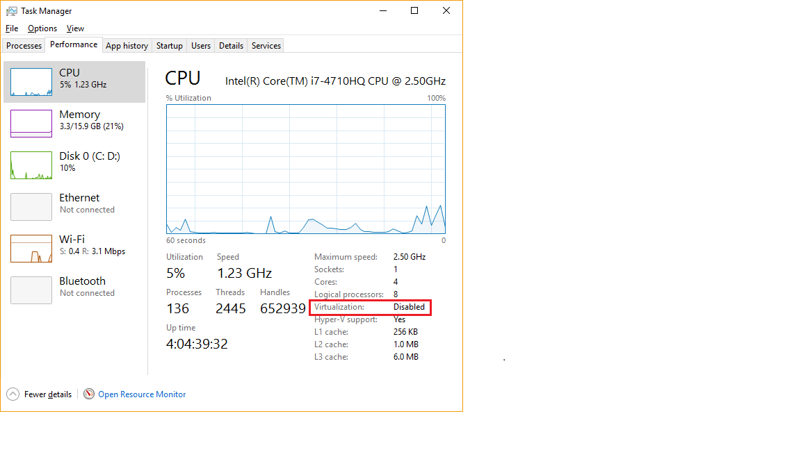
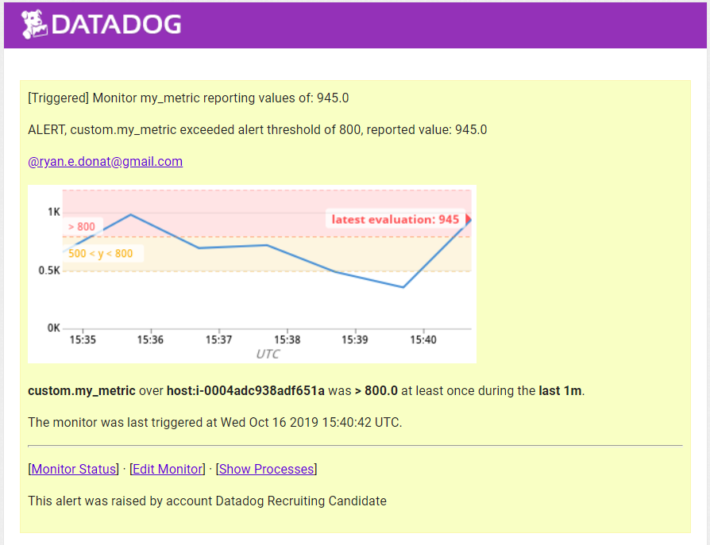

Table of contents
=================

- [Level 0  (Optional) Setup an Ubuntu VM](#level-0-optional-setup-an-ubuntu-vm)
- [Level 1  Collecting your Data](#level-1-collecting-your-data)
- [Level 2  Visualizing your Data](#level-2-visualizing-your-data)
- [Level 3  Alerting on your Data](#level-3-alerting-on-your-data) 

## Level 0 (optional) Setup an Ubuntu VM

I opted to use the windows agent and not the Ubuntu VM using Vagrant as suggested as there were some teething issues with setting up Vagrant. Vagrant requires virtual box to operate and for the virtual box to operate it requires that Virtualisation on the CPU be turned on, which is done through the bios and it is not always turned on. I did an initial attempt to turn it on after check the performance tab in the windows task manager but I was unable to access the bios as the documentation for my laptop was incorrect> I left it and proceeded with the rest of the tasks as this task was only optional.

CPU Virtualisation

## Level 1 Collecting your Data

  * Signing up for Datadog was quite simple. Once I filled out the form I was taken to the agent integration page. Here I selected the agent for windows and downloaded it and then installed it. Once the agent was installed it required a api key to finish the setup and to begin sending data to Datadog. Unfortunately I was unable to easily get the api key as it required going to the integration api page which was not possible until Datadog received a confirmation from the agent. I able to get the api key by typing the URL to the integration api page into the browser. Once the agent confirmation was obtained I was free to begin browsing the site. 

  * An agent is a program which is installed on a host and has 3 functions, the collector, dogstatd, and the forwarder.  
    - The collector is responsible for gathering various system metrics from the host machine it is installed on, as well as running the checks for each integrations installed on that host.
    - Dogstatd is local api server that allows you to send custom metrics from your applications to Datadog.
    - The forwarder is responsible for gathering all the collected data from both the collector and dogstatd and then queuing it to be sent to Datadog.

    Custom tags setup in the agent configuration. 
	

    Custom tags in the hostmap in Datadog. 
 	 

  * I installed the database integration for Microsoft SQL Server as I had it already installed on my machine. The documentation [here](https://app.datadoghq.com/account/settings#integrations/SQL_server) was very helpful. It provided the SQL scripts for creating a Datadog SQL account and granting permission to the account. Configuring the agent was simple, though I had a minor issue with the yaml configuration file initially but after removing the comments to make sure the formatting was correct it began to work properly. Below is the screen shot of the final working yaml file.
  
  

   * Writing a agent check was quiet simple. The documentation on agent checks found [here](http://docs.datadoghq.com/guides/agent_checks/) was quite good. After reading it I wrote a simple agent check that generates a random number and sends the result as a metric as well as adding a custom tag. The source can be found [here](/code).

## Level 2 Visualizing your Data

  * Creating this combined dashboard was a simple task. I accessed the SQL server dashboard from the hostmap then clicked on the gear button in the top right hand corner and clicked clone. I then edited the dashboard and added in a new graph for the test.support.random metric. [Here](https://app.datadoghq.com/dash/292968/sqlserver--test-agent--overview?live=true&page=0&is_auto=false&from_ts=1495674984858&to_ts=1495678584858&tile_size=s) is a link to my dashboard and below is a screen shot of the the new combined dash board
  
  

   * The difference between TimeBoards and ScreenBoards is:
   		- TimeBoards have all their graphs scoped to the time selected in the show drop down box. Also all graphs a displayed in a grid-like fashion and each graph can be share individually.  
		- While ScreenBoards are more flexible and are made up of widgets which can be drag and dropped in. Each graph can be set to a different time frame. ScreenbBoards can also can be share as a whole and\or as a read only entity.

  * Creating a snapshot of the test.support.random metric was a simple task where I clicked on the annotation camera icon that appears when you hove the mouse on a graph. Then I selected the section I wished to display and entered a brief message. Then next part of sending a @notification to my email was not so easy. I was able to use the @ notation but I did not receive an email. I even checked my junk box just in case and even tried again but nothing appeared. After a search I found [this](https://help.datadoghq.com/hc/en-us/articles/203038119-What-do-notifications-do-in-Datadog-) document which states that it is not possible to send a @notification email to yourself from the events page but you can setup monitor notification to yourself. So instead I sent the notification to my Google email to make sure everything worked and it did. [Here](https://app.datadoghq.com/event/stream?tags_execution=and&show_private=true&per_page=30&aggregate_up=true&use_date_happened=false&display_timeline=true&from_ts=1494990000000&priority=normal&is_zoomed=false&status=all&to_ts=1495594800000&is_auto=false&incident=true&only_discussed=false&no_user=false&page=0&live=true&bucket_size=10800000#) is a link to my events page.

  Below is a screen shot of the snap shot on the events page.
  

  Below is screen shot of the email that I received to my Google account.
  

## Level 3 Alerting on your Data

 * After reading the documentation found [here](http://docs.datadoghq.com/guides/monitors/), I was able to setup a monitor to the specifications of the task ([monitor setup](https://app.datadoghq.com/monitors#2123423/edit)) and began receiving notifications. After a while I muted the monitor so that my email would stop receiving notifications. After reading the portion on down time setup for the monitor setup page, I proceeded to setup a downtime for that monitor I created. Just before 7pm I unmuted the monitor and began receiving emails again. At 7pm I received the email notification of the down time being activated, I checked the monitor in Datadog and saw that there was a mute applied to the monitor with a time to expiration. Unfortunately I still continued to receive notification. At this point I'm not sure what I may have missed in the setup and I'm going back over the documentation and doing Google searches to see what I can find. 

    Below is a screen shot of the monitor setup.
  	 

    Below is a screen shot of the monitor down time setup.
  	

    Below is a screen shot of the email notification of threshold breach for the agent check I created.
	

    Below is screen shot of the email notification of the scheduled down time.
	

