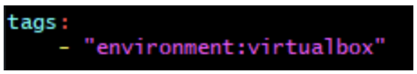
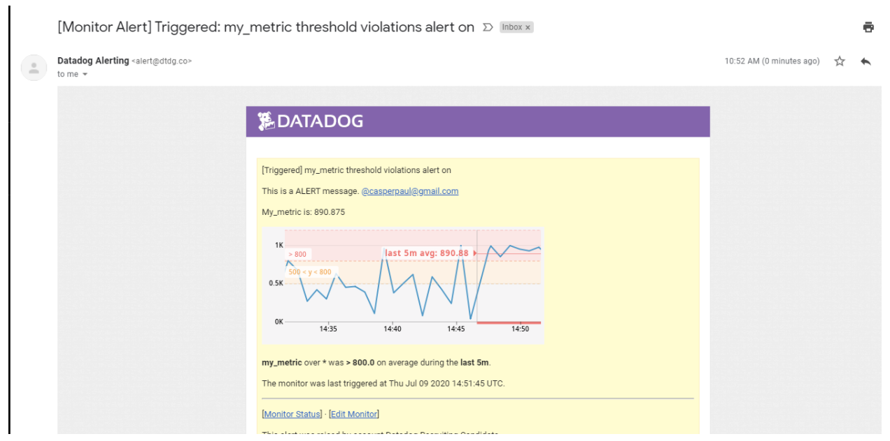
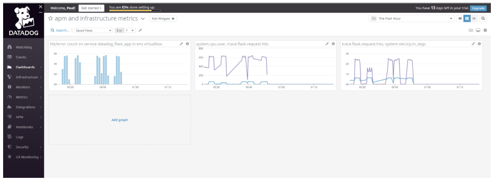
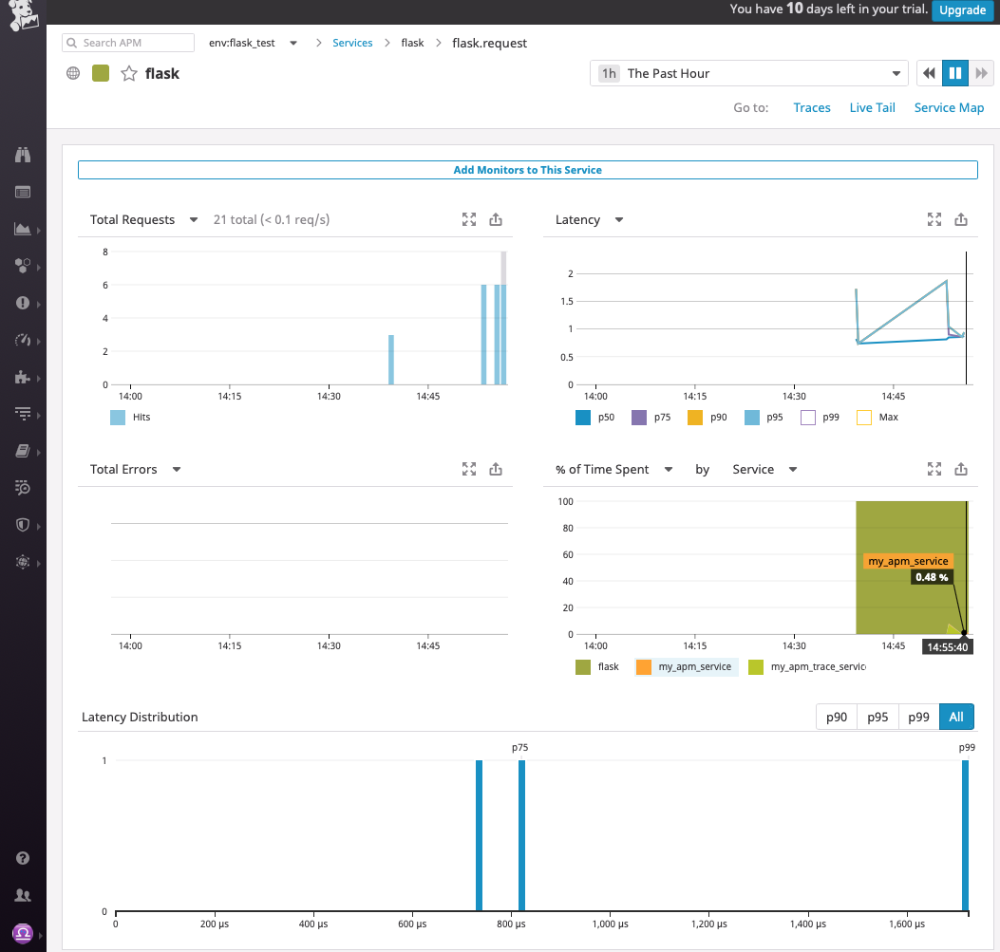

# Answers by Stephen Roe

Candidate for Solution Engineer in London (stephen.john.roe@gmail.com)

*link to this repo provided by Nick Elwell*

## Prerequisites

My setup...

1. My home laptop is OSX, could spin up Docker on that machine, but...
2. I already have a LAMP build (Ubuntu 18.04 / Apache2 / mysql / PHP, Python) live on AWS to run Wordpress - so let's instrument that with the DataDog Agent and connect from OSX as client

### Sign Up for DataDog, Install Agent & Connect

Just used `> sudo DD_AGENT_MAJOR_VERSION=7 DD_API_KEY=7b108d7...`  That was smooth!


### Get the Agent Reporting Metrics from your (local) Machine

Successful initial report from DD agent on app.datadoghq.eu webpage.

## Collecting Metrics:

### Adding tags to the DD Agent config file

`tags:
    - "<p6steve_build>:<1.0>"
    - "<p6steve_url>:<henleycloudconsulting.co.uk>"
    - "<p6steve-ssl>:<on>"`
    
*rather an unusual yaml format!*

### Screenshot of Host with Tags


### Adding MySQL Integration

Adding user & validating...
`mysql: [Warning] Using a password on the command line interface can be insecure.
Uptime	353341
Uptime_since_flush_status	353341`

Tweaking privileges...
`issing REPLICATION CLIENT grant\033[0m"
mysql: [Warning] Using a password on the command line interface can be insecure.
MySQL grant - OK`

Adjusting `/etc/datadog-agent/conf.d/mysql.d/conf.yaml` per docs -- couple of WARNings on sudo service datadog-agent status

`WARN | (pkg/collector/python/datadog_agent.go:118 in LogMessage) | mysql:deae8cbf193a8b9a | (mysql.py:956) | Privilege error or engine unavailable accessing the INNODB status tables (must grant PROCESS): (1227, 'Access denie...` ... oops looks like I forgot to grant process on innodb (probably forgot to FLUSH PRIVILEGES;)- FIXED

Here is a dashboard with MySQL...


### Custom Agent check

1. First step - clone and run the documented example - no joy. Try running with python3 directly...

`ubuntu@ip-172-31-25-233:/etc/datadog-agent/checks.d$ python3 *.py
  File "metrics_example.py", line 3
    from datadog_checks.base import AgentCheck
    ^
IndentationError: unexpected indent`

Ah, made an indentation error - FIXED!   `Done running check metrics_example`

2. Second step - tweak the code

Please also see as committed file my_metric.py

```
import random
  
from datadog_checks.base import AgentCheck

__version__ = "1.0.0"

class MyClass(AgentCheck):
    def check(self, instance):
        self.gauge(
            "my_metric.gauge",
            random.randint(0, 1000),
            tags=["env:dev","metric_submission_type:gauge"],
        )
```

3. Third step - change the collection interval to 45s

Please also see as committed code file my_metric.yaml

```
init_config:
  
instances:
  - min_collection_interval: 45
```

### Bonus Question

The collection interval can be modified in the .yaml configuration for each Agent check.

## Visualising Data:

### DataDog API Timeboard

1. my_metric scoped over host
2. mysql database metric with anomaly function applied
3. my_metric with rollup for last hour (average to match y-aexis scale)

Please also see committed file of script my_metric_graph.json


### Access Dashboard within UI

1. Set timeframe to the past 5 mins



2. Take snapshot and sent to myself with @


**Bonus Question:**

Anomaly detection is an algorithmic feature that identifies when a metric is behaving differently than it has in the past, taking into account trends, seasonal day-of-week, and time-of-day patterns. It is well-suited for metrics with strong trends and recurring patterns that are hard to monitor with threshold-based alerting.

For example, anomaly detection can help you discover when your web traffic is unusually low on a weekday afternoon—even though that same level of traffic is normal later in the evening. Or consider a metric measuring the number of logins to your steadily-growing site. Because the number increases daily, any threshold would be quickly outdated, whereas anomaly detection can alert you if there is an unexpected drop—potentially indicating an issue with the login system.

**Specifically:**

The red 'blip' on my graph for db rows read happens about once per hour - I think that tis when some internal housekpeeing occurs within mysql. Another explanation is that this is caused by a search engine robot hitting the website.

## Monitoring Data:

### New Metric Monitor

*Every 5 mins, different messages for each case, metric value, host IP*
- Warning threshold of 500
- Alerting threshold of 800
- No Data for this query over the past 10m

**Screenshot of Monitor Email**


**Bonus Question:**

*Scheduled downtime*


# Collecting APM Data:

Need to install Flask on my Ubuntu machine... try it with a simple hello world- OK



Checking out the datadog blog - good post on Flask https://www.datadoghq.com/blog/monitoring-flask-apps-with-datadog/, so...
1. pip3 install ddtrace
2. FLASK_APP=sample_app.py DATADOG_ENV=flask_test ddtrace-run flask run --port=5050
3. curl 127.0.0.1:5050  => Entrypoint to the Application
4. curl 127.0.0.1:5050/api/apm => Getting APM Started
5. curl 127.0.0.1:5050/api/trace => Posting Traces



Looks like my server is playing ball - let's get the example Flask app provided up and running and graft in the trace instrumentation (also see __init__.py committed file)...


Now let's check out the DataDog APM dashboard... looking good (hit with curl a few times)



## Link and Screenshot of a Dashboard with both APM and Infrastructure

https://p.datadoghq.eu/sb/0p0dpzq0x0wk0gc8-abda7300c45a3155679fabb26c18c4e6 (live data on Sunday 7th une 2020 at 15:15)


## Bonus Question

- A service is a set of processes that do the same job - for example a web framework or database.
- A resource is a particular action for a given service (typically an individual endpoint or query).

# Final Question:

Q. Is there anything creative you would use Datadog for?

A. I think it would be interesting to use DataDog to Monitor service utilization and service prices, roughly as follows:
- build a service to encapsulate the AWS Price List Service [API](https://docs.aws.amazon.com/awsaccountbilling/latest/aboutv2/using-pelong.html) and similar from Azure & Google
- define some introspection classes/methods for each of my services such as get-my-service-type (e.g. ec2/eu-west-2a/t2.micro) and get-my-service-metrics (e.g. %-utilization for EC2 / memory use for EBS / number of API calls for lambda)
- define economic metrics for each of my services such as $$$/hour
- define a wiring template for each service type (EC2, FarGate, Lambda and so on) that goes (i) my-service-type => (ii) my-rate & my-metric => (iii) my $$$/hour as a common & comparable DataDog metric

Customers could then use DataDog to monitor their spend for a collection of services across all delivery modes (dedicated, virtual servers, containers, microservices, etc), for example:
- verify cloud vendor billing and negotiate discounts
- compare delivery modes for optimum economic 'bang for the buck'
- set thresholds to alert on change mode events - e.g. from reserved to spot capacity
- analyze comparative cost vs service levels for each vendor and move capacity to the lowest cost option
