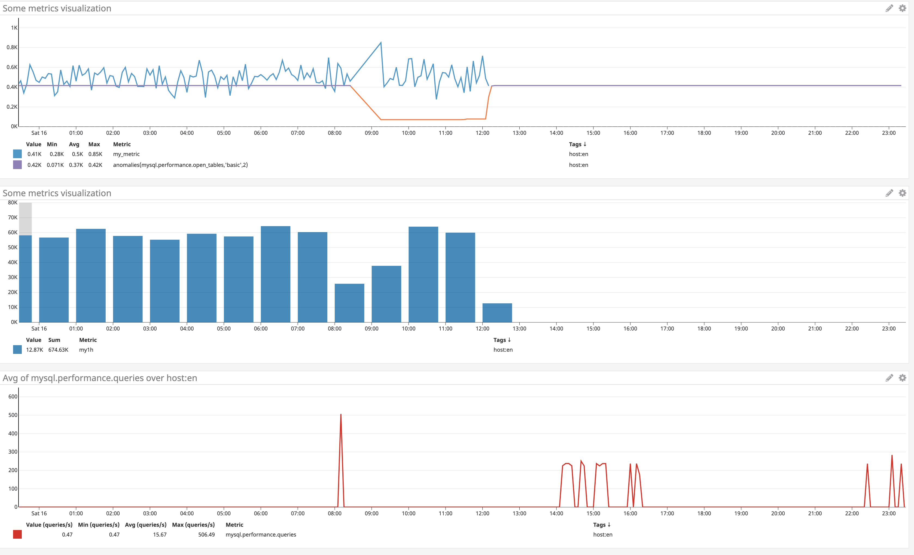

## Answers - Matthew Main

### Level 1

* **Sign up for Datadog (use "Datadog Recruiting Candidate" in the "Company" field), get the agent reporting metrics from your local machine.**

	&#x2713; <a href="https://app.datadoghq.com/dash/host/53841307?live=true&page=0&from_ts=1459983982643&to_ts=1459998382643&is_auto=false&tile_size=m">signed up with the agent and reporting metrics locally:</a><br>
	<br><br>

* **Bonus question: what is the agent?**

	<i>The Agent is the software that gathers data from a host and transfers it to Datadog. There are three major components. The agent's "collector" stores a host's local metrics, including any integrations, while "Dogstatsd", the agent's StatsD metrics aggregation server, stores custom metrics sent from an application. The agent's "forwarder" is responsible for gathering data from both the collector and from Dogstatsd and delivering it to Datadog.</i><br><br>

* **Submit an event via the API.**

		#api_event.rb:

		require 'rubygems'
		require 'dogapi'

		api_key='30bb1d28fce2e3e1c2976895ec020abd'
		app_key='91a4188beee745a5ff48aa35d3937f9c98e2baa9'

		event = Dogapi::Client.new(api_key, app_key)

		event.emit_event(Dogapi::Event.new('Hello Datadog.', :msg_title => 'Hello'))

	&#x2713; <a href="https://app.datadoghq.com/event/stream?tags_execution=and&show_private=true&per_page=30&query=hosts%3AMatthewMainsMBP.home%20status%3Aall%20priority%3Aall&aggregate_up=true&use_date_happened=false&display_timeline=true&from_ts=1459404000000&priority=normal&is_zoomed=false&status=all&to_ts=1460008800000&is_auto=false&incident=true&only_discussed=false&no_user=false&page=0&live=true&bucket_size=10800000#mac">event submitted via API:</a><br>
	<br><br>

* **Get an event to appear in your email inbox (the email address you signed up for the account with)**

		#api_event.rb:

		require 'rubygems'
		require 'dogapi'

		api_key='30bb1d28fce2e3e1c2976895ec020abd'
		app_key='91a4188beee745a5ff48aa35d3937f9c98e2baa9'

		event = Dogapi::Client.new(api_key, app_key)

		event.emit_event(Dogapi::Event.new('@matthewwmain@gmail.com Hello Datadog.', :msg_title => 'Hello'))

	&#x2713; <a href="https://app.datadoghq.com/event/stream?tags_execution=and&show_private=true&per_page=30&query=hosts%3AMatthewMainsMBP.home%20status%3Aall%20priority%3Aall&aggregate_up=true&use_date_happened=false&display_timeline=true&from_ts=1459404000000&priority=normal&is_zoomed=false&status=all&to_ts=1460008800000&is_auto=false&incident=true&only_discussed=false&no_user=false&page=0&live=true&bucket_size=10800000#mac">event sent to email:</a><br>
	<br>

	&#x2713; event in email inbox: <br>
	


<br><br>
### Level 2

* **Take a simple web app ([in any of our supported languages](http://docs.datadoghq.com/libraries/)) that you've already built and instrument your code with dogstatsd. This will create *metrics*.**

		#application_helper.rb

		require 'statsd'

		def page_counter
			statsd = Statsd.new
			statsd.increment('page_views')
		end

		#application.html.erb

		<% page_counter %>

<br>
* **While running a load test (see References) for a few minutes, visualize page views per second. Send us the link to this graph!**

		{
		  "viz": "timeseries",
		  "requests": [
		    {
		      "q": "avg:page_views{*}.as_count().rollup(avg,1)",
		      "aggregator": "avg",
		      "conditional_formats": [],
		      "type": "area"
		    }
		  ]
		}

	`$ ab -k -n 1700 -c 30 -l http://localhost:3000/`

	&#x2713; <a href="https://app.datadoghq.com/dash/117523?live=false&page=0&is_auto=false&from_ts=1460311718570&to_ts=1460312320500&tile_size=s&abstraction_level=1&aggregate_up=false&per_page=30&use_date_happened=true&display_timeline=false&tags_execution=and&fullscreen=false">visualized page views per second during load test:</a><br>
	<br><br>

* **Create a histogram to see the latency; also give us the link to the graph**

	````
	#application_controller.rb

	before_action :set_start_time, only: [:index, :new, :show, :edit]

	def set_start_time
	  @start_time = Time.now.to_f
	end

	#application_helper.rb

	require 'statsd'

	def page_load_timer(start_time)
		statsd = Statsd.new
		duration = Time.now.to_f - start_time 
		statsd.histogram('page_views.time', duration)
	end

	#application.html.erb

	<% page_load_timer(@start_time) %>

	````

	````
	{
		"viz": "timeseries",
		"requests": [
			{
				"q": "avg:page_views.time.median{*}.rollup(avg,1)",
				"aggregator": "avg",
				"style": {
					"palette": "purple"
				},
				"type": "line",
				"conditional_formats": []
			},
			{
				"q": "avg:page_views.time.95percentile{*}.rollup(avg,1)",
				"style": {
					"palette": "cool"
				},
				"type": "line"
			}
		]
	}
	````
	
	&#x2713; <a href="https://app.datadoghq.com/dash/117523?live=false&page=0&is_auto=false&from_ts=1460311718570&to_ts=1460312320500&tile_size=s&abstraction_level=1&aggregate_up=false&per_page=30&use_date_happened=true&display_timeline=false&tags_execution=and&fullscreen=false">page load latency:</a><br>
	<br><br>

* **Bonus points for putting together more creative dashboards.**

	<a href="https://app.datadoghq.com/dash/117523?live=false&page=0&is_auto=false&from_ts=1460311718570&to_ts=1460312320500&tile_size=s&abstraction_level=1&aggregate_up=false&per_page=30&use_date_happened=true&display_timeline=false&tags_execution=and&fullscreen=false">dashboard:</a><br>
	<br>


<br><br>
### Level 3

**Using the same web app from level 2:**

* **tag your metrics with `support` (one tag for all metrics)**

	&#x2713; host tagged with 'support', thereby tagging each of host's metrics:<br>
	<br><br>

* **tag your metrics per page (e.g. metrics generated on `/` can be tagged with `page:home`, `/page1` with  `page:page1`)**

		#application_helper.rb

		require 'statsd'

		def page_counter(page)
			statsd = Statsd.new
			statsd.increment('page_views', :tags => ["page:#{page}"])
		end

		def page_load_timer(page,start_time)
			statsd = Statsd.new
			duration = Time.now.to_f - start_time 
			statsd.histogram('page_views.time', duration, :tags => ["page:#{page}"])
		end

		#application.html.erb

		<% page_counter(request.env["PATH_INFO"]) %>
		<% page_load_timer(request.env["PATH_INFO"], @start_time) %>

<br>
* **visualize the latency by page on a graph (using stacked areas, with one color per `page`)**

	&#x2713; <a href="https://app.datadoghq.com/dash/117523?live=false&page=0&is_auto=false&from_ts=1460311718570&to_ts=1460312320500&tile_size=s&abstraction_level=1&aggregate_up=false&per_page=30&use_date_happened=true&display_timeline=false&tags_execution=and&fullscreen=false">latency by page:</a><br>
	<br>


<br><br>
### Level 4

**Same web app:**

* **count the overall number of page views using dogstatsd counters. / count the number of page views, split by page (hint: use tags)**

		statsd.increment('page_views', :tags => ["page:#{page}", "page:all"])


<br>
* **visualize the results on a graph**

	&#x2713; <a href="https://app.datadoghq.com/dash/117523?live=false&page=0&is_auto=false&from_ts=1460311718570&to_ts=1460312320500&tile_size=s&abstraction_level=1&aggregate_up=false&per_page=30&use_date_happened=true&display_timeline=false&tags_execution=and&fullscreen=false">overall page views split by page:</a><br><i>I graphed this a couple of different ways. The first graph stacks each page view, which displays the cumulative overall page count. The second graph uses tags to display overall page views as an area and individual page views as lines.</i><br>
	<br>
	<br><br>

* **Bonus question: do you know why the graphs are very spiky?**
 
 	<i>The graphs are spikiest wherever values vary widely and are rolled over frequently. During the load tests, for example, average page views are varying by a difference of up to ten or so views per second. Because the averages are being rolled over every second, the sharp peaks and valleys represent these variations. For smoother graphs, it's possible to modify queries with exponentially weighted moving averages.</i><br>

<br><br>
### Level 5

**Let's switch to the agent.**

* **Write an agent check that samples a random value. Call this new metric: `test.support.random`**

		#checks.d/test.yaml:

		init_config:
		instances: 
			[{}]

		#conf.d/test.py:

		from checks import AgentCheck
		import random
			class TestCheck(AgentCheck):
				def check(self, instance):
				self.gauge('test.support.random', random.random())

* **Visualize this new metric on Datadog, send us the link.**

	&#x2713; <a href="https://app.datadoghq.com/dash/117523?live=false&page=0&is_auto=false&from_ts=1460311718570&to_ts=1460312320500&tile_size=s&abstraction_level=1&aggregate_up=false&per_page=30&use_date_happened=true&display_timeline=false&tags_execution=and&fullscreen=false">agent check with random values:</a><br>
	<br>

**Here is a snippet that prints a random value in python:**

```python
import random
print(random.random())
```


<br><br>
## Instructions
If you have a question, create an issue in this repository.

To submit your answers:

1. Fork this repo.
2. Answer the questions in `answers.md`
3. Commit as much code as you need to support your answers. At a minimum, for level 5.
4. Submit a pull request.
5. Don't forget to include links to your dashboard(s), even better links *and* screenshots.

