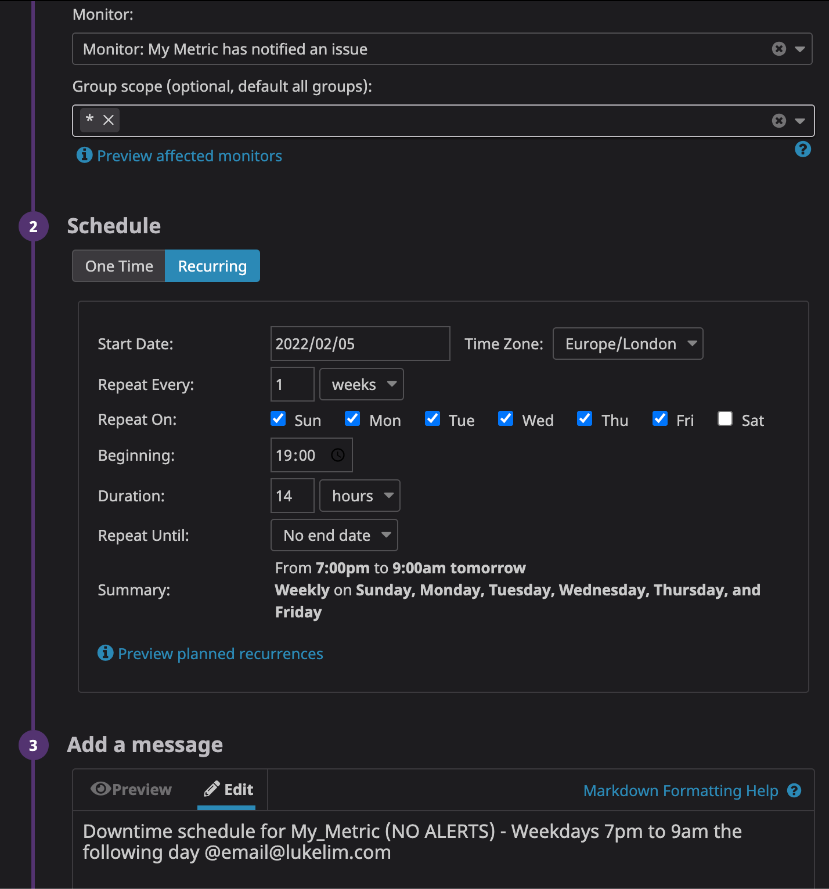
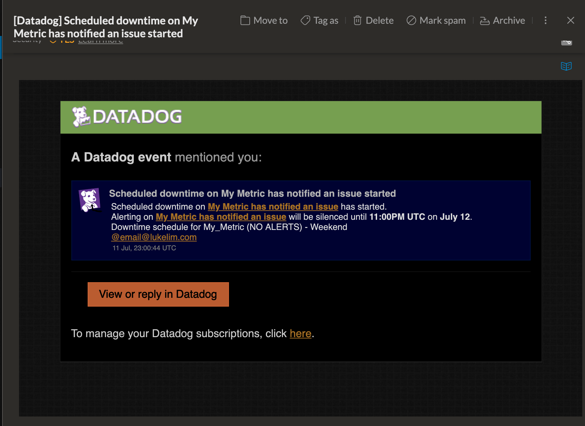
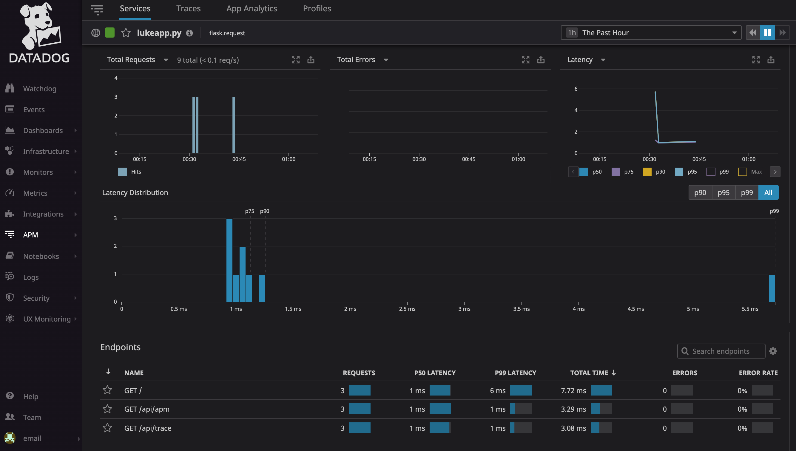

# Pre-Requisites / Setup

Having never used Vagrant, I thought I’d give this a go as it’s something new to learn about! 

•	Create Host for exercise - Ubuntu Server Installed on MacOS (Vagrant and VirtualBox)
    
    o	Renamed VM from “vagrant” to “lukeDD”
    
•	Signed up to DataDog (email@lukelim.com)

•	Installed Datadog Ubuntu agent on my VM
    
    o	My Agent Install Command: DD_AGENT_MAJOR_VERSION=7 DD_API_KEY=5b21cddf0e509ced5358c8bb2c57c97d DD_SITE="datadoghq.eu" bash -c "$(curl -L https://s3.amazonaws.com/dd-agent/scripts/install_script.sh)"
    
•	Successful agent Install and DataDog shows it installed: 

•	Then I had a good click around the system! 


# Collection Metrics

Had a browse through the options in the datadog.yaml file and realise there are a lot of options and all very well documented both in the yaml file itself and the product documentation! This gives and very good and starting point for a Datadog user to take up the basics and configure further.

Tags – Tags area great thing for a data platform and monitoring system as one of the biggest challenges in the data is understanding context and versioning for long term data validity. Tags allow this by making sure the data is grouped correctly for my business/team’s needs and also helps if we tag a transient metric or datapoint in case the underlying infrastructure is dynamic. Ie. A service moves and changes spec but it’s use and therefore reporting remains the same… I want to ensure this is reflected in my reports/dashboards/alerts.


##### Q. Add tags in the Agent config file and show us a screenshot of your host and its tags on the Host Map page in Datadog.
Didn’t want to go crazy with this but set up a few tags to see how they’d be reflected in the UI.

```
## @param hostname - string - optional - default: auto-detected
## Force the hostname name.
#
# hostname: <HOSTNAME_NAME>
hostname: lukeDD

## @param tags  - list of key:value elements - optional
## List of host tags. Attached in-app to every metric, event, log, trace, and service check emitted by this Agent.
##
## Learn more about tagging: https://docs.datadoghq.com/tagging/
#
# tags:
#   - environment:dev
#   - <TAG_KEY>:<TAG_VALUE>
#
tags:
  - environment:ddtrial
  - name:lukehost1
  - team:alpha
  - team:bravo
  - team:charlie
```

Here is the screenshot of the Host Map pages showing the tags and also from the filter drop down


##### Q. Install a database on your machine (MongoDB, MySQL, or PostgreSQL) and then install the respective Datadog integration for that database.

Installed MySQL Server on my base VM and started the MySQL service. The in built MySQL agent instructions are very clear and easy to follow to enable it and start data collection…

- Create Datadog user:
```
mysql> CREATE USER 'datadog'@'localhost' IDENTIFIED BY '<my_password>';
```

- Enable Permissions
```
GRANT REPLICATION CLIENT ON *.* TO 'datadog'@'localhost' WITH MAX_USER_CONNECTIONS 5;

GRANT PROCESS ON *.* TO 'datadog'@'localhost';

GRANT SELECT ON performance_schema.* TO 'datadog'@'localhost';
```

The following updates were made to the configuration files as per the agent documentation which again was very well written.

•	File: /etc/datadog-agent/conf.d/mysql.d/conf.yaml

    o	Made copy example config file and made appropriate edits for password, etc.

    o	Restart agent


•	File: /etc/mysql/mysql.conf.d/mysqld_safe_syslog.cnf

    o	Made copy of file as backup 

    o	Remove config lines from mysqld_safe_syslog.cnf


•	   File: /etc/mysql/my.cnf

    o	Made copy of file as backup

    o	Made edits as per the integration documentation


•	Restart mysql service

•	Enable Logs in DataDog agent config as per documentation

•	Enable (un-comment) mysql.d/conf.yaml as per documentation for logging


*** HIT AN ISSUE HERE resulting in not seeing the mysql agent appear in the Datadog UI
Needed to update the port access for 3306 on my machine

After resolving the communication issue, the mysql instance appeared. Here it is in the Host Map:


Clicked around and found the OOB report in the MySQL dashboard (also previously found the default host dashboard). This is a great touch as it offers an instant view of some key metrics for that particular end point. Excellent for customer who may not be an expert in an end point that they have been tasked to monitor (in my experience, this can be more common!).


##### Q. Create a custom Agent check that submits a metric named my_metric with a random value between 0 and 1000.

1.	Researching into this, I first created a yaml file: /etc/datadog-agent/conf.d/my_metric.yaml. The file ended up looking like this:
```
init_config:

instances:

  - min_collection_interval: 45
```

2.	Then created a second file: etc/datadog-agent/check.d/my_metric.py
```
import random
# the following try/except block will make the custom check compatible with any Agent version
try:
    # first, try to import the base class from new versions of the Agent...
    from datadog_checks.base import AgentCheck
except ImportError:
    # ...if the above failed, the check is running in Agent version < 6.6.0
    from checks import AgentCheck

# content of the special variable __version__ will be shown in the Agent status page
__version__ = "1.0.0"


class my_metric(AgentCheck):
    def check(self, instance):
        self.gauge('my_metric', random.randint(0,1000), tags=['team:charlie'])
```

After running the check command on my host to see if the agent accepts my custom metric, everything came back OK. Ran a few times to manually check at the random number generator function works as expected. Below is a screenshot for confirming all was good in the Datadog UI.


##### Q. Change your check's collection interval so that it only submits the metric once every 45 seconds

Having found information about the min_collection_interval variable I used this to configure the collection time to 45 seconds. Editing the my_metric.yaml file to include this with 45 seconds.


##### Bonus Question Can you change the collection interval without modifying the Python check file you created?

I attempted to do this in the UI in the “Metrics” pages. 

*(Having thought more about this, this will likely add the UI setting as a metadata type value to my_metric. I was unsure which would take precedence compared to configuring directly in the backend)*


# Visualisation

After creating the Mysql agent and my own metric (randomised), I had a play around with the dashboards. Looking at the dashboard vs timeboard visualisations, although similar it is powerful to have a ‘near real time’ dashboard intended for operations teams or NOC screens. These are best suited to be orderly showing useful metrics across multiple domains aligned with the same time frame for instant visual comparison. Dashboards, although similar, can be manipulated further and can be very useful for enabling Datadog value to all sorts of different team and user’s.


##### Q. Utilize the Datadog API to create a Timeboard that contains:

For the exercise, I use the UI driven timeboards to create the time board with the given features. NOTE: Using the limited dataset and not much activity, the timeboard content may not tell the most compelling story!

Screenshot of my timeboard using the very useful public URL. The public URL is a great way for admin user’s to share ad hoc reports or snapshots to non-admin user’s (ie. Incident Manager, or end user). 

*Generated public URL for this dashboard:  
https://p.datadoghq.eu/sb/y2xihlh11m1am90t-f0ae460c4e8ba470e4309249f6ce16fc*

*[At this point I played around with more of the UI settings and pages and changed to dark theme! Hence the change of screenshots after this!]*


##### Q. Your custom metric scoped over your host.

Chose to lay these on the same graph. This could be done as separate graphs too as the timeboard allows visual alignment to a time frame.

•	Blue line (I just selected a random system metric!) = system.net.conntrack.expect_max

•	Purple line = my_metric


##### Q. Any metric from the Integration on your Database with the anomaly function applied.

One of the database agent metrics with anomaly detection applied. Time frame extended to show more activity (includes time when my host was offline!):


To achieve this, I used the ‘Edit’ wizard using the anomalies function and set to 4 bounds.


##### Q. Your custom metric with the rollup function applied to sum up all the points for the past hour into one bucket

Sum of values for past hour rolled up. Show as a “query value” visualisation. The following screenshot shows a timeseries graph for the past hour to accompany the single sum value for my_metric.


The configuration for this rolled up value was done using the timeboard UI options as follows. 


*NOTE: In other monitoring products I have worked with in the past, this kind of metric has to be created as a separate entity and cannot easily be done on the fly due to the way the database structure works. This is a simple but stark reminder of legacy tools vs Datadog and the flexibility that is needed for these sorts of tools.*


##### Q. Please be sure, when submitting your hiring challenge, to include the script that you've used to create this Timeboard.

No script created for this as I used the Datadog UI timeboard wizard to create the time board and the individual dashboard widgets/screenboards.


##### Q. Set the Timeboard's timeframe to the past 5 minutes

Wasn’t able to find where/how to configure the time interval 5 minute for a timeboard. For timeboards, I got as far as the UI option that takes you to 15 minutes. What I did find is that the dashboard visualisations allows individual screenboards to be set to 5 minute so I used this instead of timeboard for this section for the exercise.


##### Q. Take a snapshot of this graph and use the @ notation to send it to yourself.

Having created a timeboard and then a dashboard with my metric (above), I looked at the Snapshot sharing in the Metrics Explorer. This is where to tag a snapshot of a graph or any screenboard using @ notation to send a snapshot 

*** I later found out this can be done as a shortcut to the snapshot function simply by clicking the graph in the timeboard itself which is much quicker and easier!

Set up here to tag my user and trigger email to be sent:


Result of this as seen in email (my personal email client):


##### Bonus Question: What is the Anomaly graph displaying?

Anomaly graph is a visualisation of the anomaly detection feature of datadog. This visluations is shows metric deviation from normal behaviour. Using historic data patterns, datadog is able to highlight any behaviour that does not follow the normal for that time period. Eg. 7 day cycle for office hours traffic shows heavier utilisation patterns for Monday-Friday and minimal for Sat-Sun. Let’s say there was a change/maintenance window on a Sunday that, this would likely show as an anomaly because there is normally a peak in traffic on a Sunday! This can be a very useful analytical feature for alerting as well!


# Monitoring


##### Q. Create a new Metric Monitor that watches the average of your custom metric (my_metric) and will alert if it’s above the following values over the past 5 minutes:
##### •	Warning threshold of 500

##### •	Alerting threshold of 800

##### •	And also ensure that it will notify you if there is No Data for this query over the past 10m.


In the Monitors menu, “New Monitor” and Threshold Trigger, specify my_metric as the definition and then 800 and 500 respectively for the alert and the warning thresholds. I kept the default values for duration time and set recovery to 1 less than the trigger value. Then enabled the No Data check keeping the default 10minute duration.


##### Q. Please configure the monitor’s message so that it will:
##### •	Q. Send you an email whenever the monitor triggers.

Selected this in the Monitor wizard UI and noticed that it updated the script with @<user/email addr> notation


##### •	Q. Create different messages based on whether the monitor is in an Alert, Warning, or No Data state.

Using the conditional variable tags {{#is_alert}}, {{#is_warning}}, {{#is_no_data}}…. I set a different message for each condition and also a recover condition. And to differentiate, I put a basic in context description in each message!


##### •	Q. Include the metric value that caused the monitor to trigger and host ip when the Monitor triggers an Alert state.
Using the message variables {{value}}, {{host_ip}} variables in the alert condition to fulfil this requirement. I included these variables as part of a sentence to make the message more descriptive. I ended up adding these variables to the other trigger conditions for warning and no data as a test the variables forward in the way I think they should!

*** At this point, I realised that in order to enable the {{host_ip}} value…. The host has to be set in the “Define a Metric” row of the Monitor configuration


For the above task requirements, the script I wrote ended up looking like this:
```
My Metric Monitor Message:

{{#is_alert}} 
My_Metric from {{host.ip}} is notifying of an ALERT condition because it has breached 800 and is showing: {{value}}. 
Please contact the Critical Infrastructure support team to get this resolved
{{/is_alert}}
{{#is_alert_recovery}}
My_Metric ALERT condition notification has been resolved and is now showing {{value}}. Thanks!
{{/is_alert_recovery}}

{{#is_warning}}
My_Metric from {{host.ip}} is notifying of a WARNING condition because it has breached 500 and is showing: {{value}}.
Please contact technical support to notify them of this status
{{/is_warning}}
{{#is_warning_recovery}}
My_Metric WARNING condition notification has been resolved and is now showing {{value}}. Thanks!
{{/is_warning_recovery}}

{{#is_no_data}}
My_Metric being received from {{host.ip}} is notifying that there has been NO DATA collected for at least 10 minutes.
Please contact the Data Systems Architecture team urgently!
{{/is_no_data}}
{{#is_no_data_recovery}}
My_Metric is now Receiving Data again. Thanks!
{{/is_no_data_recovery}}

@email@lukelim.com
```


##### •	Q. When this monitor sends you an email notification, take a screenshot of the email that it sends you.
. 
Screenshots showing Alert Monitor and No Data email notification including the expected host and value variables. Emails for warning condition and their respective recoveries also received.


##### Bonus Question: Since this monitor is going to alert pretty often, you don’t want to be alerted when you are out of the office. Set up two scheduled downtimes for this monitor:
In the Manage Downtime tab of the Monitor page, clicked the Schedule Downtime button to use the UI driven configuration page for setting these schedules. Metric name selected and @<user/email addr> used to fulfil the settings in the question!

NOTE: This is a great feature of a monitoring platform as most business have critical business hours and so alerts are not wanted in non-critical hours. Equally, if running a 24/7 alerting operation, downtime schedules are required for change windows that may take infrastructure down and alerts aren’t wanted for these times.


##### •	Q. One that silences it from 7pm to 9am daily on M-F,
##### •	Q. And one that silences it all day on Sat-Sun.

Screenshots of these schedule downtime configs… 
.  


##### Q. Make sure that your email is notified when you schedule the downtime and take a screenshot of that notification.

Email showing Downtime scheduler email. Further emails received for the other downtime schedules configured.

*** I switched Email alerting off after this by removing the notification setting in the monitor and downtime monitor schedule respectively to stop any more emails being sent!


# Collection

Pre-Req – Read up on Flask and virtualenv as I hadn’t used these before! Installed the necessary on my host machine

Then after researching the instructions for setting this up I did the following…
•	sudo apt-get install python-pip
•	pip install flask
•	pip install ddtrace

•	Create Python application lukeapp.py (script below)

```
from flask import Flask
import logging
import sys

# Have flask use stdout as the logger
main_logger = logging.getLogger()
main_logger.setLevel(logging.DEBUG)
c = logging.StreamHandler(sys.stdout)
formatter = logging.Formatter('%(asctime)s - %(name)s - %(levelname)s - %(message)s')
c.setFormatter(formatter)
main_logger.addHandler(c)

app = Flask(__name__)

@app.route('/')
def api_entry():
    return 'Entrypoint to the Application'

@app.route('/api/apm')
def apm_endpoint():
    return 'Getting APM Started'

@app.route('/api/trace')
def trace_endpoint():
    return 'Posting Traces'

if __name__ == '__main__':
    app.run(host='0.0.0.0', port='5050')
```


Then to run the app and instrument the Datadog tracing using the ddtrace-run option.
•	export DD_SERVICE=lukeapp.py
•	ddtrace-run python lukeapp.py

With the app running, I needed to initiate some activity so that it would show in the tracing service report. Simply ran these commands a few times for the different pages of the app.
```
•	curl http://0.0.0.0:5050/
•	curl http://0.0.0.0:5050/api/apm
•	curl http://0.0.0.0:5050/api/trace
```

Success!



##### Q. Provide a link and a screenshot of a Dashboard with both APM and Infrastructure Metrics

Screenshot of APM & Infra (host) metrics


Export Public URL for this dashboard:
https://p.datadoghq.eu/sb/y2xihlh11m1am90t-7736f4c41e825811bc616edc05e0fb5a


##### Bonus Question: What is the difference between a Service and a Resource?
Services are components of an application architecture that make up a service for an application. This could be something like a group of database queries for a particular database service/function or a group of URL endpoints.
Resources are the calls/jobs to a service. This could be something like a database query or a call to an API endpoint


Additional Note - To take a look at another Datadog agent type to see how straightforward other agents are. I also added my laptop as a host, firstly to add more ‘stuff’ to the UI to play around with the report types and see how to map specific metrics or grouped/tagged metrics into dashboards, but also to see how the networking would take place on the virtual machine and host machine. All worked as expected and was very straight forward in Datadog.


# Final Question:
##### Datadog has been used in a lot of creative ways in the past. We’ve written some blog posts about using Datadog to monitor the NYC Subway System, Pokemon Go, and even office restroom availability!
##### Is there anything creative you would use Datadog for?

**IT Industry related Use case**
Coming from a large enterprise or SP persona and thinking about some interesting things that Datadog could do for them, I thought a nice use case would be to take the weather and temperature from a meteorological source via their API (met office in the UK perhaps), and map it to key office or datacentre temperature sensors to see how outside effects inside. Being able to take a simple metric from the infrastructure like temperature and enhancing it’s useful value to the business by analysing next to a third party supplied metric can make for interesting use! Things like seasonal trending to save on power consumption if less cooling is needed based on outside climate. Or predictive analytics based historic data when a heatwave or something hits an area. Similar concepts could apply to other power usage use cases which in turn could lead to enhanced green initiatives.

**Non-IT related Use Case**
Something that I hear constantly from my other half and her cousins. “Weight Loss”, “food”, “exercise”!  Datadog could collect data from the first source, a fitness tracker and its recorded data, to give a whole bunch of metrics one of which includes calories burned. The second source would be a data from a food tracking app which logs food intake and it’s various components, including calories. The first job for Datadog would be to align calories consumed vs calories burned. This would make a dashboard/timeboard and perhaps monitors to alert when calories consumed is too high for the day. This could potentially be taken further to notify when too much or too little of a particular food group (fat, carbs, etc.) is consumed.

