# Seting up the environnement
## Vagrant

I chosed to use a former configuration in Vagrant. My global setup is
- Vagrant on MacOS 10.13 with VirtualBox
- VM on Ubuntu 12.04
- iTerm2
- Cup of coffee
- A rainy sunday and some free hours ahead


# Collecting Metrics:
> Add tags in the Agent config file and show us a screenshot of your host and its tags on the Host Map page in Datadog.

I installed the ddaent following the instructions. Then I added 1 line in `/etc/dd-agent/datadog.conf` and restarted the agent.

```
[...]
tags: datatog-exercise, role:main
[...]
```

### Result
We can see the host showing up in the Host Map


## Installing database:
> Install a database on your machine (MongoDB, MySQL, or PostgreSQL) and then install the respective Datadog integration for that database.

I chosed MySQL after having some trouble with the MongoDB integration.

```
vagrant@precise64:~$ sudo apt-get install -y mysql-server
```

Installing the MySQL integration : following the guide

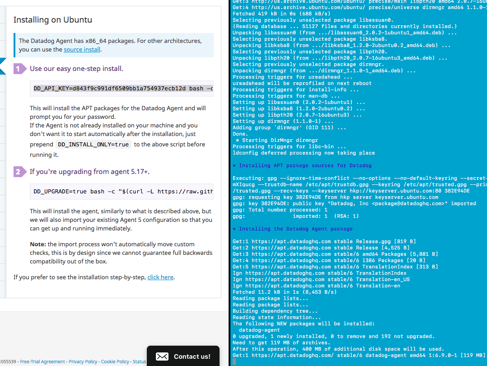


### Result
```
vagrant@precise64:~$ sudo service datadog-agent restart
 * Stopping Datadog Agent (stopping supervisord) datadog-agent          [ OK ]
 * Starting Datadog Agent (using supervisord) datadog-agent             [ OK ]
 
vagrant@precise64:~$ sudo dd-agent info
[...]
    mysql (5.20.1)
    --------------
      - instance #0 [OK]
      - Collected 1 metrics, 0 events & 1 service check
      - Dependencies:
          - pymysql: 0.6.6.None
         
[...]
```

Nice! Let's see how it look like on the WebApp with the default MuSQL integration dashboard.

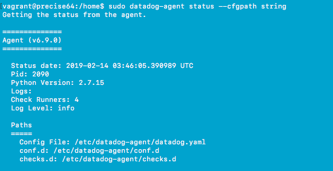

## Custom Agent

>Create a custom Agent check that submits a metric named my_metric with a random value between 0 and 1000.

My check will be called randomNumberCheck. I need to create two files named exactly the same :

`/etc/dd-agent/conf.d/randomNumberCheck.yaml`
```yaml
init_config:
    numberMin: 0
    numberMax: 1000

instances:
    [{}]
```

`/etc/dd-agent/checks.d/randomNumberCheck.py`

```Python
from checks import AgentCheck
from random import randint

class RandomNumberCheck(AgentCheck):

    def check(self, instance):
        # Getting the numbers set in the YAML file, if nothing has been provided, taking [0,1000] by default
        self.minNumber = self.init_config.get('minNumber', 0)
        self.maxNumber = self.init_config.get('maxNumber', 1000)

        # Regular checks for the inputs
        try:
            self.minNumber = int(self.minNumber)
            self.maxNumber = int(self.maxNumber)
        except ValueError:
            self.minNumber = 0
            self.maxNumber = 1000
            pass

        if(self.minNumber < self.maxNumber):
            self.minNumber, self.maxNumber = self.maxNumber, self.minNumber

        self.theChosenOne = randint(self.minNumber,self.maxNumber)

        self.gauge('my_metric', self.theChosenOne)
```

To avoid changing the python file in the futur, I decided to make min and max values as variable in my YAML file.

## Check collection interval
> Change your check's collection interval so that it only submits the metric once every 45 seconds.

First idea : in order to change the collection interval, we can change the YAML file `/etc/dd-agent/conf.d/randomNumberCheck.yaml` and add under the `init_config:` :
```YAML
min_collection_interval: 45
```

It will ensure the agent to be called as often as every 45 seconds.

> **Bonus Question** Can you change the collection interval without modifying the Python check file you created?

According to the question, collection interval can be changed by modifying the python file. It's seems a non easy way since it would imply to deal with timestamp directly. 

# Visualizing data

## Custom Timeboard

> Utilize the Datadog API to create a Timeboard that contains:
>- Your custom metric scoped over your host.
>- Any metric from the Integration on your Database with the anomaly function applied.
>- Your custom metric with the rollup function applied to sum up all the points for the past hour into one bucket


Let's see every dashboard we have to create one by one :

>Your custom metric scoped over your host.

```
{
  "requests": [
    { "q": "my_metric{host:precise64}",
    }
  ],
}
```


>Any metric from the Integration on your Database with the anomaly function applied.

```
{
  "requests": [
    { "q": "anomalies(avg:mysql.performance.cpu_time{*}, 'basic', 2)",
    }
  ],
}

```


>Your custom metric with the rollup function applied to sum up all the points for the past hour into one bucket

I decided to graph this with "bars" more than "lines" to really make it feel like bucket.

```
{
  "requests": [
    {
      "q": "my_metric{*}.rollup(sum, 3600)",
      "type": "bars",
    }
  ],
}
```

Let's wrap up all together with the API call (in bash):
```bash
#!/bin/sh

api_key=4f9bdc9b933756[...]
app_key=5634d2767f71a8[...]

curl  -X POST -H "Content-type: application/json" \
-d '{
      "graphs" : [{
          "title": "My metric for the host precise64",
          "definition": {
              "events": [],
              "requests": [
                  {"q": "my_metric{host:precise64}"}
              ]
          },
          "viz": "timeseries"
      },
      {
         "title": "Anomalies on CPU time for my MySQL database",
         "definition": {
              "events": [],
              "requests": [
                  {"q": "anomalies(avg:mysql.performance.cpu_time{*}, 'robust', 2)"}
              ]
          },
          "viz": "timeseries" 
      },
      {
          "title": "Rollup for my metric on the last hour",
          "definition": {
              "events": [],
              "requests": [
                  {"q": "my_metric{*}.rollup(sum, 3600)","type": "bars"}
              ]
          },
          "viz": "timeseries"
      }],
      "title" : "My Custom Timeboard for exercice",
      "description" : "A cool and nice timeboard.",
      "read_only": "True"
    }' \
"https://app.datadoghq.com/api/v1/dash?api_key=${api_key}&application_key=${app_key}"

```

Everything seems to work fine except the creation of the anomaly dashboard.
I get an error that I couldn't fix after troubleshooting :
```
vagrant@precise64:/vagrant$ bash create-dashboard.sh
{"errors": ["Error(s) found in query:\nError parsing query: \n unable to parse anomalies(avg:mysql.performance.cpu_time{*}, robust, 2): Rule 'scope_expr' didn't match at ', 2)' (line 1, column 52)."]}
```
I decided to go ahead and create this part by adding it to the dashboard created by the API with the UI.

> Set the Timeboard's timeframe to the past 5 minutes.

To set up the timeframe to the past 5 minutes, I just selected this frame on a graph, it automatically updated all the other. Anyhow we can be more precise with the selector at the top of the window.

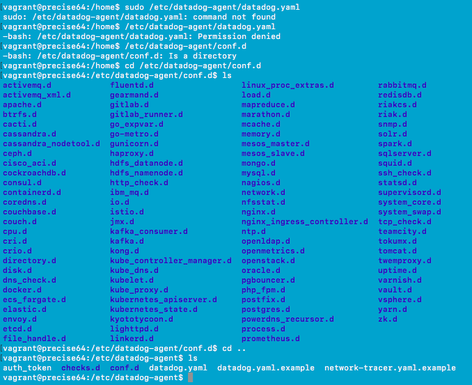

> Take a snapshot of this graph and use the @ notation to send it to yourself.


>**Bonus Question:** What is the Anomaly graph displaying?

Anomaly graph display warn when a data is going outisde a usual range. It calcul automatically what is the regular range by a powerfull algorithm. We can change the algorithm to be able to display a range thats fit more or less with the reality.

# Monitoring data

>Create a new Metric Monitor that watches the average of your custom metric (my_metric) and will alert if it’s above the following values over the past 5 minutes:
>- Warning threshold of 500
>- Alerting threshold of 800
>- And also ensure that it will notify you if there is No Data for this query over the past 10m.

With the UI, it's straightforward. First we need to go to `Monitors` in the left panel, then select `New Monitor`

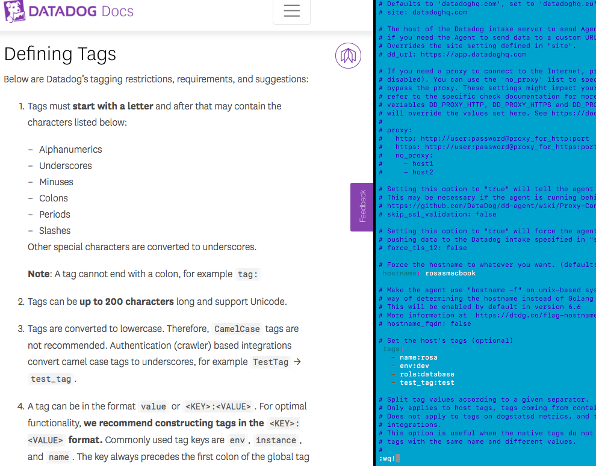

>Please configure the monitor’s message so that it will:
>- Send you an email whenever the monitor triggers.
>- Create different messages based on whether the monitor is in an Alert, Warning, or No Data state.
>- Include the metric value that caused the monitor to trigger and host ip when the Monitor triggers an Alert state.
>- When this monitor sends you an email notification, take a screenshot of the email that it sends you.

The panel for editing message is well done, it become easy to create a message according to every situation.

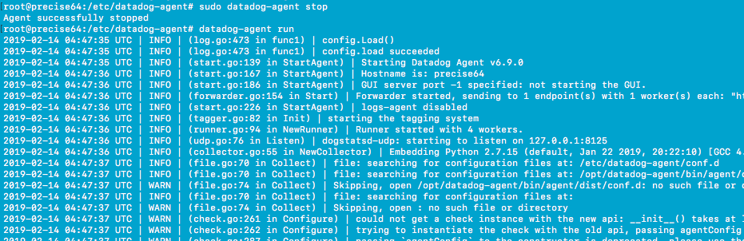

### Result

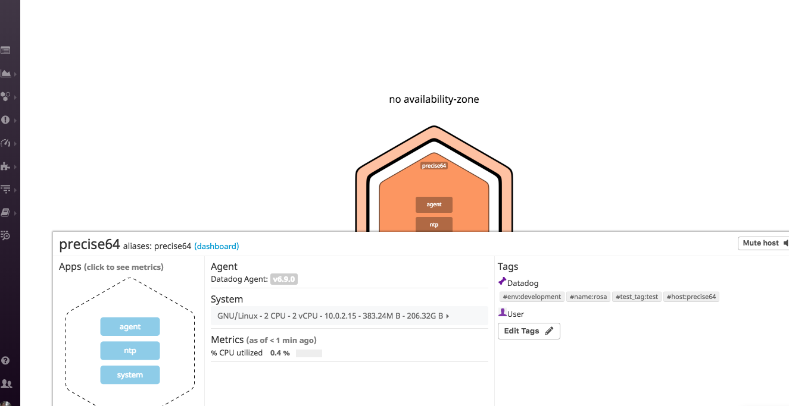

We can see that the host IP is not known, since my host is a Vagrant machine, I don't think it's really relevant to have this information anyway.

## Bonus Question 
>Bonus Question: Since this monitor is going to alert pretty often, you don’t want to be alerted when you are out of the office. Set up two scheduled downtimes for this monitor:
>- One that silences it from 7pm to 9am daily on M-F,
>- And one that silences it all day on Sat-Sun.
>- Make sure that your email is notified when you schedule the downtime and take a screenshot of that notification.


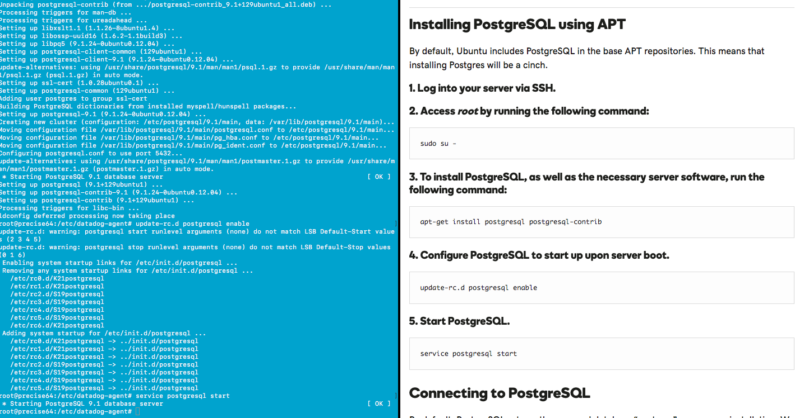

### Second Downtime

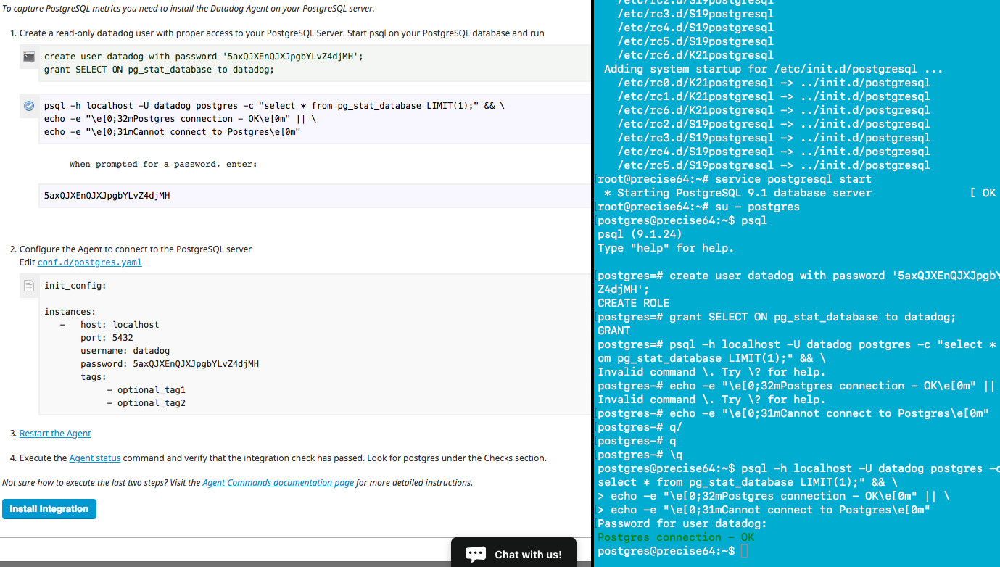

The tricky part here is on Monday morning between 00:00 and 9:00 am. Instead of creating a third downtime, making the second one starting at 9am solve the potential problem of being unwittingly woke up on a monday morning.

Since the downtime is set up for MON-FRI at 7pm and I'm doing this exercice on a Sunday, I created a downtime to be able to received the asked email.

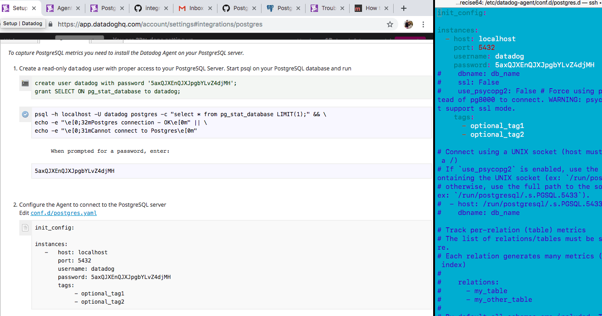

# Collecting APM Data

Since we are on a VM, I decided to stick with the flash app provided. I chose to do APM with the ddtrace-run method.

In one terminal, I started the flash APP with ddtrace-run.
```
vagrant@precise64:/vagrant$ ddtrace-run python flash-app.py
DEBUG:ddtrace.writer:resetting queues. pids(old:None new:18957)
2017-12-03 21:11:51,572 - ddtrace.writer - DEBUG - resetting queues. pids(old:None new:18957)
DEBUG:ddtrace.writer:starting flush thread
2017-12-03 21:11:51,573 - ddtrace.writer - DEBUG - starting flush thread
INFO:werkzeug: * Running on http://127.0.0.1:5000/ (Press CTRL+C to quit)
2017-12-03 21:11:51,578 - werkzeug - INFO -  * Running on http://127.0.0.1:5000/ (Press CTRL+C to quit)
DEBUG:ddtrace.api:reported 1 services
2017-12-03 21:11:52,586 - ddtrace.api - DEBUG - reported 1 services

INFO:werkzeug:127.0.0.1 - - [03/Dec/2017 21:14:09] "GET / HTTP/1.1" 200 -
2017-12-03 21:14:09,476 - werkzeug - INFO - 127.0.0.1 - - [03/Dec/2017 21:14:09] "GET / HTTP/1.1" 200 -
DEBUG:ddtrace.api:reported 1 traces in 0.00095s
2017-12-03 21:14:09,855 - ddtrace.api - DEBUG - reported 1 traces in 0.00095s
INFO:werkzeug:127.0.0.1 - - [03/Dec/2017 21:14:22] "GET / HTTP/1.1" 200 -
2017-12-03 21:14:22,067 - werkzeug - INFO - 127.0.0.1 - - [03/Dec/2017 21:14:22] "GET / HTTP/1.1" 200 -
DEBUG:ddtrace.api:reported 1 traces in 0.00245s
2017-12-03 21:14:22,883 - ddtrace.api - DEBUG - reported 1 traces in 0.00245s
INFO:werkzeug:127.0.0.1 - - [03/Dec/2017 21:15:22] "GET /api/apm HTTP/1.1" 200 -
2017-12-03 21:15:22,968 - werkzeug - INFO - 127.0.0.1 - - [03/Dec/2017 21:15:22] "GET /api/apm HTTP/1.1" 200 -
DEBUG:ddtrace.api:reported 1 traces in 0.00119s
2017-12-03 21:15:23,023 - ddtrace.api - DEBUG - reported 1 traces in 0.00119s
INFO:werkzeug:127.0.0.1 - - [03/Dec/2017 21:15:30] "GET /api/trace HTTP/1.1" 200 -
2017-12-03 21:15:30,103 - werkzeug - INFO - 127.0.0.1 - - [03/Dec/2017 21:15:30] "GET /api/trace HTTP/1.1" 200 -
DEBUG:ddtrace.api:reported 1 traces in 0.00152s
2017-12-03 21:15:31,036 - ddtrace.api - DEBUG - reported 1 traces in 0.00152s
INFO:werkzeug:127.0.0.1 - - [03/Dec/2017 21:16:15] "GET / HTTP/1.1" 200 -
2017-12-03 21:16:15,006 - werkzeug - INFO - 127.0.0.1 - - [03/Dec/2017 21:16:15] "GET / HTTP/1.1" 200 -
DEBUG:ddtrace.api:reported 1 traces in 0.00175s
2017-12-03 21:16:15,097 - ddtrace.api - DEBUG - reported 1 traces in 0.00175s
INFO:werkzeug:127.0.0.1 - - [03/Dec/2017 21:16:17] "GET /api/apm HTTP/1.1" 200 -
2017-12-03 21:16:17,312 - werkzeug - INFO - 127.0.0.1 - - [03/Dec/2017 21:16:17] "GET /api/apm HTTP/1.1" 200 -
DEBUG:ddtrace.api:reported 1 traces in 0.00160s
2017-12-03 21:16:18,103 - ddtrace.api - DEBUG - reported 1 traces in 0.00160s
INFO:werkzeug:127.0.0.1 - - [03/Dec/2017 21:16:18] "GET /api/trace HTTP/1.1" 200 -
2017-12-03 21:16:18,637 - werkzeug - INFO - 127.0.0.1 - - [03/Dec/2017 21:16:18] "GET /api/trace HTTP/1.1" 200 -
DEBUG:ddtrace.api:reported 1 traces in 0.00138s
2017-12-03 21:16:19,105 - ddtrace.api - DEBUG - reported 1 traces in 0.00138s
INFO:werkzeug:127.0.0.1 - - [03/Dec/2017 21:16:19] "GET / HTTP/1.1" 200 -
2017-12-03 21:16:19,894 - werkzeug - INFO - 127.0.0.1 - - [03/Dec/2017 21:16:19] "GET / HTTP/1.1" 200 -
DEBUG:ddtrace.api:reported 1 traces in 0.00106s
2017-12-03 21:16:20,108 - ddtrace.api - DEBUG - reported 1 traces in 0.00106s
INFO:werkzeug:127.0.0.1 - - [03/Dec/2017 21:16:20] "GET /api/apm HTTP/1.1" 200 -
2017-12-03 21:16:20,974 - werkzeug - INFO - 127.0.0.1 - - [03/Dec/2017 21:16:20] "GET /api/apm HTTP/1.1" 200 -
DEBUG:ddtrace.api:reported 1 traces in 0.00156s
2017-12-03 21:16:21,112 - ddtrace.api - DEBUG - reported 1 traces in 0.00156s
INFO:werkzeug:127.0.0.1 - - [03/Dec/2017 21:16:21] "GET /api/trace HTTP/1.1" 200 -
2017-12-03 21:16:21,966 - werkzeug - INFO - 127.0.0.1 - - [03/Dec/2017 21:16:21] "GET /api/trace HTTP/1.1" 200 -
DEBUG:ddtrace.api:reported 1 traces in 0.00136s
2017-12-03 21:16:22,114 - ddtrace.api - DEBUG - reported 1 traces in 0.00136s
INFO:werkzeug:127.0.0.1 - - [03/Dec/2017 21:16:22] "GET / HTTP/1.1" 200 -
2017-12-03 21:16:22,926 - werkzeug - INFO - 127.0.0.1 - - [03/Dec/2017 21:16:22] "GET / HTTP/1.1" 200 -
DEBUG:ddtrace.api:reported 1 traces in 0.00101s
2017-12-03 21:16:23,116 - ddtrace.api - DEBUG - reported 1 traces in 0.00101s
INFO:werkzeug:127.0.0.1 - - [03/Dec/2017 21:16:23] "GET /api/apm HTTP/1.1" 200 -
2017-12-03 21:16:23,965 - werkzeug - INFO - 127.0.0.1 - - [03/Dec/2017 21:16:23] "GET /api/apm HTTP/1.1" 200 -
DEBUG:ddtrace.api:reported 1 traces in 0.00129s
2017-12-03 21:16:24,119 - ddtrace.api - DEBUG - reported 1 traces in 0.00129s
INFO:werkzeug:127.0.0.1 - - [03/Dec/2017 21:16:24] "GET /api/trace HTTP/1.1" 200 -
2017-12-03 21:16:24,829 - werkzeug - INFO - 127.0.0.1 - - [03/Dec/2017 21:16:24] "GET /api/trace HTTP/1.1" 200 -
DEBUG:ddtrace.api:reported 1 traces in 0.00144s
2017-12-03 21:16:25,122 - ddtrace.api - DEBUG - reported 1 traces in 0.00144s
```

In another terminal, I needed to call the APP few times to start having some trace :

```
vagrant@precise64:~$ curl http://127.0.0.1:5000/
Entrypoint to the Application
vagrant@precise64:~$ curl http://127.0.0.1:5000/api/apm
Getting APM Started
vagrant@precise64:~$ curl http://127.0.0.1:5000/api/trace
Posting Traces
vagrant@precise64:~$ curl http://127.0.0.1:5000/
Entrypoint to the Application
vagrant@precise64:~$ curl http://127.0.0.1:5000/api/apm
Getting APM Started
vagrant@precise64:~$ curl http://127.0.0.1:5000/api/trace
Posting Traces
vagrant@precise64:~$ curl http://127.0.0.1:5000/
Entrypoint to the Application
vagrant@precise64:~$ curl http://127.0.0.1:5000/api/apm
Getting APM Started
vagrant@precise64:~$ curl http://127.0.0.1:5000/api/trace
Posting Traces
vagrant@precise64:~$ curl http://127.0.0.1:5000/
Entrypoint to the Application
vagrant@precise64:~$ curl http://127.0.0.1:5000/api/apm
Getting APM Started
vagrant@precise64:~$ curl http://127.0.0.1:5000/api/trace
Posting Traces
vagrant@precise64:~$
```

### Result

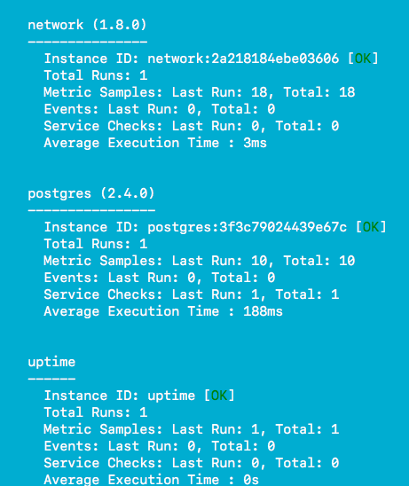

We can see some trace coming from the APP! Mission complete!

## Bonus question : service vs ressource

As far as I understood :
- A service is a set of monitored/traced part of application. It can be smaller than a full app (ex : a database, a web server...)
- A ressource is a smaller part of a service, refering a trace/call that Datadog managed to track within a service

# Final Question

> Datadog has been used in a lot of creative ways in the past. We’ve written some blog posts about using Datadog to monitor the NYC Subway System, Pokemon Go, and even office restroom availability!

>Is there anything creative you would use Datadog for?

Electricity is a very interesting energy since it can't be stored easily. Of course battery exist, but there is no solution viable [yet](https://techcrunch.com/2017/11/23/tesla-completes-the-worlds-largest-battery-for-australian-wind-farm/) for a macro size like a country. A direct consequence to this is that at any moment, any time, the production of electricity has to exactly fit the consumption. If not, the whole electricty grid can be instable and collapse.

Having the right electric supply according to the demand is challenging since the electric supply are heterogeneous :
- Nuclear power is very powerfull, cheap, but has alot of inertia (we cannot start a power plant in 2min, not even in 2 days) and have pollution concern
- Renewable energy are clean but unpredictable (what can we do if we need electricity and there is no wind and no sun?)
- Coal, oil, gaz plant are not clean power, expensive, but fast to deploy
- Hydro energy is fast, clean and can [store energy in potential energy form](https://en.wikipedia.org/wiki/Pumped-storage_hydroelectricity). But are scarce.

To understand better the issue bring by the lack of electricity storage, we can use Datadog to graph the real time production of electricity in France by type.

## Machine

Since a vagrant VM on my Macbook stop sending data when my computer is on sleeping mode, I decided to continue this exercice with a VM set up on AWS.

## Data source

I help myself with [this project](https://github.com/tmrowco/electricitymap) to get data.
I created therefore an agent check elec-france :
'/etc/dd-agent/conf.d/elec-france.yaml'
```
init_config:

instances:
    [{}]
``` 


`/etc/dd-agent/checks.d/elec-france.py'
```python
import requests
import xml.etree.ElementTree as ET
from checks import AgentCheck
import arrow

class Elecfrance(AgentCheck):

    def check(self, instance):
    	MAP_GENERATION = {
        	u'Nucl\xe9aire': 'nuclear',
        	'Charbon': 'coal',
        	'Gaz': 'gas',
        	'Fioul': 'oil',
        	'Hydraulique': 'hydro',
        	'Eolien': 'wind',
     		'Solaire': 'solar',
        	'Autres': 'biomass'
    	}
    	MAP_STORAGE = {
        	'Pompage': 'hydro',
    	}

	r = requests.session()
	formatted_date = arrow.now(tz='Europe/Paris').format('DD/MM/YYYY')
        url = 'http://www.rte-france.com/getEco2MixXml.php?type=mix&&dateDeb={}&dateFin={}&mode=NORM'.format(formatted_date, formatted_date)
        response = r.get(url)
	obj = ET.fromstring(response.content)
        mixtr = obj[7]
        data = {
            'countryCode': 'FR',
            'production': {},
            'storage': {},
            'source': 'rte-france.com',
        }
        for item in mixtr.getchildren():
            if item.get('granularite') != 'Global': continue
            key = item.get('v')
            value = None
            for value in item.getchildren(): pass
            if key in MAP_GENERATION:
                data['production'][MAP_GENERATION[key]] = float(value.text)
            elif key in MAP_STORAGE:
                data['storage'][MAP_STORAGE[key]] = -1 * float(value.text)

        for itemProduction in data['production']:
            dataName = "production." + itemProduction
            self.gauge(dataName, data['production'][itemProduction], tags=['production'])

        for itemStorage in data['storage']:
            dataName = "storage." + itemStorage
            self.gauge(dataName, data['storage'][itemStorage], tags=['storage'])
```

## Dashboards

I created two dashboards :
- One for having a global overview
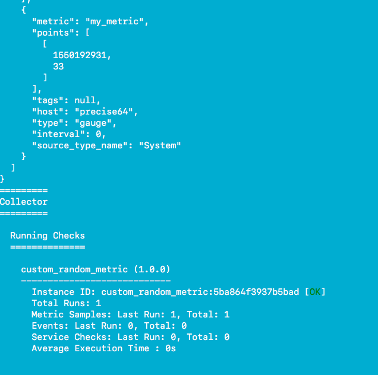
[Public link to the dashboard](https://p.datadoghq.com/sb/fac52a38d-2a4679219a).

- One focussing on the production part, with details
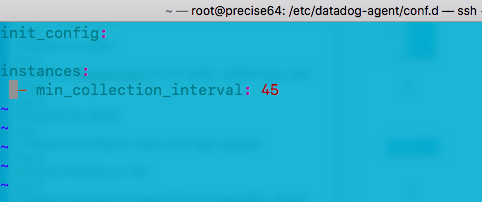
[Public link to the dashboard](https://p.datadoghq.com/sb/fac52a38d-3084f320d9).


## Impovements

- Metric units

I didn't manage to deal properly with the units since I take the information directly in MW. Having multiple thousands (k) of MW diplayed are not making the readability of the graphics easy. I should start again with correct metric sent and see what I can do with the old one since I didn't find any way to change them.

- Metric multiplication

Once we have those metrics, we can try to correlate them with metrics regarding price/quantity of MW exchanged from the European energy exchange market or other metrics not linked like the average temperature of the country.
We can as well try to catch some more precise metrics. Some metrics about production in area in France or production in other country are available too.

## Conclusion

First of all, we can notify how big the nuclear production is in France global production system. Moreover this is not the only source used : for all the little peaks of the day, fast deployment energy source like gas are used. In case of high demand (like a sunday at 7pm in the screenshots), storage resources can be used in order to satisfy the demand until another source is available (gas for instance).


 

        
