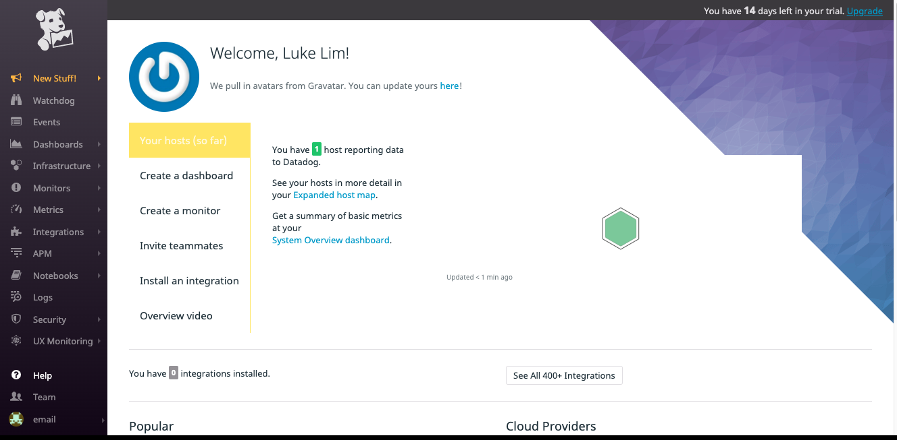
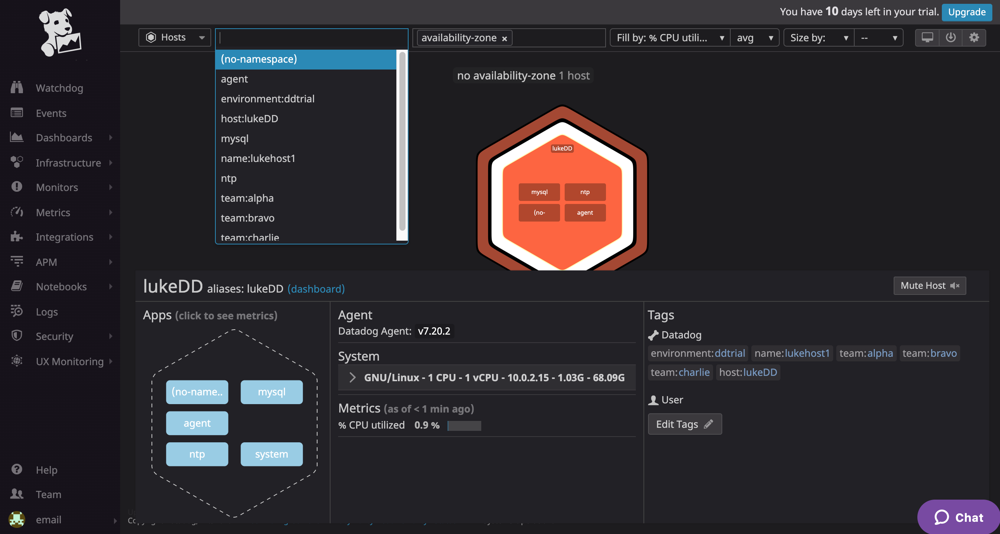

# Pre-Requisites / Setup

Having never used Vagrant, I thought I’d give this a go as it’s something new to learn about! 

•	Create Host for exercise - Ubuntu Server Installed on MacOS (Vagrant and VirtualBox)
    
    o	Renamed VM from “vagrant” to “lukeDD”
    
•	Signed up to DataDog (email@lukelim.com)

•	Installed Datadog Ubuntu agent on my VM
    
    o	My Agent Install Command: DD_AGENT_MAJOR_VERSION=7 DD_API_KEY=5b21cddf0e509ced5358c8bb2c57c97d DD_SITE="datadoghq.eu" bash -c "$(curl -L https://s3.amazonaws.com/dd-agent/scripts/install_script.sh)"
    
•	Successful agent Install and DataDog shows it installed: 

•	Then I had a good click around the system! 


# Collection Metrics

Had a browse through the options in the datadog.yaml file and realise there are a lot of options and all very well documented both in the yaml file itself and the product documentation! This gives and very good and starting point for a Datadog user to take up the basics and configure further.

Tags – Tags area great thing for a data platform and monitoring system as one of the biggest challenges in the data is understanding context and versioning for long term data validity. Tags allow this by making sure the data is grouped correctly for my business/team’s needs and also helps if we tag a transient metric or datapoint in case the underlying infrastructure is dynamic. Ie. A service moves and changes spec but it’s use and therefore reporting remains the same… I want to ensure this is reflected in my reports/dashboards/alerts.


##### Q. Add tags in the Agent config file and show us a screenshot of your host and its tags on the Host Map page in Datadog.
Didn’t want to go crazy with this but set up a few tags to see how they’d be reflected in the UI.

```
## @param hostname - string - optional - default: auto-detected
## Force the hostname name.
#
# hostname: <HOSTNAME_NAME>
hostname: lukeDD

## @param tags  - list of key:value elements - optional
## List of host tags. Attached in-app to every metric, event, log, trace, and service check emitted by this Agent.
##
## Learn more about tagging: https://docs.datadoghq.com/tagging/
#
# tags:
#   - environment:dev
#   - <TAG_KEY>:<TAG_VALUE>
#
tags:
  - environment:ddtrial
  - name:lukehost1
  - team:alpha
  - team:bravo
  - team:charlie
```

Here is the screenshot of the Host Map pages showing the tags and also from the filter drop down



##### Q. Install a database on your machine (MongoDB, MySQL, or PostgreSQL) and then install the respective Datadog integration for that database.

Installed MySQL Server on my base VM and started the MySQL service. The in built MySQL agent instructions are very clear and easy to follow to enable it and start data collection…

- Create Datadog user:
```
mysql> CREATE USER 'datadog'@'localhost' IDENTIFIED BY '<my_password>';
```

- Enable Permissions
```
GRANT REPLICATION CLIENT ON *.* TO 'datadog'@'localhost' WITH MAX_USER_CONNECTIONS 5;

GRANT PROCESS ON *.* TO 'datadog'@'localhost';

GRANT SELECT ON performance_schema.* TO 'datadog'@'localhost';
```

The following updates were made to the configuration files as per the agent documentation which again was very well written.

•	File: /etc/datadog-agent/conf.d/mysql.d/conf.yaml
o	Made copy example config file and made appropriate edits for password, etc.
o	Restart agent

•	File: /etc/mysql/mysql.conf.d/mysqld_safe_syslog.cnf
o	Made copy of file as backup 
o	Remove config lines from mysqld_safe_syslog.cnf

•	   File: /etc/mysql/my.cnf
o	Made copy of file as backup
o	Made edits as per the integration documentation

•	   Restart mysql service

•	Enable Logs in DataDog agent config as per documentation

•	Enable (un-comment) mysql.d/conf.yaml as per documentation for logging


**HIT AN ISSUE HERE resulting in not seeing the mysql agent appear in the Datadog UI
Needed to update the port access for 3306 on my machine**

After resolving the communication issue, the mysql instance appeared. Here it is in the Host Map:

