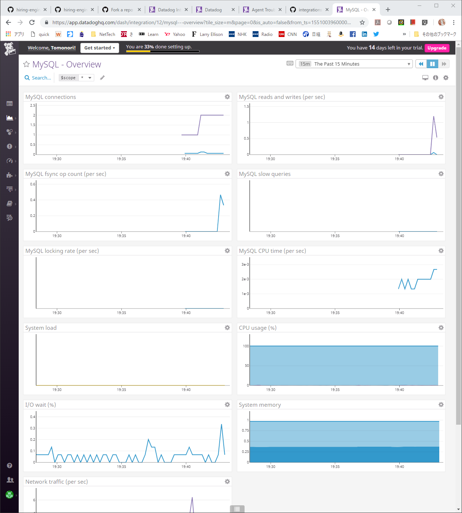

EDDITING, NOT SUBMITTED

Tomonori Matsuba
----
# Collecting Metrics:
* Add tags in the Agent config file and show us a screenshot of your host and its tags on the Host Map page in Datadog.

I changed the default name of vagrant to other names. tma is the new name, prefix of several names after this.

      
* Install a database on your machine (MongoDB, MySQL, or PostgreSQL) and then install the respective Datadog integration for that database.

MySQL is what I installed for the target DB. 

      

* Create a custom Agent check that submits a metric named my_metric with a random value between 0 and 1000.
* Change your check's collection interval so that it only submits the metric once every 45 seconds.

The graph shows both default 15 sec interval and 45 interval. The interval was changed by conf.d/tmacheck.d/conf.yaml.  
The code for the custom agent check follows.

    from random import randint
    try:
      from checks import AgentCheck
    except ImportError:
      from datadog_checks.checks import AgentCheck
    __version__ = "1.0.0"
    class TMaCheck(AgentCheck):
      def check(self, instance):
        ri = randint(0,1000)
        self.gauge('my_metric', ri)

* Bonus Question Can you change the collection interval without modifying the Python check file you created?  
The collection interval was changed initially by conf.yaml; if I use code to change the interval to 45sec,   
I'll skip twice to send the metric in check().

# Visualizing Data:
Utilize the Datadog API to create a Timeboard that contains:

* Your custom metric scoped over your host.
* Any metric from the Integration on your Database with the anomaly function applied.
* Your custom metric with the rollup function applied to sum up all the points for the past hour into one bucket
Please be sure, when submitting your hiring challenge, to include the script that you've used to create this Timeboard.

Once this is created, access the Dashboard from your Dashboard List in the UI:

* Set the Timeboard's timeframe to the past 5 minutes
* Take a snapshot of this graph and use the @ notation to send it to yourself.
* Bonus Question: What is the Anomaly graph displaying?
