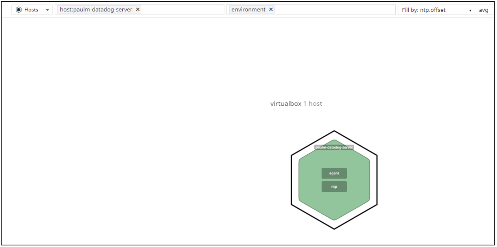
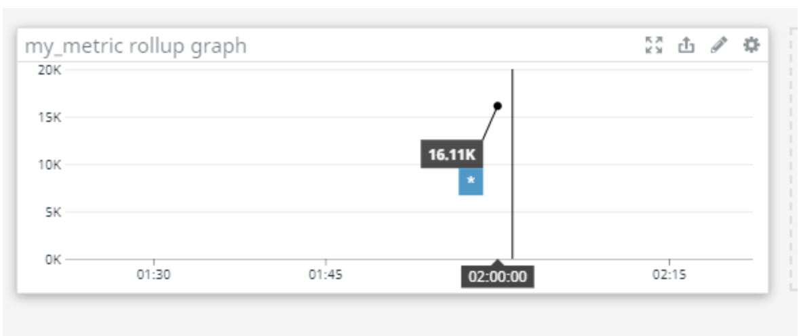

# DATADOG Technical Assessment


## Candidate: Paul Min
<br>

# Report Summary

This document will provide the solution for the DATADOG Technical Assessment geared for evaluating Sales/Solutions Engineer candidates. The exercises and criteria are located at: [https://github.com/DataDog/hiring-engineers/tree/solutions-engineer](https://github.com/DataDog/hiring-engineers/tree/solutions-engineer). For thoroughness, I provide my solutions, reasoning, and/or feedback in sequential order labeling the respective sections.

Overall, I very much enjoyed the exercise. It was a humbling experience, in that, I wrestled with some parts more heavily than others. I spent a sizable portion of my time relying on fundamentals while reading and researching about the unfamiliar terrain. For example, I never used Datadog so learning a new platform and its dependencies is the task in and of itself. It was fun, and I learned a lot. I’m excited to learn more.

During this assessment, I used Google only. I used Google for reference, research, and specific syntax clarifications. The important ones I reference in the appropriate sections; a lot of which are from [https://docs.datadoghq.com](https://docs.datadoghq.com/). I did not ask friends nor colleagues for help in completing this task, though I wouldn’t be against this in a real-world professional setting. I would also love helping teammates if they had questions no matter how basic or big.


# Prerequisites - Setup the environment

This section provides step-by-step instructions in launching a virtual machine via Vagrant-VirtualBox.Then it goes on to install a Datadog agent on it for monitoring.


1. Install VirtualBox for Windows10
2. Install Vagrant for Windows10 
3. Install VM
    1. Via Cygwin
    2. vagrant.exe box add ubuntu/xenial64
        1. (optional) --provider virtualbox --force
    3. vagrant.exe init ubuntu/xenial64
    4. vagrant.exe up
    5. Login:
        1. ssh -p 2222 -i /home/**paulm**/.vagrant/machines/default/virtualbox/private_key vagrant@127.0.0.1
        2. Or: vagrant.exe ssh
4. Sign up for Datadog.
5. After signing up, notice the message at the bottom of the console:


6. Following the instructions, we now install the agent by launching the script on the vm.
    ```
    DD_AGENT_MAJOR_VERSION=7 DD_API_KEY=7a8bf65fda7e6533f69b888f474913ae bash -c "$(curl -L https://s3.amazonaws.com/dd-agent/scripts/install_script.sh)"
    ```
7. Successfully installed and reporting should show something like the below:


8. If done correctly, you will now see the message at the lower right hand corner change to:


<br>


# Collecting Metrics


*   Add tags in the Agent config file and show us a screenshot of your host and its tags on the Host Map page in Datadog.

Appending the below snippet to the /etc/datadog/datadog.yaml file,


Will result in the Host Map page showing the appropriate new tags:





*   Install a database on your machine (MongoDB, MySQL, or PostgreSQL) and then install the respective Datadog integration for that database.

For simplicity, I installed MySQL using the apt package manager. As user root (or sudo), run the following commands:

> apt update

> apt install mysql-server

Confirm ‘mysqld’ is running after installation

> service mysql status

To install the Datadog integration component, follow the below steps:


1. Go to the Datadog console and Navigation menu ‘Integrations’
2. In the search bar type in “mysql” and you should see the following:

    


3. Hover your mouse over ‘Available’ then click ‘Install’
4. Click the “Configuration” tab to safely configure your database to be monitored
    1. For this step, you’ll need administrator level privileges like user ‘root’ to give datadog the proper rights to monitor the service
5. To verify that datadog is monitoring the service go to the Datadog console’s sidebar menu.
    2. Click Dashboards→ All Dashboards → MySQL - Overview Page
    3. If you scroll to the bottom, you’ll find that there are a few timeseries monitors that are titled “mysql” in them
*   Create a custom Agent check that submits a metric named my_metric with a random value between 0 and 1000.

This section’s solution was derived with guidance from the documentation: [https://docs.datadoghq.com/developers/write_agent_check/?tab=agentv6v7](https://docs.datadoghq.com/developers/write_agent_check/?tab=agentv6v7)


```
root@paulm-datadog-server:/etc/datadog-agent/checks.d# cat my_metric.py
import random
# the following try/except block will make the custom check compatible with any Agent version
try:
    # first, try to import the base class from new versions of the Agent...
    from datadog_checks.base import AgentCheck
except ImportError:
    # ...if the above failed, the check is running in Agent version < 6.6.0
    from checks import AgentCheck

# content of the special variable __version__ will be shown in the Agent status page
__version__ = "1.0.0"

class HelloCheck(AgentCheck):
    def check(self, instance):
#        self.gauge('my_metric', 1, tags=['custom_check:my_metric'])
        self.gauge('my_metric', random.randint(0,1000), tags=['custom_check:my_metric'])


```


Utilizing the check option, we see the custom check and conf file working:


```
root@paulm-datadog-server:/etc/datadog-agent/checks.d# sudo -u dd-agent -- datadog-agent check my_metric
=== Series ===
{
  "series": [
    {
      "metric": "my_metric",
      "points": [
        [
          1594256951,
          809
        ]
      ],
      "tags": [
        "custom_check:my_metric"
      ],
      "host": "paulm-datadog-server",
      "type": "gauge",
      "interval": 0,
      "source_type_name": "System"
    }
  ]
}
=========
Collector
=========

  Running Checks
  ==============

    my_metric (1.0.0)
    -----------------
      Instance ID: my_metric:d884b5186b651429 [OK]
      Configuration Source: file:/etc/datadog-agent/conf.d/my_metric.yaml
      Total Runs: 1
      Metric Samples: Last Run: 1, Total: 1
      Events: Last Run: 0, Total: 0
      Service Checks: Last Run: 0, Total: 0
      Average Execution Time : 1ms
      Last Execution Date : 2020-07-09 01:09:11.000000 UTC
      Last Successful Execution Date : 2020-07-09 01:09:11.000000 UTC


```


*   Change your check's collection interval so that it only submits the metric once every 45 seconds.

Changing the collection interval can be done in the conf file:


```
root@paulm-datadog-server:/etc/datadog-agent/conf.d# cat my_metric.yaml
init_config:

instances:
  - min_collection_interval: 45

#instances: [{}]
```


*   Bonus Question Can you change the collection interval without modifying the Python check file you created?

I”m not 100% sure about this one but my guess based on some basic research is to execute the check externally based on some manual or cronjob script call to the API. I originally thought there would be some override option or a way to interact with the datadog-agent or on the GUI itself but according to ([https://github.com/DataDog/dd-agent/issues/3239](https://github.com/DataDog/dd-agent/issues/3239)) handling it externally is the way to go.

<br>

# Visualizing Data

Utilize the Datadog API to create a Timeboard that contains:


*   Your custom metric scoped over your host.

For this section, I tried creating the Timeboard using Python and Bash. Below is the Python version. 


```
from datadog import initialize, api

options = {
    'api_key': '7a8bf65fda7e6533f69b888f474913ae',
    'app_key': '714d81d84d90988652376052db6ecd5c7e515cf0'
}

initialize(**options)

title = "my_metric dashboard"
description = "An informative timeboard about my_metric"
graphs = [{
    "definition": {
        "events": [],
        "requests": [
            {"q": "avg:my_metric{*}"}
        ],
        "viz": "timeseries"
    },
    "title": "my_metric graph"
}]

template_variables = [{
    "name": "host1",
    "prefix": "host",
    "default": "host:my-host"
}]

read_only = True
api.Timeboard.create(title=title,
                     description=description,
                     graphs=graphs,
                     template_variables=template_variables,
                     read_only=read_only)


```


This is the Bash version.


```
#!/bin/bash

api_key=7a8bf65fda7e6533f69b888f474913ae
app_key=714d81d84d90988652376052db6ecd5c7e515cf0

curl  -X POST -H "Content-type: application/json" \
-d '{
      "graphs" : [{
          "title": "my_metric graph",
          "definition": {
              "events": [],
              "requests": [
                  {"q": "avg:my_metric{*}"}
              ],
              "viz": "timeseries"
          }
      }],
      "title" : "my_metric dasboard",
      "description" : "A dashboard with my_metric info.",
      "template_variables": [{
          "name": "host1",
          "prefix": "host",
          "default": "host:my-host"
      }],
      "read_only": "True"
}' \
"https://api.datadoghq.com/api/v1/dash?api_key=${api_key}&application_key=${app_key}"


```


After running either of the codes, you’ll find that the Dashboards are appropriately created by going to the Datadog UI.


*   Any metric from the Integration on your Database with the anomaly function applied.

The screenshot and script is below.


```
from datadog import initialize, api

options = {
    'api_key': '7a8bf65fda7e6533f69b888f474913ae',
    'app_key': '714d81d84d90988652376052db6ecd5c7e515cf0'
}

initialize(**options)

title = "mysql dashboard ZZ"
description = "An informative timeboard about mysql"
graphs = [{
    "definition": {
        "events": [],
        "requests": [
#            {"q": "avg:mysql.performance.user_time{*}"}
            {"q": "anomalies(mysql.performance.user_time{*}, 'basic', 3)"}
        ],
        "viz": "timeseries"
    },
    "title": "mysql graph"
}]

template_variables = [{
    "name": "host1",
    "prefix": "host",
    "default": "host:my-host"
}]

read_only = True
api.Timeboard.create(title=title,
                     description=description,
                     graphs=graphs,
                     template_variables=template_variables,
                     read_only=read_only)
```


*   Your custom metric with the rollup function applied to sum up all the points for the past hour into one bucket

The screenshot and script is below.





```
from datadog import initialize, api

options = {
    'api_key': '7a8bf65fda7e6533f69b888f474913ae',
    'app_key': '714d81d84d90988652376052db6ecd5c7e515cf0'
}

initialize(**options)

title = "my_metric rollup ZZ"
description = "my_metric rollup"
graphs = [{
    "definition": {
        "events": [],
        "requests": [
            {"q": "avg:my_metric{*}.rollup(sum, 3600)"}
        ],
        "viz": "timeseries"
    },
    "title": "my_metric rollup graph"
}]

template_variables = [{
    "name": "host1",
    "prefix": "host",
    "default": "host:my-host"
}]

read_only = True
api.Timeboard.create(title=title,
                     description=description,
                     graphs=graphs,
                     template_variables=template_variables,
                     read_only=read_only)
```


Please be sure, when submitting your hiring challenge, to include the script that you've used to create this Timeboard.

Once this is created, access the Dashboard from your Dashboard List in the UI:


*   Set the Timeboard's timeframe to the past 5 minutes

```
Tried changing the timeframe by the drop down according to: https://docs.datadoghq.com/dashboards/guide/custom_time_frames/ but the version I have doesn't let me do this. So I chose to manually select the widget and it updated accordingly to 5 minutes. This worked but felt more like a workaround than what I've seen in the videos. 
```


*   Take a snapshot of this graph and use the @ notation to send it to yourself.

To take a snapshot hover over the widget and click the send icon and take the snapshot. After that, add a little comment and send it to people by typing the ‘@’ symbol to see the list of people you can send it to.


*   Bonus Question: What is the Anomaly graph displaying?

The anomaly graph may be driven by trend analysis or machine learning algorithms to detect anomalies based on historical analysis. This is different than, let’s say, threshold violations because some spikes may be acceptable according to historical conditions. For example, a web server hitting 99% at 8am may be acceptable because it happens everyday when people wake up. But if one day at 8am there’s 50%, it may be an issue worth raising because it didn’t violate any threshold parameter but according to historical analysis, it is odd behavior in contrast to data expectation ranges. There may be dependencies failing rather than the web server itself, for example.

<br>

# Monitoring Data

Since you’ve already caught your test metric going above 800 once, you don’t want to have to continually watch this dashboard to be alerted when it goes above 800 again. So let’s make life easier by creating a monitor.

Create a new Metric Monitor that watches the average of your custom metric (my_metric) and will alert if it’s above the following values over the past 5 minutes:


*   Warning threshold of 500
*   Alerting threshold of 800
*   And also ensure that it will notify you if there is No Data for this query over the past 10m.

The above requirements were configured using the GUI. The user can start by going to the sidebar navigation menu: Monitors → New Monitor → then select Metric. Configure the monitor by selecting the sections below as (follow the settings in quotations for each setting):


1. Choose Detection method: Threshold Alert
2. Define the Metric: select “my_metric” and for simplicity select from everywhere, excluding none, avg by everything.
3. Set alert conditions according to the requirements above. Furthermore, be sure to configure with “Trigger when the metric is “above” the threshold “on average” over the last “5 minutes.” Leave the recovery thresholds blank. “Require” a full window of data evaluation. “Notify” if data is missing for more than “10” minutes. “Never” automatically resolve this event from a no data state.
4. Say what’s happening. This section will be covered below in line with the requirements below.
5. Notify your team. Select your email address at the select team bar. “Notify” alert recipients when this alert is modified. “Do not restrict” editing this monitor to its creator or administrators.

Please configure the monitor’s message so that it will:


*   Send you an email whenever the monitor triggers.

```
@casperpaul@gmail.com
```


*   Create different messages based on whether the monitor is in an Alert, Warning, or No Data state.

```
{{#is_alert}}

  This is a ALERT message @casperpaul@gmail.com 

{{/is_alert}}

{{#is_warning}}

  This is a WARNING message @casperpaul@gmail.com 

{{/is_warning}}

{{#is_no_data}}

  This is a NO DATA message @casperpaul@gmail.com 

{{/is_no_data}} 
```


*   Include the metric value that caused the monitor to trigger and host ip when the Monitor triggers an Alert state.

```
My_metric is: {{value}} 
```


*   When this monitor sends you an email notification, take a screenshot of the email that it sends you.


*   Bonus Question: Since this monitor is going to alert pretty often, you don’t want to be alerted when you are out of the office. Set up two scheduled downtimes for this monitor:
    *   One that silences it from 7pm to 9am daily on M-F,
    *   And one that silences it all day on Sat-Sun.
    *   Make sure that your email is notified when you schedule the downtime and take a screenshot of that notification.

This is a mandatory feature required in most Enterprises, as some businesses hyper focus during production or critical hours. For example, trading organizations need to be on high alert during 9:30am to 4pm (market hours). Weekends are often used for maintenance and upgrades so suppressing alerts is important to not raise false positives. To schedule downtimes, refer to link: [https://docs.datadoghq.com/monitors/downtimes/?tab=bymonitorname](https://docs.datadoghq.com/monitors/downtimes/?tab=bymonitorname)

Start off by going to the Datadog UI. Go to the Sidebar. Monitors → click Manage Downtimes. To create downtimes according to the above requirements, follow the instructions below:


1. Click Schedule Downtime
2. Select Monitor “my metric threshold violations alert”
3. Schedule Recurring, where start day is a weekday (this check doesn’t account for holidays), Repeat every “1” day, Beginning “19:00”, Duration “14” hours, Repeat Until “No end date.”

Create another Schedule Downtime for the weekends.

4. Schedule Recurring, where start day is a Saturday. Repeat every 7 days, Beginning “00:00”, Duration “2” days, Repeat Until “No end date.”

For both alerts, add a brief message in (3) and Notify your team to keep track.

<br>

# Collecting APM Data

Given the following Flask app (or any Python/Ruby/Go app of your choice) instrument this using Datadog’s APM solution:


```
from flask import Flask
import logging
import sys

# Have flask use stdout as the logger
main_logger = logging.getLogger()
main_logger.setLevel(logging.DEBUG)
c = logging.StreamHandler(sys.stdout)
formatter = logging.Formatter('%(asctime)s - %(name)s - %(levelname)s - %(message)s')
c.setFormatter(formatter)
main_logger.addHandler(c)

app = Flask(__name__)

@app.route('/')
def api_entry():
    return 'Entrypoint to the Application'

@app.route('/api/apm')
def apm_endpoint():
    return 'Getting APM Started'

@app.route('/api/trace')
def trace_endpoint():
    return 'Posting Traces'

if __name__ == '__main__':
    app.run(host='0.0.0.0', port='5050')

```


*   Note: Using both ddtrace-run and manually inserting the Middleware has been known to cause issues. Please only use one or the other.

Provide a link and a screenshot of a Dashboard with both APM and Infrastructure Metrics.

Please include your fully instrumented app in your submission, as well.

For this portion, I used the above flask app. However I ran into some unknown issues where the flask app wouldn’t start due to port/bind conflictions. The workaround is to run the port in the command line. Accordingly, I launched the platform with the following command:


```
FLASK_APP=datadog_flask_apm.py DATADOG_ENV=flask_test DD_ENV=virtualbox DD_SERVICE=datadog_flask_app DD_VERSION=flask ddtrace-run flask run --port=5050
```


For testing ran some simple load tests with the command. This basically tries to hammer all the directories all at onces to conjure up some latency.


```
for i in {1..5000}; do curl 127.0.0.1:5050; done & for i in {1..5000}; do curl 127.0.0.1:5050/api/apm; done & for i in {1..5000}; do curl 127.0.0.1:5050/api/trace; done &
```


Putting all the pieces together I created the dashboard:


This dashboard shows the correlations that are possible from the hits that the flask server would receive. For example, the left widget shows the hit/error count, while the middle widget shows the correlation between the requests and the cpu. The widget on the right shows that there is a correlation between number of hits and tcp traffic hitting the loopback.

This dashboard can be found here: `https://p.datadoghq.com/sb/euaqga5iygnhae89-000a16ac2807b3f8ee98e79f43d02606`


*   Bonus Question: What is the difference between a Service and a Resource?

Let’s first define what a Service is. I like to think of a Service synonymously as a program or daemon in a computer system. These Services require Resources to run or operate. For example, you can have a program or daemon but without the Resources, they wouldn’t operate correctly--if at all. In short, Resources provide the means for programs and daemons to run their Service. So when monitoring a Service, monitoring the dependent Resources is a good way of figuring out the cause or bottlenecks of issues, or determining if resources are being spread thin due to a crowd of services.


# Final Question

Datadog has been used in a lot of creative ways in the past. We’ve written some blog posts about using Datadog to monitor the NYC Subway System, Pokemon Go, and even office restroom availability!

Is there anything creative you would use Datadog for?

Before speaking on the creative ways we can use Datadog, I’d like to briefly establish a baseline for monitoring enterprise level infrastructures. Typically, these infrastructures often require large technology investments as their business requirements necessitate it. For example, the business may require factors like high availability, performance, and/or security. When any of these are compromised there may be an impact on the business like: loss revenues, fines, and reputational risk.

Monitoring for these requirements provides a window that gives visibility into not only understanding the sophisticated, complex, and/or the interconnected systems, but the ability to make better decisions based on the data collected. This helps the technology and business operate in harmony. The word visibility is important here because it is two-fold. On one side, visibility is important for optimizing “the now” of an infrastructure while the other can behave as a feedback loop to the future direction of the business.

A creative Use Case I propose in an enterprise environment handling sensitive retail customer businesses is the Proactive Customer Experience System (PCES)--I just made this up, no need to google. For example, something like a CVS Pharmacy where prescriptions are deemed important whether they are picked up or delivered. This system puts high emphasis on the individual customer giving them a white glove service. The purpose of this system is to detect customers experiencing slowness (or anomalies) then proactively creating a ticket and/or reaching out to them saying the company is on top of it prior to any customer service or support inquiries. This may have strong long term implications to the consumers confidence that the enterprise team is aware of issues even before they are reported and that they are on top of issues and their health. It’s an auto-alert for esteemed customers. A comprehensively instrumented Datadog implementation has the ability to analyze the multihop environment, where it should be able to let the customer know step by step where they stand during the ordering process.


# Instructions

If you have a question, create an issue in this repository.

To submit your answers:


*   Fork this repo.
*   Answer the questions in answers.md
*   Commit as much code as you need to support your answers.
*   Submit a pull request.
*   Don't forget to include links to your dashboard(s), even better links and screenshots. We recommend that you include your screenshots inline with your answers.

This was completed.

Thank you again for your time and consideration.

