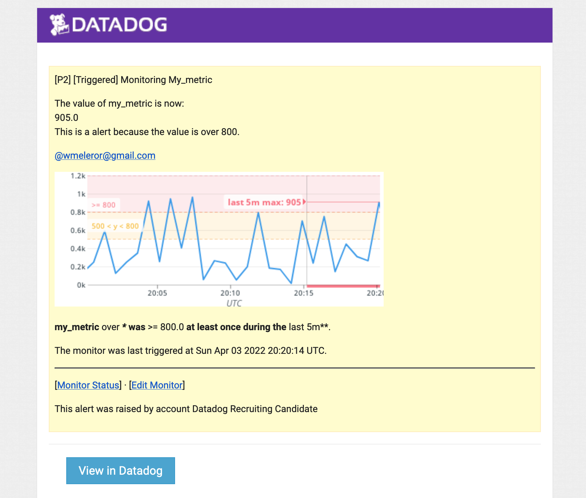

## The Exercise

## Prerequisites - Setup the environment

:heavy_check_mark: Docker container

**Please make sure to use “Datadog Recruiting Candidate” in [the “Company” field](https://a.cl.ly/wbuPdEBy)**

:heavy_check_mark: Get API-key and install agent

## Collecting Metrics:

The Host Map page in Datadog with tags. 

PostgreSQL Datadog integration.

Custom Agent named my_metric with a random value between 0 and 1000.

Custom Agent submits the metric once every 45 seconds.

* **Bonus Question** Can you change the collection interval without modifying the Python check file you created?

It’s possible, by modifying the min_collection_interval on the yaml file. 

## Visualizing Data:

Timeboard dreated by Datadog API.

[TODO] colocar o snaphot

[dashboard.py](dashboard.py)

* **Bonus Question**: What is the Anomaly graph displaying?

For this example I've considered an anomaly, percentage of usage of 2% and above.

## Monitoring Data

[TODO] take a screenshot

* **Bonus Question**: Since this monitor is going to alert pretty often, you don’t want to be alerted when you are out of the office. Set up two scheduled downtimes for this monitor:

  * One that silences it from 7pm to 9am daily on M-F,
  
  
  
  * And one that silences it all day on Sat-Sun.
  
  
  * Make sure that your email is notified when you schedule the downtime and take a screenshot of that notification.

## Collecting APM Data:

* **Bonus Question**: What is the difference between a Service and a Resource?

[TODO] 

Provide a link and a screenshot of a Dashboard with both APM and Infrastructure Metrics.

Script source code:

[apm-flask.py](apm-flask.py)

Dashboard Link:
[Dashboard Link](https://us3.datadoghq.com/dash/integration/156/apm-traces---estimated-usage?from_ts=1649007993943&to_ts=1649011593943&live=true)

## Final Question:

Datadog has been used in a lot of creative ways in the past. We’ve written some blog posts about using Datadog to monitor the NYC Subway System, Pokemon Go, and even office restroom availability!

Is there anything creative you would use Datadog for?

## Instructions

If you have a question, create an issue in this repository.

To submit your answers:

* Fork this repo.
* Answer the questions in answers.md
* Commit as much code as you need to support your answers.
* Submit a pull request.
* Don't forget to include links to your dashboard(s), even better links and screenshots. We recommend that you include your screenshots inline with your answers.

