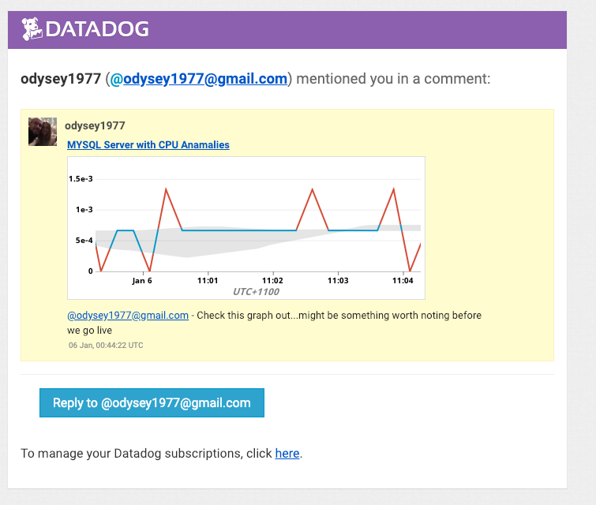

# DataDog Solutions Engineer Technical Exercise

The following is a submission for the Datadog Tech Exercise by Alex Dulmovits. If you have any questions please feel free to reach out to me at adulmovits@gmail.com.

# Setting up the Environment:

- Install [Virtualbox](https://www.virtualbox.org/wiki/Downloads) for your specific host and use it to spin up a CentOS7 VM 64bit
- Sign up for Datadog at https://www.datadoghq.com/ using “Datadog Recruiting Candidate” in the “Company” field
- Run the following command from your CentOS7 VM instance - this will install the YUM packages for the Datadog Agent and will prompt you for your password:  
```
DD_API_KEY=YOUR_API_KEY_GOES_HERE bash -c "$(curl -L https://raw.githubusercontent.com/DataDog/dd-agent/master/packaging/datadog-agent/source/install_agent.sh)"
```
- Confirm metrics are flowing into the Datadog UI

# Collecting Metrics:

## Adding Tags
__Add tags in the Agent config file and show us a screenshot of your host and its tags on the Host Map page in Datadog.__

Tagging is used throughout the Datadog product to make it easier to subset and query the machines and metrics that you have to monitor. Without the ability to assign and filter based on tags, finding the problems that exist in your environment and narrowing them down enough to discover the true causes would be extremely difficult.

- Edit the config file at `/etc/dd-agent/datadog.conf` to manually add tags to your agent:
```
tags: centos7, env:test, role:appdcontroller
```
- Restart the agent with the following command: `/etc/init.d/datadog-agent restart`
- Go to your Host Map view in the Datadog UI in order to see your newly created tags:  


## Database Integration
__Install a database on your machine (MongoDB, MySQL, or PostgreSQL) and then install the respective Datadog integration for that database.__

- Install a MySQL database on your VM (in my example I used an AppDynamics Controller's MySQL database to collect metrics from)
- If you don't have a database user account that has necessary permissions, create it and grant permissions as seen [here](https://docs.datadoghq.com/integrations/mysql/)
- Configure the agent to connect to the MySQL database by creating/editing: `/etc/dd-agent/conf.d/mysql.yaml`

[mysql.yaml](code/mysql.yaml):
```yaml
init_config:

instances:
  - server: localhost
    port: 3388
    user: root
    pass: root
    tags:
        - centos7
        - mysql5.5
        - env:test
    options:
        replication: 0
        galera_cluster: 1
```
- Restart the agent with the following command: `/etc/init.d/datadog-agent restart`
- Execute `/etc/init.d/datadog-agent info` command to verify that the integration check has passed. The output of the command should contain a section similar to the following:
```
    mysql (5.18.1)
    --------------
      - instance #0 [OK]
      - Collected 64 metrics, 0 events & 1 service check
      - Dependencies:
          - pymysql: 0.6.6.None
```  


## Agent Checks
__Create a custom Agent check that submits a metric named my_metric with a random value between 0 and 1000.__

Agent Checks allow you to collect metrics and events from custom sources or applications that do not have supported integrations. Agent Checks require files to be placed in two locations: the first file is the check module which is a python script placed in the checks.d directory and the second file is the agent check configuration which is a yaml file placed in the conf.d directory.

- Create your agent check configuration yaml file [randomnum.yaml](code/randomnum.yaml) and place it into `/etc/dd-agent/conf.d` - for this use case we don't need to add any intial configurations:
```yaml
init_config:

instances:
    [{}]
```
- Add your python script [randomnum.py](code/randomnum.py) to `/etc/dd-agent/checks.d`. This script includes the logic to return a random value between 0 and 1000 and submits it as a metric named my_metric. Note: Your agent check python script must have the same name as your intial configuration yaml file.
```python
import random
from checks import AgentCheck

class RandomNumCheck(AgentCheck):
    def check(self, instance):
       self.gauge('my_metric', random.random()*1000)
```  


## Agent Check Collection Interval
__Change your check's collection interval so that it only submits the metric once every 45 seconds.__

- Edit your agent check configuration file randomnum.yaml in `/etc/dd-agent/conf.d` to include the min_collection_interval configuration under the init_config section and set it to a value of '45'

```yaml
init_config:
    min_collection_interval: 45

instances:
    [{}]
```
The above doesn't necessarily mean the agent will submit the metric exactly every 45 seconds but instead it will be collected as often as every 45 seconds. Since the agent collector runs every 15-20 seconds, everytime it collects it will look to see when the last time the agent check ran. If that time is less than 45 seconds than it will not collect the agent check metric until the next collection.

## Bonus: Agent Check Collection Interval
__Bonus Question: Can you change the collection interval without modifying the Python check file you created?__

One way to change the collection interval without modifying any of the check files you created is to edit the AgentCheck class that all custom agent checks inherit from. Note: this will affect the collection interval for ALL of your custom agent checks.

- Go to `/opt/datadog-agent/agent/checks/__init__.py` and edit the value of DEFAULT_MIN_COLLECTION_INTERVAL. Your agent checks will now inherit this value as the new minimum collection interval.

[\_\_init\_\_.py](code/__init__.py):
```python
...
class AgentCheck(object):
    OK, WARNING, CRITICAL, UNKNOWN = (0, 1, 2, 3)

    SOURCE_TYPE_NAME = None

    DEFAULT_EXPIRY_SECONDS = 300

    DEFAULT_MIN_COLLECTION_INTERVAL = 45
...
```

# Visualizing Data:
## Creating a Timeboard with the API
__Utilize the Datadog API to create a Timeboard that contains:__  
- __Your custom metric scoped over your host.__  
- __Any metric from the Integration on your Database with the anomaly function applied.__  
- __Your custom metric with the rollup function applied to sum up all the points for the past hour into one bucket__  

The Datadog API allows you to pull and push data into Datadog. This data includes things such as metrics, events, checks, monitors, downtimes, etc. The Datadog API also allows for the creation of Timeboards which are dashboards that show metrics and events in a relative time frame in order to correlate data to help troubleshoot potential issues.

- Create an API Application Key in Datadog UI, if you haven't already, to gain full access to Datadog's programmatic API
- In order to use the API with Python, make sure the datadog python integration is installed: `pip install datadog`
- Create a python script to interact with the Datadog API and submit your Timeboard
- Run your python script `python timeboardapi.py`

[timeboardapi.py](code/timeboardapi.py):
```python
from datadog import initialize, api

options = {
    'api_key': 'YOUR_API_KEY_GOES_HERE',
    'app_key': 'YOUR_APP_KEY_GOES_HERE'
}

initialize(**options)

title = "Timeboard API"
description = "A timeboard created using the Datadog API"
graphs = [{
    "definition": {
        "events": [],
        "requests": [
            {
            "q": "avg:my_metric{host:datadoglabhost}",
             "type": "line"
            },
            {
             "q": "anomalies(avg:mysql.performance.queries{*}, 'basic', 2)",
             "type": "line"
            },
            {
             "q": "avg:my_metric{*}.rollup(sum, 3600)",
             "type": "line"
            }
        ],
    "viz": "timeseries"
    },
    "title": "Random Number and MySQL Queries"
}]

template_variables = [{
    "name": "host1",
    "prefix": "host",
    "default": "host:my-host"
}]

read_only = False
```

## Working with a Timeboard in the UI
__Once this is created, access the Dashboard from your Dashboard List in the UI:__
- __Set the Timeboard's timeframe to the past 5 minutes__
- __Take a snapshot of this graph and use the @ notation to send it to yourself__
<br>

- Use 'alt + ]' keyboard shortcut or click and drag on the graph to set the timeframe to 5min
- Click the snapshot icon  in the top right corner of the graph to take a snapshot
- You can add a message to the snapshot and use the @notation to send it yourself (or another Datadog user):  


- Go to the Events tab in order to view the snapshots you've been tagged in:  


## Bonus: Anomaly Graph
__Bonus Question: What is the Anomaly graph displaying?__

The Anomaly graph is currently displaying the metric mysql.performance.queries along with a gray band around it and a red line signifying any anomalies. Datadog is using the Basic algorithm to understand what is the expected normality for the mysql.performance.queries. The gray band on the graph represents the range that Datadog expects the incoming metrics to be within to 2 bounds (similar to standard deviations) based on historical data. If it sees an incoming metric deviate from this baseline by more than 2 bounds it will show it outside of the gray band and mark it red as an anomaly to signify this is not an expected value and there might be an issue here.  



# Monitoring Data
## Configuring a Metric Monitor
__Create a new Metric Monitor that watches the average of your custom metric (my_metric) and will alert if it’s above the following values over the past 5 minutes:__  
- __Warning threshold of 500__
- __Alerting threshold of 800__
- __And also ensure that it will notify you if there is No Data for this query over the past 10m.__  
    

 
__Please configure the monitor’s message so that it will:__ 
- __Send you an email whenever the monitor triggers.__
- __Create different messages based on whether the monitor is in an Alert, Warning, or No Data state.__
- __Include the metric value that caused the monitor to trigger and host ip when the Monitor triggers an Alert state.__
- __When this monitor sends you an email notification, take a screenshot of the email that it sends you.__

The following screenshot shows the configuration needed in order to send an email with different messages depending on if the monitor is in an Alert, Warning, or No Data state. You can use message template variables to automatically fill in values from your monitor such as metric name and host IP.  


When this monitor goes above the defined thresholds it will send the following email:  


## Bonus: Scheduling Downtime
__Bonus Question: Since this monitor is going to alert pretty often, you don’t want to be alerted when you are out of the office. Set up two scheduled downtimes for this monitor:__
- __One that silences it from 7pm to 9am daily on M-F,__
- __And one that silences it all day on Sat-Sun.__
- __Make sure that your email is notified when you schedule the downtime and take a screenshot of that notification.__
<br>  

- The following screenshot shows the configuration for a downtime that silences alerts from 7PM to 9AM daily on Moday through Friday:


- The following screenshot shows the configuration for a downtime that silences alerts on Saturday and Sunday


- When the scheduled downtime starts you will receive the following email letting you know it has started:


# Collecting APM Data:
## Instrumenting a Python Application
__Given the Flask app (or any Python/Ruby/Go app of your choice) instrument it using Datadog’s APM solution__

Datadog's integrated APM tool allows you to collect application performance metrics and gain insight into the relationship between your application's infrastructure and code.

- Install the Datadog Trace library: `pip install ddtrace`
- Import the tracer into the code: `from ddtrace import tracer`
- Run the python script using ddtrace-run: `ddtrace-run python flaskapp.py`
- Put load on the application: `nohup ./testload.sh &`

The instrumented [flaskapp.py](code/flaskapp.py):
```python
from flask import Flask
import logging
import sys
from ddtrace import tracer

# Have flask use stdout as the logger
main_logger = logging.getLogger()
main_logger.setLevel(logging.DEBUG)
c = logging.StreamHandler(sys.stdout)
formatter = logging.Formatter('%(asctime)s - %(name)s - %(levelname)s - %(message)s')
c.setFormatter(formatter)
main_logger.addHandler(c)

app = Flask(__name__)

@app.route('/')
def api_entry():
    return 'Entrypoint to the Application'

@app.route('/api/apm')
def apm_endpoint():
    return 'Getting APM Started'

@app.route('/api/trace')
def trace_endpoint():
    return 'Posting Traces'

if __name__ == '__main__':
    app.run()
```

Load running script [testload.sh](code/testload.sh):
```bash
#!/bin/bash

while :
do
   curl localhost:5000/
   sleep 2
   curl localhost:5000/api/apm
   sleep 2
   curl localhost:5000/api/trace
   sleep 2
done
```

## Bonus: Service vs. Resource
__Bonus Question: What is the difference between a Service and a Resource?__

A service in Datadog APM is defined as "a set of processes that do the same job". In relation to your application this would normally be a web app, a database, or a cache. Datadog will monitor the performance of each service individually and provice metrics such as requests, average latency, and error rate.

A resource in Datadog APM is defined as "a particular query to a service". The resources are the individual calls and traces that make up a service. For a web app service, resources will be entry points into the application such as specific URLs that users are hitting (ie. /api/apm or /api/trace). For a database, a resource will be an individual SQL query (ie. select * from database). The metrics of individual resources will make up the overall service's performance metrics.

[APM & Infrastructure Dashboard](https://app.datadoghq.com/dash/386548/apm--infrastructure-dashboard):


You can also set up monitors and see events correlated on your Timeboard graphs:


# Final Question:
__Datadog has been used in a lot of creative ways in the past. We’ve written some blog posts about using Datadog to monitor the NYC Subway System, Pokemon Go, and even office restroom availability!__

__Is there anything creative you would use Datadog for?__

When I think of places where a lightweight infrastructure monitoring agent such as Datadog would sit successfully I begin to think of some of the leading edge technologies we're going to see evolving in the next decade or so. Technologies such as self-driving cars and solar farms which are often in remote locations and need to be closely monitored to ensure uptime and that strict regulations are being met.

# Additional Work:
## AppDynamics-Datadog Event Integration

AppDynamics is an enterprise APM tool that allows you to monitor the end-to-end transactions of an application from the perspective of the end user. The AppDynamics Controller supports the ability to send HTTP Requests as the result of some event/alert in order to integrate with other tools. Using this feature, AppDynamics can send events into Datadog to correlate AppDynamics application events with infrastructure metrics.

- Configure the POST call to include your Datadog API Key and App Key:


- Use AppDynamics Templating Variables to map AppD event information into Datadog events in a JSON format:


- The event will show up in Datadog Event Stream where you can view information from the AppDynamics event and use the URL to go into the AppDynamics UI and do additional troubleshooting:


