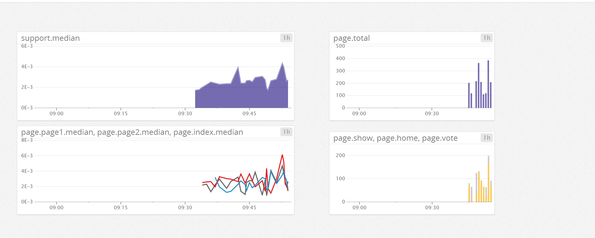

#Question 1
##Sending an event
Following is the code I used to emit an event and then send it as an email.  
```ruby
require 'rubygems'
require 'dogapi'

api_key='822c15b7b2f9fb8c49e8827404903e58'
app_key='f1dab6bb368ffa58b5d5af3358d77e42f48a1a21'

dog = Dogapi::Client.new(api_key, app_key)
host_name = 'vagrant-ubuntu-trusty-64'

test_event = dog.emit_event(Dogapi::Event.new("this will be the text\n@jroth@colgate.edu", 
                                              :msg_title => 'My Title :)'))
```

#####Email Comfirmation  
  

#####What is the agent?  
The agent is the software running on my computer in the background collecting metrics and then sending them out to Datadog. The agent is the reason why when I make calls to create histograms and increments and events, that info actually goes somewhere where I can see it and make dashboards

#Questions 2-4


I had previously built a web app where users can post questions and read/answer each others questions. The site can be found <a href="http://shaq-overflo.herokuapp.com/">here</a>. This was a challenge I did at DBC where my team and I had to build something like stack over flow so we made shaq overflow(we had fun with it). The dashboard I made to report metrics can be found in the link, there is also an image to show you what the code resulted in.  
<a href="https://p.datadoghq.com/sb/4fa302c67-1a701484c8">Dashboard Link</a>  
  
The dashboard has 4 graphs to answer the questions. Starting top left and going clockwise we have a graph of latency tagged with support, then we have the total page count, then a graph of all the seperate page counts(I tracked three pages), and then the last graph in the bottom left shows the different latencies per page(I again tracked three total pages).

I wrote helper methods in my application controller so that all controllers would inherit that behavior. Those helper methods were basically wrappers for the datadog api where I create an instance of Statsd and then make histograms, counts or increments. An example of those helpers is below
```ruby
  def histo_helper(tag = "support")
    stats = Statsd.new
    start_time = Time.now
    fake_work
    duration = Time.now - start_time
    stats.histogram(tag, duration)
  end
```
the other helpers and the code for the web app can be found <a href = "https://github.com/jkrth617/stack_over_clone/tree/master/app/controllers">here</a>, the helpers are in the application controller and then the other work done is in the question controller.  
The fake_work call replaces any db queries that would be done there. I only really had querying done on the main questions index page but to make more interesting graphs I basically faked out metrics so I could have more data. After the first time loading the page my computer would cache most of the data cause there to be a hug spike in the beginning but then basically flat-line. I had never used the load test tools so maybe they would have produced meaningful results, but for the sake of time I decided to focus on Datadog api and I didn't really look into those tools.  

#####Why do the graphs lookspiky?  
The times calculated and saved as duration are all erratic, when That info gets saved as a metric and sent to Datadog, connecting those points make the graphs spiky. 

#Question 5
I ran into some difficulty with this challenge. I ran into some problems when creating and writing to the yaml file needed as a prerequisite. There was some strange permissions errors which I had seen once before. Because of that I wasn't able to get the code running. and create a dashboard. The python code I wrote is not much different than the code given in the resource for agent checks. 

```python
import random

from checks import AgentCheck
class RandomCheck(AgentCheck):
    def check(self, instance):
        self.gauge('test.support.random', random.random())
```
