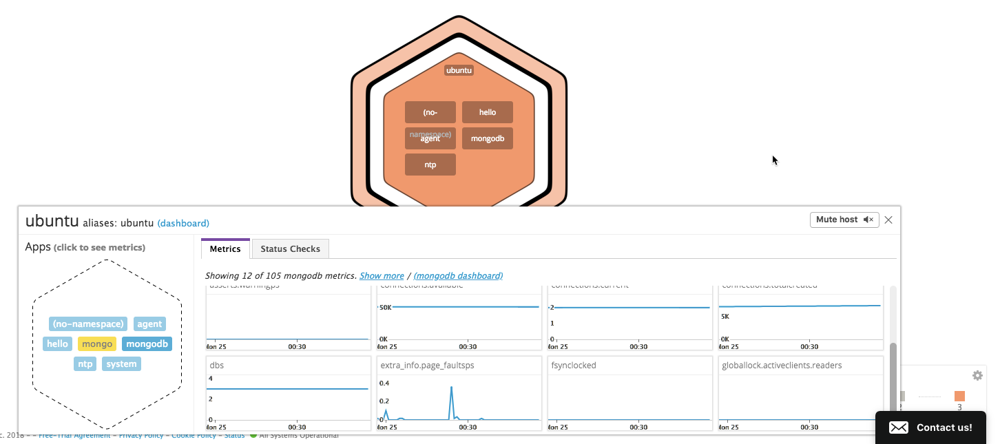
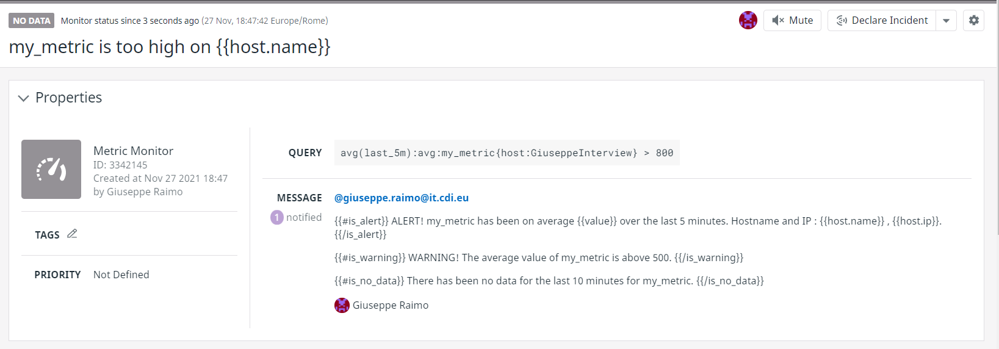
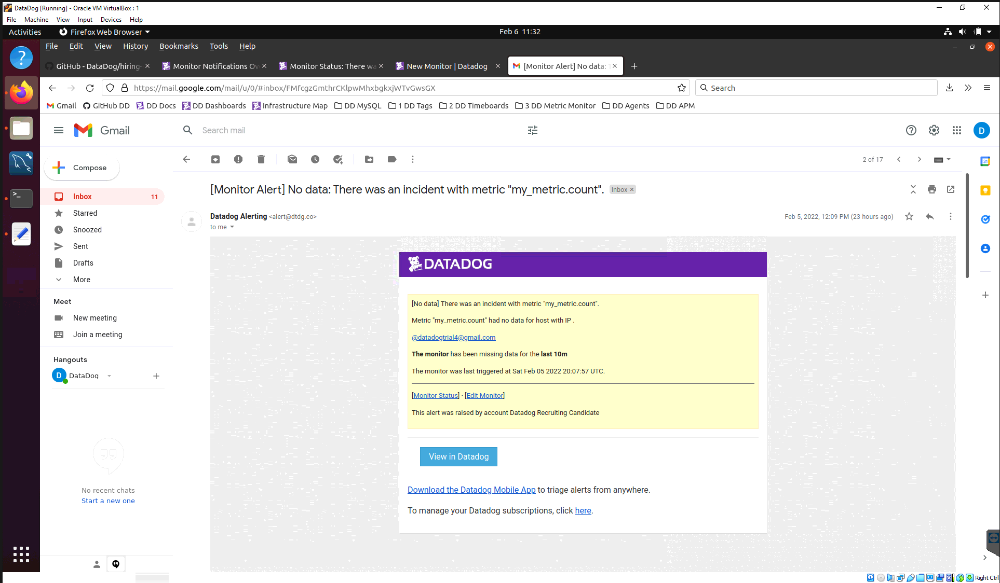

# Datadog Solutions Engineer Exercise
A technical exercise for the Solutions Engineering interview process at Datadog.

Datadog is a cloud-scale monitoring service that creates a single pane of glass
for the metrics and events generated by modern software solutions. Those
solutions can span numerous cloud and service providers with SOA and
micro-service architectures where messaging, queuing, caching, routing, and
service discovery are critical working components. These resources can be
configured and deployed in a host of ways, from containers, to virtual machines,
to bare metal.

Datadog boasts a huge library of integrations that allows customers to get
metrics into their system quickly and easily from almost any source, be it an
application, a database, tooling, a cloud provider, or third party services. And
with an API first approach developers can build custom integrations and push
custom metrics with ease. Even Graphs and Dashboards can be codified!

Datadog doesn't stop there. Real-time interactive dashboards enable customers to
quickly correlate data from all these sources and check the overall health of
their environments. Datadog can be configured to alert customers before
something goes wrong and operations teams can discuss in real-time about what
they are seeing within the dashboard itself. This keeps the context and history
relevant to the metrics at that moment in time.

<!-- START doctoc generated TOC please keep comment here to allow auto update -->
<!-- DON'T EDIT THIS SECTION, INSTEAD RE-RUN doctoc TO UPDATE -->
## Table of Contents

- [Setup an Ubuntu VM](#setup-an-ubuntu-vm)
- [Collecting Data](#collecting-data)
  - [Installing the Agent on Ubuntu](#installing-the-agent-on-ubuntu)
  - [Tagging](#tagging)
  - [Installing & Monitoring MongoDB](#installing--monitoring-mongodb)
  - [Writing a Custom Agent Check](#writing-a-custom-agent-check)
- [Visualizing Data](#visualizing-data)
  - [Mongo Dashboard](#mongo-dashboard)
  - [Snapshot and Annotation](#snapshot-and-annotation)
- [Alerting on Data](#alerting-on-data)
  - [Create a Monitor](#create-a-monitor)
  - [Email Screenshot](#email-screenshot)
  - [Night Time Down Time](#night-time-down-time)

<!-- END doctoc generated TOC please keep comment here to allow auto update -->

# Setup an Ubuntu VM
[Vagrant](https://www.vagrantup.com/) is a tool for building and managing
virtual machine environments. Vagrant provides easy to configure, reproducible,
and portable work environments built on top of industry-standard technology.

To get started with Vagrant follow the instruction set below:

- [Install Vagrant](https://www.vagrantup.com/docs/installation/) for your
specific operating system.
- [Install VirtualBox](https://www.virtualbox.org/wiki/Downloads); VirtualBox is
a general-purpose full virtualizer for x86 hardware, targeted at server, desktop
and embedded use.
- Clone this repository to your local workstation: `git clone
https://github.com/ckelner/hiring-engineers.git`
- Now run `vagrant up` from your terminal in this directory. This will add an
Ubuntu 12.04 Vagrant Box to your local workstation if you don't have it already.
A Box is simply a base virtual machine image to work with. Vagrant will then
boot a virtual machine using this image and any customizations found in the
`Vagrantfile` in this project. You'll know that it is successful if you see the
message `No Datadog API key found. Make sure 'secrets.yaml' exists. VM will
come up without Datadog agent installed.` -- we will address this in the next
session, but for now that is fine.
- You can SSH into your virtual machine by running `vagrant ssh`; you will see a
message similar to `Welcome to your Vagrant-built virtual machine` and you'll be
dropped to the VM's command prompt.

# Collecting Data
> Bonus question: In your own words, what is the Agent?

Data is at the core of all monitoring solutions. Datadog has a few ways to
collect data. The primary means is via an agent. The Datadog agent is a piece of
software that collects metrics and alerts and pushes them back to Datadog on
your behalf. Typically these are system level metrics (CPU, memory, disk) but
can also include custom application metrics as well.

## Installing the Agent on Ubuntu
Datadog offers step-by-step guides for the majority of common operating system
platforms which can be found
[here](https://app.datadoghq.com/account/settings#agent). For each there is
typically a one-line install snippet that can be used, typically this will only
apply when doing operations by hand. As an example, for our target platform
of Ubuntu, that looks like:

```bash
DD_API_KEY=$YOUR_API_KEY_HERE bash -c "$(curl -L https://raw.githubusercontent.com/DataDog/dd-agent/master/packaging/datadog-agent/source/install_agent.sh)"
```

For a more controlled and automated approach Datadog list the step-by-step
instructions as well. The [`Vagrantfile`](Vagrantfile) in this repo has adopted
those instructions to install the agent via a
[provisioner](https://www.vagrantup.com/docs/provisioning/). To take advantage
of this provisioner and install the Datadog agent when you run `vagrant up`
or `vagrant provision` you need to do the following:

- In this directory copy [`secrets.yaml.example`](secrets.yaml.example) to
  `secrets.yaml`.
  - `secrets.yaml` is never checked into source control as it is ignored through
  [`.gitignore`](.gitignore).
- Replace the `$YOUR_API_KEY_GOES_HERE` value with the real one from Datadog.
- If you still have your vagrant box running you can do `vagrant provision` and
you should see the provisioner run and install the agent. You can now go to
your [Infrastructure Host Map](https://app.datadoghq.com/infrastructure/map) to
see the agent reporting from the VM.

## Tagging
> Add tags in the Agent config file and show us a screenshot of your host and
> its tags on the Host Map page in Datadog.

[Tags](http://docs.datadoghq.com/guides/tagging/) make it easier to collect,
query, and filter for those resources which share the same tags. Tags can be
assigned via the UI, the API, the agent configuration, or inherited from an
integration.

For this project the tags are modified in the agent configuration with the
values defined in `tags.yaml`. This is automated through the
[`Vagrantfile`](Vagrantfile) provisioner. You can modify the tags in
[`tags.yaml`](tags.yaml) then run `vagrant provision` and it will alter the tags
in the agent config. It will take a few minutes to update in the
[Datadog UI](https://app.datadoghq.com/infrastructure/map).

Below is a screenshot of the default tags that will be applied to the host:


## Installing & Monitoring MongoDB
> Install a database on your machine (MongoDB, MySQL, or PostgreSQL) and then
> install the respective Datadog integration for that database.

This task we'll do via a script rather than the [`Vagrantfile`](Vagrantfile)
provisioner. Perform the following steps:

- If the vagrant VM isn't already running then `vagrant up`
- `vagrant ssh`
- `bash /vagrant_data/mongo-install.sh`
- The [scripts/mongo-install.sh](scripts/mongo-install.sh) will install mongodb,
configure the datadog database user, and configure the datadog-agent to be mongo
aware.
- The last command in the script is `sudo /etc/init.d/datadog-agent info` which
will display what checks are running. There should be a mongo check similar to
the one below:
  ```
  Checks
  ======
  ...
      mongo (5.13.2)
      --------------
        - instance #0 [OK]
        - Collected 112 metrics, 0 events & 1 service check
        - Dependencies:
            - pymongo: 3.2
  ```

And now when you revisit your
[Hostmap](https://app.datadoghq.com/infrastructure/map) you'll see that mongodb
metrics are reporting:


## Writing a Custom Agent Check
> Write a custom Agent check that samples a random value.
> Call this new metric: `test.support.random`

Datadog has a [great guide for writing an Agent
Check](http://docs.datadoghq.com/guides/agent_checks/) that has lots of details.
The basics are that a python check file which contains the check logic must be
placed in the `checks.d` directory and a YAML check configuration file by the
same name must be placed in the `conf.d` directory. This check and config abide
by certain structure which can be found in the [Datadog
documentation](http://docs.datadoghq.com/guides/agent_checks/).

To install our custom check follow these steps:

- If the vagrant VM isn't already running then `vagrant up`
- `vagrant ssh`
- `bash /vagrant_data/agent_check/install.sh`
- The [agent_check/install.sh](agent_check/install.sh) will place
  [randomcheck.py](agent_check/randomcheck.py) and
  [randomcheck.yaml](agent_check/randomcheck.yaml) in their appropriate
  directories and restart the agent.
- Shortly there after you can revisit the
[Hostmap](https://app.datadoghq.com/infrastructure/map) see the agent check
reporting:


# Visualizing Data
Visualizing data is really important for humans. Humans are experts at pattern
and anomaly recognition, but patterns and anomalies a hard to see when presented
purely as plain text. Visualizing data also makes it easier for someone to
perform a quick analysis over months and years of data in a very short amount
of time, where-as with non-visual data it would be a very lengthy task.

> Bonus question: What is the difference between a timeboard and a screenboard?

TimeBoards are used to sync all metrics and event graphs together via time for
the purpose of event correlation and troubleshooting. They are also bound to a
specific layout that cannot be altered much. Click
[here](https://app.datadoghq.com/dash/297522/mongo-dash-kelner) for an example.

ScreenBoards are for displaying data such as status (e.g. "Are all hosts up?")
and sharing data. These are great to put on display in the office or operations
center. ScreenBoards allow for a mixture of widgets and timeframes and allow for
custom layouts. Click [here](https://app.datadoghq.com/screen/190281) for an
example.

## Mongo Dashboard
> Since your database integration is reporting now, clone your database
> integration dashboard and add additional database metrics to it as well as
> your `test.support.random` metric from the custom Agent check.

[Mongo Dash Kelner](https://app.datadoghq.com/dash/297522/mongo-dash-kelner) =>


## Snapshot and Annotation
> Take a snapshot of your `test.support.random` graph and draw a box around a
> section that shows it going above 0.90. Make sure this snapshot is sent to
> your email by using the @notification


# Alerting on Data
Alerting can help teams get in front of issues before they become systematic or
cause outages for customers. Datadog alerts can be aggregate, focusing on higher
level viewpoints rather than granular data points. This is great because in
modern computing systems are built for failure and have tolerance and recovery
built-in. Datadog offers configuration for outliers, missing data, catching
unexpected trends, acceptable failure levels, and tons of integrations for
modern collaboration tooling and services.

## Create a Monitor
> Set up a monitor on this metric that alerts you when it goes above 0.90 at
least once during the last 5 minutes
> Bonus points: Make it a multi-alert by host so that you won't have to recreate
> it if your infrastructure scales up.
> Give it a descriptive monitor name and message (it might be worth it to
> include the link to your previously created dashboard in the message). Make
> sure that the monitor will notify you via email.

[Random is above 0.9! Check it
out!](https://app.datadoghq.com/monitors#2155663?group=all&live=4h) =>


## Email Screenshot
> This monitor should alert you within 15 minutes. So when it does, take a
screenshot of the email that it sends you.



## Night Time Down Time
> Bonus: Since this monitor is going to alert pretty often, you don't want to be
> alerted when you are out of the office. Set up a scheduled downtime for this
> monitor that silences it from 7pm to 9am daily. Make sure that your email is
> notified when you schedule the downtime and take a screenshot of that
> notification.


