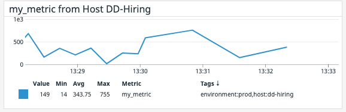
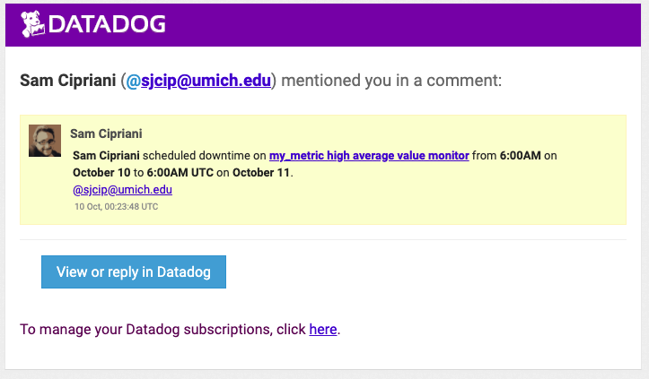

- [Basic Info](#basic-info)
    * [Organization](#organization)
- [Setup the Envirionment](#setup-the-envirionment)
    + [VMs](#vms)
    + [Sign up for DataDog](#sign-up-for-datadog)
    + [Get Agent Reporting Metrics](#get-agent-reporting-metrics)
- [Collecting Metrics](#collecting-metrics)
    + [Add Tags to the Agent](#add-tags-to-the-agent)
        * [For fun - change the hostname](#for-fun---change-the-hostname)
    + [Install a Database and Integration](#install-a-database-and-integration)
        * [Install the Database](#install-the-database)
        * [Install the Integration](#install-the-integration)
    + [Custom Agent Check](#custom-agent-check)
    + [Change the Collection Interval](#change-the-collection-interval)
    + [Bonus Question](#bonus-question)
- [Visualizing Data](#visualizing-data)
    + [Timeboard - API Method](#timeboard---api-method)
    + [Timeboard - Snapshot](#timeboard---snapshot)
    + [Bonus Question](#bonus-question-1)
- [Monitoring Data](#monitoring-data)
    + [New Monitor for `my_metric`](#new-monitor-for--my-metric-)
    + [Bonus Question](#bonus-question-2)
        * [Downtime for 7pm to 9am:](#downtime-for-7pm-to-9am-)
        * [Downtime for Sat-Sun:](#downtime-for-sat-sun-)
        * [Email confirmations (2 images):](#email-confirmations--2-images--)
- [Collecting APM Data](#collecting-apm-data)
    + [Setup](#setup)
    + [Dashboard](#dashboard)
    + [Bonus Question](#bonus-question-3)
- [Conclusion](#conclusion)
- [Appendix](#appendix)
    + [Insert Rows into DB (Anomaly)](#insert-rows-into-db--anomaly-)
    + [Timeboard - Postman Method](#timeboard---postman-method)
    + [Timeboard - GUI Method](#timeboard---gui-method)
    + [Insert rows into DB (Rows Inserted Graph)](#insert-rows-into-db--rows-inserted-graph-)
    + [Add a DB](#add-a-db)
      - [Add Table](#add-table)
      - [Insert into table](#insert-into-table)
      - [Screenshot](#screenshot)

<small><i><a href='http://ecotrust-canada.github.io/markdown-toc/'>Table of contents generated with markdown-toc</a></i></small>

# Basic Info

**Name:** Sam Cipriani

**Position:** Solutions Engineer

**Email:** sjcip@umich.edu

**Phone:** (571) 271-9166

##### Organization

I attempted to follow the basic structure in the `README` here. For example, where the `README` says "Create a new Metric Monitor...," I have made a subsection under "Monitoring Data" called "New Monitor for `my_metric`" and so on.

**NOTE:** I used another repo for a few of my hosts. The `host0` in this repo was for code snippets and screenshots; the other hosts I used were for my own edification. `host0` is AKA `dd-hiring`.

# Setup the Envirionment

### VMs

I decided to use Vagrant to set up a handful of VMs on my local machine. I used the following code each time to create the VMs:

```shell
$ vagrant init ubuntu/xenial6
$ vagrant up
$ vagrant ssh
```


### Sign up for DataDog

I signed up for a free trial using the email `sjcip@umich.edu`


### Get Agent Reporting Metrics

Once I had `ssh`ed into the Ubuntu VMs created above, I ran the supplied command to download/run a DD Agent:

```shell
$ DD_AGENT_MAJOR_VERSION=7 DD_API_KEY=<my-api-key> DD_SITE="datadoghq.com" bash -c "$(curl -L https://s3.amazonaws.com/dd-agent/scripts/install_script.sh)"
```

Shortly after the command above is executed, DataDog discovers the host (in this case, I haven't added any tags yet).


# Collecting Metrics

### Add Tags to the Agent

Edit the `datadog.yaml` file:

```shell
$ sudo vim /etc/datadog-agent/datadog.yaml
```

Specifically, uncomment and add to the `tags` section:

```yaml
## @param tags  - list of key:value elements - optional
## List of host tags. Attached in-app to every metric, event, log, trace, and service check emitted by this Agent.
##
## Learn more about tagging: https://docs.datadoghq.com/tagging/
#
tags:
  - environment:dev
  - purpose:screenshots
  - purpose:code-snippets
```

After saving the `datadog.yaml` file, restart the agent and check its status (in this case it's running):

```shell
$ sudo service datadog-agent restart
$ sudo service datadog-agent status
● datadog-agent.service - Datadog Agent
   Loaded: loaded (/lib/systemd/system/datadog-agent.service; enabled; vendor preset: enabled)
   Active: active (running) since Fri 2020-10-09 14:12:23 UTC; 25s ago
 Main PID: 4991 (agent)
    Tasks: 10
   Memory: 39.5M
      CPU: 984ms
   CGroup: /system.slice/datadog-agent.service
           └─4991 /opt/datadog-agent/bin/agent/agent run -p /opt/datadog-agent/run/agent.pid
...
...
```

After restarting the agent, the dashboard picks up the new tags:


>  Note the new tags in the screenshot above.

##### For fun - change the hostname

Since `ubuntu-xenial` is not a very descriptive hostname, I changed the hostname on this host to `dd-hiring`. To do this, I edited the `datadog.yaml` file again:

```
## @param hostname - string - optional - default: auto-detected
## Force the hostname name.
#
hostname: dd-hiring
```

After editing the file, I restarted the service and checked the infrastructure list dashboard:


> NOTE: I started with the name `dd_hiring`, but the change never appeared. I decided to troubleshoot it, and apparently it didn't like the `_` character. I renamed it to `dd-hiring`, and it showed right up.

### Install a Database and Integration

##### Install the Database

I elected to install a `PostgreSQL` database:

```shell
$ sudo apt-get install postgresql postgresql-contrib
```

Once installed, you have to create a role for the user `vagrant` (or whichever user you like). To do this, switch to the `postgres` user and create a `vagrant` superuser:

```shell
$ sudo su - postgres
postgres:~$ createuser vagrant -s			# -s for superuser
postgres:~$ exit
```

Now that Postgres is installed, create a new DB and run `psql` (list DBs with the `\l` command):

```sql
$ createdb demo_db
$ psql demo_db
psql (9.5.23)
Type "help" for help.

demo_db=# \l
                                  List of databases
   Name    |  Owner   | Encoding |   Collate   |    Ctype    |   Access privileges
-----------+----------+----------+-------------+-------------+-----------------------
 demo_db   | vagrant  | UTF8     | en_US.UTF-8 | en_US.UTF-8 |
 postgres  | postgres | UTF8     | en_US.UTF-8 | en_US.UTF-8 |
 template0 | postgres | UTF8     | en_US.UTF-8 | en_US.UTF-8 | =c/postgres          +
           |          |          |             |             | postgres=CTc/postgres
 template1 | postgres | UTF8     | en_US.UTF-8 | en_US.UTF-8 | =c/postgres          +
           |          |          |             |             | postgres=CTc/postgres
(4 rows)

```

##### Install the Integration

I followed the Postgres integration instructions. First, switch to `postgres` user, then create a `datadog` user, then give it `grant` permissions on `pg_start_database`. Finally, check the status with the supplied command:

```sql
vagrant@ubuntu-xenial:~$ sudo su - postgres
postgres@ubuntu-xenial:~$ psql
psql (9.5.23)
Type "help" for help.

postgres=# CREATE USER datadog WITH PASSWORD 'samcip';
CREATE ROLE
postgres=# grant SELECT ON pg_stat_database to datadog;
GRANT
postgres=# \q
postgres@ubuntu-xenial:~$ psql -h localhost -U datadog postgres -c \
> "select * from pg_stat_database LIMIT(1);" \
> && echo -e "\e[0;32mPostgres connection - OK\e[0m" \
> || echo -e "\e[0;31mCannot connect to Postgres\e[0m"
Password for user datadog:
Postgres connection - OK
```

Next, since this host is running pgsql version 9.5.23, create a `SECURITY DEFINER`:

```sql
$ psql
psql (9.5.23)
Type "help" for help.

postgres=# CREATE FUNCTION pg_stat_activity() RETURNS SETOF pg_catalog.pg_stat_activity AS
postgres-# $$ SELECT * from pg_catalog.pg_stat_activity; $$
postgres-# LANGUAGE sql VOLATILE SECURITY DEFINER;
CREATE FUNCTION
postgres=# CREATE VIEW pg_stat_activity_dd AS SELECT * FROM pg_stat_activity();
CREATE VIEW
postgres=# grant SELECT ON pg_stat_activity_dd to datadog;
GRANT
postgres=# \q
```

Next, I edited the `postgres.d/conf.yaml` file to point to `localhost` and port 5432; also I supplied the role and password:

```
$ sudo cp conf.yaml.example conf.yaml
$ sudo vim conf.yaml
```

```yaml
## Every instance is scheduled independent of the others.
#
instances:

    ## @param host - string - required
    ## The hostname to connect to.
    ## NOTE: Even if the server name is `localhost`, the Agent connects to PostgreSQL using TCP/IP unless you also
    ## provide a value for the sock key.
    #
  - host: localhost

    ## @param port - integer - optional - default: 5432
    ## The port to use when connecting to PostgreSQL.
    #
    port: 5432

    ## @param username - string - required
    ## The Datadog username created to connect to PostgreSQL.
    #
    username: datadog

    ## @param password - string - optional
    ## The password associated with the Datadog user.
    #
    password: samcip
```

Once this was done, I restarted the agent and clicked on the "install integration" button at the bottom of the instructions page:


I also ran the `status` command to verify that the agent was checking postgres:

```shell
$ sudo service datadog-agent status | grep postgres
Oct 09 18:07:31 ubuntu-xenial agent[11152]: 2020-10-09 18:07:31 UTC | CORE | INFO | (pkg/collector/runner/runner.go:261 in work) | check:postgres | Running check
Oct 09 18:07:31 ubuntu-xenial agent[11152]: 2020-10-09 18:07:31 UTC | CORE | INFO | (pkg/collector/runner/runner.go:327 in work) | check:postgres | Done running check
```

The integration page showed postgres successfully installed:


Since all that looked good, I came back to DataDog and checked that it was receiving data by creating a timeseries plot showing the `postgresql.db.count` from `host:dd-hiring`:


The image above shows a count of 1 database on the `dd-hiring` host.

### Custom Agent Check

To create a custom agent check, I followed the guide [linked here.](https://docs.datadoghq.com/developers/write_agent_check/?tab=agentv6v7)

To start, I created a python file called `my_metric.py` in the `/etc/datadog-agent/checks.d/` directory. I copy/pasted the example from the guide, and edited it so it would send a `randint` from 0-1000:

```python
import random # for the randint function

# the following try/except block will make the custom check compatible with any Agent version
try:
    # first, try to import the base class from new versions of the Agent...
    from datadog_checks.base import AgentCheck
except ImportError:
    # ...if the above failed, the check is running in Agent version < 6.6.0
    from checks import AgentCheck

# content of the special variable __version__ will be shown in the Agent status page
__version__ = "1.0.0"

class HelloCheck(AgentCheck):
    def check(self, instance):
        # this is the line I edited:
        self.gauge('my_metric', random.randint(0,1000), tags=['env:prod','host:dd-hiring'])
```

Once I had my python file, I made a `my_metric.yaml` file in `/etc/datadog-agent/conf.d/`:

```yaml
instances: [{}]
tags:
  - metric:my_metric
  - env:dev
  - purpose:get-hired
```

After that, I restarted the agent and validated the check:

```shell
$ sudo -u dd-agent -- datadog-agent check my_metric
=== Series ===
{
  "series": [
    {
      "metric": "my_metric",
      "points": [
        [
          1602271411,
          561
        ]
      ],
      "tags": [
        "env:prod",
        "host:dd-hiring"
      ],
      "host": "dd-hiring",
      "type": "gauge",
      "interval": 0,
      "source_type_name": "System"
    }
  ]
}
=========
Collector
=========

  Running Checks
  ==============

    my_metric (1.0.0)
    -----------------
      Instance ID: my_metric:d884b5186b651429 [OK]
      Configuration Source: file:/etc/datadog-agent/conf.d/my_metric.yaml
      Total Runs: 1
      Metric Samples: Last Run: 1, Total: 1
      Events: Last Run: 0, Total: 0
      Service Checks: Last Run: 0, Total: 0
      Average Execution Time : 0s
      Last Execution Date : 2020-10-09 19:23:31.000000 UTC
      Last Successful Execution Date : 2020-10-09 19:23:31.000000 UTC


Check has run only once, if some metrics are missing you can try again with --check-rate to see any other metric if available.
```

Finally, I went back to the DataDog UI and added a timeseries graph to my dashboard showing the metric from the `dd-hiring` host.

 

### Change the Collection Interval

From the guide linked above, it is straightforward to change the collection interval for a custom check. Simply add a `min_collection_interval` parameter to the `my_metric.yaml` file under `instances`:

```yaml
instances:
  - min_collection_interval: 45

tags:
  - metric:my_metric
  - env:dev
  - purpose:get-hired
```

As alwyas, restart the agent.

I checked the timeseries in the dashboard, and the new checks were clearly coming in less frequently:



By hovering over the timeseries, I was able to verify that before my change, the metric was report every 15 seconds, and after the change, every 45 seconds. Success!

### Bonus Question

***"Can you change the collection interval without modifying the Python check file you created?"***

I changed the collection interval without modifying the `.py` file. From the guide linked above, it seems the only way to change the collection interval is to specify a `min_collection_interval` in the `yaml` file for the given custom check.

# Visualizing Data

### Timeboard - API Method

> **NOTE:** The `timeboards` endpoint is outdated; I used the `dashboard` endpoint instead.
>
> 

First, I installed the python library:

```shell
$ python -m pip install datadog
```

Next, I created an application key:


Then, I followed the excelent python example on the [dashboards API reference page](https://docs.datadoghq.com/api/v1/dashboards/). I also looked at the `JSON` definitions from my existing dashboard widgets and wrote `timeboard_api.py`:

```python
from datadog import initialize, api

options = {
    'api_key': '<my-api-key>',
    'app_key': '<my-app-key>'
}

initialize(**options)

title = "Timeboard - API Method"
widgets = [
    {
        'definition': {
            'type': 'timeseries',
            'requests': [{'q': 'avg:my_metric{host:dd-hiring}'}],
            'title': 'my_metric from dd-hiring host; api method'
        }
    },
    {
        'definition': {
            'type': 'timeseries',
            'requests': [{'q': "anomalies(  avg:postgresql.rows_inserted{host:dd-hiring}, 'basic', 2)"}],
            'title': 'postgres rows inserted anomalies from dd-hiring host; api method'
        }
    },
    {
        'definition': {
            'type': 'query_value',
            'requests': [{'q': 'avg:my_metric{host:dd-hiring}.rollup(sum, 3600)'}],
            'title': 'rolling hour sum of my_metric (rollup); api method'
        }
    }
]

layout_type = 'ordered'
description = 'dashboard for dd-hiring process'
is_read_only = True
notify_list = ['sjcip@umich.edu']
template_variables = [{
    'name': 'timeboard - api method'
}]

output = api.Dashboard.create(title=title,
                     widgets=widgets,
                     layout_type=layout_type,
                     description=description,
                     is_read_only=is_read_only,
                     notify_list=notify_list,
                     template_variables=template_variables)

print(output)

```

... and ran it:

```json
$ python timeboard_api.py
{'notify_list': ['sjcip@umich.edu'], 'description': 'dashboard for dd-hiring process', 'author_name': 'Sam Cipriani', 'template_variables': [{'name': 'timeboard - api method'}], 'is_read_only': True, 'id': 'ies-fvu-pbn', 'title': 'Timeboard - API Method', 'url': '/dashboard/ies-fvu-pbn/timeboard---api-method', 'created_at': '2020-10-09T23:16:15.110902+00:00', 'modified_at': '2020-10-09T23:16:15.110902+00:00', 'author_handle': 'sjcip@umich.edu', 'widgets': [{'definition': {'requests': [{'q': 'avg:my_metric{host:dd-hiring}'}], 'type': 'timeseries', 'title': 'my_metric from dd-hiring host; api method'}, 'id': id-num}, {'definition': {'requests': [{'q': "anomalies(  avg:postgresql.rows_inserted{host:dd-hiring}, 'basic', 2)"}], 'type': 'timeseries', 'title': 'postgres rows inserted anomalies from dd-hiring host; api method'}, 'id': id-num}, {'definition': {'requests': [{'q': 'avg:my_metric{host:dd-hiring}.rollup(sum, 3600)'}], 'type': 'query_value', 'title': 'rolling hour sum of my_metric (rollup); api method'}, 'id': id-num}], 'layout_type': 'ordered'}
```

After running the python code, a new timeboard showed up in my Dashboard list:


To get it to show an anomaly, I added a row to my `test_table` in the Postgres database:

```sql
demo_db=# INSERT INTO test_table VALUES ('john', 'doe');
```

The dashboard looks like this:


(Note the red anomaly "spike" in the central graph.)

### Timeboard - Snapshot

The instructions didn't specify which graph to snapshot, so I took a snapshot of the most interesting graph of the three - the `my_metric` timeseries:


I promptly received a notification in my email:


### Bonus Question

***"What is the Anomaly graph displaying?***

The Anomaly detection graph displays a trendline with grey bar indicating the "expected" range of values. The range width is defined in the algorithm's arguments (can be thought of as numbers of standard deviations). In the case of the basic algorithm I selected above, the algorithm used is called the "lagging rolling quantile algorithm."

Basically, the trendline changes color if it goes outside an "expected" range at a given time, alerting the user to a potential *anomaly* in the data trend.

# Monitoring Data

### New Monitor for `my_metric`

I created a new Monitor to keep track of high average values of `my_metric`. Two screenshots showing the settings follow:


The full text from the "Say what's happening" section:

```
@sjcip@umich.edu
{{^is_no_data}}
The average value of `my_metric` over the last 5 minutes is {{value}}
{{/is_no_data}}

{{#is_alert}}
ALERT! `my_metric` has averaged very high over the last 5 minutes.
{{/is_alert}}

{{#is_warning}}
Warning - `my_metric` has averaged slightly high over the last 5 minutes.
{{/is_warning}}

{{#is_no_data}}
There has been no data from `my_metric` for the past 5 minutes.
{{/is_no_data}}
```

After saving the monitor, it was not a long wait before I received this `warning` alert:


### Bonus Question

***Since this monitor is going to alert pretty often, you don’t want to be alerted when you are out of the office. Set up two scheduled downtimes for this monitor:***

​     ***- One that silences it from 7pm to 9am daily on M-F,***

​     ***- And one that silences it all day on Sat-Sun.***

​     ***- Make sure that your email is notified when you schedule the downtime and take a screenshot of that notification.***

##### Downtime for 7pm to 9am:


##### Downtime for Sat-Sun:


##### Email confirmations (2 images):





# Collecting APM Data

### Setup

I followed the in-app instructions on the APM page. I also drew from [this blog post](https://www.datadoghq.com/blog/monitoring-flask-apps-with-datadog/) and several other sources. I chose to use the `ddtrace-run` method.

First, I had to install `python-pip` and get the `ddtrace` package (for `python3`):

```shell
$ sudo apt-get install python3-pip
$ python3 -m pip install --upgrade pip
$ python3 -m pip install ddtrace
```

Next, I copied the Flask app from the instructions page to `apm_app.py`. I ran it on the `dd-hiring` host with the following command:

```shell
$ DD_SERVICE="apm_app" DD_ENV="prod" ddtrace-run python3 apm_app.py --port=5050
```

Finally, I `curl`ed the app so there would be some traffic to trace:

```shell
# Note that I ran these dozens of times each...
$ curl 0.0.0.0:5050
$ curl 0.0.0.0:5050/api/trace
$ curl 0.0.0.0:5050/api/apm
```

### Dashboard

Shortly after running the `ddtrace-run` command, a new service named `apm_app` showed up in my Services list:


A view of the service page:


The next screenshot shows the `traces_bytes` metric from the `trace_agent.receiver` and the CPU from the same host. I sent a bunch of requests in a short time to the Flask endpoint - the spike shows up in `traces_bytes` and in `CPU` at the same time:


### Bonus Question

***What is the difference between a Service and a Resource?***

Derived from the [APM glossary](https://docs.datadoghq.com/tracing/visualization/):

A **service** is a (hopefully, logical) group of endpoints or jobs that make up a part of a scalable application. Services should be related sets of functions.

A **resource** is just that - an asset that can be accessed or referenced by a *service* or other aspect of an application. Resources enable services to do their jobs.

# Conclusion

Thank you for the opportunity to complete this exercise - I had fun working through the challenges. I created an appendix (below) which contains some side-work and extra stuff I did, just for kicks.

# Appendix

### Insert Rows into DB (Anomaly)

To get the anomaly spike to appear in the postgres "rows inserted" anomaly timeseries, I had to add some rows. To do that, I had to add a table (which I named `test_table`). Here's the `SQL` I used to accomplish that:

```sql
vagrant@ubuntu-xenial:~$ psql demo_db
psql (9.5.23)
Type "help" for help.

demo_db=# \c demo_db
You are now connected to database "demo_db" as user "vagrant".
demo_db=# \l
                                  List of databases
   Name    |  Owner   | Encoding |   Collate   |    Ctype    |   Access privileges
-----------+----------+----------+-------------+-------------+-----------------------
 demo_db   | vagrant  | UTF8     | en_US.UTF-8 | en_US.UTF-8 |
 postgres  | postgres | UTF8     | en_US.UTF-8 | en_US.UTF-8 |
 template0 | postgres | UTF8     | en_US.UTF-8 | en_US.UTF-8 | =c/postgres          +
           |          |          |             |             | postgres=CTc/postgres
 template1 | postgres | UTF8     | en_US.UTF-8 | en_US.UTF-8 | =c/postgres          +
           |          |          |             |             | postgres=CTc/postgres
(4 rows)

demo_db=# \dt
No relations found.
demo_db=# CREATE TABLE test_table (
demo_db(#    firstname varchar(60),
demo_db(#    lastname varchar(60)
demo_db(# );
CREATE TABLE
demo_db=# INSERT INTO test_table VALUES ('sam', 'cipriani');
INSERT 0 1
demo_db=# INSERT INTO test_table VALUES ('jake', 'snell');
INSERT 0 1
demo_db=# \dt
           List of relations
 Schema |    Name    | Type  |  Owner
--------+------------+-------+---------
 public | test_table | table | vagrant
(1 row)

demo_db=# select * from test_table;
 firstname | lastname
-----------+----------
 sam       | cipriani
 jake      | snell
(2 rows)
```


### Timeboard - Postman Method

Just for fun, I also created a dashboard using POSTman. Here's a screenshot of the call (note that the headers are not show, but include the api and app keys):


And the resulting dashboard:


### Timeboard - GUI Method

> **NOTE:** When I got halfway through the timeboard exercise, I realized I was supposed to use the API to create the Timeboard. I did this by mistake, but kept this section just for fun.

To create a new timeboard, I went to the dashboards page and clicked New Dashboard:


From there, I clicked on New Timeboard and named it `demo-timeboard`:


Once this was done, I added a timeseries for `my_metric` scoped to the `dd-hiring` host:


Next, I added a postgres "rows inserted" timeseries and added the anomaly detection function:


Finally, I added a "query value" display that uses the rollup function to sum up the past 3,600 seconds (1 hour):


The resulting timecard looks like this:


> See "Appendix -> Insert Rows into DB (Anomaly)" for info on how I got the anomaly spike to appear.


### Insert rows into DB (Rows Inserted Graph)

```sql
datadog_host3_db=# INSERT INTO dd_test VALUES ('Boulder', 117000);
INSERT 0 1
datadog_host3_db=# exit
```

The screenshot shows a spike in the "rows inserted" graph. It only goes up to about `0.07` which appears to be a sort of average over time. Since only 1 row was inserted, the number of ROWS/TIME could be small depending on the TIME window.


### Add a DB

The workflow I followed to add a database (this was on a separate host from `dd-hiring` where psql version 13 was installed):

```sql
vagrant@ubuntu-xenial:~$ createdb testdb
vagrant@ubuntu-xenial:~$ psql testdb
psql (13.0 (Ubuntu 13.0-1.pgdg16.04+1))
Type "help" for help.

testdb=# \l
                                     List of databases
       Name       |  Owner   | Encoding |   Collate   |    Ctype    |   Access privileges
------------------+----------+----------+-------------+-------------+-----------------------
 datadog_host3_db | vagrant  | UTF8     | en_US.UTF-8 | en_US.UTF-8 |
 postgres         | postgres | UTF8     | en_US.UTF-8 | en_US.UTF-8 |
 template0        | postgres | UTF8     | en_US.UTF-8 | en_US.UTF-8 | =c/postgres          +
                  |          |          |             |             | postgres=CTc/postgres
 template1        | postgres | UTF8     | en_US.UTF-8 | en_US.UTF-8 | =c/postgres          +
                  |          |          |             |             | postgres=CTc/postgres
 testdb           | vagrant  | UTF8     | en_US.UTF-8 | en_US.UTF-8 |
(5 rows)
```

#### Add Table

```sql
testdb=# CREATE TABLE test_table (
   firstname varchar(60),
   lastname varchar(60)
);
CREATE TABLE
testdb=# \dt
           List of relations
 Schema |    Name    | Type  |  Owner
--------+------------+-------+---------
 public | test_table | table | vagrant
(1 row)

```

#### Insert into table

```sql
testdb=# INSERT INTO test_table VALUES ('sam', 'cipriani');
         INSERT INTO test_table VALUES ('jake', 'snell');
INSERT 0 1
INSERT 0 1
testdb=# select * from test_table;
 firstname | lastname
-----------+----------
 sam       | cipriani
 jake      | snell
(2 rows)
```

#### Screenshot

The Screenshot shows the DB count increasing.


