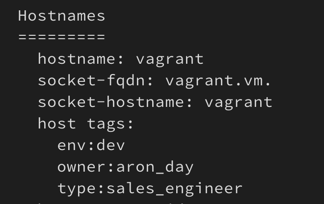
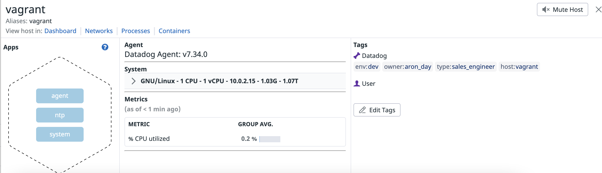
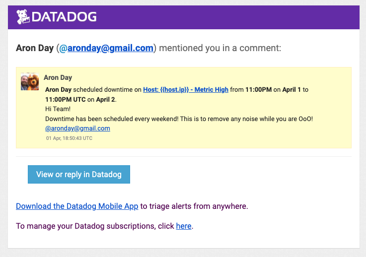

# Datadog Hiring Exercise - Mid-Market Sales Engineer, Dublin, Ireland
#### Aron Day
###### April, 2022
</br>

Thanks for the opportunity to complete this fun exercise and progress to the next stage of the interviewing process. I had so much fun learning more about the different use cases to use Datadog.
</br></br>
## Prerequisites - Setting up the Environment

For the purpose of this POC, I will be using Vagrant

Install the latest version of Vagrant & VirtualBox by following the instructions [here](https://learn.hashicorp.com/collections/vagrant/getting-started). 

Once vagrant & virtualbox is installed, run the following commands;
</br></br>
Initialize Vagrant - Ubuntu 18.04 LTS 64-bit.
</br>
```vagrant init hashicorp/bionic64```
</br></br>
Start the virtual machine.
</br>
```vagrant up```
</br></br>
SSH into the virtual machine
</br>
```vagrant ssh```
</br></br>

## Install Datadog Agent

Install Datadog agent for Ubuntu
</br>
```DD_AGENT_MAJOR_VERSION=7 DD_API_KEY=<redacted> DD_SITE="datadoghq.eu" bash -c "$(curl -L https://s3.amazonaws.com/dd-agent/scripts/install_script.sh)"```
</br>

## Collecting Metrics

Added tags in the `datadog.yaml` file in `/etc/datadog-agent` directory.
</br></br>
Change directory to access config file.
</br>
```cd etc/datadog-agent```
</br></br>
Open datadogo config file for editting to add tags.
</br>
```sudo vi datadog.yaml```
</br>

</br>
Reload Datadog service
</br>
```systemctl restart datadog-agent```
</br>
Validate that tags are getting exported via the agent
</br>

</br>
Tags appear in the Datadog UI
</br></br>

</br></br>
Note: It can take some time (15 mins) for data to populate on the dashboard

## MySQL

Install MySQL via the Debian Package Tool "apt"

Vaildate you have the latest packages
</br>
```sudo apt-get update```
</br></br>
Install MySQL Package & all dependencies.
</br>
```sudo apt-get install mysql-server```
</br></br>
Once MySQL is installed, proceed to configue it. 
</br>
** This is not PRODUCTION ready**
</br></br>
Login to MySQL via command-line
</br>
```sudo mysql -u root```
</br></br>
Create a database user for the Datadog Agent as documented in Datadog Documentation [here](https://app.datadoghq.eu/account/settings#integrations/mysql)
</br>
```mysql> CREATE USER 'datadog'@'localhost' IDENTIFIED BY '<UNIQUEPASSWORD>';```
</br></br>
Grant the datadog user the following privileges only.
</br>
```mysql> GRANT REPLICATION CLIENT ON *.* TO 'datadog'@'%' WITH MAX_USER_CONNECTIONS 5;```
</br></br>
```mysql> GRANT PROCESS ON *.* TO 'datadog'@'localhost';```
</br><br>
```mysql> GRANT SELECT ON performance_schema.* TO 'datadog'@'localhost';```
</br></br>
### Metric collection
Create mysql.d/conf.yaml or use the exmple.
</br>
Make sure that any file you create within the datadog dir has the correct ownership of ```dd-agent```. Otherwise your intergrations & checks won't work correctly! 
</br></br>
```cd /etc/datadog-agent/conf.d/mysql.d```
</br></br>
```vi conf.yaml```
</br></br>
Add the following codeblock
</br>
```yaml
init_config:

instances:
  - server: 127.0.0.1
    user: datadog
    pass: "<YOUR_CHOSEN_PASSWORD>" # from the CREATE USER step earlier
    port: "<YOUR_MYSQL_PORT>" # e.g. 3306
    options:
      replication: false
      galera_cluster: true
      extra_status_metrics: true
      extra_innodb_metrics: true
      extra_performance_metrics: true
      schema_size_metrics: false
      disable_innodb_metrics: false
```
</br>
If you are unsure on which port, you can check via mysql by running the following:
</br>

``` sql
mysql> SHOW GLOBAL VARIABLES LIKE 'PORT';
+---------------+-------+
| Variable_name | Value |
+---------------+-------+
| port          | 3306  |
+---------------+-------+
1 row in set (0.00 sec)
```
</br><br>
Restart datadog-agent.
</br>
```sudo systemctl restart datadog-agent```
</br></br>
Confirm that datadog agent can make a connection to mysql
</br></br>
```sudo datadog-agent status```
</br></br>
``` 
mysql (8.0.3)
    -------------
      Instance ID: mysql:f07dbc7a3ba974ea [OK]
      Configuration Source: file:/etc/datadog-agent/conf.d/mysql.d/conf.yaml
      Total Runs: 38
      Metric Samples: Last Run: 128, Total: 4,863
      Events: Last Run: 0, Total: 0
      Service Checks: Last Run: 1, Total: 38
      Average Execution Time : 24ms
      Last Execution Date : 2022-04-01 12:16:54 UTC (1648815414000)
      Last Successful Execution Date : 2022-04-01 12:16:54 UTC (1648815414000)
      metadata:
        flavor: MySQL
        version.build: unspecified
        version.major: 5
        version.minor: 7
        version.patch: 37
        version.raw: 5.7.37+unspecified
        version.scheme: semver
```
</br></br>
Don't forget to install the MySQL intergration - It can take at least 5 minutes for data to appear.
</br></br>

</br></br>
Confirm data in Datadog UI
</br></br>


## Custom Agent Check

</br>
Lets not reinvent the wheel and use exisiting documented datadog code for the custom check. 
</br>
 References for code:

 * [Custom Agent Check](https://docs.datadoghq.com/developers/write_agent_check/?tab=agentv6v7#custom-agent-check/)
 * [Custom Agent Check - Gauge](https://docs.datadoghq.com/metrics/agent_metrics_submission/?tab=gauge)
 * [Collection interval](https://docs.datadoghq.com/developers/write_agent_check/?tab=agentv6v7#collection-interval)

Create a new directory named ```my_metric.d``` 
</br></br>
```sudo mkdir /etc/datadog-agent/conf.d/my_metric.d```
</br></br>
Create a new file called ```my_metric.yaml``` & add the following code:
</br></br>
```sudo vi /etc/datadog-agent/conf.d/my_metric.d/my_metric.yaml```
</br>

```
init_config:
  
instances:
  - min_collection_interval: 45
```        
</br>
This allow us to change the Collection interval from the default of 30 to 45 seconds. 
</br></br>

Create a new python file in ```/etc/datadog-agent/checks.d``` named ```my_metric```. Add the following code:
``` 
import random

# the following try/except block will make the custom check compatible with any Agent version
try:
    # first, try to import the base class from new versions of the Agent...
    from datadog_checks.base import AgentCheck
except ImportError:
    # ...if the above failed, the check is running in Agent version < 6.6.0
    from checks import AgentCheck

# content of the special variable __version__ will be shown in the Agent status page
__version__ = "1.0.0"

class MyClass(AgentCheck):
    def check(self, instance):
        self.gauge(
            "my_metric",
            random.randint(0, 1000),
        )
```

</br>
Restart datadog-agent.
</br>

```sudo systemctl restart datadog-agent```
</br>

Validate datadog agent picks up new check
</br>
```datadog-agent status```
```
my_metric (1.0.0)
    -----------------------
      Instance ID: my_metric:5ba864f3937b5bad [OK]
      Configuration Source: file:/etc/datadog-agent/conf.d/my_metric.d/my_metric.yaml
      Total Runs: 17
      Metric Samples: Last Run: 1, Total: 17
      Events: Last Run: 0, Total: 0
      Service Checks: Last Run: 0, Total: 0
      Average Execution Time : 0s
      Last Execution Date : 2022-04-01 13:52:14 UTC (1648821134000)
      Last Successful Execution Date : 2022-04-01 13:52:14 UTC (1648821134000)
````
Bonus Question:
</br>
We set the collection interval within the my_metric yaml config. This allows the ability to adjust the collection interval in a config file rather than the python file. 

## Visualizing Data

First to use the API, you need to create a new Application Key to use along side your exisiting API key. Best practice to create a seperate API & Application Key. This needs to be done via the Organization Settings in Datadog UI. 
More Details can be found [here](https://docs.datadoghq.com/account_management/api-app-keys/).
</br></br>
For ease of use, and less dependencies we use CuRL to call the API. 
</br></br>
The objective is to create a timeboard, and display widgets via the API.
</br>
Run the following CuRL block:
``` curl
curl -X POST \
  https://api.datadoghq.eu/api/v1/dashboard \
  -H 'Content-Type: application/json' \
  -H 'DD-API-KEY: <redacted>' \
  -H 'DD-APPLICATION-KEY: <redacted>' \
  -d '{
  "title": "Datadog Exercise - Visualizing Data - Timeboard",
  "description": "Custom timeboard for Datadog Exercise - Visualizing Data",
  "layout_type": "ordered",
  "widgets": [
    {
      "definition": {
        "title": "Custom Metric",
        "type": "timeseries",
        "legend_size": "2",
        "requests": [
          {
            "q": "my_metric{host:vagrant}"
          }
        ]
      }
    },
    {
      "definition": {
        "title": "MySQL - Anomalies - CPU Performance",
        "type": "timeseries",
        "requests": [
          {
            "q": "anomalies(avg:mysql.performance.cpu_time{host:vagrant}, '\''basic'\'', 2)",
            "display_type": "line",
            "style": {
              "palette": "cool",
              "line_type": "solid",
              "line_width": "normal"
            }
          }
        ],
        "yaxis": {
          "label": "Percent",
          "scale": "linear",
          "min": "auto",
          "max": "auto",
          "include_zero": true
        }
      }
    },
    {
      "definition": {
        "title": "Hourly Rollup - Custom Metric",
        "legend_size": "2",
        "type": "timeseries",
        "requests": [
          {
            "q": "sum:my_metric{host:vagrant}.rollup(sum, 3600)",
            "display_type": "line",
            "style": {
              "palette": "cool",
              "line_type": "solid",
              "line_width": "normal"
            }
          }
        ],
        "yaxis": {
          "label": "Value",
          "scale": "linear",
          "min": "auto",
          "max": "auto",
          "include_zero": true
        }
      }
    }
  ]
}'
```
</br>
Once the CuRL comand has ran you can access the dashboard from the Datadog UI.

Dashboards can be access from [here](https://app.datadoghq.eu/dashboard/lists)
</br>
Dashboard URL - https://p.datadoghq.eu/sb/e52f3b0a-b1a6-11ec-8582-da7ad0900005-bda930daf5bae612014c38e0e0b0b031
</br></br>
Timeboard's timeframe to the past 5 minutes
</br></br>

</br></br>
Sending a screenshot 
</br></br>

</br></br>
Notification received
</br></br>

</br></br>
Bonus Question: What is the Anomaly graph displaying?
The graph is set up to display any data that is "2" standard deviations off from the predicted values. This can help determine if current behavior of a metric is different than previous trends and patterns. The exact datapoint is Percentage of CPU time spent by MySQL.
</br>

[Anomaly detection in Datadog](https://www.datadoghq.com/blog/introducing-anomaly-detection-datadog/)
</br>
We are using the Basic algorithm
```
Basic uses a simple lagging rolling quantile computation to determine the range of expected values. It adjusts quickly to changing conditions but has no knowledge of seasonality or long-term trends.
```
</br>

## Monitoring Data

We setup a new ```metric monitor``` within the Datadog UI. The objective is to monitor and notify if a value goes over a threshold. 

* Alert > 800
* Warning > 500
* NO DATA > 10 Minutes
</br></br>

Metric Config
</br></br>

</br></br>
Notification Config
</br></br>

</br></br>
Warning Email Notification
</br></br>

</br></br>
We setup a weekly evening downtime schedule. This is to make sure we don't have any alert noise during Out of Office time. Depending on the monitor(s), you may want to exclude critical alerts from the downtime. 
</br></br>

</br></br>
Once created we recieve an email
</br></br>

</br></br>
We also setup a weekend downtime schedule. This is to make sure we don't have any alert noise during Out of Office time. Depending on the monitor(s), you may want to exclude critical alerts from the downtime. 
</br></br>
Once created we recieve an email
</br></br>


## Collecting APM Data

For the purpose of this exercise we will use Flask App via Python. 

We follow the APM documentation on Datadog Docs to instrument the app.
</br>


Datadog APM resources can be found [here](https://docs.datadoghq.com/tracing/setup_overview/setup/python)
</br></br>
Firstly make sure you have ddtrace python libary installed.
</br>
```pip install ddtrace```
</br></br>
We then install the Flask Libary.
</br>
```pip install flask```
</br></br>
Create a new file within ```/etc/python/``` named ```flaskApp.py```. Add the following codenblock:
``` py
from ddtrace import tracer #Datadog APM Lib
from flask import Flask
import logging
import sys

# Have flask use stdout as the logger
main_logger = logging.getLogger()
main_logger.setLevel(logging.DEBUG)
c = logging.StreamHandler(sys.stdout)
formatter = logging.Formatter('%(asctime)s - %(name)s - %(levelname)s - %(message)s')
c.setFormatter(formatter)
main_logger.addHandler(c)

app = Flask(__name__)

@app.route('/')
def api_entry():
    return 'Entrypoint to the Application'

@app.route('/api/apm')
def apm_endpoint():
    return 'Getting APM Started'

@app.route('/api/trace')
def trace_endpoint():
    return 'Posting Traces'

if __name__ == '__main__':
    app.run(host='0.0.0.0', port='5050')
```

</br>

We now can run flaskApp via ```ddtrace``` by running the following command:
</br>

```ddtrace-run python flaskApp.py```
</br></br>
To get traces & spans to Datadog UI we need to make a request to the application. We do this by running a CuRL command. 
</br></br>
```curl 127.0.0.1:5050```
</br></br>
We get the followin via the logs:
```
root@vagrant:/etc/python# ddtrace-run python flaskApp.py
 * Serving Flask app "flaskApp" (lazy loading)
 * Environment: production
   WARNING: This is a development server. Do not use it in a production deployment.
   Use a production WSGI server instead.
 * Debug mode: off
INFO:werkzeug: * Running on http://0.0.0.0:5050/ (Press CTRL+C to quit)
2022-04-01 19:30:59,454 - werkzeug - INFO -  * Running on http://0.0.0.0:5050/ (Press CTRL+C to quit)
DEBUG:ddtrace.internal.processor.trace:trace 3313601777458735321 has 2 spans, 1 finished
2022-04-01 19:31:04,194 - ddtrace.internal.processor.trace - DEBUG - trace 3313601777458735321 has 2 spans, 1 finished
DEBUG:ddtrace.tracer:finishing span name='flask.try_trigger_before_first_request_functions' id=13131418103822352931L trace_id=3313601777458735321L parent_id=15815315556520161486L service='flask' resource='flask.try_trigger_before_first_request_functions' type=None start=1648841464.1941419 end=1648841464.194172 duration=3e-05 error=0 tags={} metrics={} (enabled:True)
2022-04-01 19:31:04,195 - ddtrace.tracer - DEBUG - finishing span name='flask.try_trigger_before_first_request_functions' id=13131418103822352931L trace_id=3313601777458735321L parent_id=15815315556520161486L service='flask' resource='flask.try_trigger_before_first_request_functions' type=None start=1648841464.1941419 end=1648841464.194172 duration=3e-05 error=0 tags={} metrics={} (enabled:True)
DEBUG:ddtrace.internal.processor.trace:trace 3313601777458735321 has 3 spans, 2 finished
2022-04-01 19:31:04,195 - ddtrace.internal.processor.trace - DEBUG - trace 3313601777458735321 has 3 spans, 2 finished
DEBUG:ddtrace.tracer:finishing span name='flask.preprocess_request' id=9617692516843858077L trace_id=3313601777458735321L parent_id=15815315556520161486L service='flask' resource='flask.preprocess_request' type=None start=1648841464.195605 end=1648841464.1956391 duration=3.4e-05 error=0 tags={} metrics={} (enabled:True)
2022-04-01 19:31:04,196 - ddtrace.tracer - DEBUG - finishing span name='flask.preprocess_request' id=9617692516843858077L trace_id=3313601777458735321L parent_id=15815315556520161486L service='flask' resource='flask.preprocess_request' type=None start=1648841464.195605 end=1648841464.1956391 duration=3.4e-05 error=0 tags={} metrics={} (enabled:True)
DEBUG:ddtrace.internal.processor.trace:trace 3313601777458735321 has 5 spans, 3 finished
2022-04-01 19:31:04,197 - ddtrace.internal.processor.trace - DEBUG - trace 3313601777458735321 has 5 spans, 3 finished
DEBUG:ddtrace.tracer:finishing span name='__main__.api_entry' id=13250604336421295435L trace_id=3313601777458735321L parent_id=8524502458531866873L service='flask' resource='/' type=None start=1648841464.19696 end=1648841464.196999 duration=3.9e-05 error=0 tags={} metrics={} (enabled:True)
2022-04-01 19:31:04,197 - ddtrace.tracer - DEBUG - finishing span name='__main__.api_entry' id=13250604336421295435L trace_id=3313601777458735321L parent_id=8524502458531866873L service='flask' resource='/' type=None start=1648841464.19696 end=1648841464.196999 duration=3.9e-05 error=0 tags={} metrics={} (enabled:True)
DEBUG:ddtrace.internal.processor.trace:trace 3313601777458735321 has 5 spans, 4 finished
2022-04-01 19:31:04,198 - ddtrace.internal.processor.trace - DEBUG - trace 3313601777458735321 has 5 spans, 4 finished
DEBUG:ddtrace.tracer:finishing span name='flask.dispatch_request' id=8524502458531866873L trace_id=3313601777458735321L parent_id=15815315556520161486L service='flask' resource='flask.dispatch_request' type=None start=1648841464.1968908 end=1648841464.19817 duration=0.001279 error=0 tags={} metrics={} (enabled:True)
2022-04-01 19:31:04,199 - ddtrace.tracer - DEBUG - finishing span name='flask.dispatch_request' id=8524502458531866873L trace_id=3313601777458735321L parent_id=15815315556520161486L service='flask' resource='flask.dispatch_request' type=None start=1648841464.1968908 end=1648841464.19817 duration=0.001279 error=0 tags={} metrics={} (enabled:True)
DEBUG:ddtrace.internal.processor.trace:trace 3313601777458735321 has 6 spans, 5 finished
2022-04-01 19:31:04,199 - ddtrace.internal.processor.trace - DEBUG - trace 3313601777458735321 has 6 spans, 5 finished
DEBUG:ddtrace.tracer:finishing span name='flask.process_response' id=2787449132601028635L trace_id=3313601777458735321L parent_id=15815315556520161486L service='flask' resource='flask.process_response' type=None start=1648841464.1998668 end=1648841464.1999128 duration=4.6e-05 error=0 tags={} metrics={} (enabled:True)
2022-04-01 19:31:04,200 - ddtrace.tracer - DEBUG - finishing span name='flask.process_response' id=2787449132601028635L trace_id=3313601777458735321L parent_id=15815315556520161486L service='flask' resource='flask.process_response' type=None start=1648841464.1998668 end=1648841464.1999128 duration=4.6e-05 error=0 tags={} metrics={} (enabled:True)
DEBUG:ddtrace.internal.processor.trace:trace 3313601777458735321 has 7 spans, 6 finished
2022-04-01 19:31:04,201 - ddtrace.internal.processor.trace - DEBUG - trace 3313601777458735321 has 7 spans, 6 finished
DEBUG:ddtrace.tracer:finishing span name='flask.do_teardown_request' id=17530595065326893283L trace_id=3313601777458735321L parent_id=15815315556520161486L service='flask' resource='flask.do_teardown_request' type=None start=1648841464.201601 end=1648841464.201641 duration=4e-05 error=0 tags={} metrics={} (enabled:True)
2022-04-01 19:31:04,202 - ddtrace.tracer - DEBUG - finishing span name='flask.do_teardown_request' id=17530595065326893283L trace_id=3313601777458735321L parent_id=15815315556520161486L service='flask' resource='flask.do_teardown_request' type=None start=1648841464.201601 end=1648841464.201641 duration=4e-05 error=0 tags={} metrics={} (enabled:True)
DEBUG:ddtrace.internal.processor.trace:trace 3313601777458735321 has 8 spans, 7 finished
2022-04-01 19:31:04,202 - ddtrace.internal.processor.trace - DEBUG - trace 3313601777458735321 has 8 spans, 7 finished
DEBUG:ddtrace.tracer:finishing span name='flask.do_teardown_appcontext' id=5129814024335867663L trace_id=3313601777458735321L parent_id=15815315556520161486L service='flask' resource='flask.do_teardown_appcontext' type=None start=1648841464.202761 end=1648841464.202786 duration=2.5e-05 error=0 tags={} metrics={} (enabled:True)
2022-04-01 19:31:04,203 - ddtrace.tracer - DEBUG - finishing span name='flask.do_teardown_appcontext' id=5129814024335867663L trace_id=3313601777458735321L parent_id=15815315556520161486L service='flask' resource='flask.do_teardown_appcontext' type=None start=1648841464.202761 end=1648841464.202786 duration=2.5e-05 error=0 tags={} metrics={} (enabled:True)
DEBUG:ddtrace.tracer:finishing span name='flask.request' id=15815315556520161486L trace_id=3313601777458735321L parent_id=None service='flask' resource=u'GET /' type='web' start=1648841464.192121 end=1648841464.2038631 duration=0.011742 error=0 tags={'flask.endpoint': u'api_entry', 'flask.url_rule': u'/', 'flask.version': u'1.1.4', 'http.method': u'GET', 'http.status_code': u'200', 'http.url': u'http://127.0.0.1:5050/', 'runtime-id': u'fd3b389130544a77a8bcf4e9ef858b7d'} metrics={'_dd.agent_psr': 1.0, '_dd.measured': 1, '_dd.top_level': 1, '_dd.tracer_kr': 1.0, '_sampling_priority_v1': 1, 'system.pid': 13996} (enabled:True)
2022-04-01 19:31:04,204 - ddtrace.tracer - DEBUG - finishing span name='flask.request' id=15815315556520161486L trace_id=3313601777458735321L parent_id=None service='flask' resource=u'GET /' type='web' start=1648841464.192121 end=1648841464.2038631 duration=0.011742 error=0 tags={'flask.endpoint': u'api_entry', 'flask.url_rule': u'/', 'flask.version': u'1.1.4', 'http.method': u'GET', 'http.status_code': u'200', 'http.url': u'http://127.0.0.1:5050/', 'runtime-id': u'fd3b389130544a77a8bcf4e9ef858b7d'} metrics={'_dd.agent_psr': 1.0, '_dd.measured': 1, '_dd.top_level': 1, '_dd.tracer_kr': 1.0, '_sampling_priority_v1': 1, 'system.pid': 13996} (enabled:True)
INFO:werkzeug:127.0.0.1 - - [01/Apr/2022 19:31:04] "GET / HTTP/1.1" 200 -
2022-04-01 19:31:04,205 - werkzeug - INFO - 127.0.0.1 - - [01/Apr/2022 19:31:04] "GET / HTTP/1.1" 200 -
DEBUG:ddtrace.internal.writer:sent 1.58KB in 0.00084s to http://localhost:8126/v0.4/traces
2022-04-01 19:31:05,208 - ddtrace.internal.writer - DEBUG - sent 1.58KB in 0.00084s to http://localhost:8126/v0.4/traces
DEBUG:ddtrace.sampler:initialized RateSampler, sample 100.0% of traces
2022-04-01 19:31:05,208 - ddtrace.sampler - DEBUG - initialized RateSampler, sample 100.0% of traces
DEBUG:ddtrace.sampler:initialized RateSampler, sample 100% of traces
2022-04-01 19:31:05,209 - ddtrace.sampler - DEBUG - initialized RateSampler, sample 100% of traces
DEBUG:ddtrace.sampler:initialized RateSampler, sample 100.0% of traces
2022-04-01 19:31:05,209 - ddtrace.sampler - DEBUG - initialized RateSampler, sample 100.0% of traces
DEBUG:ddtrace.sampler:initialized RateSampler, sample 100% of traces
2022-04-01 19:31:05,209 - ddtrace.sampler - DEBUG - initialized RateSampler, sample 100% of traces
```
</br>
We can now see traces within Datadog UI
</br></br>

</br></br>
We can drill down into the trace to see each span that makes up this overall request. 
</br></br>

</br></br>

</br></br>

</br></br>

[Link](https://p.datadoghq.eu/sb/e52f3b0a-b1a6-11ec-8582-da7ad0900005-5087abbe030b16b47eb129d3135360e1) to the APM/Infra Dashboard (Public)
</br>

Bonus Question: What is the difference between a Service and a Resource?
</br>
A Service is a collection of functional resources that combine together to serve a specific purpose. Resources are elements of a service that represent a particular action. In our example, the service flask_app.py contained 3 web endpoints. Individually, each endpoint is considered a resource
</br>


## Final Question:
</br>
Is there anything creative you would use Datadog for?
</br></br>
Real-time monitoring of Formula 1 (motorsport racing) telemetry data. Data streaming is important for getting insights in real time and reacting to events as fast as possible.
</br></br>
Real Formula 1 data is not easily accessible, so the best way is to simulate it.

F1 2021 game by Codemasters has the ability to publish all the available telemetry data during a race via UDP! 

The specification of all possible packets is available from Codemasters [here](https://forums.codemasters.com/topic/80231-f1-2021-udp-specification/)

The idea is to use Kafka to manage all the datapoints and then use Datadog to graph the details. 
</br>
This is an example using Grafana!
</br></br>

</br>

## Thank you
Thank you again for this opportunity with DataDog!
</br></br>

