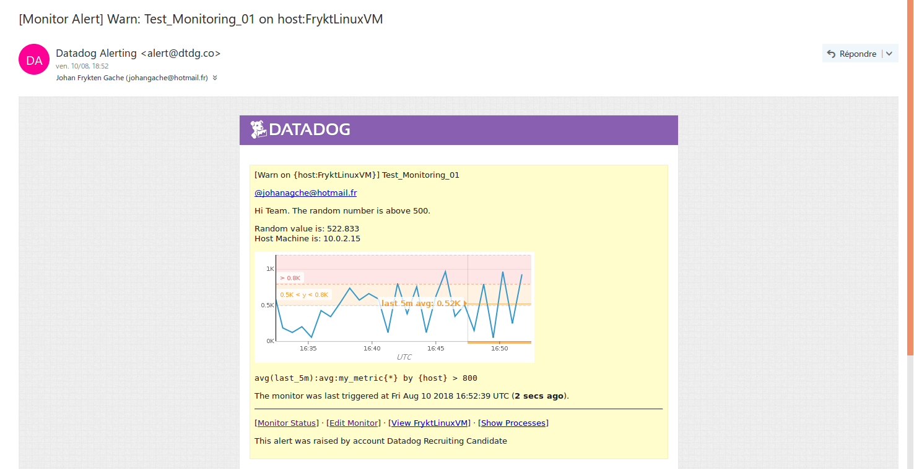

# First: 
Thanks. I wish to thank you for letting me so far in the process.

In the /00_ASSETS folder, you will find:
* The 26 Screenshots in ./01_SCREENSHOTS
* The few Scripts I wrote and may or may not have used in ./02_SCRIPTS

## Prerequisites:
I configured a fresh Linux Ubuntu 17.04 VM via the Oracle Virtual Box tool so I would have no OS or dependency issues and I could type my way out of almost anything using the terminal.
I then signed up for a Datadog free account and downloaded everything I needed: the dd-agent, a MySQL cluster, the latest Python and Node.js versions.
Once everything was settled and clean, I started working on the Datadog application. 

## Collecting Metrics:
### Host Dashboard [here](https://app.datadoghq.com/dash/host/549363268)
 * Tags: I modified the datadog.conf.yaml file, uncommented the Tags option and added three tags I thought meaningful for this host.

__Vim interface of the .conf.yaml file__

__DD's Host Map page__

 * Custom Check: To create a Custom Agent check we need two files.
One in the datadog-agent/checks.d and one in the datadog-agent/conf.d. We'll see about the later at the next question. 
The first one is a .py document and is a small Python Program just to check a random number between 0 and 1000.

__.py Check__

 * Collection interval: The second file is a .yaml configuration file for the check we have previously written. Here we will only tell the Agent to change the default collection_interval to 45 thus changing the rate of submition of the metric.

__.yaml Config__

 * **Bonus**:
Elsewhere on the app.datadoghq.com/metric/summary, we have access to the metadata of our metrics therefore we can modify the interval. It also does not modify __neither__ our Python Check File nor our Yaml Config File!

__Web App Metadata__

## Visualizing Data:
### Timeboard [here](https://app.datadoghq.com/dash/883660/test-timeboard-v01)
 * Timeboard: I created a Timeboard on the Web Application with three graphs:

__My custom metric scoped__

__The CPU Time from the mysql.performance__

__My custom metric with a rollup function__

As for the script, since I did not use the API but the UI, I wrote a script to fetch my Timeboard which could be used to save it. The Curl request was:
> curl "https://api.dash/883660?api_key=c2a059719d8ed637828c38c8d5699d44&application_key=f291ca2d769bbda165f427a823f004980a00ffeb"

I stored the JSon result in my **00_ASSETS/02_SCRIPTS** folder as **Script_Timeboard_Get**
__Curl GET request__

 * Timeboard's timeframe: I unfortunately didn't find how to modify the timeframe to __less than 1h__.

 * Snapshot:

__Snapshot sent to my account__

 * Bonus:
The MySql Performance CPU with Anomaly Detection graph is displaying what is normal - the __greyed area__ - and what is not - the __red flagged points__ outside of this greyed area. The greyed area shows a trend of what should be next and by such detects what should not be: strange checks that are way too high or way too low.

## Monitoring Data:
### Monitor [here](https://app.datadoghq.com/monitors/5882259)
 * Creating a Metric Monitor: Setting the monitor was very straightforward for this step.

__Creation of the Monitor__

The result is also pretty clear:

__On the DD Web App__

 * Sending an email: Writing the email script is also neat. We need the Team/Person(s) to contact tag(s) (here: @me). We can program some conditions with brackets and #is_something (here: {{#is_alert}} for example). And we have access to some variables like the {{value}} we are monitoring and our {{host.ip}} to now where is the problem.

__Scripted Email__

__Result in my mail box!__

 * Bonus: Manage Downtime
On the UI, just a switch to /monitors#/downtime and we're good to schedule some for the nights and the weekends.

__Downtimes UI Editing__

__The Two Downtimes scheduled__

__Arrival on the mail box!__

## Collecting APM Data:
 * I wrote a Node.js app with the DD-trace Middleware to test the Datadog's APM solution.
The script was little but efficient enough:

> const tracer = require('dd-trace').init({
>  debug: true
>})
>const span = tracer.startSpan('web.request')
>
>span.setTag('http.url', '/login')
>span.finish()

__Working on the host__

__And on Datadog's Application__

__First check__

However, strangely, I did not understood how to create a new Dashboard with both the APM and the Infrastructure Metrics. There was a APM Metrics on the Dashboard Creation's page but it was greyed and disabled...

 * Bonus:
From what I understood, a service is __a process or a set of processes__ like a database and a resource is __an action for a service__ like a query to a database. Therefore, a service can have __multiple__ resources.

## Final Question:
I could think of an application for Spotify, Deezer, Qobuz or maybe even Youtube to monitor what kind of music we listen and at which hours. Maybe I listen to classical in the morning and metal in the evening __usually__ and that on days were I listen to jazz __before__ going to sleep I lose my will sleep! Or if I __start__ the day with some cult badass 70s rock maybe I will want to eat more at lunch...
Well... You said "__creative__".

Once again, thank you. I hope I wrote enough and was able to be clear and sound.
