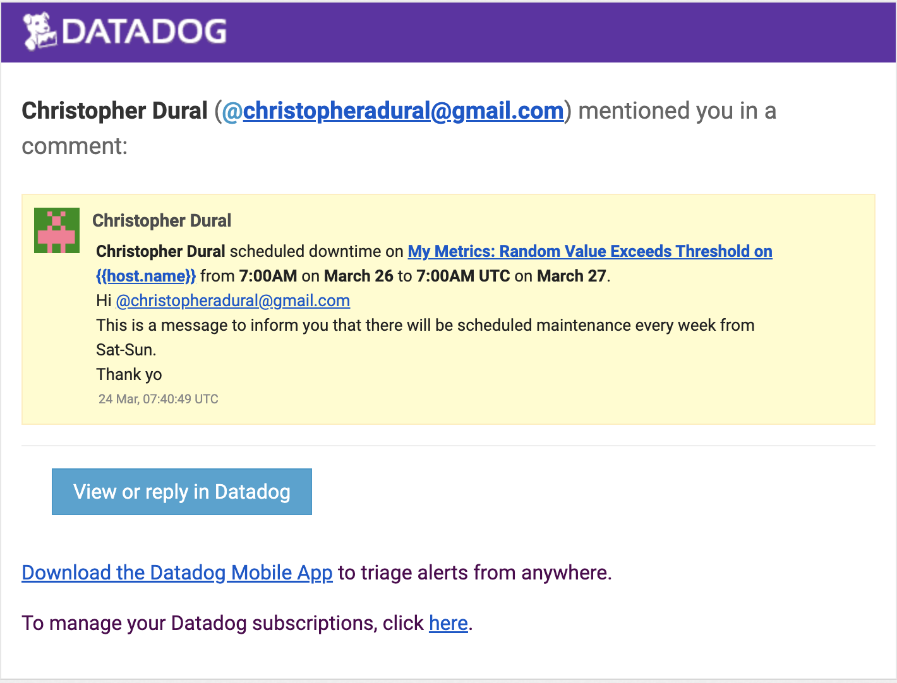

# Andrew Wojszynski Solutions Engineer Answers

## Environment Setup

### Creating Vagrant environment

Create two Ubuntu 16.04 using Vagrant on Mac (dependency on [Homebrew](https://brew.sh/))

1. Install VirtualBox
```
$ brew cask install virtualbox
```
2. Install Hashicorp Vagrant and Vagrant Manager
```
$ brew cask install vagrant && brew cask install vagrant-manager
```
3. Configure two work directories with following Vagrant template
```
Vagrant.configure("2") do |config|
 config.vm.box="ubuntu/xenial64"
 config.vm.hostname = "[HOSTNAME]"
 config.vm.define "[HOSTNAME]"
end
```
4. In each directory, create VM with vagrant
```
$ vagrant init [HOSTNAME] --template=[path/to/template]
```
5. In each directory, bring up VM
```
$ vagrant up
```
6. In each directory, ssh into VM
```
$ vagrant ssh
```
### Creating Python Environment

1. After SSHing into both VMs, install python3
```
$ sudo apt install python3
```
2. Create datadog env folder
```
$ mkdir datadog-env
```
3. Initialize python virtual environment
```
$ python3 -m venv ~/datadog-env
```
4. Activate virtual environment
```
$ source datadog-env/bin/activate
```
5. Install datadog and ddtrace libraries
```
(datadog-env) $ datadog-env/bin/pip install datadog && datadog-env/bin/pip install ddtrace
```
6. Install flask
```
(datadog-env) $ datadog-env/bin/pip install flask
```

## Collecting Metrics

### Install agent

1. After SSHing into host VM, install agent
```
DD_API_KEY=<DATADOG_API_KEY> bash -c "$(curl -L https://raw.githubusercontent.com/DataDog/datadog-agent/master/cmd/agent/install_script.sh)"
```
### Add tags

1. Edit agent config file at `/etc/datadog-agent/datadog.yaml`
2. Add tags
```
tags:
    -env:test
    -type:vagrant
```
3. Screenshot of host map with added tags in Datadog


### Install Postgres and add integration

1. Install Postgres 9.5
```
$ sudo apt install postgresql
```
2. Add integration in Datadog GUI

3. Configure postgres to work with Datadog
```
$ sudo -u postgres psql
postgres=# create user datadog with password '<PASSWORD>';
postgres=# grant SELECT ON pg_stat_database to datadog;
```
4. Configure Datadog Agent to connect to PostgreSQL at `conf.d/postgres.d/conf.yaml`
```
init_config:

instances:
  - host: localhost
    port: 5432
    username: datadog
    password: <PASSWORD>
```
5. Restart datadog agent
```
$ sudo service datadog-agent restart
```
6. Screenshot of host map with PostgreSQL added


## Custom Agent Check

### Create Python Script for custom check
1. Create custom my_metric check ([Code](scripts/my_metric.py))
```python
from random import randint

try:
    from checks import AgentCheck
except ImportError:
    from datadog_checks.checks import AgentChecks

__version__ = '1.0.0'

class MetricCheck(AgentCheck):
    def check(self, instance):
        value = randint(0,1000)
        self.gauge('my_metric', value)
```
### Create yaml config for custom check
1. Change config to send on 45 second interval ([Code](scripts/my_metric.yaml))
```yaml
init_config:

instances:
 
 -  min_collection_interval: 45
```
### Configure agent to use custom check
1. Put script in `/etc/datadog-agent/checks.d`
2. Put config in `/etc/datadog-agent/conf.d/my_metric.d`
3. Restart the agent
```
$ sudo service datadog-agent restart
```

### Bonus
Custom check interval is changed by changing the yaml config file rather than the Python script.

## Visualizing Data

### Creating timeboard with the Datadog API

1. Create Python script using the Datadog client libraries ([Code](scripts/timeboard.py))
```python
from datadog import initialize, api

options = {
    'api_key': 'API_KEY',
    'app_key': 'APP_KEY'
}


initialize(**options)
# if running from monitored host would add socket.gethostname() function
host_name = 'datadog-host'

title = "Exercise Timeboard"
description = "This timeboard contains a rollup sum of queries, a custom metric over a host, and anomaly detect on postgres percentage of max connections in use"

graphs=[

    {
        "definition": {
            "requests": [
                {"q": "sum:my_metric{host:" + host_name + "}.rollup(sum,3600)"
                }
                        ],
            "viz" : "query_value"
                      },
        "title": "Rollup over last hour"
    },

    {
        "definition": {
            "requests": [
                {"q":"avg:my_metric{host:" + host_name + "}"
                }
                        ],
            "viz" : "timeseries"
                      },
        "title": "Custom Check over host"              
     },
       
     {
         "definition": {
             "requests": [
                 {"q": "anomalies(avg:postgresql.percent_usage_connections{host:"+host_name + "}, 'basic', 6)"
                 }
                                       
                         ],
            "viz" : "timeseries"
                       },
        "title": "Anomaly detection on percentage of max connections in use in postgres"
     }
 
]

read_only=True

api.Timeboard.create(title=title,
                     description=description,
                     graphs=graphs,
                     read_only=read_only)
```
2. Initialize Python3 virtual env
```
$ source ~/datadog-env/bin/activate
```
3. Execute script
```
(datadog-env)$ python3 timeboard.py
```
4. Screenshot:


### UI metrics
1. Change timeframe of timeboard to last five minutes


2. Annotate timeboard and send to myself with @ notation


### Bonus
My anomlay graph is showing the percentage of max connections used in Postgres. Anomaly detection uses algorithms to identify when metrics
are behaving differently than they have in the past based on a variety of statistical models, including lagging rolling quantile computation,
SARIMA, and seasonal-trend decomposition.

## Monitoring Data

### Configure Alert
1. Screenshot of alert conditions


2. Alert Message


### Recieve Alert
1. Trigger Email


2. Warning Email


### Bonus
1. Weekday Downtime - Email Screenshot


2. Weekday Downtime - Config


3. Weekend Downtime - Email Screenshot


4. Weekend Downtime - Config


## Collecting APM Data

### Create Flask App
1. Simple Flask App ([Code](scripts/flask-app.py))
```python
from flask import Flask
import logging
import sys

# Have flask use stdout as the logger
main_logger = logging.getLogger()
main_logger.setLevel(logging.DEBUG)
c = logging.StreamHandler(sys.stdout)
formatter = logging.Formatter('%(asctime)s - %(name)s - %(levelname)s - %(message)s')
c.setFormatter(formatter)
main_logger.addHandler(c)

app = Flask(__name__)

@app.route('/')
def api_entry():
    return 'Entrypoint to the Application'

@app.route('/api/apm')
def apm_endpoint():
    return 'Getting APM Started'

@app.route('/api/trace')
def trace_endpoint():
    return 'Posting Traces'

if __name__ == '__main__':
    app.run(host='0.0.0.0', port='5050')
```
2. Activate virtualenv
```
$ source datadog-env/bin/activate
```
3. Use middleware to send traces to Datadog
```
(datadog-env)$ ddtrace-run python3 flask-app.py
```
4. Create traffic to app
```bash
$ for i in range {1..10}; do \
> curl localhost:5050; \
> done
```

5. Screenshot of Traces


### Instrument Flask App

1. Instrument Flask app with ddtrace library and change service name to 'test' ([Code](scripts/flask-app-ins.py))
```python
from ddtrace import patch_all, config
patch_all()

# Change service name to 'test'

config.flask['service_name'] = 'test'

from flask import Flask
import logging
import sys

# Have flask use stdout as the logger
main_logger = logging.getLogger()
main_logger.setLevel(logging.DEBUG)
c = logging.StreamHandler(sys.stdout)
formatter = logging.Formatter('%(asctime)s - %(name)s - %(levelname)s - %(message)s')
c.setFormatter(formatter)
main_logger.addHandler(c)

app = Flask(__name__)

@app.route('/')
def api_entry():
    return 'Entrypoint to the Application'

@app.route('/api/apm')
def apm_endpoint():
    return 'Getting APM Started'

@app.route('/api/trace')
def trace_endpoint():
    return 'Posting Traces'

if __name__ == '__main__':
    app.run(host='0.0.0.0', port='5050')
```

2. Activate virtualenv
```
$ source datadog-env/bin/activate
```
3. Run app
```
(datadog-env) $ python3 flask-app-ins.py
```
4. Create more traffic ([Code](scripts/test.sh))
```bash
#!/bin/bash

for i in $(seq 1000); do
  if (($i % 5));
  then
    curl localhost:5050/api/trace
    echo
  if  (($i % 2));
  then
    curl localhost:5050
    echo
  fi
  else
    curl localhost:5050/api/apm
    echo
  fi
done
```
5. Screenshot of Traces


### Dashboard Link and Screenshot
1. [Link](https://p.datadoghq.com/sb/4fcb6bfc6-9bf2afeb8cec05635846df389de49c23)
2. Screenshot of dashbord with APM and system CPU load


### Bonus

A resource is a particular query to a service. In the instrumented [Flask](scripts/flask-app-ins.py) app above, the resources are (GET /), (GET /api/trace), and (GET /api/apm).
In this case, the resources are requests to a particular endpoint in the web app.

A service is the aggregate of resources that work together. In this case, the first app which had trace sent to Datadog with the `$ddtrace-run` command
was a service using the default name "flask" and the second app with the instrumented code was named "test"

 
## Final Question

I would use Datadog create dashboards for a combination of two fundamental aspects of life in New York City, the stock market and happy hour.
With a few starting pieces of information, we could easily create a pricing model that changes based on number of units sold and shelf life of
an item, ultimately conforming to the laws of supply and demand and fluctuating like the stock market.
```
Necessary starting information:

1. Cost of goods sold
2. Inventory remaining
3. Number of sales
4. Target margin range
5. Shelf life of product
6. Starting sale price 
```
Once we understand this starting information, we can graph the price of drinks over the course of the night as a timeseries in Datadog.

Based on the inventory, we need to sell a certain number units per day before the product expires. Because of this, we need to incentivize
buyers to buy the product so we start driving down the price as a function of approaching the expiration date. When the price goes 
down, we sell more, but as we sell more product, we raise the price to maximize profit.

The current sale price would be represented as a gauge on a timeseries and represented as a line graph. The number of sales over the course
of a night will be represented as a counter over time.

When applying this approach to a happy hour, we create fun, interactive engagement with our customers and encourage them to keep their eyes on
the Datadog dashboards for price changes.
