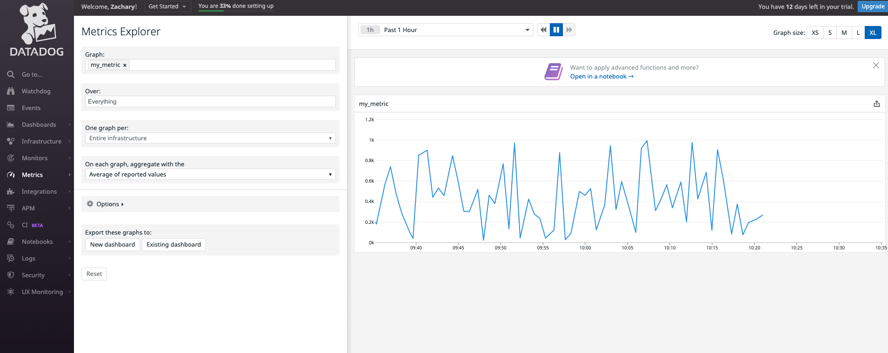
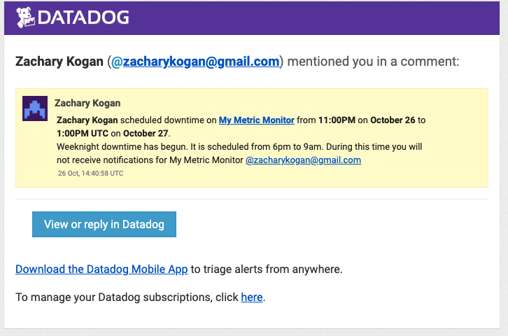

# Welcome to Zach Kogan's Sales Engineering Exercise for Datadog!👨‍💻

## Setup:

 I setup a Vagrant Ubuntu VM as recommended by following the instruction here: https://www.vagrantup.com/docs/installation
 
 Next, I signed up for  a trial Datadog account using  "Datadog Recruiting Candidate" in the Company field. 

---
## Collecting Metrics:
 Referencing the information at https://docs.datadoghq.com/getting_started/agent/
  I opened the file `datadog.yaml` from the command line with:
```
$ sudo vi /etc/datadog-agent/datadog.yaml
```
  I then added the tags in the file and saved it as below:

```
tags:
  - name:zach
  - project:trial:
  - time:EST
  - type:person
```

My Datadog host map page now looked like this: 


Then I installed a MongoDB server onto the Vagrant VM, following the instructions here:https://docs.mongodb.com/manual/tutorial/install-mongodb-on-ubuntu/

Next, I followed the instructions on integrating MongoDB here: https://app.datadoghq.com/account/settings#integrations/mongodb

After completing the integration I was able to see MongoDB in the Datadog portal: 

To set up a custom Agent check I followed the instructions here: https://docs.datadoghq.com/developers/write_agent_check/?tab=agentv6v7

I named my files custom_random_check.py and custom_random_check.yaml. Putting the Python file in the checks.d directory and the yaml in the conf.d directory. 

custom_random_check.yaml
```
instances: [{}]

```
custom_random_check.py
```
try:
    from datadog_checks.base import AgentCheck

except ImportError:
    from checks import AgentCheck

import random

class RandomCheck(AgentCheck):
    def check(self, instance):
        self.gauge('my_metric', random.randint(1, 1000))
```

To generate a random number between 1 and 1000, I used the random.randint function from Python's random library found here: https://docs.python.org/3/library/random.html

In order to change the interval to once every 45 seconds I followed the instructions for Collection intervals here: https://docs.datadoghq.com/developers/write_agent_check/?tab=agentv6v7

I updated my custom_random_check.yaml to this:
```
instances:
  - min_collection_interval: 45
```
I was able to see my_metric in the Datadog portal! 🎉



Bonus Question: Yes, you change the collection interval without modifying the Python check file.
You can do it by updating the yaml file.

## Visualizing Data:
To create the timeboard, I began with the documentation on Datadog API dashboards found here: https://docs.datadoghq.com/api/latest/dashboards/

I imported the Datadog collection into Postman from here: https://docs.datadoghq.com/getting_started/api/#import-the-datadog-collection-into-postman .

Next, I entered my API Key and Application Key to configure the environment and successfully sent an GET request to validate my API key.

Using the information here  https://docs.datadoghq.com/api/latest/dashboards/#create-a-new-dashboard and the provided template's Create Dashboard Post request from the Datadog Postman collection I sent a JSON to create a dashboard with three widgets.

The three widgets are all timeseries types as described here: https://docs.datadoghq.com/dashboards/widgets/timeseries.

The first widget looks at my custom metric average.

The second uses the anomalies function to check if the metric is behaving differently than it has in the past, as described here: https://docs.datadoghq.com/monitors/create/types/anomaly/.

The third uses the rollup function explained here: https://docs.datadoghq.com/dashboards/functions/rollup/ summing up over one hour.

```
{
  "title": "Custom Timeboard",
  "layout_type": "ordered",
  "description": "Custom agent check submitting random number from 1-1000.",
  "widgets": [
        {
          "definition": {
                "type": "timeseries",
                "requests": [
                  {
                        "q": "avg:my_metric{*}"
                  }
                ],
                "title": "Custom Random Metric"
          }
        },
        {
          "definition": {
                "type": "timeseries",
                "requests": [
                  {
                        "q": "anomalies(avg:mongodb.locks.collection.acquirecount.intent_exclusiveps{*}, 'basic', 3)"

                  }
                ],
                "title": "MongoDB Performance CPU Time Anomalies"
          }
        }
        {
          "definition": {
                "type": "timeseries",
                "requests": [
                  {
                        "q": "avg:my_metric{*}.rollup(sum, 3600)"

                  }
                ],
                "title": "Custom Random Metric Hourly Rollup"
          }
        }

  ]

}
```
My dashboard was now visible in the Datadog UI 🤘 [](images/dashboard.png)

You can see the dashboard here: https://p.datadoghq.com/sb/524fe4d0-303a-11ec-91d7-da7ad0900002-a651617bb73df005f0b4dd1ac7ed0220

I set the timeframe to the past 5 min and sent myself a snapshot:


The anomalies function identifies when a metric is behaving differently than it has in the past. This trend based analysis is able to track things that are not suited for thresholds.

## Monitoring Data

I created a new threshold Metric Monitor that watches the average of my custom metric by referencing  https://docs.datadoghq.com/monitors/create/types/metric/?tab=threshold in the Datadog portal like so:


Next, I configured the notification to alert me with an appropriate email for each condition like so:
```
{{#is_alert}}
Alert: my_metric is above {{threshold}} at {{value}}. Host IP = {{host.ip}} @zacharykogan@gmail.com 
{{/is_alert}} 

{{#is_warning}}
Warning: my_metric is above {{warn_threshold}} at {{value}} @zacharykogan@gmail.com 
{{/is_warning}} 

{{#is_no_data}}
No Data: my_metric has not reported data for the past 10 min @zacharykogan@gmail.com 
{{/is_no_data}}
```

Here is what the email looks like when the warning is triggered:


I scheduled two downtimes and set both to send me an email notification when they begin.

Here is how the weeknight downtime setup looked:


Here is how the weekend downtime setup looked:


The email notification that downtime has begun looked like this:



## Collecting APM Data:

I began by reading the Datadog APM docs https://docs.datadoghq.com/tracing/setup_overview/.

I also watched this great video on APM instrumentation: https://www.youtube.com/watch?v=dbkd5sRTCIw

I read up on Flask and installed it on my Ubuntu vm following the docs here:  https://linuxize.com/post/how-to-install-flask-on-ubuntu-20-04/

Upon successful installation, I was able to enter the virtual environment

Following the instructions at  https://docs.datadoghq.com/tracing/setup_overview/setup/python/?tab=containers, 
I installed ddtrace and confirmed apm was enabled in the datadog.yaml.

Using the provided Flask app, I created a file named apm_data.py and pasted the provided code.

apm_data.py
```python
from flask import Flask
import logging
import sys

# Have flask use stdout as the logger
main_logger = logging.getLogger()
main_logger.setLevel(logging.DEBUG)
c = logging.StreamHandler(sys.stdout)
formatter = logging.Formatter('%(asctime)s - %(name)s - %(levelname)s - %(message)s')
c.setFormatter(formatter)
main_logger.addHandler(c)

app = Flask(__name__)

@app.route('/')
def api_entry():
    return 'Entrypoint to the Application'

@app.route('/api/apm')
def apm_endpoint():
    return 'Getting APM Started'

@app.route('/api/trace')
def trace_endpoint():
    return 'Posting Traces'

if __name__ == '__main__':
    app.run(host='0.0.0.0', port='5050')
```

I configured the environment variables from the command line inside the shell as recommended here: https://docs.datadoghq.com/tracing/setup_overview/setup/python/?tab=containers#configuration

```DD_SERVICE="flask" DD_ENV="dev" DD_LOGS_INJECTION=true```

I ran the app with ddtrace-run:

```ddtrace-run python apm_data.py```

The Flask app was now up and running 🎉
```
 * Serving Flask app 'apm_data' (lazy loading)
 * Environment: production
   WARNING: This is a development server. Do not use it in a production deployment.
   Use a production WSGI server instead.
 * Debug mode: off
WARNING:werkzeug: * Running on all addresses.
   WARNING: This is a development server. Do not use it in a production deployment.
2021-10-28 14:00:28,311 - werkzeug - WARNING -  * Running on all addresses.
   WARNING: This is a development server. Do not use it in a production deployment.
INFO:werkzeug: * Running on http://10.0.2.15:5050/ (Press CTRL+C to quit)
2021-10-28 14:00:28,313 - werkzeug - INFO -  * Running on http://10.0.2.15:5050/ (Press CTRL+C to quit)

```
Seeing that the app was running on http://10.0.2.15:5050/, I began making get requests to the three routes in the app ('/', 'api/apm', 'api/trace')

I was able to see the flask data in the Datadog portal under APM Services 🙌


I created a new dashboard and added widgets for latency metrics from each endpoint and infrastructure metrics from Vagrant.

Flask APM and Vagrant Infrastructure Dashboard: https://p.datadoghq.com/sb/524fe4d0-303a-11ec-91d7-da7ad0900002-b69736ea9834c1f86a4d651fc5682a60


**Bonus Question**: 

A service is a group of resources such as URL endpoints or database queries.

A resource is one of those URL endpoints or database queries tha make up a service, which can be instrumented.

https://docs.datadoghq.com/tracing/visualization/#services
https://docs.datadoghq.com/tracing/visualization/#resources

## Final Question:

Datadog can be used in all kinds of interesting ways to understand and improve the functionality of business.

A ski resort or a theme park could benefit from using Datadog to track functions whose codependency isn't apparent or easy to understand.

The performance or ticket sales or rentals in one place may have impact on lift operations in a seemingly unrelated part of the resort.

This may be impacting the sales at some retail locations or refreshment vendors. 

Weather, parking lot capacity and shuttle performance, wait times, highway traffic and many other factors are likely impacting performance throughout the resort.


By utilizing Datadog a resort can find these co-dependencies and their impact, apply solutions and enhance business performance and customer experience.. 


