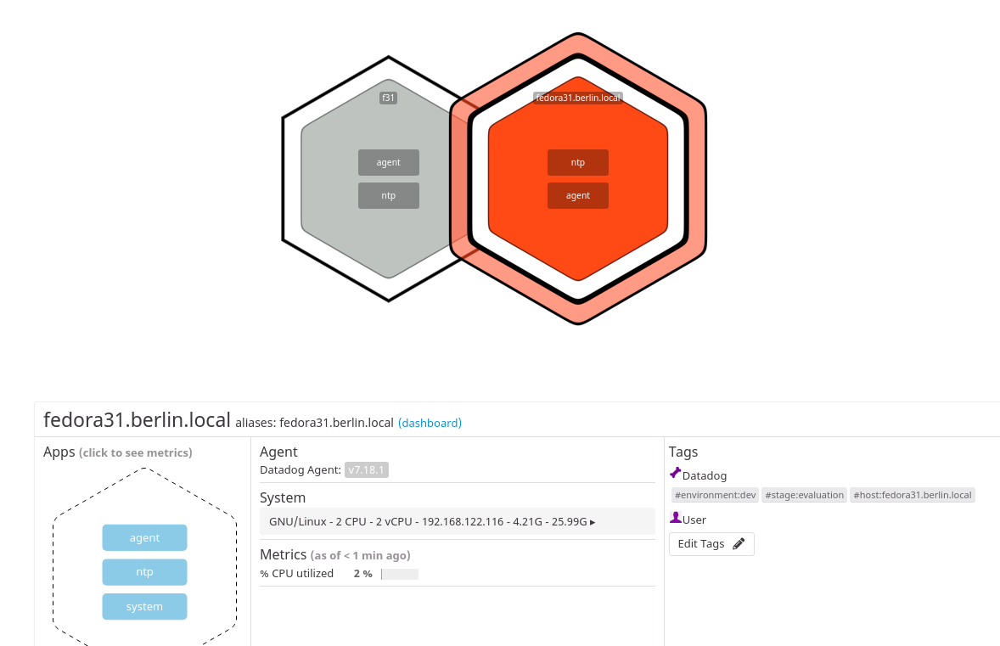

Your answers to the questions go here.

I did setup a Fedora 31 virtual machine using Virt-Manager on my Fedora 31 Notebook.

When It came up, I used the one line install to install the DD Agent :

```bash
DD_AGENT_MAJOR_VERSION=7 DD_API_KEY=2a6eee5aaca2d5b447f71e746277e2ff DD_SITE="datadoghq.eu" bash -c "$(curl -L https://raw.githubusercontent.com/DataDog/datadog-agent/master/cmd/agent/install_script.sh)"
```

I trieds setting up some tags but the dd agent did not come up again.

```bash
systemctl status datadog-agent
● datadog-agent.service - Datadog Agent
   Loaded: loaded (/usr/lib/systemd/system/datadog-agent.service; enabled; vendor preset: disabled)
   Active: failed (Result: exit-code) since Fri 2020-04-10 13:29:47 CEST; 23s ago
  Process: 1079 ExecStart=/opt/datadog-agent/bin/agent/agent run -p /opt/datadog-agent/run/agent.pid (code=exited, status=255/EXCEPTION)
 Main PID: 1079 (code=exited, status=255/EXCEPTION)
      CPU: 66ms

Apr 10 13:29:47 f31 systemd[1]: datadog-agent.service: Main process exited, code=exited, status=255/EXCEPTION
Apr 10 13:29:47 f31 systemd[1]: datadog-agent.service: Failed with result 'exit-code'.
Apr 10 13:29:47 f31 systemd[1]: datadog-agent.service: Scheduled restart job, restart counter is at 5.
Apr 10 13:29:47 f31 systemd[1]: Stopped Datadog Agent.
Apr 10 13:29:47 f31 systemd[1]: datadog-agent.service: Start request repeated too quickly.
Apr 10 13:29:47 f31 systemd[1]: datadog-agent.service: Failed with result 'exit-code'.
Apr 10 13:29:47 f31 systemd[1]: Failed to start Datadog Agent.
```

So I tried to start manually to see what the problem would be :

```bash
[root@f31 ~]# /opt/datadog-agent/bin/agent/agent run -p /opt/datadog-agent/run/agent.pid
Error: Failed to setup config unable to load Datadog config file: While parsing config: yaml: line 63: did not find expected key
Error: unable to set up global agent configuration: unable to load Datadog config file: While parsing config: yaml: line 63: did not find expected key
```
I found a space charachter in front of the Tags line that prevented startup. Fixing that the agent came up again. But did not show the new tags in the infrastructure map immediatly. That prompted me to look at the logs a bit deeper : 

```bash
journalctl -f -u datadog-agent
-- Logs begin at Fri 2020-04-10 13:01:36 CEST. --
Apr 10 13:34:58 f31 agent[1249]: 2020-04-10 13:34:58 CEST | CORE | INFO | (pkg/collector/runner/runner.go:261 in work) | Running check network
Apr 10 13:34:58 f31 agent[1249]: 2020-04-10 13:34:58 CEST | CORE | INFO | (pkg/collector/runner/runner.go:327 in work) | Done running check network, next runs will be logged every 500 runs
Apr 10 13:34:59 f31 agent[1249]: 2020-04-10 13:34:59 CEST | CORE | INFO | (pkg/collector/runner/runner.go:261 in work) | Running check load
Apr 10 13:34:59 f31 agent[1249]: 2020-04-10 13:34:59 CEST | CORE | INFO | (pkg/collector/runner/runner.go:327 in work) | Done running check load, next runs will be logged every 500 runs
Apr 10 13:35:00 f31 agent[1249]: 2020-04-10 13:35:00 CEST | CORE | INFO | (pkg/collector/runner/runner.go:261 in work) | Running check file_handle
Apr 10 13:35:00 f31 agent[1249]: 2020-04-10 13:35:00 CEST | CORE | INFO | (pkg/collector/runner/runner.go:327 in work) | Done running check file_handle, next runs will be logged every 500 runs
Apr 10 13:35:08 f31 agent[1249]: 2020-04-10 13:35:08 CEST | CORE | ERROR | (pkg/collector/runner/runner.go:292 in work) | Error running check disk: [{"message": "not sure how to interpret line '  11       0 sr0 7 0 2 0 0 0 0 0 0 5 0 0 0 0 0 0 0\\n'", "traceback": "Traceback (most recent call last):\n  File \"/opt/datadog-agent/embedded/lib/python3.8/site-packages/datadog_checks/base/checks/base.py\", line 713, in run\n    self.check(instance)\n  File \"/opt/datadog-agent/embedded/lib/python3.8/site-packages/datadog_checks/disk/disk.py\", line 121, in check\n    self.collect_latency_metrics()\n  File \"/opt/datadog-agent/embedded/lib/python3.8/site-packages/datadog_checks/disk/disk.py\", line 244, in collect_latency_metrics\n    for disk_name, disk in iteritems(psutil.disk_io_counters(True)):\n  File \"/opt/datadog-agent/embedded/lib/python3.8/site-packages/psutil/__init__.py\", line 2168, in disk_io_counters\n    rawdict = _psplatform.disk_io_counters(**kwargs)\n  File \"/opt/datadog-agent/embedded/lib/python3.8/site-packages/psutil/_pslinux.py\", line 1125, in disk_io_counters\n    for entry in gen:\n  File \"/opt/datadog-agent/embedded/lib/python3.8/site-packages/psutil/_pslinux.py\", line 1098, in read_procfs\n    raise ValueError(\"not sure how to interpret line %r\" % line)\nValueError: not sure how to interpret line '  11       0 sr0 7 0 2 0 0 0 0 0 0 5 0 0 0 0 0 0 0\\n'\n"}]
```

It looks like the disk check has trouble with my installation. And it just took a few minutes for the tags and hostname change to be visible in the UI


