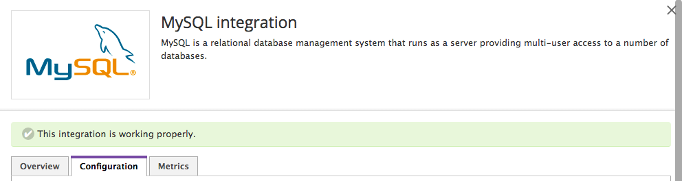

Thank you for taking the time to review my coding challenge. I look forward to speaking with members of the Datadog team regarding this opportunity.


# The Challenge


## Level 0 - Setup an Ubuntu VM


I setup Vagrant for the first time on my computer. I was pretty impressed by what it could do.


## Level 1 - Collecting your Data


- **Sign up for Datadog and install Datadog agent** - I installed the agent following the in-app instructions.

For ubuntu:

   [Installing on Ubuntu](https://app.datadoghq.com/account/settings#agent/ubuntu)

   [Basic Agent Usage for Ubuntu](http://docs.datadoghq.com/guides/basic_agent_usage/ubuntu/)


- **What is the Agent?** - The Datadog Agent is software that runs on a user's servers, collecting metrics and events which it sends to Datadog for analysis. The agent consists of four main components. The Collector gathers application and system metrics from the machine. DogStatsD is a backend server that receives custom application metrics from the user. The Forwarder transfers the data from DogStatsD and the collector to Datadog. Finally the SupervisorD, which is responsible for keeping the Collector, DogStatsD, and the Forwarder up and running.


- **Adding Tags:**


I edited the configuration file - /etc/dd-agent/datadog.conf


I could then see the tags on my Host Map page.


- **Install a database on your machine (MongoDB, MySQL, or PostgreSQL) and then install the respective Datadog integration for that database.** -I installed MySQL.

Add MySQL - [link to Datadog docs MySQL Integration](http://docs.datadoghq.com/integrations/mysql/)





I added the Datadog agent to the MySQL user table, and modified the mysql.yaml file  (/etc/dd-agent/conf.d/mysql.yaml).


- **Write a custom agent to sample random value. Call this new metric: test.support.random** - Using Datadog's [Docs](http://bit.ly/1sitxHf), I was able to write a custom Agent check sampling a random value.


Check file: /etc/dd-agent/checks.d/firstChecker.py  

```
from checks import AgentCheck
import random

class HelloCheck(AgentCheck):
  def check(self, instance):
    self.gauge('test.support.random', random.random())
```


Configuration file: /etc/dd-agent/conf.d/firstChecker.yaml

```
init_config:
instances:
  [{}]
```


## Level 2 - Visualizing your Data


- **Since your database integration is reporting now, clone your database integration dashboard and add additional database metrics to it as well as your test.support.random metric from the custom Agent check.** - I cloned my MySQL dashboard and added the additional metrics. I also added the test.support.random metric.


Link to my Dashboard: [Travis's Dashboard](https://app.datadoghq.com/dash/173277/mysql)


- **What is the difference between a timeboard and a screenboard?** - Timeboard and screenboard are two different types of custom dashboards. Timeboard is better for troubleshooting and tracking correlations between different metrics/events while screenboard is better for looking into system status. Screenboards have more options, such as Eventstream, Check Status, Free Text, etc.

All graphs in a timeboard display the same time range, for example, the past 1 hour. On the contrary, each panel in a screenboard can display data for a different time period appropriate to that metric.

Each graph of a timeboard can be shared individually by generating embed code (iframe), while screenboards can be shared as a whole using a public url.

Screenboard: [Public url](https://p.datadoghq.com/sb/6026d6b5e-0b141c1724)


- **Take a snapshot of your test.support.random graph and draw a box around a section that shows it going above 0.90. Make sure this snapshot is sent to your email by using the @notification** - I used the camera widget to take a snapshot of the test.support.random graph going above .90. I drew a box around the peak of the graph. I then sent an email to myself at '@testtravisdunn@gmail.com'.


I received the email shortly after.


## Level 3 - Alerting on your Data


-**Setup multi-alert monitor:**


-**Monitor activation email:**


-**Scheduled Downtime config:**


-**Scheduled Downtime email notification:**


Thanks again! I hope to hear from Datadog soon.
