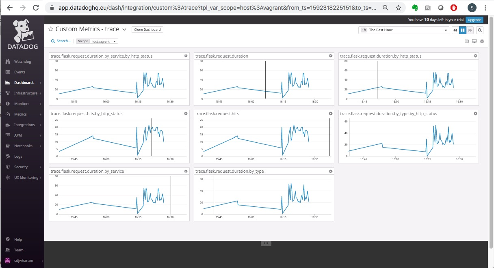

# Datadog Sales Engineer Candidate - Steve Wharton

## Prerequisites - Setup the environment

	Used vagrant/virtualbox on OSX with Ubuntu VM.
	
	Signed up for datadoghq EU trial account.
	

## Collecting Metrics:

Add tags in the Agent config file and show us a screenshot of your host and its tags on the Host Map page in Datadog.

**ANSWER**

Install Datadog agent on host

~~~bash
vagrant@vagrant:~$ DD_AGENT_MAJOR_VERSION=7 DD_API_KEY=myapikey DD_SITE="datadoghq.eu" bash -c "$(curl -L https://raw.githubusercontent.com/DataDog/datadog-agent/master/cmd/agent/install_script.sh)"
~~~

~~~bash
vagrant@vagrant:~$ sudo vim /etc/datadog-agent/datadog.yaml
~~~

~~~bash
vagrant@vagrant:/var/log/datadog$ sudo systemctl restart datadog-agent
~~~

It can take a couple of minutes for the tags to appear.

Install a database on your machine (MongoDB, MySQL, or PostgreSQL) and then install the respective Datadog integration for that database.

**ANSWER**

Installed MySQL

~~~bash
vagrant@vagrant:~$ sudo apt install mysql-server
~~~

Check MySQL is running

~~~bash
vagrant@vagrant:~$ sudo netstat -tap | grep mysql
tcp        0      0 localhost:mysql         0.0.0.0:*               LISTEN      23904/mysqld 
~~~

The MySQL check is included in the datadog agent so nothing else to install - just configuration changes

Created datadog user/password in MySQL

~~~bash
mysql> CREATE USER 'datadog'@'localhost' IDENTIFIED BY 'Mysql123!';
Query OK, 0 rows affected (0.01 sec)

mysql> exit
~~~

Check datadog user OK with MySQL

~~~
vagrant@vagrant:~$ mysql -u datadog --password=Mysql123! -e "show status" | grep Uptime && echo -e "\033[0;32mMySQL user - OK\033[0m" || echo -e "\033[0;31mCannot connnect to MySQL\033[0m"
mysql: [Warning] Using a password on the command line interface can be insecure.
Uptime	3096
Uptime_since_flush_status	3096
MySQL user - OK
~~~

Check MySQL permissions for datadog

~~~
vagrant@vagrant:~$ mysql -u datadog --password=Mysql123! -e "show slave status" && echo -e "\033[0;32mMySQL grant - OK\033[0m" || echo -e "\033[0;31mMissing REPLICATION CLIENT grant\033[0m"
mysql: [Warning] Using a password on the command line interface can be insecure.
ERROR 1227 (42000) at line 1: Access denied; you need (at least one of) the SUPER, REPLICATION CLIENT privilege(s) for this operation
Missing REPLICATION CLIENT grant
~~~

~~~
mysql> GRANT REPLICATION CLIENT ON *.* TO 'datadog'@'localhost' WITH MAX_USER_CONNECTIONS 5;
Query OK, 0 rows affected, 1 warning (0.00 sec)
mysql> GRANT PROCESS ON *.* TO 'datadog'@'localhost';
Query OK, 0 rows affected (0.00 sec)
~~~

Find the performance schema & grant permissions to datadog user

~~~
mysql> show databases like 'performance_schema';
+-------------------------------+
| Database (performance_schema) |
+-------------------------------+
| performance_schema            |
+-------------------------------+
1 row in set (0.01 sec)
mysql> GRANT SELECT ON performance_schema.* TO 'datadog'@'localhost';
Query OK, 0 rows affected (0.01 sec)

mysql> exit
~~~

Enable Log collection in the datadog-agent

~~~bash
sudo vim /etc/datadog-agent/datadog.yaml
~~~

Setup the logfile locations in the datadog mysql config and setup the MySQL account to be used

~~~bash
sudo vim /etc/datadog-agent/conf.d/mysql.d/conf.yaml
~~~

~~~bash
sudo systemctl restart datadog-agent
~~~

Setup permissions using logrotation code snippet from the integration instructions.

~~~bash
sudo vim /etc/logrotate.d/mysql-server 
~~~

However, was getting MySQL logging errors

~~~bash
vagrant@vagrant:/etc/datadog-agent/checks.d$ sudo datadog-agent status

...

  mysql
  -----
    Type: file
    Path: /var/log/mysql/mysql_error.log
    Status: Error: file /var/log/mysql/mysql_error.log does not exist
    Type: file
    Path: /var/log/mysql/mysql_slow.log
    Status: Error: file /var/log/mysql/mysql_slow.log does not exist
    Type: file
    Path: /var/log/mysql/mysql.log
    Status: Error: file /var/log/mysql/mysql.log does not exist

~~~

   
Followed the troubleshooting guide
<https://docs.datadoghq.com/logs/guide/log-collection-troubleshooting-guide/>

Confirmed that the Ubuntu kernel supported ACL's and that they were used by default using these
<https://www.tecmint.com/secure-files-using-acls-in-linux/>

Check ACL supported

~~~bash
vagrant@vagrant:/etc/datadog-agent/conf.d/mysql.d$ grep -i acl /boot/config*
/boot/config-4.15.0-55-generic:CONFIG_EXT4_FS_POSIX_ACL=y
/boot/config-4.15.0-55-generic:CONFIG_REISERFS_FS_POSIX_ACL=y
/boot/config-4.15.0-55-generic:CONFIG_JFS_POSIX_ACL=y
/boot/config-4.15.0-55-generic:CONFIG_XFS_POSIX_ACL=y
/boot/config-4.15.0-55-generic:CONFIG_BTRFS_FS_POSIX_ACL=y
/boot/config-4.15.0-55-generic:CONFIG_F2FS_FS_POSIX_ACL=y
/boot/config-4.15.0-55-generic:CONFIG_FS_POSIX_ACL=y
/boot/config-4.15.0-55-generic:CONFIG_TMPFS_POSIX_ACL=y
/boot/config-4.15.0-55-generic:CONFIG_HFSPLUS_FS_POSIX_ACL=y
/boot/config-4.15.0-55-generic:CONFIG_JFFS2_FS_POSIX_ACL=y
/boot/config-4.15.0-55-generic:CONFIG_NFS_V3_ACL=y
/boot/config-4.15.0-55-generic:CONFIG_NFSD_V2_ACL=y
/boot/config-4.15.0-55-generic:CONFIG_NFSD_V3_ACL=y
/boot/config-4.15.0-55-generic:CONFIG_NFS_ACL_SUPPORT=m
/boot/config-4.15.0-55-generic:CONFIG_CEPH_FS_POSIX_ACL=y
/boot/config-4.15.0-55-generic:CONFIG_CIFS_ACL=y
/boot/config-4.15.0-55-generic:CONFIG_9P_FS_POSIX_ACL=y
/boot/config-4.15.0-58-generic:CONFIG_EXT4_FS_POSIX_ACL=y
/boot/config-4.15.0-58-generic:CONFIG_REISERFS_FS_POSIX_ACL=y
/boot/config-4.15.0-58-generic:CONFIG_JFS_POSIX_ACL=y
/boot/config-4.15.0-58-generic:CONFIG_XFS_POSIX_ACL=y
/boot/config-4.15.0-58-generic:CONFIG_BTRFS_FS_POSIX_ACL=y
/boot/config-4.15.0-58-generic:CONFIG_F2FS_FS_POSIX_ACL=y
/boot/config-4.15.0-58-generic:CONFIG_FS_POSIX_ACL=y
/boot/config-4.15.0-58-generic:CONFIG_TMPFS_POSIX_ACL=y
/boot/config-4.15.0-58-generic:CONFIG_HFSPLUS_FS_POSIX_ACL=y
/boot/config-4.15.0-58-generic:CONFIG_JFFS2_FS_POSIX_ACL=y
/boot/config-4.15.0-58-generic:CONFIG_NFS_V3_ACL=y
/boot/config-4.15.0-58-generic:CONFIG_NFSD_V2_ACL=y
/boot/config-4.15.0-58-generic:CONFIG_NFSD_V3_ACL=y
/boot/config-4.15.0-58-generic:CONFIG_NFS_ACL_SUPPORT=m
/boot/config-4.15.0-58-generic:CONFIG_CEPH_FS_POSIX_ACL=y
/boot/config-4.15.0-58-generic:CONFIG_CIFS_ACL=y
/boot/config-4.15.0-58-generic:CONFIG_9P_FS_POSIX_ACL=y
~~~

Check ACL installed

~~~bash
vagrant@vagrant:/etc/datadog-agent/conf.d/mysql.d$ sudo apt-get install acl
Reading package lists... Done
Building dependency tree       
Reading state information... Done
acl is already the newest version (2.2.52-3build1).
0 upgraded, 0 newly installed, 0 to remove and 160 not upgraded.
~~~

Check root is mounted with ACL

~~~bash
vagrant@vagrant:/etc/datadog-agent/conf.d/mysql.d$ mount | grep -i root
/dev/mapper/vagrant--vg-root on / type ext4 (rw,relatime,errors=remount-ro,data=ordered)
~~~

Its not specified on the mount, but it may be running by default

~~~bash
vagrant@vagrant:/etc/datadog-agent/conf.d/mysql.d$ sudo tune2fs -l /dev/mapper/vagrant--vg-root | grep acl
Default mount options:    user_xattr acl
~~~

Yes - ACL running by default so lets check them.

~~~bash
vagrant@vagrant:/etc/datadog-agent/conf.d/mysql.d$ getfacl /var/log/mysql/
getfacl: Removing leading '/' from absolute path names
# file: var/log/mysql/
# owner: mysql
# group: adm
user::rwx
group::r-x
other::—
~~~

Let's set the ACL's on the the directory and the log files

~~~bash
sudo setfacl -m u:dd-agent:rx /var/log/mysql/
sudo setfacl -m u:dd-agent:rx /var/log/mysql/mysql_error.log 
sudo setfacl -m u:dd-agent:rx /var/log/mysql/mysql_slow.log 
sudo setfacl -m u:dd-agent:rx /var/log/mysql/mysql.log
~~~

Restart the datadog agent and check the status

~~~bash
sudo service datadog-agent stop
sudo service datadog-agent start

sudo datadog-agent status

...
mysql
  -----
    Type: file
    Path: /var/log/mysql/mysql_error.log
    Status: OK
    Inputs: /var/log/mysql/mysql_error.log 
    Type: file
    Path: /var/log/mysql/mysql_slow.log
    Status: OK
    Inputs: /var/log/mysql/mysql_slow.log 
    Type: file
    Path: /var/log/mysql/mysql.log
    Status: OK
    Inputs: /var/log/mysql/mysql.log
~~~

now shows status=OK for all the MySQL logs.

The ACL's will reset when the logs rotation. So added a postrotate section in /etc/logrotate.d/mysql-server to set the ACL's again for each log file for dd-agent - so that the ACL's get set again when the logs rotate.

MySQL integration up and running

    
    

Create a custom Agent check that submits a metric named my_metric with a random value between 0 and 1000.

~~~
vagrant@vagrant:/etc/datadog-agent/conf.d$ sudo mkdir my_metric.d
vagrant@vagrant:/etc/datadog-agent/conf.d$ cd my_metric.d/
vagrant@vagrant:/etc/datadog-agent/conf.d/my_metric.d$ sudo vim my_metric.yaml
instances: [{}]
~~~

~~~python
vagrant@vagrant:/etc/datadog-agent/checks.d$ sudo vim my_metric.py

import random
from datadog_checks.base import AgentCheck
__version__ = "1.0.0"
class MyClass(AgentCheck):
    def check(self, instance):
        self.gauge(
                "my_metric.gauge",
                random.randint(0, 1000),
                tags=["env:stevelearning","metric_submission_type:gauge"],
        )       
~~~

~~~
vagrant@vagrant:/etc/datadog-agent/checks.d$ sudo -u dd-agent -- datadog-agent check my_metric
=== Series ===
{
  "series": [
    {
      "metric": "my_metric.gauge",
      "points": [
        [
          1592229601,
          444
        ]
      ],
      "tags": [
        "env:stevelearning",
        "metric_submission_type:gauge"
      ],
      "host": "vagrant",
      "type": "gauge",
      "interval": 0,
      "source_type_name": "System"
    }
  ]
}
=========
Collector
=========
  Running Checks
  ==============
    
    my_metric (1.0.0)
    -----------------
      Instance ID: my_metric:d884b5186b651429 [OK]
      Configuration Source: file:/etc/datadog-agent/conf.d/my_metric.d/my_metric.yaml
      Total Runs: 1
      Metric Samples: Last Run: 1, Total: 1
      Events: Last Run: 0, Total: 0
      Service Checks: Last Run: 0, Total: 0
      Average Execution Time : 1ms
      Last Execution Date : 2020-06-15 14:00:01.000000 UTC
      Last Successful Execution Date : 2020-06-15 14:00:01.000000 UTC
      

~~~
Took a little while for my_metric to appear in Dashboard

Change your check's collection interval so that it only submits the metric once every 45 seconds.

Default is 15 seconds - its not a guaranteed interval - host might be busy, or the actual metric collection could in theory take longer than the aspirational collection interval.

~~~
vagrant@vagrant:/etc/datadog-agent$ cd conf.d/my_metric.d/
vagrant@vagrant:/etc/datadog-agent/conf.d/my_metric.d$ ls
my_metric.yaml
vagrant@vagrant:/etc/datadog-agent/conf.d/my_metric.d$ sudo vim ./my_metric.yaml 

init_config:
        min_collection_interval: 45
instances: [{}]

vagrant@vagrant:/etc/datadog-agent/conf.d/my_metric.d$ sudo service datadog-agent stop
vagrant@vagrant:/etc/datadog-agent/conf.d/my_metric.d$ sudo service datadog-agent start
vagrant@vagrant:/etc/datadog-agent/conf.d/my_metric.d$ sudo datadog-agent status

my_metric (1.0.0)
    -----------------
      Instance ID: my_metric:708819f59dba2721 [OK]
      Configuration Source: file:/etc/datadog-agent/conf.d/my_metric.d/my_metric.yaml
      Total Runs: 4
      Metric Samples: Last Run: 1, Total: 4
      Events: Last Run: 0, Total: 0
      Service Checks: Last Run: 0, Total: 0
      Average Execution Time : 0s
      Last Execution Date : 2020-06-15 14:31:15.000000 UTC
      Last Successful Execution Date : 2020-06-15 14:31:15.000000 UTC

~~~

**Bonus Question** Can you change the collection interval without modifying the Python check file you created?

Editing the my_metric.yaml file to add min_collection_interval: 45
See above.
 

## Visualizing Data:

Utilize the Datadog API to create a Timeboard that contains:

Your custom metric scoped over your host.

Any metric from the Integration on your Database with the anomaly function applied.

Your custom metric with the rollup function applied to sum up all the points for the past hour into one bucket

Please be sure, when submitting your hiring challenge, to include the script that you've used to create this Timeboard.

**ANSWER**

Ref: <https://docs.datadoghq.com/dashboards/>

Ref: <https://docs.datadoghq.com/api/>

Created an Application key to be used in conjunction with my API key.

Thought I'd CURL a GET first before doing a POST just to see what happened.

~~~bash
vagrant@vagrant:/etc/datadog-agent/conf.d/my_metric.d$ curl -X GET https://api.datadoghq.eu/api/v1/dashboard -H "Content-Type: application/json" -H "DD-API-KEY: d7afa42139e5f46b428466e4e935f8b5" -H "DD-APPLICATION-KEY: 43d17872e83a15abc8196ded43689d73c4a49bb7"
{"dashboards":[]}vagrant@vagrant:/etc/datadog-agent/conf.d/my_metric.d$
~~~

Seemed strange getting an empty list back. So though I'd try using the Datadog Python Library from
<https://github.com/DataDog/datadogpy>

~~~
pip3 install datadog
~~~

~~~python
from datadog import initialize, api
  
options = {
    'api_key': 'd7afa42139e5f46b428466e4e935f8b5',
    'app_key': '43d17872e83a15abc8196ded43689d73c4a49bb7'
}
initialize(**options)
result=api.Dashboard.get_all()
print(result)
~~~

~~~bash
vagrant@vagrant:~$ python3 ./getAllDashboards.py 
{'errors': ['Forbidden']}
~~~

Time to google a little more.  Found an example of using requests which I've used before so tried that

~~~python
import requests
import pprint

s = requests.session()
s.params = {
  'api_key': 'd7afa42139e5f46b428466e4e935f8b5',
  'application_key': '43d17872e83a15abc8196ded43689d73c4a49bb7',
}
infra_link = 'https://app.datadoghq.eu/api/v1/hosts'
infra_content = s.request(
  method='GET', url=infra_link, params=s.params
).json()

#print(infra_content)
pprint.pprint(infra_content)
~~~

That worked 

~~~bash
vagrant@vagrant:~$ python3 ./getHosts.py 
{'exact_total_matching': True,
 'host_list': [{'aliases': ['vagrant'],
                'apps': ['mysql',
                         'my_metric',
                         'ntp',
                         'agent',
                         'example_metric’],
……..etc
~~~

**Worked out that there were two issues**

1. My Datadog account in EU.  I've used the endpoint directly in the CURL and 'requests' example so just needed to work out how to do that in the Datadog Python Library.
2. At the time I ran the first CURL example and got an empty list back, I only had the preset dashboards configured.  Once I created a new dashboard the CURL command returned information about that new dashboard.  So seems that the standard preset dashboards dont get returned by GetAllDashboards

Worked out how to hit the EU endpoint when using datadogpy 
'api_host': 'https://api.datadoghq.eu' 

Installed Postman and the datadog json collection
Had a look around and worked out the required parameters needed to create the particular dashboard

~~~python
from datadog import initialize, api
import pprint

options = {
    'api_key': 'd7afa42139e5f46b428466e4e935f8b5',
    'app_key': '43d17872e83a15abc8196ded43689d73c4a49bb7',
    'api_host': 'https://api.datadoghq.eu'
}

initialize(**options)

title = 'Steves Dashboard created by API number 5'
widgets = [{
    'definition': {
        'type': 'timeseries',
        'requests': [
            {'q': 'avg:my_metric.gauge{host:vagrant}'}
        ],
        'title': 'Avg of my_metric.gauge over host:vagrant'
    }
},
{
    'definition': {
        'type': 'timeseries',
        'requests': [
            {'q': "anomalies(avg:mysql.performance.user_time{host:vagrant}, 'basic', 2)"}
        ],
        'title': 'Avg of mysql.performance.user_time over host:vagrant with Basic Anomaly detection'
    }
},
{
    'definition': {
        'type': 'timeseries',
        'requests': [
            {'q': 'sum:my_metric.gauge{host:vagrant}.rollup(sum,3600)',
                'display_type': 'bars'}
        ],
        'title': 'Rolled up sum of my_metric.gauge over host:vagrant'
    }
},
]
layout_type = 'ordered'
description = 'A dashboard created via API.'

result=api.Dashboard.create(title=title,
                     widgets=widgets,
                     layout_type=layout_type,
                     description=description)

pprint.pprint(result)

~~~

Once this is created, access the Dashboard from your Dashboard List in the UI:

Set the Timeboard's timeframe to the past 5 minutes

The shortest timeframe I could set the dashboard to seemed to by 15 minutes - have I missed something?
<https://p.datadoghq.eu/sb/wviz2y0tl1idoo3n-aad4b477bf17c512bab1504d6ba2fc88>

Take a snapshot of this graph and use the @ notation to send it to yourself.

**Bonus Question**: What is the Anomaly graph displaying?

The tail of the Anomaly Graph is showing the future predicted values of my_metric

## Monitoring Data

Since you’ve already caught your test metric going above 800 once, you don’t want to have to continually watch this dashboard to be alerted when it goes above 800 again. So let’s make life easier by creating a monitor.

Create a new Metric Monitor that watches the average of your custom metric (my_metric) and will alert if it’s above the following values over the past 5 minutes:

Warning threshold of 500
Alerting threshold of 800
And also ensure that it will notify you if there is No Data for this query over the past 10m.

Please configure the monitor’s message so that it will:

Send you an email whenever the monitor triggers.

Create different messages based on whether the monitor is in an Alert, Warning, or No Data state.

Include the metric value that caused the monitor to trigger and host ip when the Monitor triggers an Alert state.

When this monitor sends you an email notification, take a screenshot of the email that it sends you.

**Bonus Question**: Since this monitor is going to alert pretty often, you don’t want to be alerted when you are out of the office. Set up two scheduled downtimes for this monitor:

One that silences it from 7pm to 9am daily on M-F,
And one that silences it all day on Sat-Sun.
Make sure that your email is notified when you schedule the downtime and take a screenshot of that notification.

## Collecting APM Data:

Given the following Flask app (or any Python/Ruby/Go app of your choice) instrument this using Datadog’s APM solution:

~~~python
from flask import Flask
import logging
import sys

# Have flask use stdout as the logger
main_logger = logging.getLogger()
main_logger.setLevel(logging.DEBUG)
c = logging.StreamHandler(sys.stdout)
formatter = logging.Formatter('%(asctime)s - %(name)s - %(levelname)s - %(message)s')
c.setFormatter(formatter)
main_logger.addHandler(c)

app = Flask(__name__)

@app.route('/')
def api_entry():
    return 'Entrypoint to the Application'

@app.route('/api/apm')
def apm_endpoint():
    return 'Getting APM Started'

@app.route('/api/trace')
def trace_endpoint():
    return 'Posting Traces'

if __name__ == '__main__':
    app.run(host='0.0.0.0', port='5050')
    
~~~

**ANSWER**

Installed ddtrace and modified PATH

~~~
vagrant@vagrant:~$ python3 -m pip install ddtrace
Defaulting to user installation because normal site-packages is not writeable
Collecting ddtrace
  Downloading ddtrace-0.38.2-cp36-cp36m-manylinux2010_x86_64.whl (999 kB)
     |████████████████████████████████| 999 kB 2.2 MB/s 
Collecting msgpack>=0.5.0
  Downloading msgpack-1.0.0-cp36-cp36m-manylinux1_x86_64.whl (274 kB)
     |████████████████████████████████| 274 kB 3.1 MB/s 
Installing collected packages: msgpack, ddtrace
  WARNING: The scripts ddtrace-run and pyddprofile are installed in '/home/vagrant/.local/bin' which is not on PATH.
  Consider adding this directory to PATH or, if you prefer to suppress this warning, use --no-warn-script-location.
Successfully installed ddtrace-0.38.2 msgpack-1.0.0

vagrant@vagrant:~$ echo $PATH
/usr/local/sbin:/usr/local/bin:/usr/sbin:/usr/bin:/sbin:/bin:/usr/games:/usr/local/games:/snap/bin
vagrant@vagrant:~$ export PATH="/home/vagrant/.local/bin:$PATH"
vagrant@vagrant:~$ echo $PATH
/home/vagrant/.local/bin:/usr/local/sbin:/usr/local/bin:/usr/sbin:/usr/bin:/sbin:/bin:/usr/games:/usr/local/games:/snap/bin
vagrant@vagrant:~$ 

~~~

~~~
ddtrace-run python3 ./flaskAPM.py
~~~

Opened another terminal to run 

~~~
curl http://0.0.0.0:5050
~~~

Wrote a script that looped the curl command multiple times with a random delay between 0-1s to build up a load.

~~~bash
#!/bin/bash
  
# Quick test workload against flask to demo APM tracing
# .$delay is random delay between 0 and 1.0 seconds

count="1"
loop="1000"

while [ $count -le $loop ]; do
        #echo $count
        let "count+=1"
        delay=$(( ( RANDOM % 10 )  + 0 ))
        #echo $delay
        sleep .$delay
        curl http://0.0.0.0:5050/
done
~~~

Note: Using both ddtrace-run and manually inserting the Middleware has been known to cause issues. Please only use one or the other.

**Bonus Question**: What is the difference between a Service and a Resource?

Services are application related stats - number of requests, request latency distribution etc. 

Resources are system level stats - cpu, network, io

Provide a link and a screenshot of a Dashboard with both APM and Infrastructure Metrics.

**ANSWER**

Tweaked bash script slightly to increase the hit rate 

~~~bash
#!/bin/bash
  
# Quick test workload against flask to demo APM tracing
# .$delay is random delay between 0 and 1.0 seconds

count="1"
loop="1000"

while [ $count -le $loop ]; do
        #echo $count
        let "count+=1"
        delay=$(( ( RANDOM % 10 )  + 0 ))
        echo 0.0$delay
        sleep .0$delay
        curl http://0.0.0.0:5050/
done

~~~

<https://p.datadoghq.eu/sb/wviz2y0tl1idoo3n-466cda239c623464374c5b4902ce9bf6>

Please include your fully instrumented app in your submission, as well.

## Final Question:

Datadog has been used in a lot of creative ways in the past. We’ve written some blog posts about using Datadog to monitor the NYC Subway System, Pokemon Go, and even office restroom availability!

Is there anything creative you would use Datadog for?

At the moment, my house keeps flooding (slightly) due to a blocked drain and the heavy rain we've been having.  I'd like to monitor the rate of rain fall, and the water level in the drain and predictivly model when we have to start bailing out the drain to avoid mopping up another 30L of rainwater.

