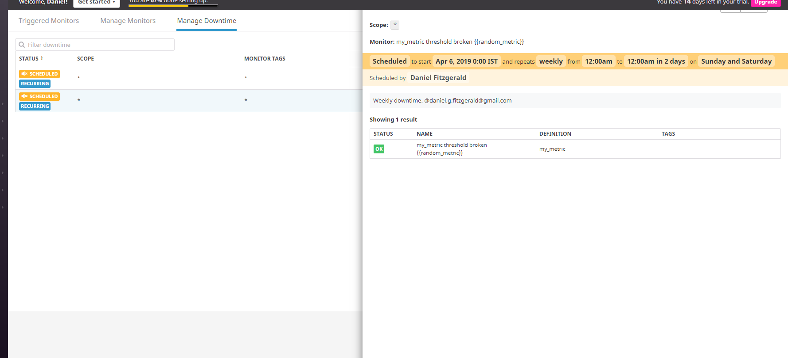

## Collecting Metrics
1) Config of the agent : [datadog.conf](dd-agent/datadog.conf)

Screenshot of the tags : 

2) MySQL Integration has been chosen and done.

Screenshot of the host map : 

3) Code of the configuration file : [YAML file](dd-agent/conf.d/my_check.yaml)
Code of the check file : [Python file](dd-agent/checks.d/my_check.py)

Screenshot of the metric informations : 

4) I changed the [configuration](dd-agent/conf.d/my_check.yaml) of the check

BONUS) I didn't modify the python script to do so, I modified the config in the YAML file. This is the only way I know, for now.

## Visualizing Data
Python script to create/update a board : [update_board.py](./update_board.py)
JSON file for the board : [board.json](./board.json)

Screenshot of the Timeboard:

I didn't receive an email after my annotation. I tried several times and I even changed my email adress. No success. I screenshoted the event in the event list.
My timeboard big : 

BONUS) The Anomaly Graph displays a line (or other visualization) which can take 2 colors, blue or red. If the color goes to red for a part of the graph, it means that the value went below or higher the "usual" trend calculated by the anomaly algorithm. https://docs.datadoghq.com/guides/anomalies/ 

## Monitoring Data
Screenshot of the e-mail when I received a "Warning" notification :

Here is my configuration for my monitor :

BONUS) Again, I did not receive an e-mail when I set the downtimes, which is weird.
Here is the view of both in the downtime pannel.

Weekly Downtime :

Week-end Downtime:

## Collecting APM Data
[Link to my Dashboard](https://p.datadoghq.com/sb/b1131d66e-41a43718b5)
Screenshot of my dashboard :

BONUS) Following the python doc (http://pypi.datadoghq.com/trace/docs/), a "service" is "the name of a set of processes that do the same job", for example, the name of your app.
A ressource is "a particular query to a service". For example, an endpoint or a sql query.
