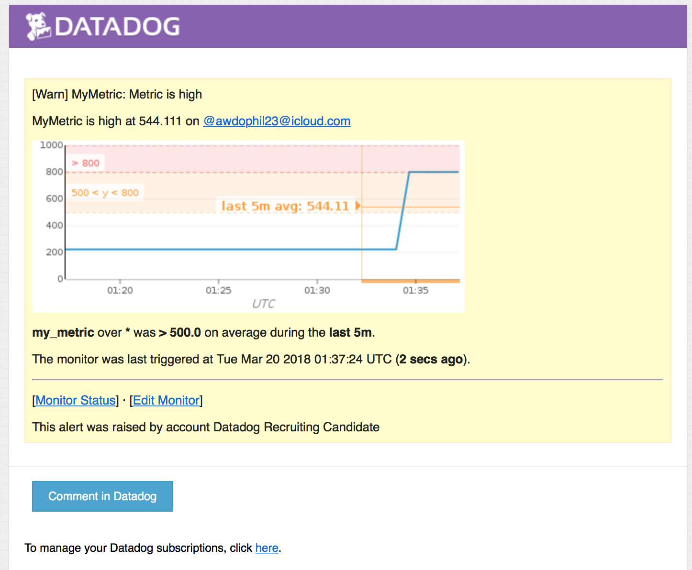
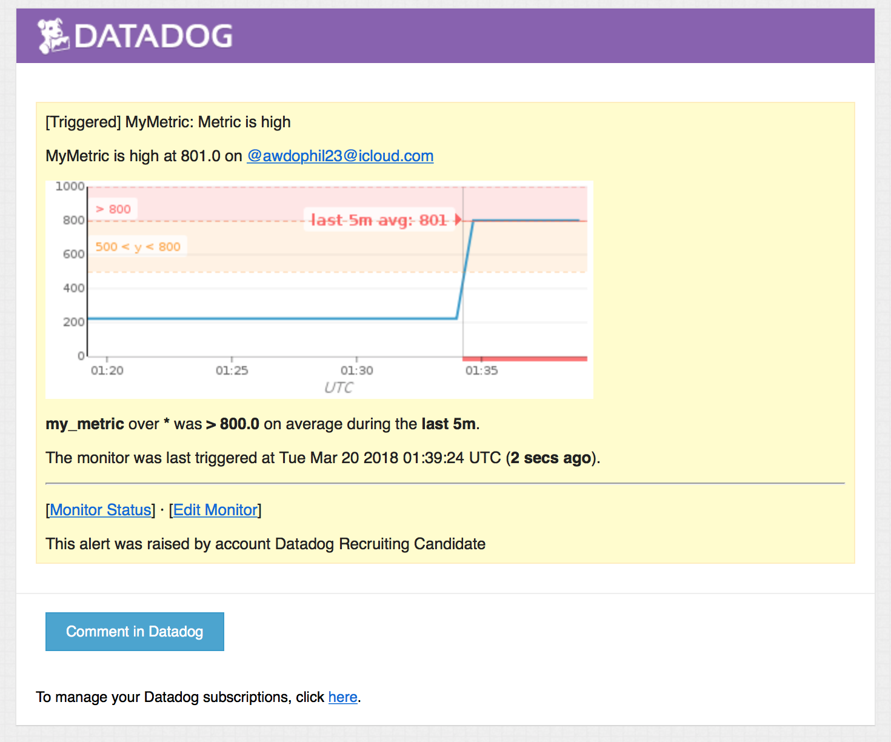
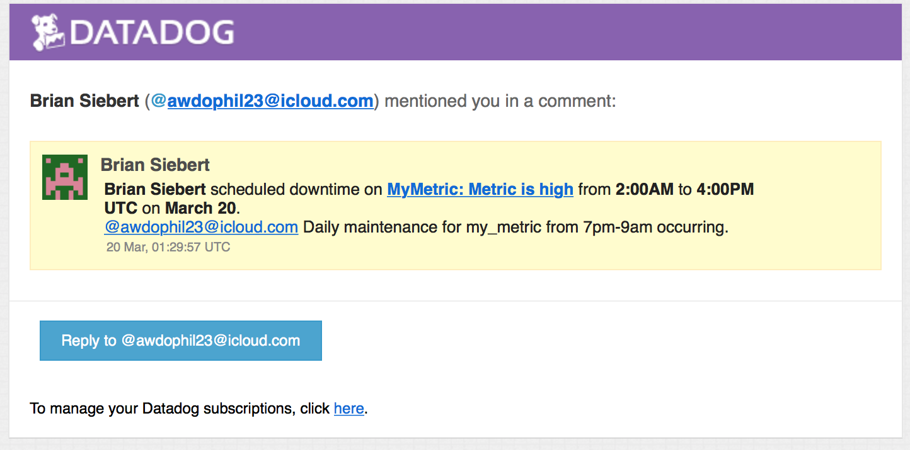
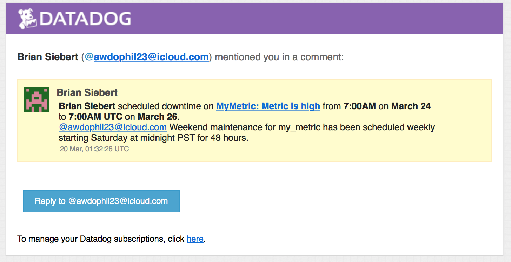
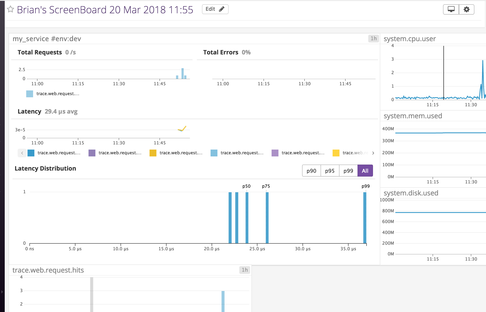

Your answers to the questions go here.

Add tags in the Agent config file and show us a screenshot of your host and its tags on the Host Map page in Datadog.


Install a database on your machine (MongoDB, MySQL, or PostgreSQL) and then install the respective Datadog integration for that database.


Create a custom Agent check that submits a metric named my_metric with a random value between 0 and 1000.
my_metric.py
```
from checks import AgentCheck
class myCheck(AgentCheck):
        def check(self, instance):
                self.guage('my_metric', 223)
```
Change your check's collection interval so that it only submits the metric once every 45 seconds.
```
my_metric.yaml
init_config:
min_collection_interval: 45
instances:
        [{}]
```

Bonus Question Can you change the collection interval without modifying the Python check file you created?
****I could not find a way to do this.

Utilize the Datadog API to create a Timeboard that contains:

Your custom metric scoped over your host.
Any metric from the Integration on your Database with the anomaly function applied.
Your custom metric with the rollup function applied to sum up all the points for the past hour into one bucket
Please be sure, when submitting your hiring challenge, to include the script that you've used to create this Timemboard.

****I continually received an error from the API using curl that I was submitting an invalid application key.  I troubleshot this for quite a while and even created and revoked numerous application keys and continued to receive the same error.  I finally just went to the webpage and created the timeboard manually.

Once this is created, access the Dashboard from your Dashboard List in the UI:
Set the Timeboard's timeframe to the past 5 minutes

****The smallest time increment available for the timeboard is 1 hour so I was unable to set it to 5 minutes.

Take a snapshot of this graph and use the @ notation to send it to yourself.


Bonus Question: What is the Anomaly graph displaying?

****This algortihm shows when a metric is behaving out of the norm based on what it has done in the past.

Since you’ve already caught your test metric going above 800 once, you don’t want to have to continually watch this dashboard to be alerted when it goes above 800 again. So let’s make life easier by creating a monitor.

Create a new Metric Monitor that watches the average of your custom metric (my_metric) and will alert if it’s above the following values over the past 5 minutes:

Warning threshold of 500
Alerting threshold of 800
And also ensure that it will notify you if there is No Data for this query over the past 10m.
Please configure the monitor’s message so that it will:

Send you an email whenever the monitor triggers.

Create different messages based on whether the monitor is in an Alert, Warning, or No Data state.

Include the metric value that caused the monitor to trigger and host ip when the Monitor triggers an Alert state.

When this monitor sends you an email notification, take a screenshot of the email that it sends you.


Bonus Question: Since this monitor is going to alert pretty often, you don’t want to be alerted when you are out of the office. Set up two scheduled downtimes for this monitor:

*One that silences it from 7pm to 9am daily on M-F,

*And one that silences it all day on Sat-Sun.

Make sure that your email is notified when you schedule the downtime and take a screenshot of that notification.

Provide a link and a screenshot of a Dashboard with both APM and Infrastructure Metrics.

APM and Infrastructure Dashboard
https://p.datadoghq.com/sb/4390b2bac-be2fbb83e1cd423d85444eede1c25c7b 



Please include your fully instrumented app in your submission, as well.

```
from flask import Flask
import logging
import sys

from ddtrace import tracer

with tracer.trace("web.request", service="my_service") as span:
  span.set_tag("my_tag", "my_value")

# Have flask use stdout as the logger
main_logger = logging.getLogger()
main_logger.setLevel(logging.DEBUG)
c = logging.StreamHandler(sys.stdout)
formatter = logging.Formatter('%(asctime)s - %(name)s - %(levelname)s - %(message)s')
c.setFormatter(formatter)
main_logger.addHandler(c)

app = Flask(__name__)

@app.route('/')
def api_entry():
    return 'Entrypoint to the Application'

@app.route('/api/apm')
def apm_endpoint():
    return 'Getting APM Started'

@app.route('/api/trace')
def trace_endpoint():
    return 'Posting Traces'

if __name__ == '__main__':
    app.run()
```

Final Question:
Datadog has been used in a lot of creative ways in the past. We’ve written some blog posts about using Datadog to monitor the NYC Subway System, Pokemon Go, and even office restroom availability!

Is there anything creative you would use Datadog for?
****I would like to use DD to trqck and report baseball statistics for my favorite team the Yankees.  I think it would be interesting to see baseball statistics drawn out which is not available today on sites like ESPN where they only provide lists.
