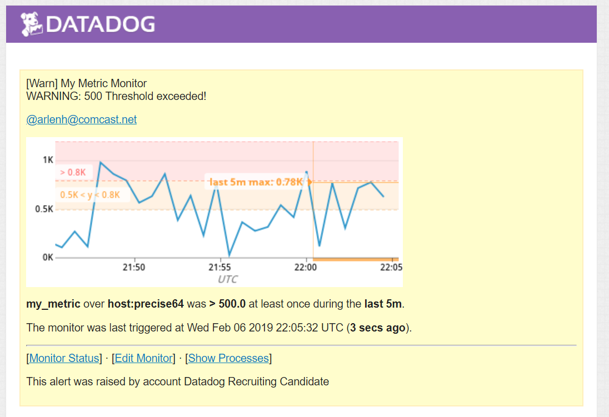

#COLLECTING METRICS

> 
On this picture you can see the tags I added to the agent thanks to the configuration files

> 
On this picture You can see that the db (PostgreSQL) is correctly integrated

> 
On this picture you can this that I'm correctly reporting a metrics with the Agent

- Bonus Question : Yes, It's possible to do so without modifying the Python Checkfile,I did it in the "hello.yaml" configuration File.
```
  init_config:

instances:
  - min_collection_interval: 45

```

#VISUALIZING DATA

[Here](create_timeboard_via_api.rb)
 is the script I used to create the
timeboard.

> 
On this picture you can see the result of my script, creating a Timeboard through Datadog API.

> 
On this picture you can see the last 5min of my metrics reporting, as I'm sending the snapshot to myself

- Bonus Question: The anomaly graph is displaying a metrics, with a grey overlay for the Anomaly function used on this metrics. It is useful to determine if a metrics is reporting normaly or anormal values, thanks to an algorithm based on previous values. On my timeboard, it just overlays a bit my metrics values because It is mostly constant.

#MONITORING DATA

> 
On this picture you can see how I have defined my monitor to receive notifications

> 
On this picture you can see a typical email I receive when my metrics goes above 800, thanks to the monitoring.

> 
On this picture you can see a typical email I receive when my metrics goes above 500, thanks to the monitoring.

> 
On this picture, you can see that I've setup the downtime for my application, to not be notified outside of worktime.

> 
And here it's the the details of this downtime setup

COLLECTING APM DATA
[Here](https://p.datadoghq.com/sb/e3173ed8a-a7d8b4026550bb06b28c901b59e9a884) is a link of a Dashboard, with both APM and Infrastructure Metrics

> 
And here is a picture of the result


The App I used is a small website I'm currently developping, it's a Ruby on Rails Project. I just added the gem 'dd-trace', and a datadog.rb initializer.

- Bonus Question: A Resource is a data access mechanism. It is for me mostly data, a memory location, a way to access it and the according permissions. A Service is more of a controller, allowing execution of desired operations, without regards toward the data type.


#FINAL QUESTION:

I see some other applications for the datadog app. It could be used in online games for examples, like in popular esport games, who are live, multiplayer and statistic-intensive. It could mesure effectiveness of a player compared to the other, to the overall state of the game, and produce analytics to help coaches understand what are the best strategies, or which player struggles with it.

It could also be used, in a reduced version, as a way to determine the optimal settings for a game/application on a specific configuration, allowing a player to get the more of his/her computer to play in the best conditions, in running a few tests in the background or at first launch for exemple. Some driver/CG provider try to do that (NVIDIA GeForce Exp for exemple) with mixed results.

#CONCLUSION

Thank you for your attention, this project took me more time than expected, but I had fun discovering the Datadog App, which is very useful. I hope my submission will be appreciated, and that I've been explicit enough in the different exercises.
