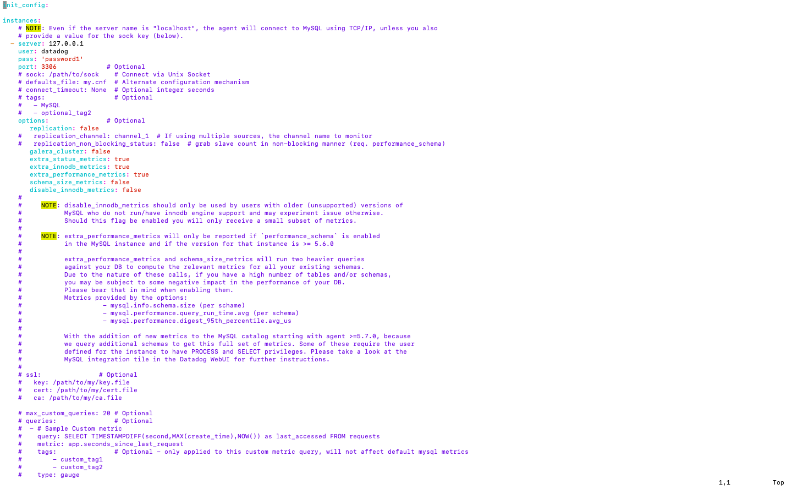

## Datadog - Solutions Engineer Exercise Answers

## Questions

## Prerequisites - Setup the environment

* Environment - 16.04.5 LTS (Xenial Xerus).  Environment was setup and accessed through Vagrant.
* Datadog Account - Linked to Google account, rayner.dalmeida@gmail.com.
* Installed Ubuntu Datadog agent using instructions: https://app.datadoghq.com/account/settings#agent/ubuntu

  _Host Agent Installation:_
  

  

## Collecting Metrics:

* Tags were added by updating the tags parameter within the Datadog agent config file, /etc/datadog-agent/datadog.yaml.

  _Agent Config File with Tags:_
  

  _Host Map Displaying Host Tags_:
  

* For this exercise I installed a MySQL database onto my VM and completed the Datadog MySQL integration instructions, https://docs.datadoghq.com/integrations/mysql/.

  _MySQL Database Installation:_
  

  

  _MySQL.yaml File Configuration (/etc/datadog-agent/conf.d/mysql.d/conf.yaml):_
  

* Created a custom agent check that submits a metric named my_metric.randnum with a random value between 0 and 1000.  I updated the metric name to utilize a proper namespace and follow the naming convention established by the out-of-box metrics.  Prior to the update the host map rendered the metric with a "no namespace" label.

  _Custom Agent File List:_

  * [Agent Configuration File - mymetric.yaml](config/mymetric.yaml)
  * [Agent Python Script - mymetric.py](scripts/mymetric.py)

    ```python
    # the following try/except block will make the custom check compatible with any Agent version
    import random  

    try:
        # first, try to import the base class from old versions of the Agent...
        from checks import AgentCheck
    except ImportError:
        # ...if the above failed, the check is running in Agent version 6 or later
        from datadog_checks.checks import AgentCheck

    # content of the special variable __version__ will be shown in the Agent status page
    __version__ = "1.0.0"

    class RandomNumheck(AgentCheck):
        def check(self, instance):
            self.gauge('my_metric.randnum', random.randint(0,1000))
    ```
    

  _Custom Agent Check Validation:_
  

  Host Map Displaying Custom Agent Check:
  

* Updated the collection interval for the custom agent check to 45 seconds by updating the min_collection_interval parameter in mymetric.yaml.


* **Bonus Question** Can you change the collection interval without modifying the Python check file you created?

  **Answer:** The collection interval can be modified through the min_collection_interval parameter stored in the custom agent configuration file (/etc/datadog-agent/conf.d/mymetric.yaml).

## Visualizing Data:

The timeboard presented below was generated through a Python script calling the Datadog Timeboard APIs.  The timeboard contains:
* Custom metric (my_metric) scoped over my host, ubuntu-xenial.
* MySQL CPU time performance metric (mysql.performance.cpu_time) with the anomaly function applied.
* Custom metric (my_metric) with the rollup function applied to sum up all the points for the past hour into one bucket.

  [API Generated Timeboard](https://app.datadoghq.com/dash/1006685/datadog-lab---timeboard)

  [Timeboard Python Script - timeboard.py](timeboard.py)
  ```Python
  # Datadog Timeboard Script

  # imports
  from datadog import initialize, api
  from json import dumps

  # API initialization parameters
  options = {'api_key': '956b376eda4be274a4d8a54fbfb84a42',
             'app_key': 'ab521a571251baa8202cef85a2d1a95bb2e26ffd'}

  initialize(**options)

  # Timeboard API parameters
  title = "Datadog Lab - Timeboard"
  description = "Timeboard generated through Datadog APIs"
  graphs = [{"definition": {"events": [],
                            "requests": [{
                              "q": "avg:my_metric.randnum{host:ubuntu-xenial}",
                              "type": "line"}],
                              "viz": "timeseries"},
                            "title": "My_Metric by Host"},
            {"definition": {"events": [],
                            "requests": [{
                              "q": "anomalies(avg:mysql.performance.cpu_time{*}, 'basic', 2)",
                              "type": "line"}],
                              "viz": "timeseries"},
                            "title": "MySQL CPU Time with Anomalies"},
            {"definition": {"events": [],
                            "requests": [{
                              "q": "avg:my_metric.randnum{*}.rollup(sum, 3600)",
                              "type": "line"}],
                              "viz": "timeseries"},
                            "title": "My_Metric Rolled Up Hourly"}
          ]

  template_variables = [{
      "name": "ubuntu-xenial",
      "prefix": "host",
      "default": "host:ubuntu-xenial"
  }]
  read_only = True

  apiResponse = api.Timeboard.create(
                       title=title,
                       description=description,
                       graphs=graphs,
                       template_variables=template_variables,
                       read_only=read_only)
  ```

  _API Generated Timeboard:_
  


Once this is created, access the Dashboard from your Dashboard List in the UI:

* Set the Timeboard's timeframe to the past 5 minutes

  _Timeboard for the Past 5 Minutes:_
  
* Take a snapshot of this graph and use the @ notation to send it to yourself.

  _Timeboard Snapshot and Notificaiton:_
  

  


* **Bonus Question**: What is the Anomaly graph displaying?

  **Answer:** The anomaly graph is displaying .


## Monitoring Data

Since you’ve already caught your test metric going above 800 once, you don’t want to have to continually watch this dashboard to be alerted when it goes above 800 again. So let’s make life easier by creating a monitor.

Create a new Metric Monitor that watches the average of your custom metric (my_metric) and will alert if it’s above the following values over the past 5 minutes:

* Warning threshold of 500
* Alerting threshold of 800
* And also ensure that it will notify you if there is No Data for this query over the past 10m.

Please configure the monitor’s message so that it will:

* Send you an email whenever the monitor triggers.
* Create different messages based on whether the monitor is in an Alert, Warning, or No Data state.
* Include the metric value that caused the monitor to trigger and host ip when the Monitor triggers an Alert state.
* When this monitor sends you an email notification, take a screenshot of the email that it sends you.

* **Bonus Question**: Since this monitor is going to alert pretty often, you don’t want to be alerted when you are out of the office. Set up two scheduled downtimes for this monitor:

  * One that silences it from 7pm to 9am daily on M-F,
  * And one that silences it all day on Sat-Sun.
  * Make sure that your email is notified when you schedule the downtime and take a screenshot of that notification.

## Collecting APM Data:

Given the following Flask app (or any Python/Ruby/Go app of your choice) instrument this using Datadog’s APM solution:

```python
from flask import Flask
import logging
import sys

# Have flask use stdout as the logger
main_logger = logging.getLogger()
main_logger.setLevel(logging.DEBUG)
c = logging.StreamHandler(sys.stdout)
formatter = logging.Formatter('%(asctime)s - %(name)s - %(levelname)s - %(message)s')
c.setFormatter(formatter)
main_logger.addHandler(c)

app = Flask(__name__)

@app.route('/')
def api_entry():
    return 'Entrypoint to the Application'

@app.route('/api/apm')
def apm_endpoint():
    return 'Getting APM Started'

@app.route('/api/trace')
def trace_endpoint():
    return 'Posting Traces'

if __name__ == '__main__':
    app.run(host='0.0.0.0', port='5050')
```

* **Note**: Using both ddtrace-run and manually inserting the Middleware has been known to cause issues. Please only use one or the other.

* **Bonus Question**: What is the difference between a Service and a Resource?

Provide a link and a screenshot of a Dashboard with both APM and Infrastructure Metrics.

Please include your fully instrumented app in your submission, as well.

## Final Question:

Datadog has been used in a lot of creative ways in the past. We’ve written some blog posts about using Datadog to monitor the NYC Subway System, Pokemon Go, and even office restroom availability!

Is there anything creative you would use Datadog for?

## Instructions

If you have a question, create an issue in this repository.

To submit your answers:

* Fork this repo.
* Answer the questions in answers.md
* Commit as much code as you need to support your answers.
* Submit a pull request.
* Don't forget to include links to your dashboard(s), even better links and screenshots. We recommend that you include your screenshots inline with your answers.

## References

### How to get started with Datadog

* [Datadog overview](https://docs.datadoghq.com/)
* [Guide to graphing in Datadog](https://docs.datadoghq.com/graphing/)
* [Guide to monitoring in Datadog](https://docs.datadoghq.com/monitors/)

### The Datadog Agent and Metrics

* [Guide to the Agent](https://docs.datadoghq.com/agent/)
* [Datadog Docker-image repo](https://hub.docker.com/r/datadog/docker-dd-agent/)
* [Writing an Agent check](https://docs.datadoghq.com/developers/write_agent_check/)
* [Datadog API](https://docs.datadoghq.com/api/)

### APM

* [Datadog Tracing Docs](https://docs.datadoghq.com/tracing)
* [Flask Introduction](http://flask.pocoo.org/docs/0.12/quickstart/)

### Vagrant

* [Setting Up Vagrant](https://www.vagrantup.com/intro/getting-started/)

### Other questions:

* [Datadog Help Center](https://help.datadoghq.com/hc/en-us)
