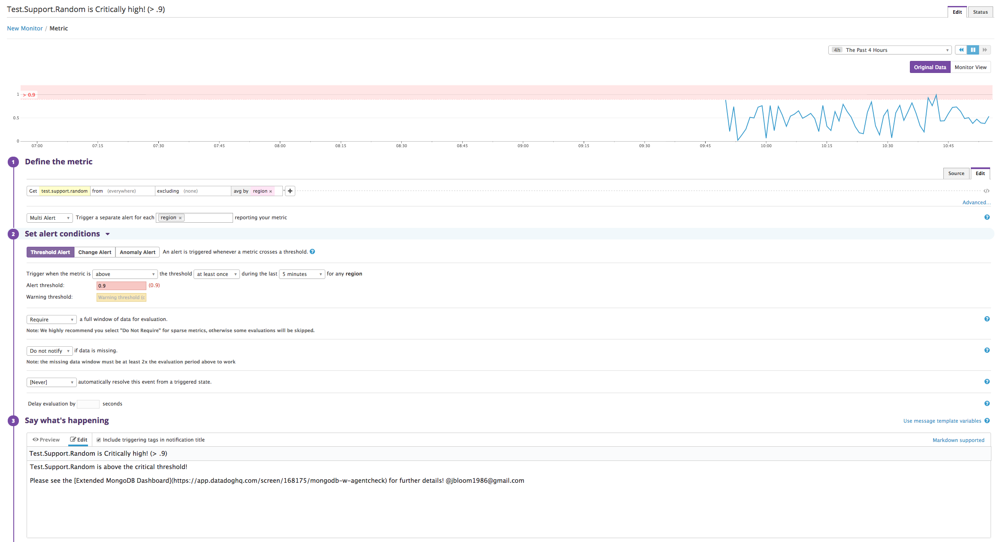

Sign up for Datadog (use "Datadog Recruiting Candidate" in the "Company" field), get the Agent reporting metrics from your local machine.
  

Bonus question: In your own words, what is the Agent?
  It's a python application that acts as a metric pump. It ingests pre-defined metrics and events based on the OS/tech-stack that is being monitored. The extensions gather additional product specific metrics, based on the extension(s) being used. The agent then sends the data to the SaaS-based DataDog aggregator for analysis, display, reporting and alertin capabilities.

Add tags in the Agent config file and show us a screenshot of your host and its tags on the Host Map page in Datadog.
  

Install a database on your machine (MongoDB, MySQL, or PostgreSQL) and then install the respective Datadog integration for that database.
  

Write a custom Agent check that samples a random value. Call this new metric: test.support.random
  

Since your database integration is reporting now, clone your database integration dashboard and add additional database metrics to it as well as your test.support.random metric from the custom Agent check.
  
  [Dashboard Link](https://app.datadoghq.com/screen/168175/mongodb-w-agentcheck)

Bonus question: What is the difference between a timeboard and a screenboard?
  A timeboard is a grid-like dashboard that is controlled by a global time selector. Individual graphs from the timeboard can be shared across DataDog users.
  A screenboard is a more customizable dashboard that allows individual graphs to use their own time frames. A screenboard is shared as a whole dashboard between DataDog users.

Take a snapshot of your test.support.random graph and draw a box around a section that shows it going above 0.90. Make sure this snapshot is sent to your email by using the @notification
  

Set up a monitor on this metric that alerts you when it goes above 0.90 at least once during the last 5 minutes
Bonus points: Make it a multi-alert by host so that you won't have to recreate it if your infrastructure scales up.
Give it a descriptive monitor name and message (it might be worth it to include the link to your previously created dashboard in the message). Make sure that the monitor will notify you via email.
  [Monitor Link](https://app.datadoghq.com/monitors#1765053?group=triggered&live=4h)
  

This monitor should alert you within 15 minutes. So when it does, take a screenshot of the email that it sends you.
  

Bonus: Since this monitor is going to alert pretty often, you don't want to be alerted when you are out of the office. Set up a scheduled downtime for this monitor that silences it from 7pm to 9am daily. Make sure that your email is notified when you schedule the downtime and take a screenshot of that notification.
  [Scheduled Downtime Link](https://app.datadoghq.com/monitors#downtime?id=217559933)
  

