DATADOG EXERCISE RESULTS
========================
Setup
=====

Ubuntu Setup with Agent
-----------------------

Below are the steps followed to setup the environment.

1.  VMware Fusion 8.5.10 is already installed on Mac running Mojave.

2.  Installed Ubuntu 18.04.1

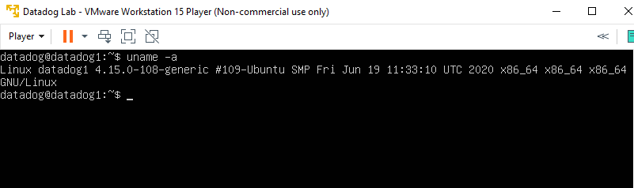

3.  Signed-up and logged-in to the Datadog web site.

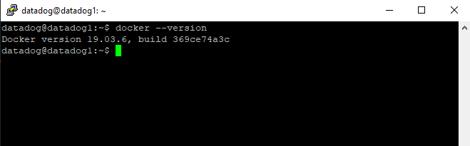

4.  Installed the Datadog agent on the Ubuntu guest.

    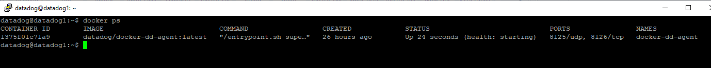

    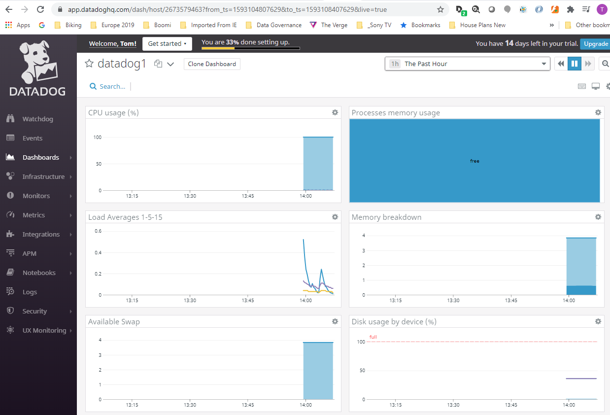

    Note that the output above has been shorted and replaced with "...".

5.  The Ubuntu host reported to Datadog as expected.

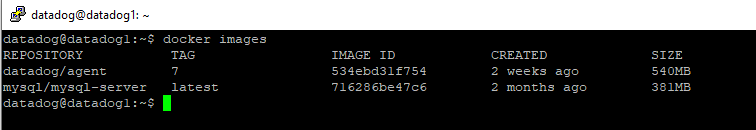

GitHub Notes
------------

The GitHub project details are provided here to enable viewing of
various files created while completing the exercise.

1.  Forked the project

    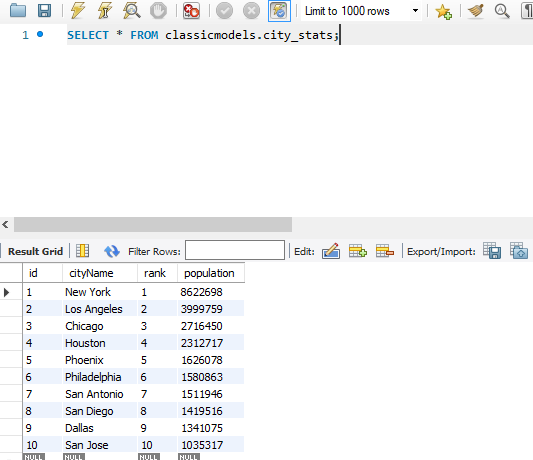

2.  Created a folder called src with sub-folders to hold the needed
    source code.

    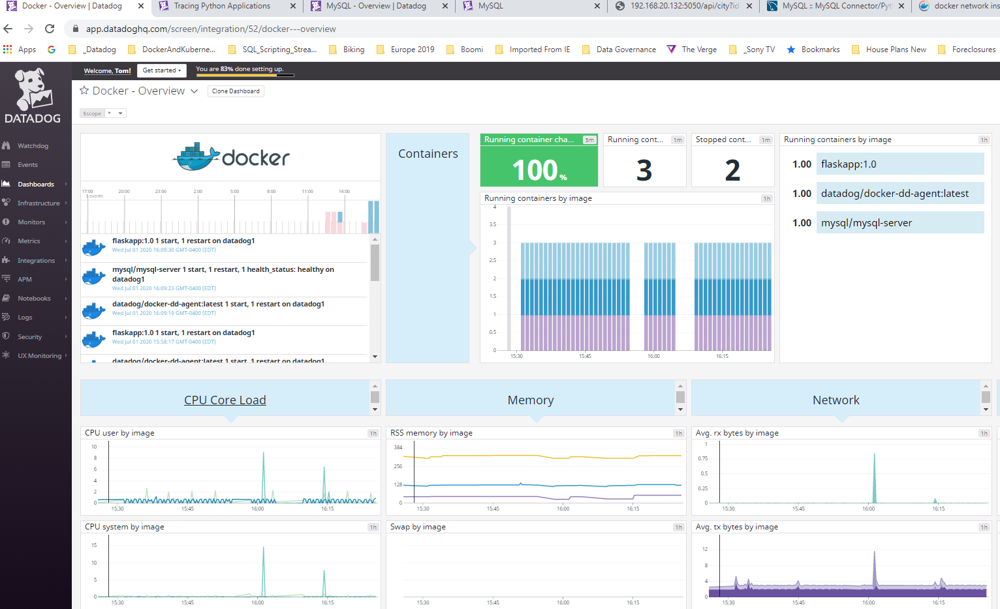

3.  Code changes were primarily conducted using VS Code.

    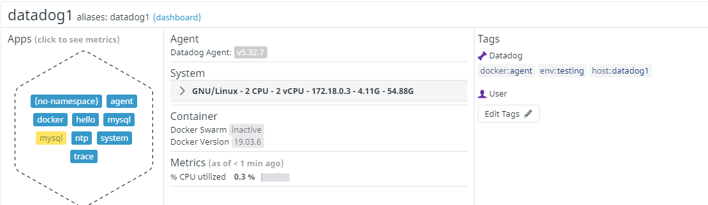

Collecting Metrics
==================

Create Host Tags
----------------

1.  Modify the /etc/datadog-agent/datadog.yaml file to include host tags

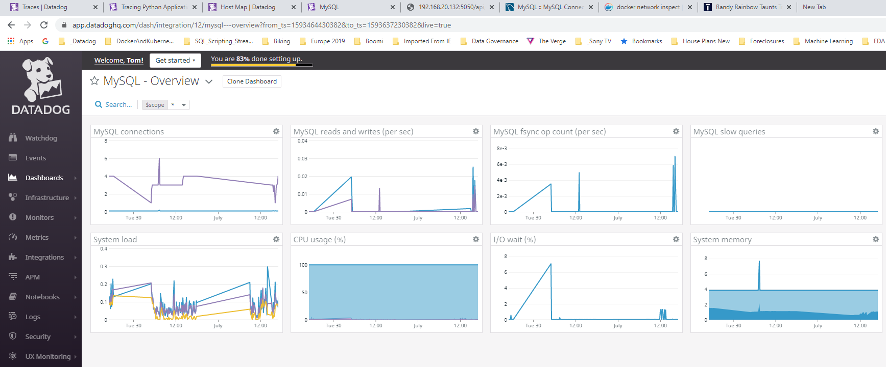

2.  Restart the Datadog agent

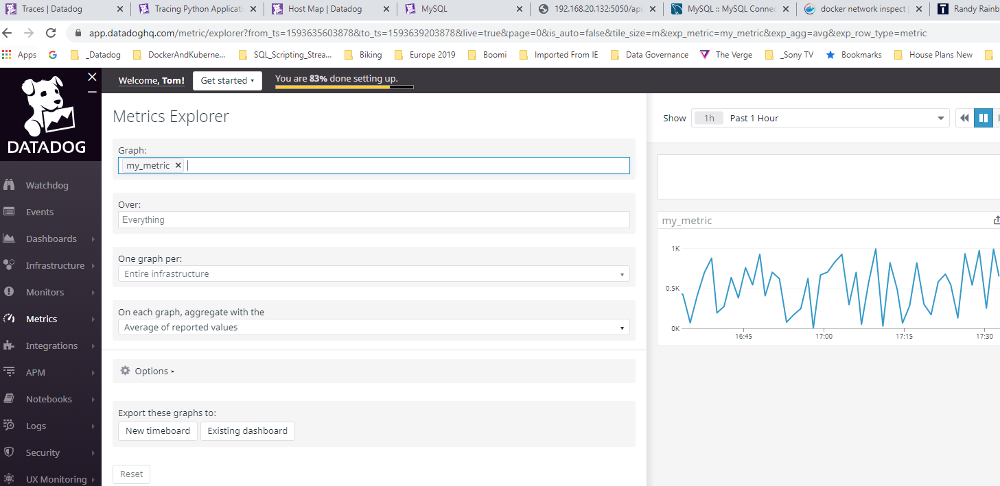

3.  View the new Host Tags on the Host Map

    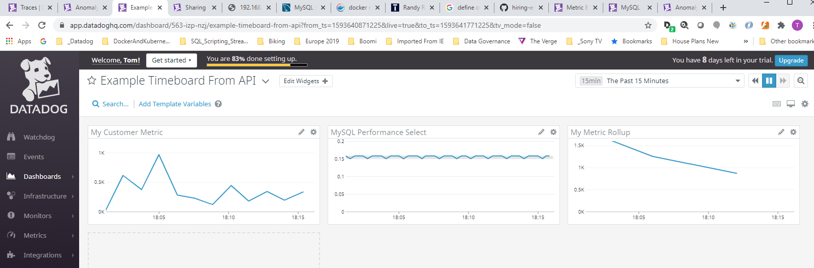

Database Monitoring
-------------------

### MySQL Installation

The installation of MySQL was completed using the following
instructions.

<https://www.digitalocean.com/community/tutorials/how-to-install-mysql-on-ubuntu-18-04>

Following the installation, the MySQL service was active and running.

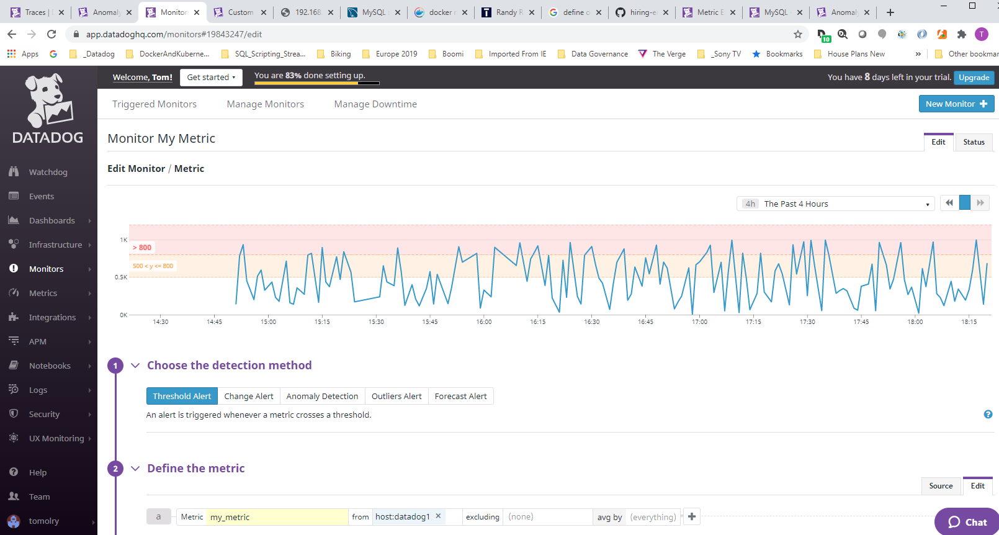

### MySQL Integration Configuration

Below are the steps completed to configure the MySQL based on the
configuration instructions provided in the Datadog MySQL Integration

1.  Create a datadog user with replication rights for the installed
    instance of MySQL server.

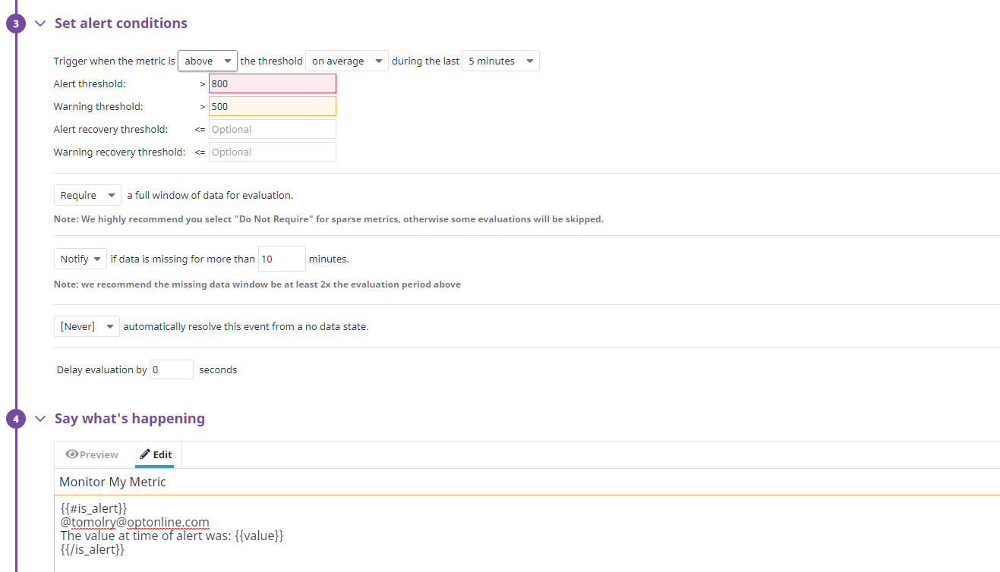

2.  Configure the agent to connect to MySQL by creating/modifying the
    /etc/datadog-agent/conf.d/mysql.d/mysql.yaml file as follows.

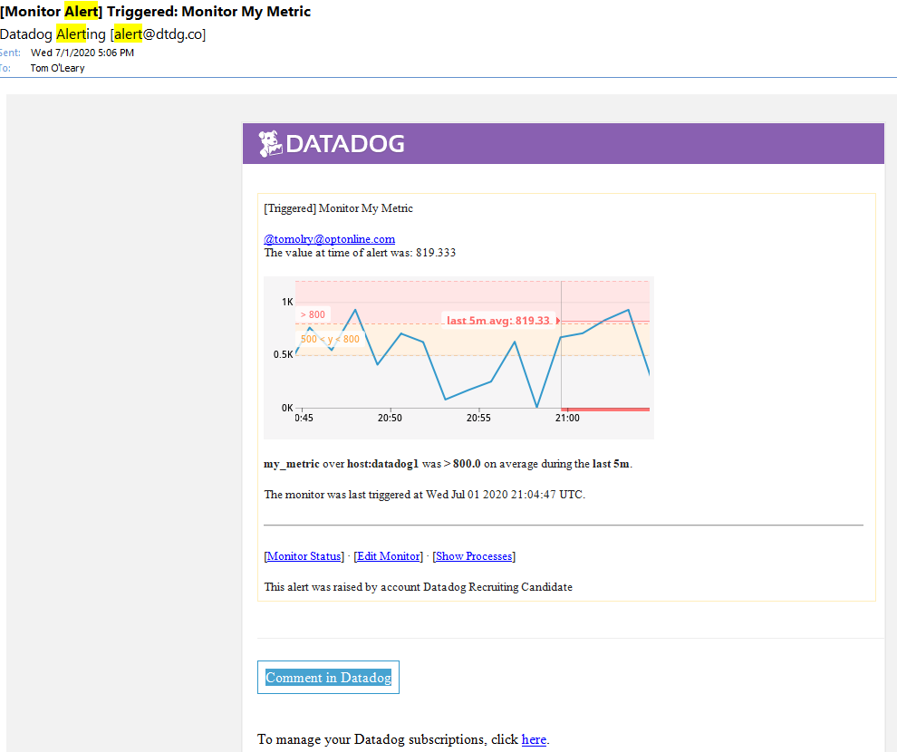

Here is how the mysql.yaml file was configured.

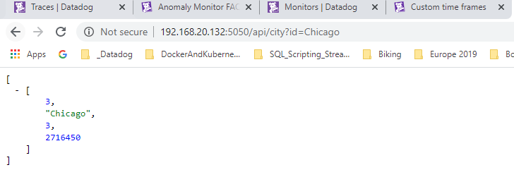

3.  After restarting the agent and executing "sudo datadog-agent
    status", the following was observed in the status output to confirm
    the agent is now monitoring MySQL.

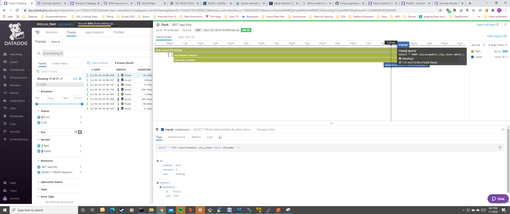{

4.  Here is the default dashboard for MySQL indicating that data has
    been collected. Note all graphs are not shown due to lack of data.

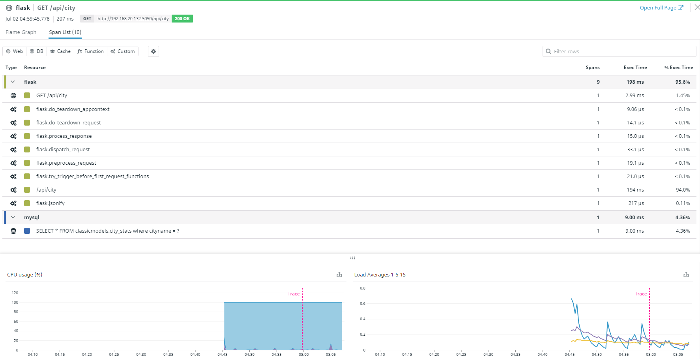{

Custom Agent Check
------------------

The following section in the Datadog Docs was used to configure this
section.

<https://docs.datadoghq.com/developers/write_agent_check/?tab=agentv6>

### Create Files Needed for the New Custom Metric 

1.  Here is the yaml file created to setup the agent
    check.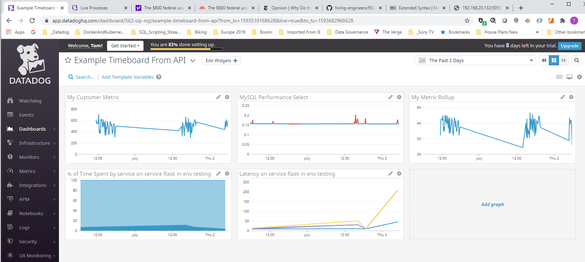

2.  Here is the Python file to generate the metric with a random number
    between 0 and 1000.

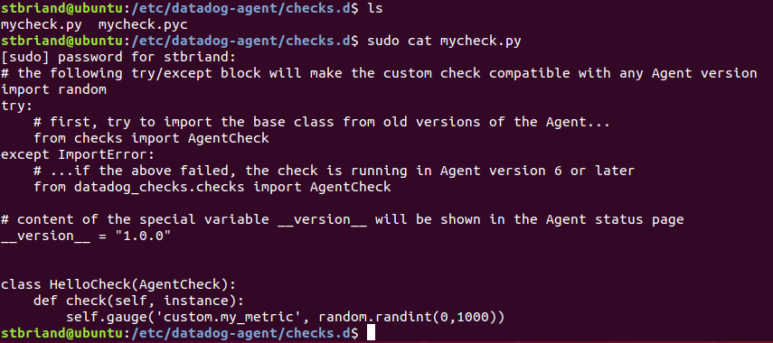

3.  The new metric "my\_metric" can be viewed using the Metrics explorer
    or using the "custom" namespace from the Host Map.

### Change the Collection Interval

The default collection interval is 15 seconds. To change it to 45
seconds the mycheck.yaml file was modified to the following.

The agent log located at /var/log/datadog/agent.log now indicates that
the custom metric is collected every 45 seconds.

Note that **[no change]{.underline}** to the mycheck.py Python file is
required. Only to the mycheck.yaml file. Also see the src/Check folder
in GitHub to view the files used to setup and configure the custom
metric.

Visualizing Data
================

Setup
-----

### Check Python Version

### Install Python Datadog Client

### Create an Application Key

Both an API and application key are needed to execute the Python script
with the Python datadogpy client library. The API key was already
available and a "demo" application key was generated.

See <https://app.datadoghq.com/account/settings#api>

Timeboard Creation
------------------

### Create a Timeboard using the Datadog API

See the src/API subfolder in the esbriand/hiring-engineers project. The
Custom\_Timeboard.py file contains the code to create the Timeboard with
appropriate graphs.

### One Hour Time Frame

Here is the Timeboard that was created from the script with a one-hour
time frame. See
<https://app.datadoghq.com/dash/1072792/steves-custom-timeboard> to view
the Timeboard.

{

### Five Minute Time Frame

Here is a snapshot of the MySQL Queries Per Second graph over a 5-minute
time frame that includes an anomaly. A snapshot was taken with added
comments shown in the Event Stream.

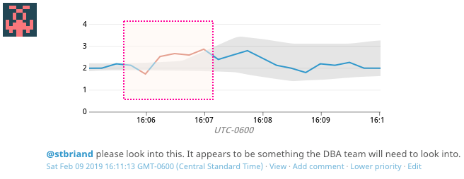

### Anomaly Graphing

The anomaly detection uses historical data to determine whether the data
for a metric is outside of normal bounds.. Metrics with regular and
expected trends are good candidates for anomaly detection. The graph is
displaying the expected trend based the historical data and has
identified when additional queries per second were occuring that have
not occurred regularly in the past.

### Notes on using the API

To better understand both the formatting and settings for some graphs,
it helped to create a Timeboard with graphs using the UI as an example
and then use the API to export the Timeboard to view how some of the
settings were used and formatted. The API documentation seems to be very
brief unless I missed something.

Monitoring Data
===============

Monitor Creation
----------------

{

Warning in the Event Stream and Email
-------------------------------------

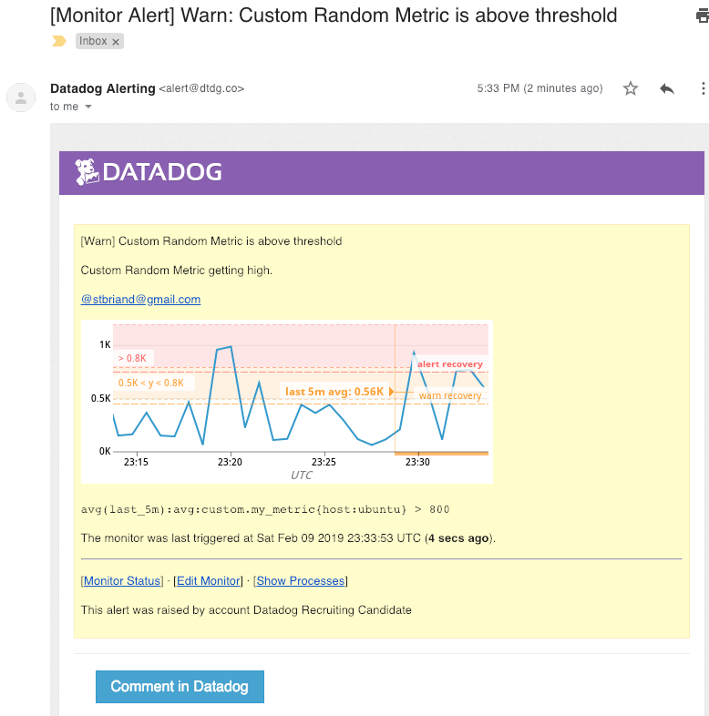

Manage Alert Downtime
---------------------

A Downtime entry was created on Saturday February 9^th^ to silence
alerts on the weekend. The following message was received at midnight
indicating the scheduled downtime had started and ends at midnight on
Sunday.

Collecting APM Data
===================

Setup
-----

### Create Virtual Environment

See
<https://www.digitalocean.com/community/tutorials/how-to-serve-flask-applications-with-gunicorn-and-nginx-on-ubuntu-14-04>
for details on the overall steps required. Below are the commands needed
to install Flask on the Ubuntu server.

### APM Setup

1.  Changes to the /etc/datadog-agent/datadog.yaml file are highlighted
    below to Enable trace collection for the Datadog Agent. For full
    details on how to setup APM in Datadog see
    <https://docs.datadoghq.com/agent/apm/?tab=agent630>.

2.  The following code was added to the Flask app to instrument the
    application. See
    <http://pypi.datadoghq.com/trace/docs/web_integrations.html#flask>
    for details on the Datadog Python tracing client with Flask.

### APM Tracing

Start the Flask app

Access the application to generate trace events. Based on the Flask app
there are three routes.

1.  <http://localhost:5050>

2.  <http://localhost:5050/api/apm>

3.  <http://localhost:5050/api/trace>

After accessing the application, the trace
/var/log/datadog/trace-agent.log file shows trace data being processed.

Under APM -\> Services the my-flask-service is visible.

Here is the detailed view of the service.

### Dashboard with both APM and Infrastructure Metrics

Here is a Timeboard that contains graphs for both the Ubuntu server and
My-Flask-Service. See
<https://app.datadoghq.com/dash/1073072/my-flask-timeboard> to view the
Timeboard.

### The difference between a Service and a Resource

A **service** is typically a set of one or more software functionalities
that execute a set of operations. For example, a database service could
query a database and return one or more values. In terms of Datadog, a
service is a service is a set of processes that do the same job.

A **resource** is a specific action for a service. Services can receive
varying input that allow the service to vary the operations executed and
information returned. For example, a web application may have multiple
URL endpoints that respond with different information. This is the case
for the Flask app where it has three routes/URLs.

See <https://docs.datadoghq.com/tracing/visualization/> for more
information on services and resources in Datadog.

Extra: Monitoring App in Azure
==============================

This is a brief description of a NodeJS/MongoDB application running in
Azure that has been setup for Monitoring. The URL for the application is
<http://13.92.184.65:8080> and the GitHub project is show below along
with the running application in Azure.

The application was deployed to Azure using Packer to build the images
and Terraform to conduct the deployment including the Datadog Agent. The
yaml files on each machine were edited by hand. However, they could be
added to the project and deployed using Terraform. Here are the results
of the configured monitoring.

See <https://app.datadoghq.com/screen/578924/azure-hackathon-starter> to
view the Dashboard above.

Thank-you
