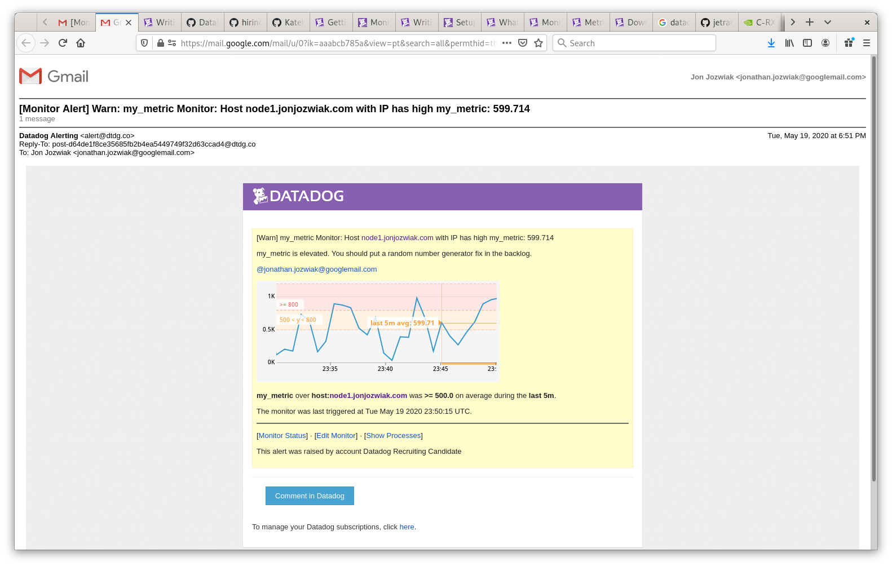

# Technical Exercise

Below are my answers from this exercise.  Please review and reach out to me with any questions or clarification.  

## Prerequisites - setup the environment 

I have a 3-node Kubernetes environment in my home lab that I've used for these exercises.  All 3 nodes are masters and worker nodes.  In it's current iteration it was provisioned using rke (Rancher) and is running Kubernetes 1.16.9.  

### Installing the Datadog Agent on Kubernetes

I used the Helm template for this install.  I already had Helm installed, so it was just a matter of updating the datadog-values file to meet the needs of the exercises.  

The key things I changed are as follows: 
* Ensure all agents I want are installed (collectEvents, logs, processAgent, apm, clusterAgent, and processAgent)
* UseConfigMap so the configuration can be altered easily
* Add tags 
* Include my mysql monitor
* Include my custom check

The file I used is here (less the apiKey and mysql passwords): [datadog_values.yaml](datadog_values.yaml)

Original source is from the [Datadog Helm Chart values.yaml](https://raw.githubusercontent.com/helm/charts/master/stable/datadog/values.yaml)

Once the values were set I used the following commands to install into my cluster:

```
# Install into the datadog namespace
kubectl create ns datadog
helm install datadog -n datadog -f datadog-values.yaml stable/datadog 

# Verify cluster-agent
kubectl get pods -n datadog -l app=datadog-cluster-agent
kubectl exec -n datadog -it datadog-cluster-agent-69b9d96bd4-xqf47 -- datadog-cluster-agent status

# Verify agent
kubectl get pods -n datadog -l app=datadog
kubectl exec -n datadog -it datadog-7z6x7 -- agent status
```

At this point I connected to https://app.datadoghq.com/event/stream to see the cluster events and walked through some getting started screens.  

In the Kubernetes environment in the datadog namespace I have a cluster-agent, kube-state-metrics, and a datadog DaemonSet.  

## Collecting Metrics 

* Add tags in the Agent config file and show us a screenshot of your host and its tags on the Host Map page in Datadog.

For this I did add the tags in the Helm values.  Specifically as follows: 

```
datadog:
  tags:
     - "environment:production"
     - "datadog:awesome"
```

However I did a number of iterations and I'm not certain if these applied or not.  The other approach I took was altering the ConfigMap as follows:

```
kubectl edit configmap datadog-datadog-yaml -n datadog

# Add to the bottom of your datadog.yaml file (Ensuring it is indented in line with other main sections (listeners and apm_config...)
    tags:
      - "environment:production"
      - "datadog:awesome"

# The datadog agent doesn't appear to have a config reloader... 
# Manually kill on each node and have the DaemonSet redeploy

kubectl get pods -n datadog -l app=datadog
kubectl delete pods -n datadog -l app=datadog 

kubectl get pods -n datadog -l app=datadog

# Verify logs from the agent container 
kubectl logs datadog-dqm57 agent -n datadog
```

I took screenshots of each of my hosts and their tags as follows:


* Install a database on your machine (MongoDB, MySQL, or PostgreSQL) and then install the respective Datadog integration for that database.

For this I used mysql with a simple wordpress deployment.  My deployment templates are in the k8s-deployments directory in this repo.  

```
kubectl apply -f k8s-deployments/mysql-deployment.yaml
kubectl apply -f k8s-deployments/wordpress-deployment.yaml
kubectl port-forward -n wordpress service/wordpress 8080:80
# Connect to localhost:8080 and do initial wordpress config 
```

For setting up the mysql integration I mainly followed the documentation [here](https://docs.datadoghq.com/integrations/mysql/#host).  

I just added root login details in annotations rather than creating a user.  In Kubernetes the password should ideally be stored as a secret and passed through as an environment variable.  However, I cut a corner here just to keep things simple for this exercise.  If you're interested I can walk you through a SealedSecret in my private repo.  

Later as I was deploying more I added this directly to the helm chart configuration under confd -> mysql.yaml.  I think either approach would work, but here's what I did in my first walk through before updating helm values: 

```
kubectl edit deployment wordpress-mysql -n wordpress

  # Put this at the pod template level (spec -> template -> metadata -> annotations)
    metadata:
      annotations:
        ad.datadoghq.com/mysql.check_names: '["mysql"]'
        ad.datadoghq.com/mysql.init_configs: '[{}]'
        ad.datadoghq.com/mysql.instances: '[{"server": "%%host%%", "user": "root","pass": "<REDACTED>"}]'
        ad.datadoghq.com/mysql.logs: '[{"source": "mysql", "service": "mysql"}]'

# Validate Collection 
kubectl get pods -n datadog
kubectl exec -n datadog -it <POD_NAME> -- agent status
```

Here's a screenshot from the mysql agent monitoring (not a lot of excitement as there is no usage!)


* Create a custom Agent check that submits a metric named my_metric with a random value between 0 and 1000.

I followed the documentation [here](https://docs.datadoghq.com/developers/write_agent_check/?tab=agentv6v7
) to help write my agent.  This time I just used a helm upgrade from the chart to deploy as it seemed a good approach.  (You can see this in the datadog-values.yaml I referenced earlier)  If you want to take a look at the raw python code outside of Helm, it is available [here](my_metric.py)

```
# Update checksd in datadog-values.yaml to include the python program
  checksd:
    my_metric.py: |-
      #!/usr/bin/python
      import random 

      # the following try/except block will make the custom check compatible with any Agent version
      try:
          # first, try to import the base class from new versions of the Agent...
          from datadog_checks.base import AgentCheck
      except ImportError:
          from checks import AgentCheck

      # content of the special variable __version__ will be shown in the Agent status page
      __version__ = "1.0.0"

      class HelloCheck(AgentCheck):
          def check(self, instance):
            self.gauge('my_metric', value=random.randint(0,1001))

# Update the confd section to include the custom metric
  confd:
    ... 
    my_metric.yaml: |-
      #instances: [{}]
      instances:
        - min_collection_interval: 45
```

Note - I already sent the interval for the next question.  

For deployment and verification, I followed these steps: 

```
helm upgrade datadog -n datadog -f datadog-values.yaml stable/datadog

kubectl get pods -n datadog 
kubectl exec -n datadog -it datadog-c5kkk -- agent check my_metric
kubectl exec -n datadog -it datadog-c5kkk -- agent check my_metric --check-rate
```

* Change your check's collection interval so that it only submits the metric once every 45 seconds.

I set this directly in the Helm chart and upgraded as previously mentioned.  

* Bonus Question Can you change the collection interval without modifying the Python check file you created?

I think I already did this by modifying the Helm chart.  I don't have any collection interval set in Python.  


## Visualizing Data

* Use the Datadog API to create a timeboard including custom metric, anomaly function, and rollup 

I had to walk through this in the Datadog UI in order to understand what a dashboard looks like.  Afterwards, I considered using the Python bindings for this, but instead decided to use Terraform as I thought it would be a faster development.  Terraform's datadog dashboard module is documented [here](https://www.terraform.io/docs/providers/datadog/r/dashboard.html).  

For deployment, I needed both an API key (which I already have) as well as an App key.  I created a new app key for Terraform here: 
https://app.datadoghq.com/account/settings#api 

My terraform code is in the *terraform-dashboard* directory in this repo.  I deployed as follows: 

```
export DATADOG_API_KEY="<MY API KEY>"
export DATADOG_APP_KEY="<MY APP KEY>"
terraform init
terraform apply
```

This turned out easy and would be good to redeploy.  However, I found the UI was much easier for creating the dashboard.  


* Update the Dashboard to the last 5 minutes and send with @ notation 

I really struggled with this.  I thought I would just have to put in *5m* in the dropdown, but it isn't an option.  After some trial and error I found that I could just scroll and select the last 5 minutes on a graph and then hit the play button for it to continue.  

The screenshot of my dashboard is below: 


And a message sent to me with @ notation is here: 


* What is the anomaly graph displaying? 

Anomoly detection is used to show data points that are outside standard operations.
There are 3 algorithms (basic, agile, and robust) and a bounds assigned for the algorithms.  Basic, which I used, shows a simple rolling computation for range.  Any rapid increase or descrease in resource demand would show as an anomoly.  Robust and agile algorithms can support seasonal metrics / trends and are recommended for metrics with daily or weekly fluctuations.

The bounds parameter specifies the width of allowed deviations in the time series with 1 being narrowest and 4 being widest.


## Monitoring Data

The request for this exercise was to create a metric monitor over the custom metric (my_metric).  It should report over 5m intervals and send a warning at 500 and an alert at 800.  If no data arrives over 10m it should also send a notification.  

This was simple to implement.  I went into the monitors dashboard and created a new metric monitor.  I chose the average of my_metric for just one of my hosts.  Also my interval was 5 minutes and alerting >= 800 and warning >= 500.  

My notification template for data missing more than 10 minutes looked like this: 

```
# Title: 
my_metric Monitor: Host {{host.name}} with IP {{host.ip}} has high my_metric: {{value}}

# Body:
{{#is_alert}}
my_metric is too high!!!  Fix your random number generator now!
{{/is_alert}}
{{#is_warning}}
my_metric is elevated.  You should put a random number generator fix in the backlog.
{{/is_warning}}
{{#is_nodata}}
my_metric is not reporting data.  Check to see if agent is functioning properly.
{{/is_nodata}}
```

For notifications I added myself and saved this.  Afterwards I enjoyed the mails flowing regularly!  :D 

For the downtime schedule I went to Monitors -> Manage Downtime -> Schedule Downtime 

Because of the timings requested I ended up making 3 recurring schedules as follows: 
* Repeat every 1 week on Monday - Friday from 12AM - 9AM (9 hours)
* A similar one for 7PM - midnight Monday - Thursday (5 hours)
* And a 3rd For 12:00 - 12:00AM Sat and Sunday (1 day)

My main concern was making certain the Sunday night into Monday morning was included in the downtime which is why I created things this way.  However, a possible alternative would be: 
* Sunday - Friday 7PM - 9AM 
* Saturday - Sunday 12:00 - 12:00  

Below are screenshots of my alert, warning, and scheduled downtime.  





I didn't get an alert for no data during testing, but I believe it is configured correctly to notify as it seems to be a simple setting.  


## Collecting APM Data

For this exercise I used the sample Python Flask application provided, but needed to put it in a container to run in my cluster.  The raw files for the docker container are in the *k8s-deployments/apm-python-sample* directory in this repo.  I created and pushed an image that I could consume as follows: 

```
docker build -t apm-python-sample:latest .

# Tag and Push
docker login --username=yourhubusername
docker images
docker tag apm-python-sample:latest yourhubusername/apm-python-sample:latest
docker push yourhubusername/apm-python-sample:latest
docker logout
```

After this I deployed to my Kubernetes cluster (in the datadog namespace) and tested:

```
kubectl apply -f apm-python-sample.yaml

kubectl get svc -n datadog

# On one of the cluster nodes, send some trafffic to the service
curl http://<cluster-ip>:5050
curl http://<cluster-ip>:5050/api/apm
curl http://<cluster-ip>:5050/api/trace
```

As you can see in my Dockerfile I used ddtrace-run for this.  It was really simple to setup and I loved that I didn't need to modify any of the code.  Here is a screenshot of the dashboard I created: 


* Bonus Question: What is the difference between a Service and a Resource

A service groups together endpoints, queries, or jobs for the purpose of scaling instances.  A resource represents a partular domain of an application, such as a web endpoint.  In other words, a service is a group of resources that make up your application.


## Final Question - Creative Uses for Datadog

Starting with boring and obvious, using Datadog to monitor a Kubernetes and microservices deployment is a great solution.  Being able to provide visibility into complex environments with minimal effort is amazing.  I think this was probably creative years ago, but now just a best practice for operations.  

For creativity I see a couple of use cases that I could implement myself.  First, I've recently implemented a new home automation system (Hubitat - Migrated away from Wink) and may later use one of the open source solutions such as [Home Assistant](https://www.home-assistant.io/).  I can see value in capturing the metrics from my home such as devices on/off, windows and doors opened/closed, and alerting on device connectivity issues.  Anomaly detection may be useful here.  Another thing of interest is alerting when batteries get low on blinds and a dashboard of battery levels across my devices.  

A second hobby of mine is home brewing and I've been very interested in creating a fully automated IOT home brewery to automate the brewing process and later fermentation.  Datadog could be used to monitor sensors and alert if a threshold is crossed (for example, fermentation temperature too warm).  A dashboard here would be great to see overall temperature trend during that process.  A step further could be to use an alert and webhook to trigger an event (such as turn on/off heater or cooler to maintain appropriate temperature).  I think though just starting with visibility would be fun while considering more complex integrations.  

## Recap

I found the exercises were a good introduction to the breadth of capabilities of the Datadog product.  Obviously there is a depth of capability here and I really just scratched the surface.  It would have been nice to dive into some other areas like logging or security, but I realize the time commitment involved.  

I hope that all the Kubernetes above didn't distract from the overall effort.  In hindsight it may have been easier to focus on just a single virtual machine or docker container on my laptop to minimize the effort and focus entirely on Datadog.  However, I'm glad I worked through this in a clustered environment to get a better feel for the use cases in production monitoring and the complexity involved.  

Thank you for taking the time to review my answers!  
