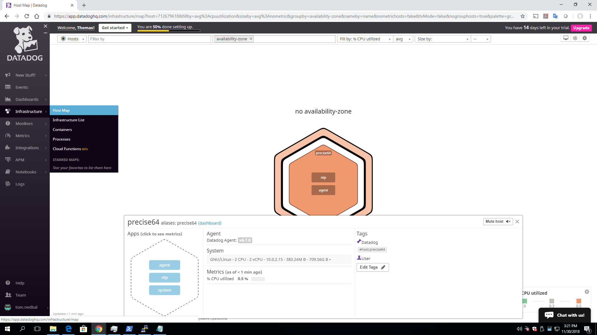
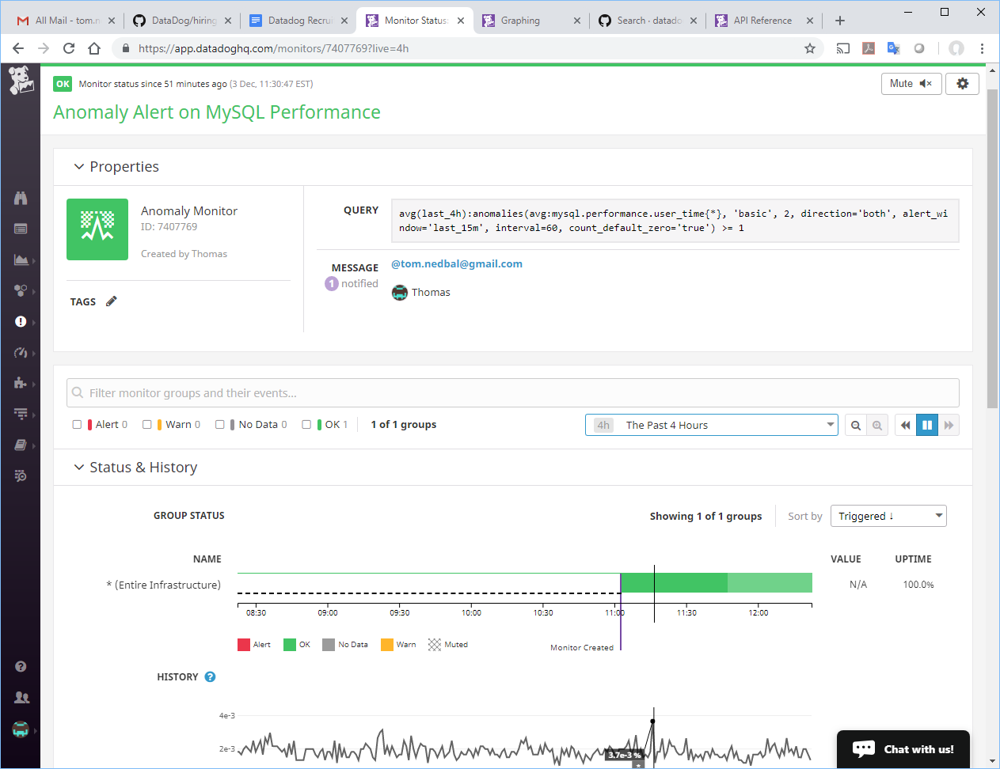
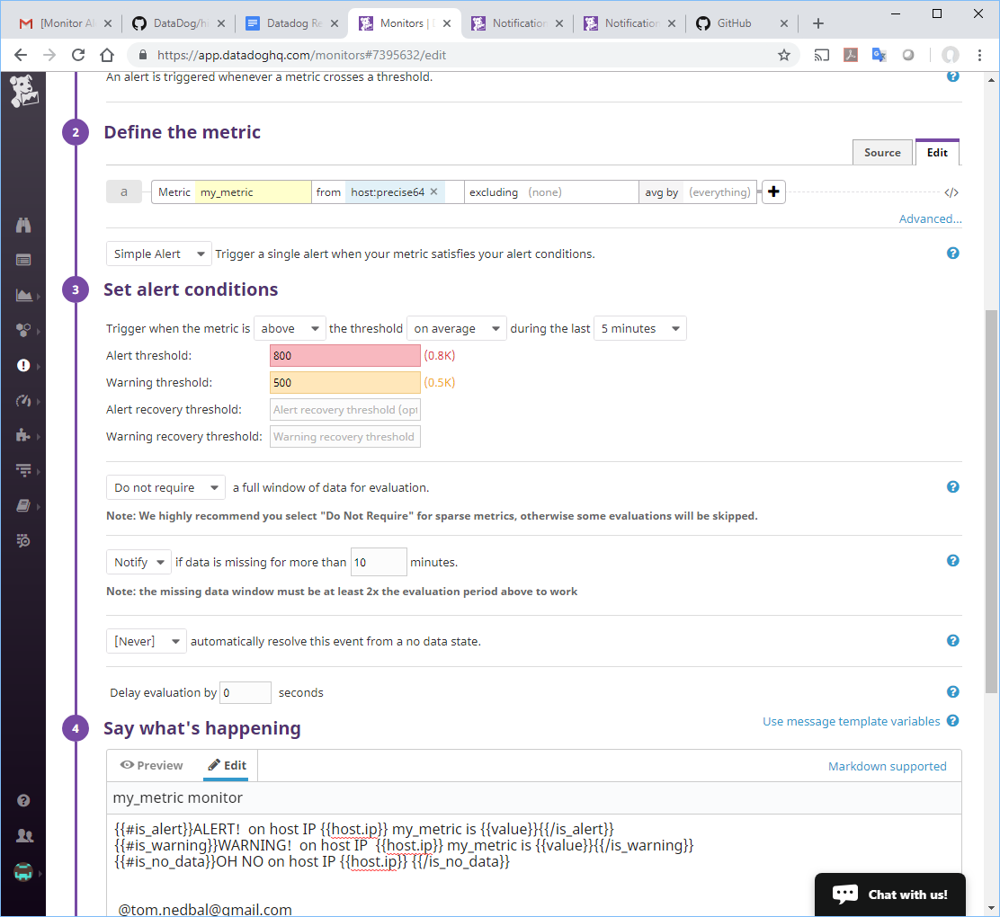
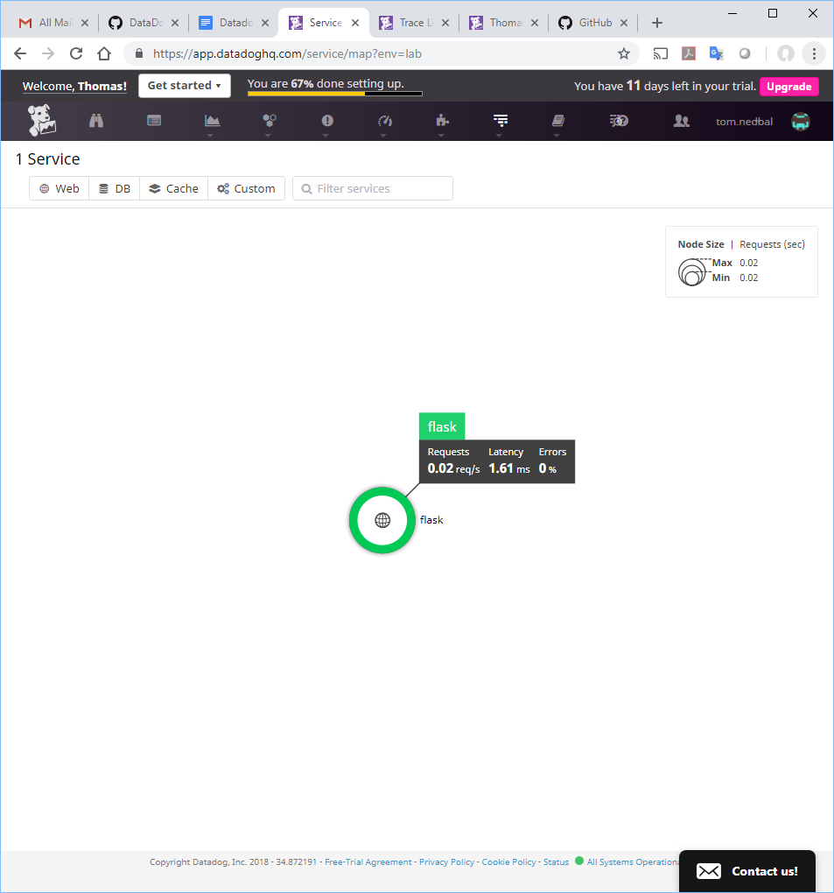
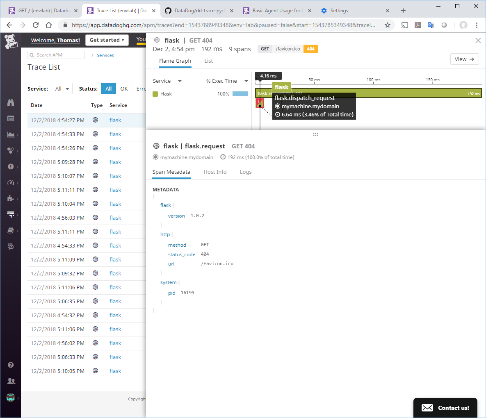

Datadog Recruiting Candidate Tom Nedbal					11/30/2018

I received the Hiring Engineers exercise Friday afternoon 11/30 and started with the prereqs, although I had already signed up for a Datadog trial and had started monitoring a CentOS VM on my home PC.  I used vagrant and created an Ubuntu VM.  I logged into the Ubuntu VM and confirmed it as a base linux OS.

Next I installed the Datadog agent from Datadog HQ and found it to be extremely fast and easy:


I checked the agent status and logs to confirm it was up and reporting metrics:


Looking at Datadog HQ I saw my host on the Host Map:



I also saw the agent metrics starting to report:


### **Collecting Metrics:**

* **Add tags in the Agent config file and show us a screenshot of your host and its tags on the Host Map page in Datadog.**

The next step was to edit the /etc/datadog-agent/datadog.yaml config file.  I added several tags designating this as a lab DB server for the CRM application:


Here’s the Host Map with my "crm" and “dbserver” tags:


* **Install a database on your machine and then install the respective Datadog integration for that database.**

Next I installed MySQL and the Datadog integration.  I found it to be fast and easy:


Metrics reporting to the MqSQL dashboard:


* **Create a custom Agent check that submits a metric named my_metric with a random value between 0 and 1000. **

I created "my_metric.yaml" and “my_metric.py” files and used “random.randint(0,1000)” as shown below:

```python
# the following try/except block will make the custom check compatible with any Agent version
try:
    # first, try to import the base class from old versions of the Agent...
    from checks import AgentCheck
except ImportError:
    # ...if the above failed, the check is running in Agent version 6 or later
    from datadog_checks.checks import AgentCheck

# content of the special variable __version__ will be shown in the Agent status page
__version__ = "1.0.0"

import random
class My_MetricCheck(AgentCheck):
    def check(self, instance):
        self.gauge('my_metric', random.randint(0,1000))

```

Viewing "my_metric" random values:


* **Change your check's collection interval so that it only submits the metric once every 45 seconds.**** ** 

I added "min_collection_interval: 45" to the “my_metric.yaml” file.

```python
init_config:
instances:

 - min_collection_interval: 45
 ```

Graph of metrics confirming the new collection interval of 45 sec:


* **Bonus Question Can you change the collection interval without modifying the Python check file you created?**

Yes, I added the *min_collection_interval: 45 *to the yaml file and did not modify the python program.

### **Visualizing Data:**

**Utilize the Datadog API to create a Timeboard that contains:**

* Your custom metric scoped over your host.

* Any metric from the Integration on your Database with the anomaly function applied.

* Your custom metric with the rollup function applied to sum up all the points for the past hour into one bucket

I ran the following python program to create my Timeboard and graphs with rollup and anomaly features:

```python
from datadog import initialize, api

options = {'api_key': 'bc9c040619249fb29dcc64b2955d7223',

           'app_key': '513bc9b63afa9551a2b2f31c938a573be0d41fea'}
	   
#

#

initialize(**options)

title = "Tom's Timeboard"

description = "Tom's random metric"

graphs = [{

	"definition": {
        
	"events": [],
        
	"requests": [
        
		{"q": "avg:my_metric{*}.rollup(sum, 3600)"}
        
	],
        
	"viz": "timeseries"

	},

    "title": "my_metric - Tom's Random"

},

{

	"definition": {
        
	"events": [],
        
	"requests": [
        
		{"q": "anomalies(avg:mysql.performance.user_time{*}, 'basic',2)"}
        
	]
        
	"viz": "timeseries"
    
    },
    
    "title": "MySQL Performance User Time"

}]

template_variables = [{
    
    "name": "host1",
    
    "prefix": "host",
    
    "default": "host:my-host"

}]

read_only = True

api.Timeboard.create(title=title,
                     
		     description=description,
                     
		     graphs=graphs,
                     
		     template_variables=template_variables,
                     
		     read_only=read_only)
```

Timeboard as created by API with rollup and anomaly features:


Next I changed the time frame to 5 min. and sent myself a snapshot:


Email received from MySQL graph with anomaly set to last 5 minutes:


* **Bonus Question: What is the Anomaly graph displaying?**

The gray band shows the bounds for the anomaly monitor with the "basic" algorithm and the metrics outside of the band have been identified as anomalies. 

* **"Extra Credit"**

For "fun" I added the following lines to the bottom of my API script and created a monitor for this metric:

```python
# Create a new monitor	

options: {
		
		"notify_audit": False,
		
		"locked": False,
		
		"timeout_h": 0,
		
		"new_host_delay": 300,
		
		"require_full_window": False,
		
		"notify_no_data": False,
		
		"renotify_interval": "0",
		
		"escalation_message": "",
		
		"include_tags": False,
		
		"thresholds": {
			
			"critical": 1,
			
			"warning": 0.8,
			
			"critical_recovery": 0
		
		},
		
		"threshold_windows": {
			
			"trigger_window": "last_15m",
			
			"recovery_window": "last_15m"
	
	}

}

tags = []

api.Monitor.create(
    
    type="metric alert",
    
    query="avg(last_4h):anomalies(avg:mysql.performance.user_time{*}, 'basic', 2, direction='both', alert_window='last_15m', 
    interval=60, count_default_zero='true') >= 1",
    
    name="Anomaly Alert on MySQL Performance",
    
    message=" @tom.nedbal@gmail.com",
    
    tags=tags,
    
    options=options

)
```

"Extra Credit" - Monitor created by API script for the MySQL metric:



### **Monitoring Data: ****Create a new Metric Monitor that watches the average of your custom metric (my_metric) and will alert if it’s above the following values over the past 5 minutes.**

I used the UI to create this monitor with the values as requested:



Monitor email received:


**Bonus Question: Since this monitor is going to alert pretty often, you don’t want to be alerted when you are out of the office. Set up two scheduled downtimes for this monitor:**

* **One that silences it from 7pm to 9am daily on M-F,**

* **And one that silences it all day on Sat-Sun.**

* **Make sure that your email is notified when you schedule the downtime and take a screenshot of that notification.**

Evening and Weekend downtime for alerts:


### **Collecting APM Data:**

### **Given the following Flask app,  instrument this using Datadog’s APM solution:**

I installed Flask and ran the Flask app on my CentOS VM, which I had already had running with the Datadog agent.  To instrument the app I ran *ddtrace-run python toms_flask.pl *and quickly started receiving metrics and traces when I exercised the app.

Here is the link to a Screenboard with APM metrics along with Infrastructure metrics:

[https://p.datadoghq.com/sb/092994c9a-08b34c223e3fb31d4610a267cc80e399](https://p.datadoghq.com/sb/092994c9a-08b34c223e3fb31d4610a267cc80e399)


Here is an APM dashboard with traces sorted by duration:


Here is the APM Service Map:



Investigating a trace:


Investigating a trace with a 404 error:



The Host Map with APM metrics:


"Extra Credit" For fun I setup an APM Monitor:


Flask app I used:

```python
from flask import Flask

import logging

import sys

# Have flask use stdout as the logger

main_logger = logging.getLogger()

main_logger.setLevel(logging.DEBUG)

c = logging.StreamHandler(sys.stdout)

formatter = logging.Formatter('%(asctime)s - %(name)s - %(levelname)s - %(message)s')

c.setFormatter(formatter)

main_logger.addHandler(c)

app = Flask(__name__)

@app.route('/')

def api_entry():

    return 'Entrypoint to the Application'
    
@app.route('/api/apm')

def apm_endpoint():

    return 'Getting APM Started'
    
@app.route('/api/trace')

def trace_endpoint():

    return 'Posting Traces'
    
if __name__ == '__main__':

    app.run(host='0.0.0.0', port='5050')
```
    

Tracing Section:

* Bonus Question: What is the difference between a Service and a Resource?

A **Service** is the name of a set of processes that work together to provide a feature set. For instance, a simple web application may consist of two services: a single webapp service and a single database service.  These services are defined by the user when instrumenting their application with Datadog. This field is helpful to quickly distinguish between your different processes.

A **Resource** is a particular query to a service. For a web application, some examples might be a canonical URL like /user/home. For a SQL database, a resource would be the SQL of the query itself like "select * from users where id = ?".  These resources can be found after clicking on a particular service. 

Final Question:
Datadog has been used in a lot of creative ways in the past. We’ve written some blog posts about using Datadog to monitor the NYC Subway System, Pokemon Go, and even office restroom availability!

Is there anything creative you would use Datadog for?

Yes, I am interested to see if any customers are using Datadog to monitor SAP or PeopleSoft.  Also, with the new synthetic solution coming, can it monitoring Salesforce and other big SaaS offerings. 

In summary, I found this exercise very informative.  I found Datadog to be a powerful and very easy to use (and implement) monitoring solution. 

Thank you!  

Tom Nedbal  

