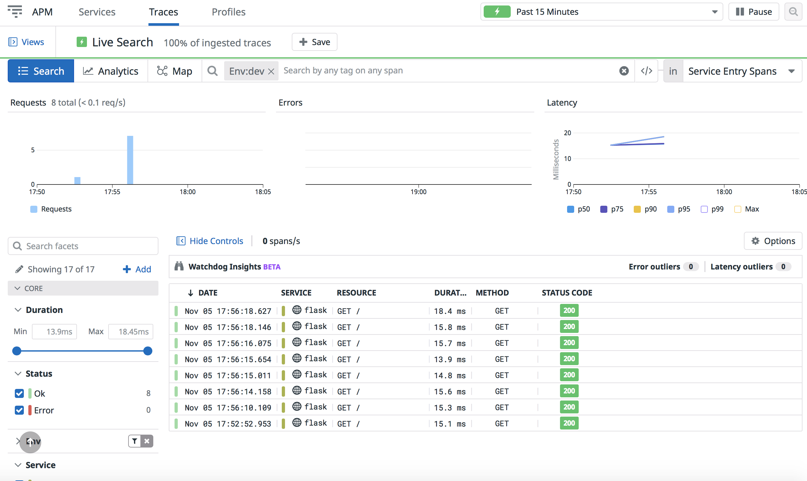

# DataDog Hiring Exercise - Sales Engineer NYC
#### Matt McCreadie
###### November, 2021
Thank you again for the opportunity to complete this exercise and progress through the interview process. I had my work cut out for me between juggling closing out a strong October in my current role and training for the NYC Marathon coming up last weekend, but I had a ton of fun learning and diving right into the product.
</br></br>

</br></br>
Let's walk through this exercise as if I am presenting to a customer.
</br>
</br>

## Prerequisites - Setting up the Environment

I installed the latest version of Vagrant Ubuntu and installed Virtual Box by following [these instructions](https://learn.hashicorp.com/collections/vagrant/getting-started). Once installed, I ran the following commands;
</br></br>
Initialize Vagrant.
</br>
```
vagrant@vagrant:~$ vagrant init hashicorp/bionic64
```
</br></br>
Initialize Vagrant.
</br>
```
vagrant@vagrant:~$ vagrant up
```
</br></br>
SSH into the machine using `vagrant ssh`.
</br></br>

## Collecting Metrics

I editted the API key and added tags in the `datadog.yaml` file within the `/etc/datadog-agent` directory.
</br></br>
Change directory to access config file.
</br>
```cd etc/datadog-agent```
</br></br>
Open config file for editting mentioned above.
</br>
```sudo vi datadog.yaml```
</br></br>

</br></br>
Tags appeared in the Datadog UI (shown below).
</br></br>

</br></br>
I then installed mySql via the command-line using the one-step install command below.
</br>
```DD_AGENT_MAJOR_VERSION=7 DD_API_KEY=f8462f0c39ce8a293fe6adc19654d325 DD_SITE="datadoghq.com" bash -c "$(curl -L https://s3.amazonaws.com/dd-agent/scripts/install_script.sh)"```
</br></br>
Once mysql was installed, I setup the database with the following;
</br></br>
Open mysql via the command-line.
</br>
```sudo mysql -u root```
</br></br>
Create a database user for the Datadog Agent.
</br>
```mysql> CREATE USER 'datadog'@'localhost' IDENTIFIED BY '<UNIQUEPASSWORD>';```
</br></br>
Grant the user the following privileges only.
</br>
```mysql> GRANT REPLICATION CLIENT ON *.* TO 'datadog'@'localhost' WITH MAX_USER_CONNECTIONS 5;```
</br></br>
```mysql> GRANT PROCESS ON *.* TO 'datadog'@'localhost';```
</br><br>
```mysql> GRANT SELECT ON performance_schema.* TO 'datadog'@'localhost';```
</br></br>
I then renamed the conf.yaml.example file to conf.yaml and added the following edits;
</br>
```yaml
init_config:

instances:
  - server: 127.0.0.1
    user: datadog
    pass: "<YOUR_CHOSEN_PASSWORD>" # from the CREATE USER step earlier
    port: "<YOUR_MYSQL_PORT>" # e.g. 3306
    options:
      replication: false
      galera_cluster: true
      extra_status_metrics: true
      extra_innodb_metrics: true
      extra_performance_metrics: true
      schema_size_metrics: false
      disable_innodb_metrics: false
```


Restart datadog-agent (sudo service datadog-agent restart)</br>
I then ran the DataDog Agent status check to confirm that mySql was showing under my "checks" section
</br></br>
Building out the custom agent check was pretty straight forward as well; I created a new directory called custom_check.d, created a new file called custom_check.yaml, then editted that file to include my script. I then created a python file in checks.d called custom_check.py, and editted that file to include my script.
</br></br>
Bonus Question: I was able to edit the collection interval; I did so by editting the yaml file (rather than the python file I created) by editting the min_collection_interval to be 45.
</br></br>

</br></br>

### Visualizing the Data

Here's where I ran into a bit of a hiccup. I started by downloading Postman and going that route, but I could not get it to function as I needed, so I quickly pivoted to Python as my method.
</br></br>
&nbsp;&nbsp;&nbsp;&nbsp;&nbsp;&nbsp; - ran pip install datadog, created new file under /etc/python, added script to this example.py to test </br>
&nbsp;&nbsp;&nbsp;&nbsp;&nbsp;&nbsp; - I then executed my timeboard.py file to write my own dashboards; my_metrics, anamoly function and rollup function
</br></br>
Here's a screenshot of the email I received including a snapshot of one of the graphs.
</br></br>

</br></br>
[Collecting Metrics - Timeboard](https://app.datadoghq.com/dashboard/s2d-shp-ud2/datadog-exercise-timeboard?from_ts=1636169951234&to_ts=1636170251234&live=true)
</br></br>
Bonus Question: Anomaly Function is triggering on any value outside of 2 standard deviations.
</br></br>

### Monitoring Data

Monitoring Data was another straight-forward section of the assignment, especially using the DataDog UI. I was able to follow documentation to set up warning, alert and "no data" emails. I was definitely eager to get the downtime set up once I was getting sent notification emails non-stop once this was up and running!
</br></br>
Configuring Email Notifications; Warning, Alert and No Data</br>

</br></br>
Email Triggered and Sent</br>

</br></br>
Email sent after scheduling weeknight downtime</br>

</br></br>
Email sent after scheduling weekend downtime</br>


### Collecting APM Data

Collecting APM Data was my biggest battle of the assignment. I followed all the documentation exactly; pip install ddtrace, built the python file using the flask code under the python directory, named it flaskApp.py, and then ran ddtrace-run python flaskApp.py
</br></br>
I was running into an issue where I wasn't seeing traces and was unable to confirm by running a curl command at the address it was returning. Ultimately I had to open a new terminal to execute the command while the flask script was running for the traces to begin appearing in the DataDog UI.
</br></br>
Here's a few screenshots and a link for review;
</br></br>

</br></br>

</br></br>

</br></br>

</br></br>

</br></br>
[Link to Traces](https://app.datadoghq.com/apm/traces?query=env%3Adev&cols=core_service%2Ccore_resource_name%2Clog_duration%2Clog_http.method%2Clog_http.status_code&historicalData=true&messageDisplay=inline&sort=desc&streamTraces=true&start=1636083895436&end=1636170295436&paused=false)
</br></br>
Bonus Question: Service vs Resource
</br></br>
Service; Services are the building blocks of modern microservice architectures - broadly a service groups together endpoints, queries, or jobs for the purposes of building your application.
“Flask”, in my project for example.
</br>
Resource; Resources represent a particular domain of a customer application - they are typically an instrumented web endpoint, database query, or background job.
This would relate to the trace metrics that are encompassed by the Flash service mentioned above, in my project for example.
</br></br>

### Final Question

Final Question:
</br></br>
As I mentioned earlier, I've been pretty active in the fitness space with marathons, IronMan races, etc. I am a big user of wearable technology as well, specifically Whoop's wearable tech.
</br></br>
I absolutely love the product, but I recently ran into an issue where my hardware could not connect to the app on my phone/ data was not feeding to the software. There wasn't much visibility to my hardware/software from their support team and I had to download logs for them to review.
</br></br>
A creative application of DataDog might be to leverage DataDog's IoT solution to help minimize downtime for Whoop's userbase. As wearable tech gets more complex and more user's rely on this for their sport, fitness and overall health, keeping downtime minimized and ensuring function of their applications will be more important than ever.
</br></br>

### Thank you

Thank you again for the consideration, and I look forward to more opportunity with DataDog!</br></br>
