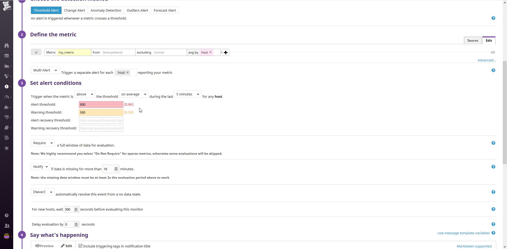
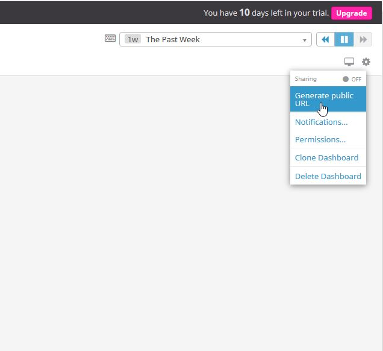

 **This VM is running on my windows box that goes to sleep and that tends to break things on the VM/agent. I ran a quick script to generate a whole bunch of 200s and 404s for the flask app for the public dashboard, so you might have to go back a few hours to find that depending on when this PR is reviewed**

## Questions

Please provide screenshots and code snippets for all steps.

## Prerequisites - Setup the environment

You can utilize any OS/host that you would like to complete this exercise. However, we recommend one of the following approaches:

* You can spin up a fresh linux VM via Vagrant or other tools so that you don’t run into any OS or dependency issues. [Here are instructions](https://github.com/DataDog/hiring-engineers/blob/solutions-engineer/README.md#vagrant) for setting up a Vagrant Ubuntu VM. We strongly recommend using minimum `v. 16.04` to avoid dependency issues.
* You can utilize a Containerized approach with Docker for Linux and our dockerized Datadog Agent image.

Then, sign up for Datadog (use “Datadog Recruiting Candidate” in the “Company” field), get the Agent reporting metrics from your local machine.

## Collecting Metrics:

* Add tags in the Agent config file and show us a screenshot of your host and its tags on the Host Map page in Datadog.
    1. In the /etc/datadog-agent/datadog.yaml file uncomment out the tags section or add content similar to the following to add tags to the server:
        ```yml
        tags:
          - thisisfun
          - env:datdoginterview
          - role:SolutionsEngineer
        ```
    2. restart the datadog agent: `sudo systemctl restart datadog-agent`
    3. You should see the tags show in the dashboard after a short wait

        

* Install a database on your machine (MongoDB, MySQL, or PostgreSQL) and then install the respective Datadog integration for that database.
    1. As a user with sudo privledges run: 
    
        `sudo apt-get install mysql-server -y && sudo systemctl start mysql`

    2. Enter the mysql shell: 

        `sudo mysql`

    3. In the mysql shell run the following (Note: Only the first two commands are required but the rest give access to the full metrics catalog for MySQL):
        1. Create the datadog user: 

            `CREATE USER 'datadog'@'localhost' IDENTIFIED BY '<SuperSecurePassword>';`

        2. Grant replication rights: 

            `GRANT REPLICATION CLIENT ON *.* TO 'datadog'@'localhost' WITH MAX_USER_CONNECTIONS 5;`

        3. Grant Process metrics: 

            `GRANT PROCESS ON *.* TO 'datadog'@'localhost';`

        4. Grant read access to the performance_schema and its tables: 

            `GRANT SELECT ON performance_schema.* TO 'datadog'@'localhost';`

    4. run the following command to verify correct permissions setup if the extended permissions were granted:
        ```sh
        mysql -u datadog --password='<SuperSecurePassword>' -e "SELECT * FROM performance_schema.threads" && \
        echo -e "\033[0;32mMySQL SELECT grant - OK\033[0m" || \
        echo -e "\033[0;31mMissing SELECT grant\033[0m"
        mysql -u datadog --password='<SuperSecurePassword>' -e "SELECT * FROM INFORMATION_SCHEMA.PROCESSLIST" && \
        echo -e "\033[0;32mMySQL PROCESS grant - OK\033[0m" || \
        echo -e "\033[0;31mMissing PROCESS grant\033[0m"
        ```
    5. create a mysql config file in the /etc/datadog-agent/conf.d directory file called mysql.yaml that contains the following:
        ```yaml
        init_config:
        
        instances:
          - server: localhost
            user: datadog
            pass: <SuperSecurePassword>
            tags:
              - optional_tag1
              - optional_tag2
            options:
              replication: 0
              galera_cluster: 1
        ```
    6. Give dd-agent:dd-agent permissions to the file: `sudo chown dd-agent:dd-agent /etc/datadog-agent/conf.d/mysql.yaml`
    7. Restart the datadog agent: `sudo systemctl restart datadog-agent`
    8. Configure monitoring in the console:

        1. Go to Integrations > Integrations:

            
        2. Search for MySQL and then click on the Available button

            
        3. Click the Configuration tab, scroll to the bottom, and click "Install Integration." The instructions can be ignored as they were done previously.

            
        4. Go the the Dashboard list and you should find a MySQL preset dashboard to look at.

            

* Create a custom Agent check that submits a metric named my_metric with a random value between 0 and 1000.
    1. Create a script file to be placed in /etc/datadog-agent/checks.d 
        * Here's [mine](./scripts/my_metric.py)
            ```python
            #!/usr/bin/python
            import random
            from datadog_checks.checks import AgentCheck

            # content of the special variable __version__ will be shown in the Agent status page
            __version__ = "1.0.0"

            class My_Metric(AgentCheck):
                def check(self, instance):
                    self.gauge('my_metric',random.randint(0,1000))
            ```
    2. Create a conf file to be placed in /etc/datadog-agent/conf.d that ***must be the same name as the python file***
        * Here's [mine](./conf/my_metric.yaml) that uses the default configuration from datadog
            ```yaml
            instances: [{}]
            ```
    Working instance:

    

* Change your check's collection interval so that it only submits the metric once every 45 seconds.
    1. Modify the [my_metric.yaml](./conf/my_metric_sleep.yaml) to include a min_collection_interval section  for 45 seconds
        ```yaml
        init_config:

        instances: 
          - min_collection_interval: 45
        ```
        
* **Bonus Question** Can you change the collection interval without modifying the Python check file you created?
    * Yes, see above. 
## Visualizing Data:

Utilize the Datadog API to create a Timeboard that contains:

Notes: 
1. With python you will need to make sure that the datadog library isinstalled
2. With the python API I found the  datadog documentation to be out of date with the libary version and had to use api.Timeboard vs api.Dashboard called out in the docs [here on the dd website](https://docs.datadoghq.com/api/?lang=python#dashboards)
* Your custom metric scoped over your host.
    ```python
    {
        'title': 'MyMetric on Test',
        'definition': {
            'type': 'timeseries',
            'requests': [
                {
                    'q': 'avg:my_metric{host:test}'
                }
            ]
        }
    }
    ```
* Any metric from the Integration on your Database with the anomaly function applied.
    ```python
    {
        'title': 'MySQL CPU Time',
        'definition': {
            'type': 'timeseries',
            'requests': [
                {
                    'q': 'anomalies(avg:mysql.performance.cpu_time{*}, "basic", 2)'
                }
            ]
        }
    }
    ```
* Your custom metric with the rollup function applied to sum up all the points for the past hour into one bucket
    ```python
    {
        'title': 'MyMetricRollup',
        'definition': {
            'type': 'timeseries',
            'requests': [
                {
                    'q': 'sum:my_metric{*}.rollup(sum,3600)'
                }
            ]
        }
    }
    ```
Please be sure, when submitting your hiring challenge, to include the script that you've used to create this Timeboard. **Mine is located [here](./scripts/custom_timeboard.py)**

Once this is created, access the Dashboard from your Dashboard List in the UI:

* Set the Timeboard's timeframe to the past 5 minutes

    
* Take a snapshot of this graph and use the @ notation to send it to yourself.

    
* **Bonus Question**: What is the Anomaly graph displaying?

    Graph is displaying CPU time with anomalies, datapoints outside the calculated norm, showing up in red

## Monitoring Data

Since you’ve already caught your test metric going above 800 once, you don’t want to have to continually watch this dashboard to be alerted when it goes above 800 again. So let’s make life easier by creating a monitor.

Create a new Metric Monitor that watches the average of your custom metric (my_metric) and will alert if it’s above the following values over the past 5 minutes:

* Warning threshold of 500
* Alerting threshold of 800
* And also ensure that it will notify you if there is No Data for this query over the past 10m.

    

Please configure the monitor’s message so that it will:
    
* Send you an email whenever the monitor triggers.
* Create different messages based on whether the monitor is in an Alert, Warning, or No Data state.
* Include the metric value that caused the monitor to trigger and host ip when the Monitor triggers an Alert state.
* When this monitor sends you an email notification, take a screenshot of the email that it sends you.

    ```
    {{#is_alert}}
    Alert: my_metric is at {{value}} on {{host.ip}} 
    {{/is_alert}} 

    {{#is_warning}}
    Warning: my_metric is at {{value}} on {{host.ip}} 
    {{/is_warning}} 

    {{#is_no_data}}
    my_metric is missing some data
    {{/is_no_data}} 
    @matt.mckeown15@gmail.com
    ```
    
* **Bonus Question**: Since this monitor is going to alert pretty often, you don’t want to be alerted when you are out of the office. Set up two scheduled downtimes for this monitor:

  * One that silences it from 7pm to 9am daily on M-F,

    

  * And one that silences it all day on Sat-Sun.

    

  * Make sure that your email is notified when you schedule the downtime and take a screenshot of that notification.

    

## Collecting APM Data:

Given the following Flask app (or any Python/Ruby/Go app of your choice) instrument this using Datadog’s APM solution:

```python
from flask import Flask
import logging
import sys

# Have flask use stdout as the logger
main_logger = logging.getLogger()
main_logger.setLevel(logging.DEBUG)
c = logging.StreamHandler(sys.stdout)
formatter = logging.Formatter('%(asctime)s - %(name)s - %(levelname)s - %(message)s')
c.setFormatter(formatter)
main_logger.addHandler(c)

app = Flask(__name__)

@app.route('/')
def api_entry():
    return 'Entrypoint to the Application'

@app.route('/api/apm')
def apm_endpoint():
    return 'Getting APM Started'

@app.route('/api/trace')
def trace_endpoint():
    return 'Posting Traces'

if __name__ == '__main__':
    app.run(host='0.0.0.0', port='5050')
```

* **Note**: Using both ddtrace-run and manually inserting the Middleware has been known to cause issues. Please only use one or the other.

    I used this flask app mentioned above

    
* **Bonus Question**: What is the difference between a Service and a Resource?
    
    service is a web application whereas a resource is within the application, in this context

Provide a link and a screenshot of a Dashboard with both APM and Infrastructure Metrics.

1. In the top right corner of the dashboard, click the cog:

    

2. On the popup, configure the timeframe that you want to make puplic. The URL is a public URL to the dashboard

    

    https://p.datadoghq.com/sb/dv8va2kmb308p2ut-55348d03267b385784dd7b4655d7defd


Please include your fully instrumented app in your submission, as well: located [here](./scripts/dd_flask.py)

## Final Question:

Datadog has been used in a lot of creative ways in the past. We’ve written some blog posts about using Datadog to monitor the NYC Subway System, Pokemon Go, and even office restroom availability!

Is there anything creative you would use Datadog for?

With the possibility to collect custom metrics, the use of Datadog can only be limited by creativity. With the advent of IoT, Datadog can monitor just about anything in the home such as: the ability to monitor environment variables from multiple IoT manufacturers or sensors centrally dash-boarded, extended to property managers trying to manage Airbnb rentals, could be used to monitor and collect metrics on animals tagged across the world. Specifically, I would use it to monitor environment metrics in my home and outside including rain, wind, moister in the ground for sprinkling, temperature, humidity, thinks like that. 

## Instructions

If you have a question, create an issue in this repository.

To submit your answers:

* Fork this repo.
* Answer the questions in answers.md
* Commit as much code as you need to support your answers.
* Submit a pull request.
* Don't forget to include links to your dashboard(s), even better links and screenshots. We recommend that you include your screenshots inline with your answers.

## References

### How to get started with Datadog

* [Datadog overview](https://docs.datadoghq.com/)
* [Guide to graphing in Datadog](https://docs.datadoghq.com/graphing/)
* [Guide to monitoring in Datadog](https://docs.datadoghq.com/monitors/)

### The Datadog Agent and Metrics

* [Guide to the Agent](https://docs.datadoghq.com/agent/)
* [Datadog Docker-image repo](https://hub.docker.com/r/datadog/docker-dd-agent/)
* [Writing an Agent check](https://docs.datadoghq.com/developers/write_agent_check/)
* [Datadog API](https://docs.datadoghq.com/api/)

### APM

* [Datadog Tracing Docs](https://docs.datadoghq.com/tracing)
* [Flask Introduction](http://flask.pocoo.org/docs/0.12/quickstart/)

### Vagrant

* [Setting Up Vagrant](https://www.vagrantup.com/intro/getting-started/)

### Other questions:

* [Datadog Help Center](https://help.datadoghq.com/hc/en-us)