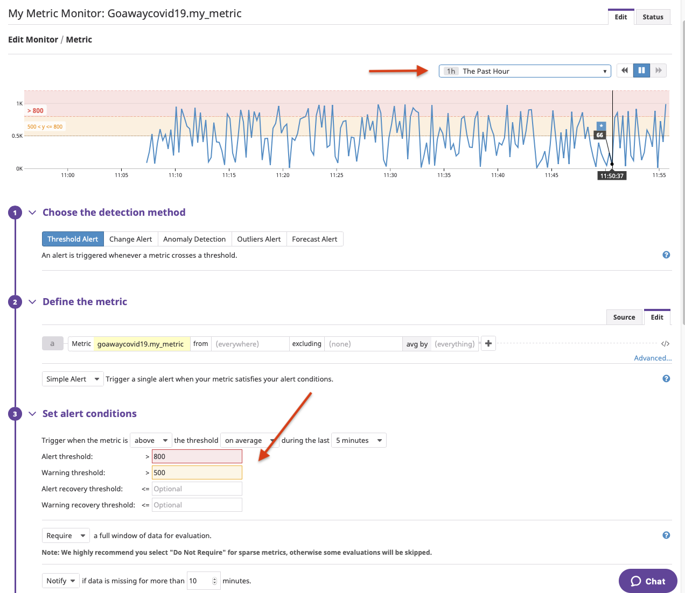
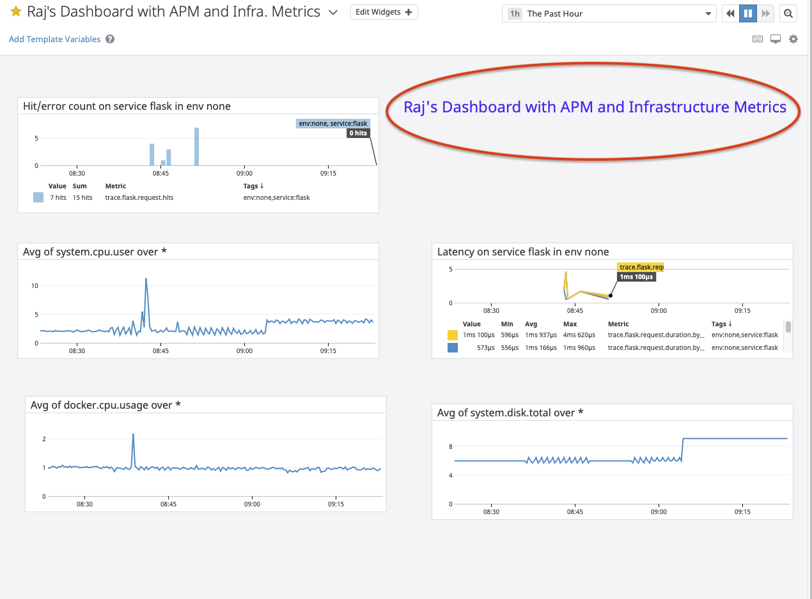

# Answers

**Candidate Name: Raj S** :smile:

## Collecting Metrics:

Add tags in the Agent config file and show us a screenshot of your host and its tags on the Host Map page in Datadog.

**The following tags were added to the /etc/datadog-agent/datadog.yaml file**

tags:
   - environment:RajsEnv
   - OS:Ubuntu18.04
   - Monitoredby:DataDog
   
**As shown below by the arrow mark**


## Install a database on your machine (MongoDB, MySQL, or PostgreSQL) and then install the respective Datadog integration for that database.

I installed PostgreSQL on my Ubuntu 18.04.4 LTS (GNU/Linux 4.15.0-96-generic x86_64) VM
```
raj@raj-replicated:~$ sudo service postgresql status
● postgresql.service - PostgreSQL RDBMS
   Loaded: loaded (/lib/systemd/system/postgresql.service; enabled; vendor preset: enabled)
   Active: active (exited) since Thu 2020-04-23 21:11:12 CDT; 46min ago
 Main PID: 1081 (code=exited, status=0/SUCCESS)
    Tasks: 0 (limit: 4660)
   CGroup: /system.slice/postgresql.service

Apr 23 21:11:12 raj-replicated systemd[1]: Starting PostgreSQL RDBMS...
Apr 23 21:11:12 raj-replicated systemd[1]: Started PostgreSQL RDBMS.
```


## Create a custom Agent check that submits a metric named my_metric with a random value between 0 and 1000.

This is a 2 step process as shown below.

**First I created the following file in /etc/datadog-agent/checks.d/mymetric.py 

>>>
```
import random

# the following try/except block will make the custom check compatible with any Agent version
try:
    # first, try to import the base class from new versions of the Agent...
    from datadog_checks.base import AgentCheck
except ImportError:
    # ...if the above failed, the check is running in Agent version < 6.6.0
    from checks import AgentCheck

# content of the special variable __version__ will be shown in the Agent status page
__version__ = "1.0.0"

class mymetric(AgentCheck):
    def check(self, instance):
        self.gauge('goawaycovid19.my_metric', random.randint(0,1000), tags=['TAG_KEY:TAG_VALUE'])
```

>>>>>>

## Change your check's collection interval so that it only submits the metric once every 45 seconds.

**Second is to create a corresponding file in /etc/datadog-agent/conf.d/mymetric.yaml

```
init_config:

instances:
   - host: datadograj
   - min_collection_interval: 45
```

>>>>>>>

Bonus Question Can you change the collection interval without modifying the Python check file you created?

This can be accomplished by changing the jmx_check_period parameter in the /etc/datadog-agent/datadog.yaml as shown below.
```
raj@raj-replicated:/etc/datadog-agent/conf.d$ sudo cat /etc/datadog-agent/datadog.yaml | grep jmx_check
## @param jmx_check_period - integer - optional - default: 15000
# jmx_check_period: 15000
```

<hr>

#Visualizing Data:
Utilize the Datadog API to create a Timeboard that contains:

Your custom metric scoped over your host.


Any metric from the Integration on your Database with the anomaly function applied.


Your custom metric with the rollup function applied to sum up all the points for the past hour into one bucket
Please be sure, when submitting your hiring challenge, to include the script that you've used to create this Timeboard.


<p>
<p>


Once this is created, access the Dashboard from your Dashboard List in the UI:
Set the Timeboard's timeframe to the past 5 minutes
Take a snapshot of this graph and use the @ notation to send it to yourself.

https://p.datadoghq.com/sb/oi8rtjdn7iubo6f6-a00d4174f148e1d6e895652be63d98aa


See below:


**Bonus Question: What is the Anomaly graph displaying?

The anomaly graph shows the change in the given metric when it is outside the normal range. This is a quick way to quickly identify any strange behavior 

<hr>

## Monitoring Data

Since you’ve already caught your test metric going above 800 once, you don’t want to have to continually watch this dashboard to be alerted when it goes above 800 again. So let’s make life easier by creating a monitor.

Create a new Metric Monitor that watches the average of your custom metric (my_metric) and will alert if it’s above the following values over the past 5 minutes:

Warning threshold of 500
Alerting threshold of 800
And also ensure that it will notify you if there is No Data for this query over the past 10m.



Please configure the monitor’s message so that it will:

Send you an email whenever the monitor triggers.

Create different messages based on whether the monitor is in an Alert, Warning, or No Data state.
<p>


Include the metric value that caused the monitor to trigger and host ip when the Monitor triggers an Alert state.

When this monitor sends you an email notification, take a screenshot of the email that it sends you.

<p>
Triggered alert:


<p>
<p>

Warning alert:


<hr>

Bonus Question: Since this monitor is going to alert pretty often, you don’t want to be alerted when you are out of the office. Set up two scheduled downtimes for this monitor:

One that silences it from 7pm to 9am daily on M-F,
And one that silences it all day on Sat-Sun.
Make sure that your email is notified when you schedule the downtime and take a screenshot of that notification.

Please see below of the screenshots for the above bonus question.


<hr>
<p>
<p>

<hr>
<p>
<p>

<hr>
<p>
<p>

<hr>
<p>
<p>
<hr>
<p>
<p>
# Collecting APM Data:
Given the following Flask app (or any Python/Ruby/Go app of your choice) instrument this using Datadog’s APM solution:

Note: Using both ddtrace-run and manually inserting the Middleware has been known to cause issues. Please only use one or the other.

<p>
<p>


Bonus Question: What is the difference between a Service and a Resource?
** A Resource is an API endpoint Vs Service is a system process

## Provide a link and a screenshot of a Dashboard with both APM and Infrastructure Metrics.

APM and Infrastructure Metrics Dashboard
https://p.datadoghq.com/sb/oi8rtjdn7iubo6f6-66e64659c2711c8592fdc3b13994a225

Please include your fully instrumented app in your submission, as well.

My flaskapp.py:

```
raj@raj-replicated:~/my_flask_app$ sudo cat flaskapp.py
from flask import Flask
import logging
import sys

# Have flask use stdout as the logger
main_logger = logging.getLogger()
main_logger.setLevel(logging.DEBUG)
c = logging.StreamHandler(sys.stdout)
formatter = logging.Formatter('%(asctime)s - %(name)s - %(levelname)s - %(message)s')
c.setFormatter(formatter)
main_logger.addHandler(c)

app = Flask(__name__)

@app.route('/')
def api_entry():
    return 'Entrypoint to the Application'

@app.route('/api/apm')
def apm_endpoint():
    return 'Getting APM Started'

@app.route('/api/trace')
def trace_endpoint():
    return 'Posting Traces'

if __name__ == '__main__':
    app.run(host='0.0.0.0', port='5050')
```

## Running instance of the flask application with ddtrace-run command on my Ubuntu VM

```
(venv) raj@raj-replicated:~/my_flask_app$  ddtrace-run python flaskapp.py
 * Serving Flask app "flaskapp" (lazy loading)
 * Environment: production
   WARNING: This is a development server. Do not use it in a production deployment.
   Use a production WSGI server instead.
 * Debug mode: off
2020-04-25 08:40:01,922 DEBUG [ddtrace.internal.import_hooks] [import_hooks.py:136] - No hooks registered for module 'stringprep'
2020-04-25 08:40:01,922 - ddtrace.internal.import_hooks - DEBUG - No hooks registered for module 'stringprep'
2020-04-25 08:40:01,923 INFO [werkzeug] [_internal.py:113] -  * Running on http://0.0.0.0:5050/ (Press CTRL+C to quit)
2020-04-25 08:40:01,923 - werkzeug - INFO -  * Running on http://0.0.0.0:5050/ (Press CTRL+C to quit)
2020-04-25 08:43:16,885 DEBUG [ddtrace.tracer] [tracer.py:466] - Updating constant tags ['lang:python', 'lang_interpreter:CPython', 'lang_version:3.6.9', 'tracer_version:0.36.1', 'service:flask']
2020-04-25 08:43:16,885 - ddtrace.tracer - DEBUG - Updating constant tags ['lang:python', 'lang_interpreter:CPython', 'lang_version:3.6.9', 'tracer_version:0.36.1', 'service:flask']
2020-04-25 08:43:16,887 DEBUG [ddtrace.tracer] [tracer.py:590] - writing 8 spans (enabled:True)
2020-04-25 08:43:16,887 - ddtrace.tracer - DEBUG - writing 8 spans (enabled:True)
2020-04-25 08:43:16,887 DEBUG [ddtrace.tracer] [tracer.py:592] -
      name flask.request
        id 9115686373042409972
  trace_id 6873940170630977248
 parent_id None
   service flask
  resource GET /
      type web
     start 1587822196.885013
       end 1587822196.886974
  duration 0.001961s
     error 0
```
<hr>
<P>

# Final Question:
Datadog has been used in a lot of creative ways in the past. We’ve written some blog posts about using Datadog to monitor the NYC Subway System, Pokemon Go, and even office restroom availability!

Is there anything creative you would use Datadog for?

Given the pandemic situation I would use Datadog to provide a County by County update on recoveries, death rates and ventilators available so each county can monitor thier progress. This would help the local authorities immensely as they plan their strategy to flatten the curve (that would be a Datadog Dashboard as well).

# Extra stuff:


