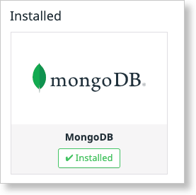

Your answers to the questions go here.

# Collecting Metrics:
## Add tags in the Agent config file and show us a screenshot of your host and its tags on the Host Map page in Datadog.

Snippet from /etc/datadog-agent/datadog.yaml
```
# Set the host's tags (optional)
#tags:
#  - mytag
#  - env:prod
#  - role:database
tags:
  - role:sandbox
  - region:ohioValley
  - database:mongo
```
*Screenshot showing custom tags*


## Install a database on your machine (MongoDB, MySQL, or PostgreSQL) and then install the respective Datadog integration for that database.
_I installed Mongo...._
```
vagrant@ubuntu-xenial:~$ sudo apt-key adv --keyserver hkp://keyserver.ubuntu.com:80 --recv EA312927
vagrant@ubuntu-xenial:~$ echo "deb http://repo.mongodb.org/apt/ubuntu xenial/mongodb-org/3.2 multiverse" | sudo tee /etc/apt/sources.list.d/mongodb-org-3.2.list
vagrant@ubuntu-xenial:~$ sudo apt-get update
vagrant@ubuntu-xenial:~$ sudo apt-get install -y mongodb-org
vagrant@ubuntu-xenial:~$ sudo systemctl start mongod
vagrant@ubuntu-xenial:~$ sudo systemctl status mongod
● mongod.service - High-performance, schema-free document-oriented database
   Loaded: loaded (/lib/systemd/system/mongod.service; disabled; vendor preset: enabled)
   Active: active (running) since Wed 2018-09-05 20:19:05 UTC; 11s ago
     Docs: https://docs.mongodb.org/manual
 Main PID: 8417 (mongod)
    Tasks: 19
   Memory: 28.8M
      CPU: 98ms
   CGroup: /system.slice/mongod.service
           └─8417 /usr/bin/mongod --quiet --config /etc/mongod.conf
``` 
_Screenshot of defaut MongoDB Dashboard


##	Create a custom Agent check that submits a metric named my_metric with a random value between 0 and 1000.
`vagrant@ubuntu-xenial:/etc/datadog-agent/checks.d$ more mycheck.py`
```python
import random
from checks import AgentCheck
 
class MyCheck(AgentCheck):
  def check(self, instance):
    self.gauge('my_metric', random.randint(0,1000))
```

```yaml
vagrant@ubuntu-xenial:/etc/datadog-agent/conf.d$ more mycheck.yaml 
init_config:
 
instances:
  - min_collection_interval: 45 
``` 
## Change your check's collection interval so that it only submits the metric once every 45 seconds.
_(See mycheck.yaml snippet above)_

## Bonus Question Can you change the collection interval without modifying the Python check file you created?
_Yes, you can change the collection interval without modifying the Python code.  The collection interval is set via the yaml configuration file._


# Visualizing Data:
## Utilize the Datadog API to create a Timeboard that contains:
### Your custom metric scoped over your host.
### Any metric from the Integration on your Database with the anomaly function applied.
### Your custom metric with the rollup function applied to sum up all the points for the past hour into one bucket
 
 
*Script used to create this Timeboard.*
```python 
from datadog import initialize, api
 
options = {
  'api_key': '8c442ba646af67c78f242cc4c800023a',
  'app_key': '2a66ed3428490dfec6d87df20dabfe1ba77309dd'}
 
initialize(**options)
 
title = "My Timeboard"
description = "An informative timeboard."
graphs = [
  {"definition": {
    "events": [],
    "requests": [{"q": "avg:my_metric{host:ubuntu-xenial}"}],
    "viz": "timeseries"
  },
  "title": "my_metric over ubuntu-xenial"},
 
  {"definition": {
    "events": [],
    "requests": [{"q": "anomalies(avg:mongodb.uptime{*}, 'basic', 2)"}],
    "viz": "timeseries"
  },
  "title": "mongodb: uptime w/ anomalies"},
 
  {"definition": {
    "events": [],
    "requests": [{"q": "avg:my_metric{*}.rollup(sum, 3600)","type": "bars"}],
    "viz": "timeseries"
  },
  "title": "my_metric sum in hour buckets"},
 
]
 
read_only = True
result = api.Timeboard.create(title=title,
                     description=description,
                     graphs=graphs,
                     read_only=read_only)
print (result)
``` 
 
### Once this is created, access the Dashboard from your Dashboard List in the UI:

### Set the Timeboard's timeframe to the past 5 minutes
_I wasn't able to set the time-frame to the last 5 minutes via the drop-down, 1 hour was the shortest increment._


_In order to get a 5 min view, I selected a 5 minute window with the mouse off of one of the charts._


### Take a snapshot of this graph and use the @ notation to send it to yourself.


### Bonus Question: What is the Anomaly graph displaying?
_Hmmm, not much.  I have anomaly detection on MongoDB Uptime... not much to detect.  I wanted to see how the Anomaly detection worked so I turned it on for "my_metric".  It's pretty slick, clearly shows the "Fairway" where the expected values should lie and highlights the outliers._


# Monitoring Data
## Since you’ve already caught your test metric going above 800 once, you don’t want to have to continually watch this dashboard to be alerted when it goes above 800 again. So let’s make life easier by creating a monitor.
## Create a new Metric Monitor that watches the average of your custom metric (my_metric) and will alert if it’s above the following values over the past 5 minutes:
  ### Warning threshold of 500
  ### Alerting threshold of 800
  ### And also ensure that it will notify you if there is No Data for this query over the past 10m.


##Please configure the monitor’s message so that it will:
  ### Send you an email whenever the monitor triggers.
  ### Create different messages based on whether the monitor is in an Alert, Warning, or No Data state.
  ### Include the metric value that caused the monitor to trigger and host ip when the Monitor triggers an Alert state.
  ### When this monitor sends you an email notification, take a screenshot of the email that it sends you.


## Bonus Question: Since this monitor is going to alert pretty often, you don’t want to be alerted when you are out of the office. Set up two scheduled downtimes for this monitor:
### One that silences it from 7pm to 9am daily on M-F,
_Reading between the lines, the Ops team doesn't want notifications on weekends, before 9AM on Workdays or after 7PM on workdays.  To achieve this you need to include Sundays to prevent alerts on Mondays from Midnight to 9AM Monday mornings._


### And one that silences it all day on Sat-Sun.


### Make sure that your email is notified when you schedule the downtime and take a screenshot of that notification.


# Collecting APM Data:
## Given the following Flask app (or any Python/Ruby/Go app of your choice) instrument this using Datadog’s APM solution:

### Note: Using both ddtrace-run and manually inserting the Middleware has been known to cause issues. Please only use one or the other.
 
### Bonus Question: What is the difference between a Service and a Resource? 
_Service: A service is a set of processes that do the same job.  DataDog has 4 distinct service types: web, db, cache, custom (eg external api)_
 
_Resource: Is a particular action for a service such as a particular query or function associated with a particular URI (eg api/v2/get)_
 
 
### Provide a link and a screenshot of a Dashboard with both APM and Infrastructure Metrics.


https://p.datadoghq.com/sb/9374a82e0-2f76d6998082c49ce71ad06e41ca67a2

### Please include your fully instrumented app in your submission, as well.
`vagrant@ubuntu-xenial:~$ vim flaskapp.py `
```python 
from flask import Flask
import blinker as _
from ddtrace import tracer
from ddtrace.contrib.flask import TraceMiddleware
import logging
import sys
 
 
# Have flask use stdout as the logger
main_logger = logging.getLogger()
main_logger.setLevel(logging.DEBUG)
c = logging.StreamHandler(sys.stdout)
formatter = logging.Formatter('%(asctime)s - %(name)s - %(levelname)s - %(message)s')
c.setFormatter(formatter)
main_logger.addHandler(c)
 
app = Flask(__name__)
traced_app = TraceMiddleware(app, tracer, service="my-flask-app", distributed_tracing=False)
 
@app.route('/')
def api_entry():
    return 'Entrypoint to the Application'
 
@app.route('/api/apm')
def apm_endpoint():
    return 'Getting APM Started'
 
@app.route('/api/trace')
def trace_endpoint():
    return 'Posting Traces'
 
if __name__ == '__main__':
    app.run(host='0.0.0.0', port='5050')
```

# Final Question:
## Datadog has been used in a lot of creative ways in the past. We’ve written some blog posts about using Datadog to monitor the NYC Subway System, Pokemon Go, and even office restroom availability!
## Is there anything creative you would use Datadog for?
_One of the first spaces that came to mind was the IoT space.  In my home I could easily see how I could use DD to monitor a number of IoT devices in my home including z-Wave sensors, lights and even a Raspberry PI I'm setting up to monitor and control my sump pumps.  Easy deployment coupled with a scripable configuration and control makes DD an ideal candidate for the massive scale required for an IoT deployment._
