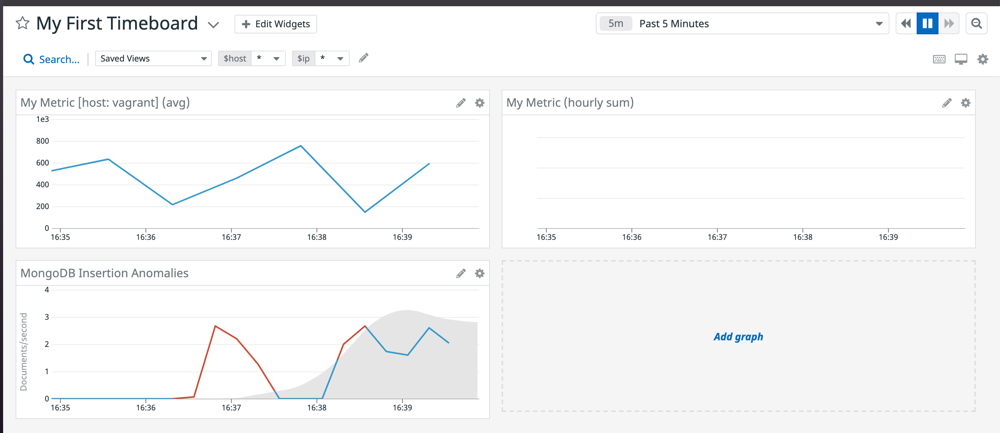
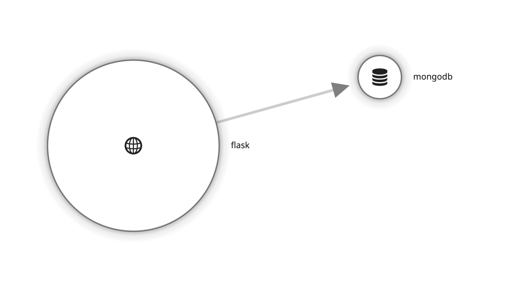

# Answers

## Collecting Metrics:

Which os/host set-up did I pick? 
 

[Docker](docker.sh) is going to be the majority of use cases but there will always be some who need to install the agent directly (older workloads, etc). Implementing both with docker and on an vagrant VM (ubuntu) gives me a good understanding of the differences, and the power of the auto-discovery in docker. 

For database I went with a local install of MongoDB, using [this config file](conf_mongo.yaml).

I created the custom check as requested with increased collection interval, and added a tag for the IP address (to potentially use later):
[custom.yaml](custom.yaml)
[custom.py](custom.py)

* **Bonus Answer** I'll be honest that I'm a bit unsure about this one, mostly because I did not change the Python file to answer the question above; that change was made in the yaml config. The change I did in the config file is specific to this check, but it can also be done at the global level.

I also created a second check that imitates a business metric, which would 'show' better when telling a story:
[cart.yaml](cart.yaml)
[cart.py](cart.py)

## Visualizing Data:

Here is the initial script that I used to create these [dashboards](timeboard_new.sh) by directly hitting the `/dashboard` API.

A 5 minute view of the dashboard with three graphs:

Note because one of the three is an hourly roll-up it will not show data.

Of most interest is the anomaly example, which is looking at document inserts per second into Mongo. I've used API from my flask app (see APM) to run a large number of inserts (at least relative to the historical data of almost none) and captured a snapshot of this sent to myself:

* **Bonus Answer**: The anomaly functions allow a user to run their metric data through algorithms that look at the historical data to understand what values are considered 'normal' and which are potentially anomalies. This range of normal values would show as a gray shaded area on the chart which is incredibly useful in helping users understand if a spike they are seeing is problematic and requires action or not. No two spikes are created equal, and sometimes they are perfectly normal (due to seasonality, time of day, holidays, etc).

A lot of organizations are using tools like Terraform to manage their infrastructure-as-code. It would be really useful for customers to be able to automate creation of dashboards (and monitors, etc) when they are spinning up infrastructure. And of course..... DD has 'an app' (integration) for that!

Here is another dashboard using [Terraform](datadog_dashboard.tf) to show as an example, using the cart dollar total metric:

## Monitoring Data

Thresholds:

Message:

Note: I want to call out that this does *not* include the Host IP, which I couldn't quite figure out how to get. I thought that adding at as a tag to the custom Python check file would make it available, but couldn't get it to work.

E-mail Examples:

* **Bonus Answer**:

Scheduled Downtime:

E-mail Notification:

## Collecting APM Data:

* **Bonus Answer**: A service is "broadly a service groups together endpoints, queries, or jobs for the purposes of building your application." I copied this definition from the glossary because I couldn't come up with a non-awful way of defining them. In practice that means individual microservices (lambdas, etc), databases, message queues, etc. These show up on the service map, i.e:

Resources are actions taken by services. An example of that would be a GET request out to an API, as show in this example traces from my [flask app](app.py):

Metrics and traces are two of the 'three pillars of observability'. To complete the trinity I've also made sure to get logging set up so that I had access to those logs-in-context.

And here's an [updated dashboard](https://p.datadoghq.com/sb/1ead0e3e-b81a-11eb-a477-da7ad0900002-8008fe8171c713645022e9c2a537e860) from above that now includes a fourth graph using APM data:

(editor's note: this app is running on vagrant and so requires init in the code for tracing. If we were using docker this wouldn't be necessary. This makes the docker implementation much better as it would not require a pull request / updating code to get traces going.)

I also instrumented a second service written in [node](auth-service.js) which makes calls out to auth0:

This init was done using environment variables and so required no code changes. I can imagine for an auth service like this that there is a lot of value in being able to import the auth0 logs. Luckily again there is an integration:

This would be a great next step, but unfortunately auth0 streams are only available for enterprise accounts (i.e. not mine) :(

## Final Question:

My flask app was a clue to this answer in the `/api/magic` endpoint, which calls out to a Magic the Gathering API. I'm a pretty big fan of Magic the Gathering and can admit it's not the first time I've used this. There is this idea of the 'metagame' in games like Magic, i.e. what cards/decks are popular at a given time in the community. What's particularly interesting is that the meta can fluctuate pretty dramatically for a number of reasons, for example when new set is released that has great synergy with older cards, or because a popular streamer has used them in a new deck.

It would be interesting to set up a few scrapers (using something like [soup](https://www.crummy.com/software/BeautifulSoup/bs4/doc/)) that run once a day to create a set of metrics. A couple of examples would be:
- grabbing daily price data from the major card resellers, which can be combined with a monitor to flag which cards have seen the biggest price movements in the past 24 hours
- scraping reddit and twitter to aggregate mentions of each card, with the idea being that cards being mentioned a lot are going to be used in the 'meta' more / go up in value
- following content feeds of [popular streamers](https://aetherhub.com/User/covertgoblue) to see what new decks they are using and what cards may become more popular because of it
