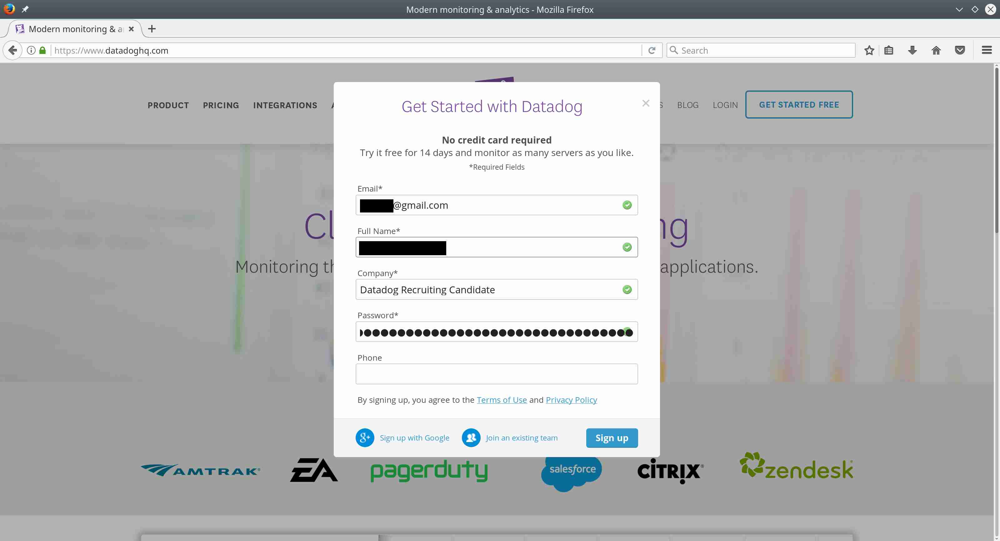
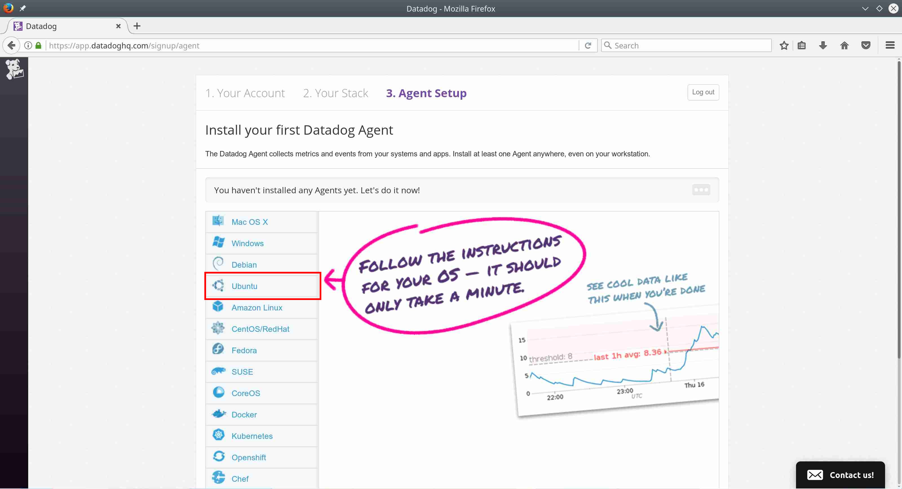
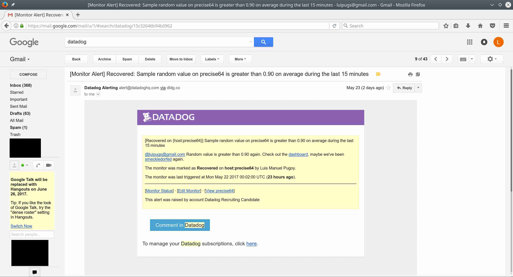

# Signing up for Datadog

1. Open your web browser and go to the following page: https://www.datadoghq.com/.

  

2. Click on the "Get started free" button and enter your details in the pop-up. Click the Sign up button.

  

3. In the Your Stack page, select the technologies you use from the list provided. This helps Datadog know more about its customers and plan improvements to the product. Click Next.

  

4. In the Agent Setup page, choose your system from the list on the left.  In this example we are using Ubuntu 12.04, so click on Ubuntu.

  

5. Upon clicking on Ubuntu, your one-step install command is generated along with steps to install the Datadog Agent in Ubuntu.

  

6. The value of the `DD_API_KEY` is autogenerated and unique to your account. It is used to identify your machines from all the other machines that are reporting to Datadog's servers, so you should keep it private.

  Using the one-step install command requires the `curl` package to be installed. To install, run `sudo apt-get update` and `sudo apt-get install curl` in your terminal.

  Running the one-step install command in Ubuntu will look like the following:

  ```
  $ DD_API_KEY=XXXXXXXXXXXXXXXXXXXXXXXXXXXXXXXX bash -c "$(curl -L https://raw.githubusercontent.com/DataDog/dd-agent/master/packaging/datadog-agent/source/install_agent.sh)"
    % Total    % Received % Xferd  Average Speed   Time    Time     Time  Current
                                   Dload  Upload   Total   Spent    Left  Speed
  100  9911  100  9911    0     0  22408      0 --:--:-- --:--:-- --:--:-- 26714

  * Installing apt-transport-https

  Ign http://us.archive.ubuntu.com precise InRelease
  Hit http://us.archive.ubuntu.com precise-updates InRelease
  Hit http://us.archive.ubuntu.com precise-backports InRelease
  Hit http://security.ubuntu.com precise-security InRelease
  Hit http://us.archive.ubuntu.com precise Release.gpg
  Hit http://security.ubuntu.com precise-security/main Sources
  Hit http://us.archive.ubuntu.com precise-updates/main Sources
  Hit http://us.archive.ubuntu.com precise-updates/restricted Sources
  Hit http://us.archive.ubuntu.com precise-updates/universe Sources
  Hit http://us.archive.ubuntu.com precise-updates/multiverse Sources
  Hit http://us.archive.ubuntu.com precise-updates/main amd64 Packages
  Hit http://us.archive.ubuntu.com precise-updates/restricted amd64 Packages
  Hit http://us.archive.ubuntu.com precise-updates/universe amd64 Packages
  Hit http://us.archive.ubuntu.com precise-updates/multiverse amd64 Packages
  Hit http://us.archive.ubuntu.com precise-updates/main i386 Packages
  Hit http://us.archive.ubuntu.com precise-updates/restricted i386 Packages
  Hit http://security.ubuntu.com precise-security/restricted Sources
  Hit http://security.ubuntu.com precise-security/universe Sources
  Hit http://security.ubuntu.com precise-security/multiverse Sources
  Hit http://security.ubuntu.com precise-security/main amd64 Packages
  Hit http://security.ubuntu.com precise-security/restricted amd64 Packages
  Hit http://security.ubuntu.com precise-security/universe amd64 Packages
  Hit http://security.ubuntu.com precise-security/multiverse amd64 Packages
  Hit http://security.ubuntu.com precise-security/main i386 Packages
  Hit http://security.ubuntu.com precise-security/restricted i386 Packages
  Hit http://security.ubuntu.com precise-security/universe i386 Packages
  Hit http://us.archive.ubuntu.com precise-updates/universe i386 Packages
  Hit http://us.archive.ubuntu.com precise-updates/multiverse i386 Packages
  Hit http://us.archive.ubuntu.com precise-updates/main TranslationIndex
  Hit http://us.archive.ubuntu.com precise-updates/multiverse TranslationIndex
  Hit http://us.archive.ubuntu.com precise-updates/restricted TranslationIndex
  Hit http://us.archive.ubuntu.com precise-updates/universe TranslationIndex
  Hit http://us.archive.ubuntu.com precise-backports/main Sources
  Hit http://us.archive.ubuntu.com precise-backports/restricted Sources
  Hit http://us.archive.ubuntu.com precise-backports/universe Sources
  Hit http://us.archive.ubuntu.com precise-backports/multiverse Sources
  Hit http://security.ubuntu.com precise-security/multiverse i386 Packages
  Hit http://security.ubuntu.com precise-security/main TranslationIndex
  Hit http://security.ubuntu.com precise-security/multiverse TranslationIndex
  Hit http://security.ubuntu.com precise-security/restricted TranslationIndex
  Hit http://security.ubuntu.com precise-security/universe TranslationIndex
  Hit http://us.archive.ubuntu.com precise-backports/main amd64 Packages
  Hit http://us.archive.ubuntu.com precise-backports/restricted amd64 Packages
  Hit http://us.archive.ubuntu.com precise-backports/universe amd64 Packages
  Hit http://us.archive.ubuntu.com precise-backports/multiverse amd64 Packages
  Hit http://us.archive.ubuntu.com precise-backports/main i386 Packages
  Hit http://us.archive.ubuntu.com precise-backports/restricted i386 Packages
  Hit http://security.ubuntu.com precise-security/main Translation-en
  Hit http://security.ubuntu.com precise-security/multiverse Translation-en
  Hit http://security.ubuntu.com precise-security/restricted Translation-en
  Hit http://us.archive.ubuntu.com precise-backports/universe i386 Packages
  Hit http://us.archive.ubuntu.com precise-backports/multiverse i386 Packages
  Hit http://us.archive.ubuntu.com precise-backports/main TranslationIndex
  Hit http://us.archive.ubuntu.com precise-backports/multiverse TranslationIndex
  Hit http://security.ubuntu.com precise-security/universe Translation-en
  Hit http://us.archive.ubuntu.com precise-backports/restricted TranslationIndex
  Hit http://us.archive.ubuntu.com precise-backports/universe TranslationIndex
  Hit http://us.archive.ubuntu.com precise Release
  Hit http://us.archive.ubuntu.com precise-updates/main Translation-en
  Hit http://us.archive.ubuntu.com precise-updates/multiverse Translation-en
  Hit http://us.archive.ubuntu.com precise-updates/restricted Translation-en
  Hit http://us.archive.ubuntu.com precise-updates/universe Translation-en
  Hit http://us.archive.ubuntu.com precise-backports/main Translation-en
  Hit http://us.archive.ubuntu.com precise-backports/multiverse Translation-en
  Hit http://us.archive.ubuntu.com precise-backports/restricted Translation-en
  Hit http://us.archive.ubuntu.com precise-backports/universe Translation-en
  Hit http://us.archive.ubuntu.com precise/main Sources
  Hit http://us.archive.ubuntu.com precise/restricted Sources
  Hit http://us.archive.ubuntu.com precise/universe Sources
  Hit http://us.archive.ubuntu.com precise/multiverse Sources
  Hit http://us.archive.ubuntu.com precise/main amd64 Packages
  Hit http://us.archive.ubuntu.com precise/restricted amd64 Packages
  Hit http://us.archive.ubuntu.com precise/universe amd64 Packages
  Hit http://us.archive.ubuntu.com precise/multiverse amd64 Packages
  Hit http://us.archive.ubuntu.com precise/main i386 Packages
  Hit http://us.archive.ubuntu.com precise/restricted i386 Packages
  Hit http://us.archive.ubuntu.com precise/universe i386 Packages
  Hit http://us.archive.ubuntu.com precise/multiverse i386 Packages
  Hit http://us.archive.ubuntu.com precise/main TranslationIndex
  Hit http://us.archive.ubuntu.com precise/multiverse TranslationIndex
  Hit http://us.archive.ubuntu.com precise/restricted TranslationIndex
  Hit http://us.archive.ubuntu.com precise/universe TranslationIndex
  Hit http://us.archive.ubuntu.com precise/main Translation-en
  Hit http://us.archive.ubuntu.com precise/multiverse Translation-en
  Hit http://us.archive.ubuntu.com precise/restricted Translation-en
  Hit http://us.archive.ubuntu.com precise/universe Translation-en
  Reading package lists...
  Reading package lists...
  Building dependency tree...
  Reading state information...
  The following extra packages will be installed:
    libapt-pkg4.12 libcurl3-gnutls
  The following packages will be upgraded:
    apt-transport-https libapt-pkg4.12 libcurl3-gnutls
  3 upgraded, 0 newly installed, 0 to remove and 190 not upgraded.
  Need to get 1,178 kB of archives.
  After this operation, 16.4 kB of additional disk space will be used.
  Get:1 http://us.archive.ubuntu.com/ubuntu/ precise-updates/main libapt-pkg4.12 amd64 0.8.16~exp12ubuntu10.27 [934 kB]
  Get:2 http://us.archive.ubuntu.com/ubuntu/ precise-updates/main libcurl3-gnutls amd64 7.22.0-3ubuntu4.17 [228 kB]
  Get:3 http://us.archive.ubuntu.com/ubuntu/ precise-updates/main apt-transport-https amd64 0.8.16~exp12ubuntu10.27 [16.4 kB]
  Fetched 1,178 kB in 6s (179 kB/s)
  (Reading database ... 51127 files and directories currently installed.)
  Preparing to replace libapt-pkg4.12 0.8.16~exp12ubuntu10 (using .../libapt-pkg4.12_0.8.16~exp12ubuntu10.27_amd64.deb) ...
  Unpacking replacement libapt-pkg4.12 ...
  Setting up libapt-pkg4.12 (0.8.16~exp12ubuntu10.27) ...
  Processing triggers for libc-bin ...
  ldconfig deferred processing now taking place
  (Reading database ... 51127 files and directories currently installed.)
  Preparing to replace libcurl3-gnutls 7.22.0-3ubuntu4 (using .../libcurl3-gnutls_7.22.0-3ubuntu4.17_amd64.deb) ...
  Unpacking replacement libcurl3-gnutls ...
  Preparing to replace apt-transport-https 0.8.16~exp12ubuntu10 (using .../apt-transport-https_0.8.16~exp12ubuntu10.27_amd64.deb) ...
  Unpacking replacement apt-transport-https ...
  Setting up libcurl3-gnutls (7.22.0-3ubuntu4.17) ...
  Setting up apt-transport-https (0.8.16~exp12ubuntu10.27) ...
  Processing triggers for libc-bin ...
  ldconfig deferred processing now taking place

  * Installing APT package sources for Datadog

  Executing: gpg --ignore-time-conflict --no-options --no-default-keyring --secret-keyring /tmp/tmp.6ElmPzQm7x --trustdb-name /etc/apt/trustdb.gpg --keyring /etc/apt/trusted.gpg --primary-keyring /etc/apt/trusted.gpg --recv-keys --keyserver hkp://keyserver.ubuntu.com:80 C7A7DA52
  gpg: requesting key C7A7DA52 from hkp server keyserver.ubuntu.com
  gpg: key C7A7DA52: public key "Datadog Packages <package@datadoghq.com>" imported
  gpg: no ultimately trusted keys found
  gpg: Total number processed: 1
  gpg:               imported: 1  (RSA: 1)
  Executing: gpg --ignore-time-conflict --no-options --no-default-keyring --secret-keyring /tmp/tmp.qyz3w3Li1P --trustdb-name /etc/apt/trustdb.gpg --keyring /etc/apt/trusted.gpg --primary-keyring /etc/apt/trusted.gpg --recv-keys --keyserver hkp://keyserver.ubuntu.com:80 382E94DE
  gpg: requesting key 382E94DE from hkp server keyserver.ubuntu.com
  gpg: key 382E94DE: public key "Datadog, Inc <package@datadoghq.com>" imported
  gpg: Total number processed: 1
  gpg:               imported: 1  (RSA: 1)

  * Installing the Datadog Agent package

  Get:1 https://apt.datadoghq.com stable Release.gpg [473 B]
  Get:2 https://apt.datadoghq.com stable Release [2,367 B]
  Get:3 https://apt.datadoghq.com stable/main amd64 Packages [9,624 B]
  Get:4 https://apt.datadoghq.com stable/main i386 Packages [8,382 B]
  Get:5 https://apt.datadoghq.com stable/main TranslationIndex [313 B]
  Ign https://apt.datadoghq.com stable/main TranslationIndex
  Ign https://apt.datadoghq.com stable/main Translation-en_US
  Ign https://apt.datadoghq.com stable/main Translation-en
  Fetched 20.8 kB in 2s (8,281 B/s)
  Reading package lists...
  Reading package lists...
  Building dependency tree...
  Reading state information...
  The following NEW packages will be installed:
    datadog-agent
  0 upgraded, 1 newly installed, 0 to remove and 190 not upgraded.
  Need to get 69.4 MB of archives.
  After this operation, 223 MB of additional disk space will be used.
  Get:1 https://apt.datadoghq.com/ stable/main datadog-agent amd64 1:5.13.2-1 [69.4 MB]
  Fetched 69.4 MB in 44s (1,573 kB/s)
  Selecting previously unselected package datadog-agent.
  (Reading database ... 51127 files and directories currently installed.)
  Unpacking datadog-agent (from .../datadog-agent_1%3a5.13.2-1_amd64.deb) ...
  Prepare Datadog Agent keys rotation
    Add the new 'Datadog, Inc <package@datadoghq.com>' key to the list of APT trusted keys.... key already installed
  Processing triggers for ureadahead ...
  ureadahead will be reprofiled on next reboot
  Setting up datadog-agent (1:5.13.2-1) ...
  Registering service datadog-agent
   Adding system startup for /etc/init.d/datadog-agent ...
     /etc/rc0.d/K20datadog-agent -> ../init.d/datadog-agent
     /etc/rc1.d/K20datadog-agent -> ../init.d/datadog-agent
     /etc/rc6.d/K20datadog-agent -> ../init.d/datadog-agent
     /etc/rc2.d/S20datadog-agent -> ../init.d/datadog-agent
     /etc/rc3.d/S20datadog-agent -> ../init.d/datadog-agent
     /etc/rc4.d/S20datadog-agent -> ../init.d/datadog-agent
     /etc/rc5.d/S20datadog-agent -> ../init.d/datadog-agent
  Enabling service datadog-agent
  Creating dd-agent group
  Creating dd-agent user

  * Adding your API key to the Agent configuration: /etc/dd-agent/datadog.conf

  * Starting the Agent...

   * Stopping Datadog Agent (stopping supervisord) datadog-agent
     ...done.
   * Starting Datadog Agent (using supervisord) datadog-agent
     ...done.

  Your Agent has started up for the first time. We're currently verifying that
  data is being submitted. You should see your Agent show up in Datadog shortly
  at:

      https://app.datadoghq.com/infrastructure

  Waiting for metrics..................................

  Your Agent is running and functioning properly. It will continue to run in the
  background and submit metrics to Datadog.

  If you ever want to stop the Agent, run:

      sudo /etc/init.d/datadog-agent stop

  And to run it again run:

      sudo /etc/init.d/datadog-agent start
  ```

  After running the one-step install command the page would update that the first Agent is running. It can take a few minutes for this to happen.

7. After a few minutes the Datadog page will update that the first Agent is now running.

  

8. If after some time the page still doesn't reflect that the Datadog Agent is running, you can try the following steps to troubleshoot the Agent:

  1. Run `sudo /etc/init.d/datadog-agent status` to check if the Agent is running.
  2. Run `sudo /etc/init.d/datadog-agent info` to check the Agent's status.
  3. Check the logs located at `/var/log/datadog`.

**Bonus Answer:** The Datadog Agent is a program that runs on your machine. It collects the events and metrics that are generated by the machine and sends them to the Datadog servers.

# Host tags

You can add tags to your machine to make the Datadog dashboard more informative. For example you can tag which machines are web servers, which are database servers, etc. To add tags to your machine you can edit the Datadog Agent's configuration file. In Ubuntu it is located in `/etc/dd-agent/datadog.conf`. You can use a text editor like `vim` or `nano` to edit it.

For example, running `sudo vim /etc/dd-agent/datadog.conf` will show something similar to the following. Non-relevant sections are replaced with ellipses.

```
[Main]

...

# Set the host's tags (optional)
# tags: mytag, env:prod, role:database

...
```

In the configuration file edit the section named `tags` to add tags. Multiple tags can be separated by commas. Remember to remove the # symbol at the start of the `tags` section because lines beginning with # in the configuration file are treated as comments and ignored.

```
[Main]

...

# Set the host's tags (optional)
tags: tag1, tag2, tag3

...
```

You can set tags as key:value pairs. For example, if you want to tag your machine as having the database role, you can add a tag `role:database`. This is not required, you can set tags as just simple values, but it is useful when filtering and grouping metrics and machines using tags.

When you have finished adding the tags and saving the changes restart the Datadog Agent by running `sudo /etc/init.d/datadog-agent restart`.

After restarting the Agent it takes a few minutes for the tags to be updated. The tags can be seen by going to Infrastructure -> Host Map and clicking on the machine that was recently updated.


As can be seen in the screenshot an alternative way of adding tags is by setting them manually from the Infrastructure -> Host Map page. The tags that are set this way are listed under the "User" section of the tags. Tags set through the API are also listed in this section, but that is a separate topic.

# Integrations

Integrations can be thought of as ready made checks provided by Datadog for the different parts of your stack. Instead of creating your own checks for your nginx web server, for example, you can instead install the nginx integration to send your nginx metrics to Datadog.

You can search for integrations by going to the Integrations page.


To install the integration for MySQL for example search for "mysql". Go to the "Configuration" tab to see the instructions for installing the integration. Of course this requires MySQL to be installed first on the machine the integration will be installed to.


You can verify that the integration has been installed by going back to the Host Map page (Infrastructure -> Host Map) and checking the list of apps installed on the host.


You can check for issues with your integrations by going to the Infrastructure -> Infrastructure List page. Integrations that are not working properly will have a yellow background.


Clicking on the integration will show the details of the issue.


An alternative way of checking for errors with your integrations is by running `sudo /etc/init.d/datadog-agent info` to check the Agent's status.

```
$ sudo /etc/init.d/datadog-agent info
...

  Checks
  ======

...

    mysql (5.13.2)
    --------------
      - instance #0 [ERROR]: '(2003, "Can\'t connect to MySQL server on \'localhost\' ([Errno 111] Connection refused)")'
      - Collected 0 metrics, 0 events & 1 service check
      - Dependencies:
          - pymysql: 0.6.6.None

...
```

In this example, the Datadog Agent cannot connect to the MySQL server. Checking the MySQL server on the host shows that it is not running, so the issue can be resolved by starting the MySQL server.

# Custom checks

When you need to measure metrics or send events that are not included in Datadog's integrations, you can create custom checks for your application. Custom checks in Datadog are written in Python. A sample custom check is below.

```
from checks import AgentCheck
import random


class RandSampleCheck(AgentCheck):

    def check(self, instance):
        self.gauge('test.support.random', random.random())
```

Let's go over the code and see what it does:
- All custom checks need to be a subclass of the `AgentCheck` class.
- The name of the class, `RandSampleCheck`, can be anything.
- Your class should implement the `check()` method. It takes one parameter, `instance`, and the value of the `instance` parameter is retrieved from the `instances` section of the check's configuration file. The `check()` method is run once for every item in the `instances` section.
- To send your custom metrics, you can choose from the following methods:

  ```
  self.gauge( ... ) # Sample a gauge metric

  self.increment( ... ) # Increment a counter metric

  self.decrement( ... ) # Decrement a counter metric

  self.histogram( ... ) # Sample a histogram metric

  self.rate( ... ) # Sample a point, with the rate calculated at the end of the check

  self.count( ... ) # Sample a raw count metric

  self.monotonic_count( ... ) # Sample an increasing counter metric
  ```

  These take the following parameters, in order:

  - `metric`: The name of the metric
  - `value`: The value for the metric (defaults to 1 on increment, -1 on decrement)
  - `tags`: (optional) A list of tags to associate with this metric.
  - `hostname`: (optional) A hostname to associate with this metric. Defaults to the current host.
  - `device_name`: (optional) A device name to associate with this metric.

The function of the sample check then is to send a random value as a metric with the name `test.support.random`.

A custom check needs a corresponding configuration file. The configuration file is written in yaml and it has the following format:

```
init_config:
  min_collection_interval: 0
  key2: value2
  key3: value3

instances:
  - key1: value1
    key2: value2

  - key3: value3
    key4: value4
```

The `init_config` and `instances` sections are required. The `init_config` section defines configuration values that can be used by the custom check. The `min_collection_interval` key is optional and can be used to set how often the check will be run. A value of 0 (default) means that it will be run with the same interval as the other checks/integrations.

The `instances` section contains a list of key value pairs. The `check()` method of the custom check is run against every `instance` in the list, so they can be used to define values that need to be checked.

The custom check is placed in the `/etc/dd-agent/checks.d` folder, while its configuration file is placed in the `/etc/dd-agent-config.d folder`. They need to have the same file name, so if the custom check if named `test.py`, then its configuration file needs to be named `test.yaml`.

After adding the check the Datadog Agent needs to be restarted for the custom metrics to be included. If there's an issue with the custom check take a look at the output of the command `sudo /etc/init.d/datadog-agent info` for any clues.

When everything has been set up correctly then the custom metrics should be available in your account.


# Custom dashboards

Dashboards are how metrics and events are displayed in Datadog. Datadog automatically creates a dashboard for every integration you install, for every custom check you add, and for every machine you install the Datadog Agent to. The list of dashboards can be seen by going to the Dashboards -> Dashboard List.


To clone a dashboard follow these steps:

1. Click on the Dashboard to be cloned. In this example click on the "MySQL - Overview" dashboard.
  
2. In the Dashboard click on the gear symbol on the upper right then choose "Clone Dashboard"
  
3. Enter the new Dashboard name and description
  

After cloning the dashboard it will be added to the list of custom dashboards.


Let's now add a graph to this Dashboard.
1. Click on the Dashboard to add graphs to
  
2. In the Dashboard click on Add Graphs
  
3. A new section showing the types of graphs will be shown
  
4. Click and drag the type of graph to add, then enter the details on the new graph
  

After saving the new graph details it should be added to your dashboard.


**Bonus answer:** Timeboards and screenboards are types of dashboards. A timeboard is a dashboard where the graphs have the same time range. They are also shown in a grid form for easier correlation and troubleshooting. They are usually used for investigating issues.

A screenboard on the other hand is more customizable, with more types of graphs and widgets which can have different time ranges. Screenboards are usually used to show a high level overview of the status of the system.

# Annotating graphs

You can annotate graphs to notify team members of interesting events. To annotate a part of a graph click on the camera icon of the graph. The cursor will change to a pencil and you can drag it on the part of the graph you want to annotate.


After selecting the part of the graph to annotate, a text field will be shown where you can add comments.


In the text field you can notify other members of the team using @-notifications. You can notify all members of your team, individual team members, and Datadog support. Mentioning team members in an @-notification will send an email to that team member. An @-notification to yourself in a comment won't send an email though [1].


# Monitors

Rather than checking the dashboards all the time to see if a graph has exceeded a threshold, you can create a monitor on the metric or event that would alert you automatically. Follow these steps to create a monitor on a metric:

Go to Monitors -> New Monitor


Click on Metric. This will open a page where you can enter the details for the new monitor.


At the first step, you can define which metric to set the monitor to. You can also optionally filter and group the metric by tags.


At the second step, you can set what type of alert will be sent by the monitor. A `single alert` type only alerts once, while a `multi alert` can be set to trigger multiple times based on user defined conditions.

There are also three types of alerts that can be sent. This example uses the `threshold alert`.
  - `Threshold alert` - will alert if the metric exceeds a user-defined threshold
  - `Change alert` - will alert if the difference between values is greater than a user-defined threshold
  - `Anomaly alert` - will alert if a metric is showing non-standard behavior

A `threshold alert` can optionally have a warning threshold in addition to the error threshold where only warnings will be sent. This can be useful to alert different members depending on the severity.


After filling in the other details of the alert you can then set the message that will be sent. You can use Markdown and use the @-notification to notify your team members. You can also use message template variables to customize the message.


Click Save after filling in the other details and the monitor should now be active.

When the monitor has been triggered and you were set to be notified then you should receive an email.


You can also receive an email if the alert has been resolved.



# Bonus: Monitor downtime

You can schedule monitor downtime to specify when the monitor will be active. This can be used to prevent monitors from being alerted on non office hours for example. You can add monitor downtime with the following steps:

Go to Monitors -> Manage Downtime


Click on Schedule Downtime


Enter the downtime details. The details you can add are:
 - which monitor the downtime will be applied to
 - the dates and times of the downtime
 - the message that will be sent when the downtime is active/inactive


An email that is sent when the downtime is active will be similar to this.


When the downtime is finished an email similar to this will be sent.


# Dashboards list

[MySQL + random](https://app.datadoghq.com/dash/291995/mysql--random)


[Host dashboard](https://app.datadoghq.com/dash/host/297642011)


Integration dashboards:
  - [Custom metrics - ntp](https://app.datadoghq.com/dash/integration/custom%3Antp)
  - [Custom metrics - test](https://app.datadoghq.com/dash/integration/custom%3Atest)
  - [MySQL - Overview](https://app.datadoghq.com/dash/integration/mysql)
  - [System - Disk I/O](https://app.datadoghq.com/dash/integration/system_io)
  - [System - Networking](https://app.datadoghq.com/dash/integration/system_networking)
  - [System - Overview](https://app.datadoghq.com/dash/integration/system_overview)

[1]: https://help.datadoghq.com/hc/en-us/articles/203038119-What-do-notifications-do-in-Datadog-
