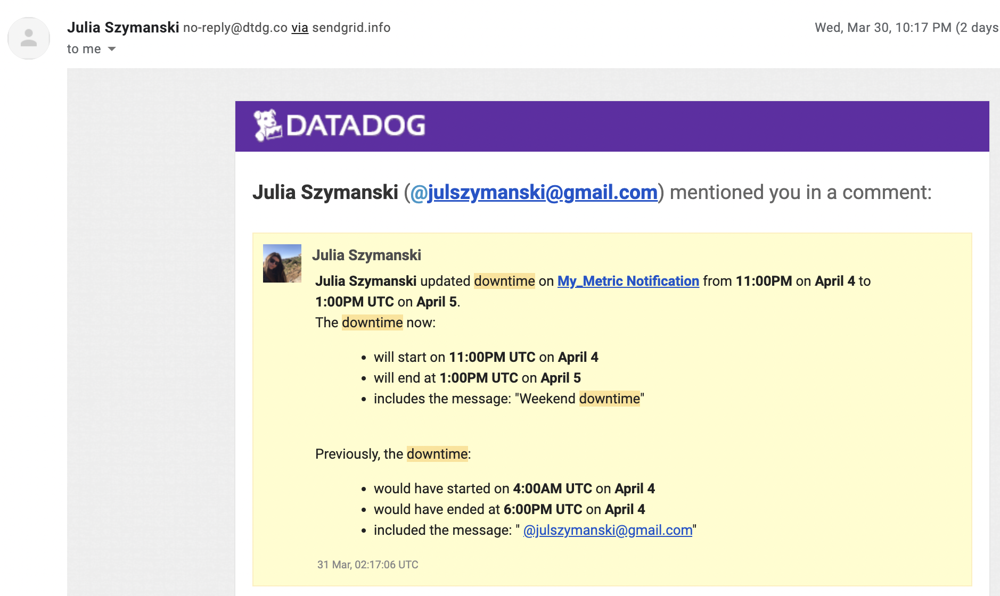
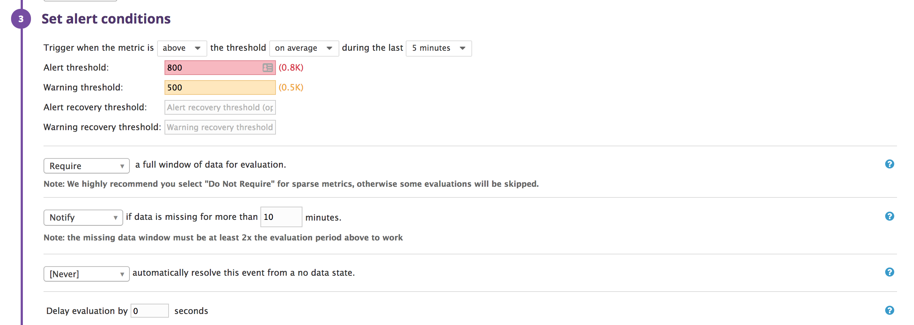
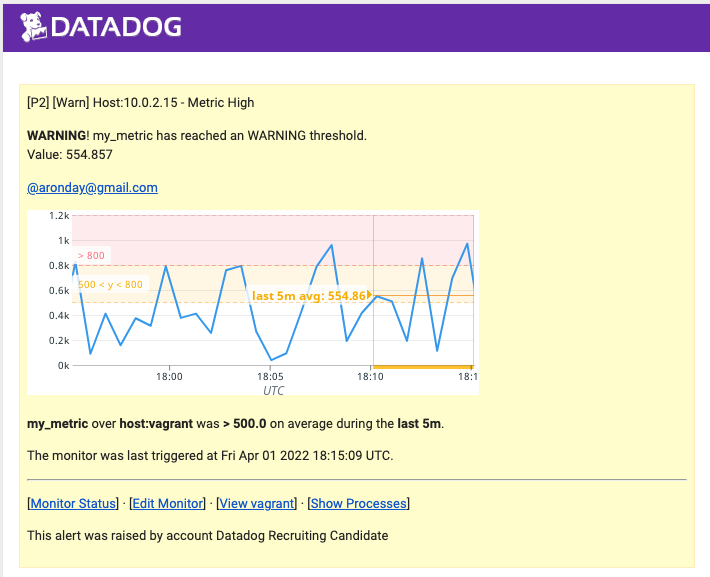
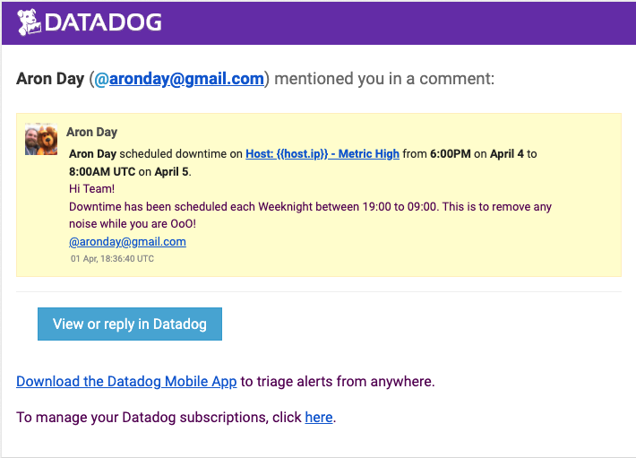

# Datadog Solutions Engineer Exercises - Matthew Tessler

## Prequisites - Setup the Environment

### Vagrant VM Creation

I am completing this exercise on a Mac OS X operating system. To avoid dependency issues, as the instructions recommended, I decided to spin up a fresh linux VM via Vagrant. I followed their [instructions](https://www.vagrantup.com/intro/getting-started/). I ran the command `vagrant init hashicorp/precise64` to create the virtual machine. 

Then I started up the virtual machine with the command `vagrant up` and ran the command `vagrant ssh` to interface with the virtual machine.

### Datadog Account Creation

I then signed up for a Datadog account.

After that I followed the instructions in the sign up process. When I got to the "Agent Setup" step I chose the "Installing on Ubuntu" option because I was using an Ubuntu VM with Vagrant. 

### Agent Installation

I followed the "Installing with Ubuntu" steps. I entered the one line of commands from the instructions. The installation sequence ran, and at its completion, the message from the datadog-agent informed me the Agent was running and functioning properly.

...

After that I was able to complete the setup process and was taken to the main dashboard. 

## Collecting Metrics

### Adding Tags

The instructions next said to "Add tags in the Agent config file and show us a screenshot of your host and its tags on the Host Map page in Datadog."

I had to do some research to find where the Agent config file was located. I found the answer at this [resource](https://help.datadoghq.com/hc/en-us/articles/203037169-Where-is-the-configuration-file-for-the-Agent-). After moving to the `etc/datadog-agent` directory, I located the `datadog.yaml` file. I opened the file to edit it. 

I added some tags according to these instructions on this [page](https://docs.datadoghq.com/getting_started/tagging/assigning_tags/#assigning-tags-using-the-configuration-files), and then I went back to look at the host map. **I'm still not sure how to get the tags to reflect immediatedly on the host map.** I was trying to restart the service, and I don't think that worked. I couldn't figure out how to do the command to run the service check on the agent so that didn't work. It just updated after a while. Regardless, now my Agent configration file and the host map both reflect the same tags. 

The tags are visible in the configuration file at the bottom of the terminal window:

And here are the tags in the host map:

### Installing Database

Next I needed to install a database on the machine and then install the respective Datadog integration for that database. I decided to go with MongoDB. First I updated my Ubuntu operating system from 12.04 to 14.04 in line with the instructions on MongoDB's [website](https://docs.mongodb.com/manual/tutorial/install-mongodb-on-ubuntu/) to install the Community Edition on Ubuntu.

After installing MongoDB, I began the install for the integration for Datadog. I followed these [instructions](https://docs.datadoghq.com/integrations/mongo/#setup). I set up the `conf.yaml` file, set up the user in the mongo shell, and installed the integration on Datadog. Here you can see some screenshots on Datadog that the MongoDB integration is up and running on the host. 

Running an info status check, `sudo datadog-agent status`, the checks appear for MongoDB. Here is a screenshot:

### Creating a Custom Agent Check

The next instructions are to "create a custom Agent check that submits a metric named my_metric with a random value between 0 and 1000." I read these [directions](https://docs.datadoghq.com/developers/agent_checks/#agentcheck-interface) to learn how custom agent checks work and how to submit a metric.

Following those instructions, I created a `custom_check.yaml` file in the `conf.d` directory. I also created a `custom_check.py` file in the `checks.d` directory. Both these files are included in the repository.

The my_metric dashboard is now available on the host. It is shown here on the infrastructure list page under the host I've been running.

Next up was to change the collection interval so it only submits the metric once every 45 seconds. The **bonus question** asks if this can be done without modifying the Python check file that I created. I'm actually not sure of how to modify the interval by changing the Python file. Maybe it's something obvious like creating an if-statement that only lets it run once every three times, but the way I found how to do it when researching was not through that. According to the documentation for the custom agent check, the checks run every 15-20 seconds depending on how many integrations there are. The way to change how often the metric is submitted is to add the `min_collection_interval` property in the `yaml` file that corresponds with the custom agent check. The way that works -based on my understanding of the documentation- is that when the collection check comes around every 15-20 seconds, it'll see if 45 seconds have elapsed since it last submitted the metric. If 45 seconds have not elapsed, it won't submit the metric. If 45 seconds have elapsed, it will. In my experience, this means that it either submits the my_metric every 40 seconds, or every 60 seconds. Before I changed the collection interval, it was submitting every 20 seconds. When I changed it, it does 40 seconds or 60 seconds. I kind of get why it is doing that, but not completely. Regardless, I think that's the best way to do it.

Here is a screenshot of the my_metric dashboard. You can see that after I changed the collection interval at around 8:50 AM, the points space out. They are spaced by mostly 40 second, but some 60 second intervals.

## Visualizing Data

Next I was to use the Datadog API to create a Timeboard with three metrics on the same timeseries graph. Doing so required a bit of research. First I read the general graphing [documentation](https://docs.datadoghq.com/graphing/) for the UI. Once I was familiar, I read the [documentation](https://docs.datadoghq.com/graphing/miscellaneous/graphingjson/) about editing graphs with JSON. This is how I would be primarily editing the graph I was creating. Finally, I researched the [functions](https://docs.datadoghq.com/graphing/miscellaneous/functions/) I would be using the `anomalies()` and `.rollup()` function. I added the three metrics described in the bullet points (custom metric scoped over host, any method from Integration from database with anomaly function applied, and custom metric with rollup function). 

The script for this Timeboard is included in the repository as `timeboard.json`. Here is the completed Dashboard. I could not figure out how to set the timeframe for the Timeboard to just the last five minutes so I set it to the past hour. Here is a screenshot of the timeseries graph: 

I then took a snapshot of the graph and used the -at- notation to send it to myself. Here is the notification showing up in my events:

As for the **bonus question**, I don't think the anomaly part of the graph is displaying anything for me besides just the regular metric line because my MongoDB database doesn't have any anomalous changes to its metrics. It was completely consistent for the snapshot I took.

## Monitoring Data

### Setting Up Monitor

Next up is creating a Metric Monitor to watch the average of my custom metric and alert for certain events. I used the form to create the monitor. It notifies for a warning threshold of 500 (for a 5 minute average), notifies for an alerting threshold of 800 (for a 5 minute average), and notifies if there is No Data for the query over the past 10 minutes. This was easy enough to figure out how to do. 

I then set up the monitor's message to have special notes with each trigger. The three alerts will send the host name and host ip with their notes, and the Alert and Warning will include the metric number that triggered the monitor.

Here are screenshots of the setup:

Here is a screenshot of an email it sent me:

### **Bonus** Setting Up Downtime

For the **bonus question** I set up the scheduled downtime for Monday-Friday 7:00 PM - 9:00 AM and Saturday-Sunday all day.

Here is the M-F downtime setup and the corresponding email notification:

Here is the S-S downtime setup and the corresponding email notification:

## Collecting APM Data

## Final Question

