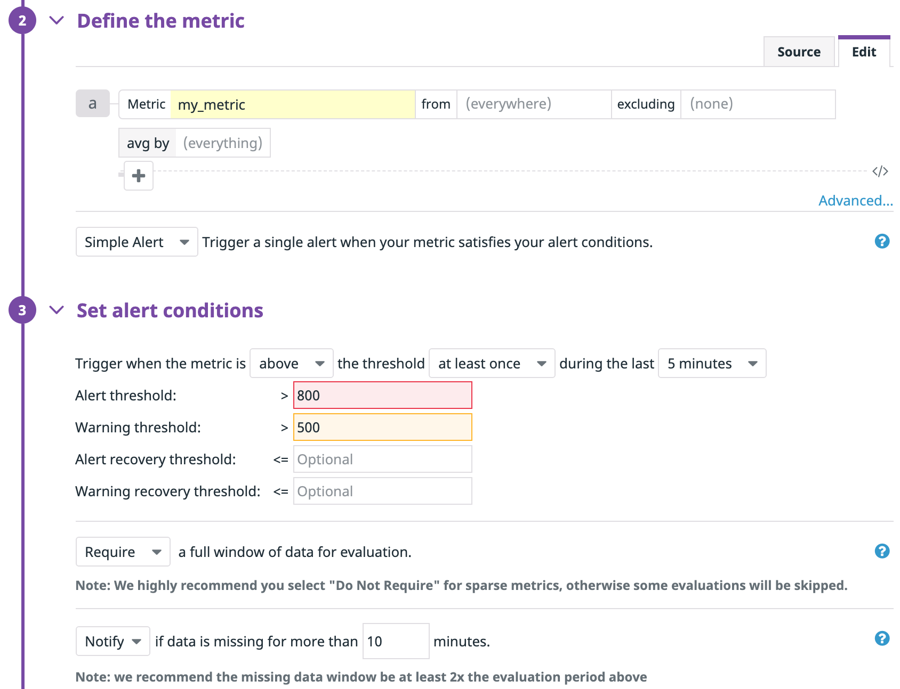

### Level 1 - Collecting your Data

* Sign up for Datadog (use "Datadog Recruiting Candidate" in the "Company" field), get the Agent reporting metrics from your local machine.

  - **Please see datadog_agent_status.txt**


* Bonus question: In your own words, what is the Agent?

  - **The Agent is an automated tool which gathers events, metrics, and data from client integrations and reports them back to Datadog. The Agent comes with many different checks across integrations, and can be configured to report custom checks depending on the client's requirements.**


* Add tags in the Agent config file and show us a screenshot of your host and its tags on the Host Map page in Datadog.

  


* Install a database on your machine (MongoDB, MySQL, or PostgreSQL) and then install the respective Datadog integration for that database.

  - **PostgreSQL installed and integrated successfully.**


* Write a custom Agent check that samples a random value. Call this new metric: `test.support.random`

  - **/etc/dd-agent/checks.d/random_sample.py**
    ```
    from checks import AgentCheck
    import random
    class RandomCheck(AgentCheck):
      def check(self, instance):
      self.gauge('test.support.random', random.random())
    ```

  - **/etc/dd-agent/conf.d/random_sample.yaml**
    ```
    init_config:

    instances:
      [{}]
    ```


### Level 2 - Visualizing your Data

* Since your database integration is reporting now, clone your database intergration dashboard and add additional database metrics to it as well as your `test.support.random` metric from the custom Agent check.

  - **See [https://app.datadoghq.com/dash/152338/testsupportrandom-monitor-screenboard](https://app.datadoghq.com/dash/152338/testsupportrandom-monitor-screenboard)**


  

* Bonus question: What is the difference between a timeboard and a screenboard?

  - **A timeboard is a way to view multiple metrics presented side by side at the same scale to make comparisons and correlations between events. It offers features such as multimousing, annotations, and snapshots for sharing and documentation amongst team members.**

  - **A screenboard is a more freeform and customizable overview of a client's infrastructure with a CMS style interface, and offers more metrics and display styles to complement the timeboard. It's possible to add notes and images alongside metric visualizations, and users can create custom layouts depending on the narrative and requirements of that particular screenboard.**


* Take a snapshot of your `test.support.random` graph and draw a box around a section that shows it going above 0.90. Make sure this snapshot is sent to your email by using the @notification

  - 


### Level 3 - Alerting on your Data

Since you've already caught your test metric going above 0.90 once, you don't want to have to continually watch this dashboard to be alerted when it goes above 0.90 again.  So let's make life easier by creating a monitor.  
* Set up a monitor on this metric that alerts you when it goes above 0.90 at least once during the last 5 minutes

  - **Screenshot of monitor config**


  

* Bonus points:  Make it a multi-alert by host so that you won't have to recreate it if your infrastructure scales up.  

  - **See monitor_config screenshot above**


* Give it a descriptive monitor name and message (it might be worth it to include the link to your previously created dashboard in the message).  Make sure that the monitor will notify you via email.

  - **See monitor_notification screenshot below**


* This monitor should alert you within 15 minutes. So when it does, take a screenshot of the email that it sends you.


  - **Note tags in email subject line:**


* Bonus: Since this monitor is going to alert pretty often, you don't want to be alerted when you are out of the office. Set up a scheduled downtime for this monitor that silences it from 7pm to 9am daily. Make sure that your email is notified when you schedule the downtime and take a screenshot of that notification.


