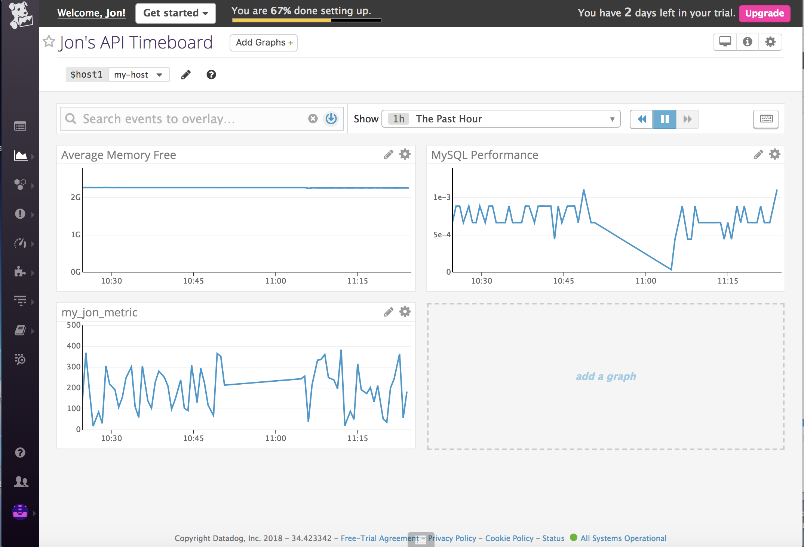
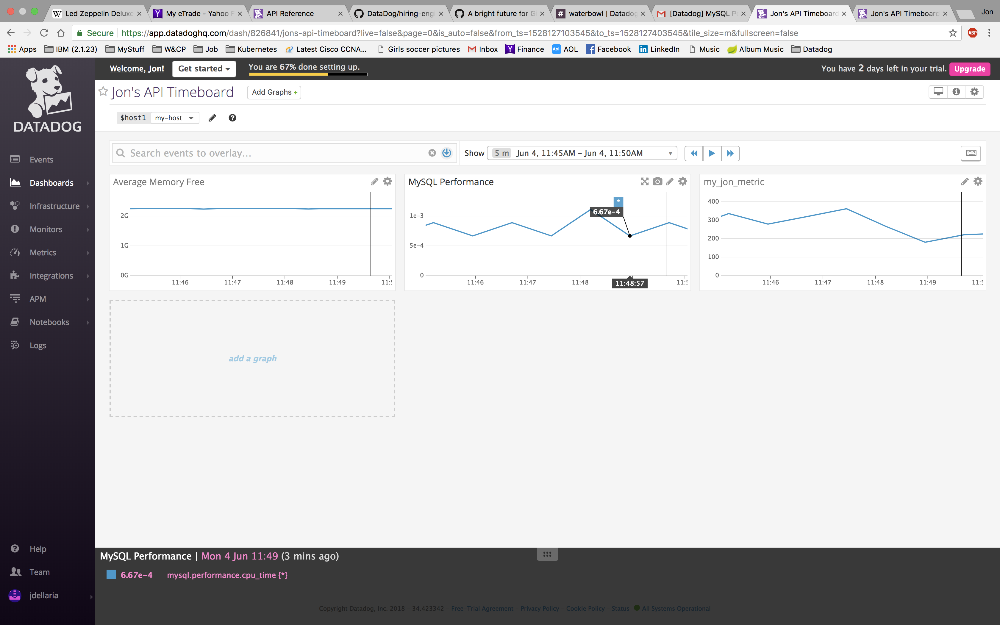
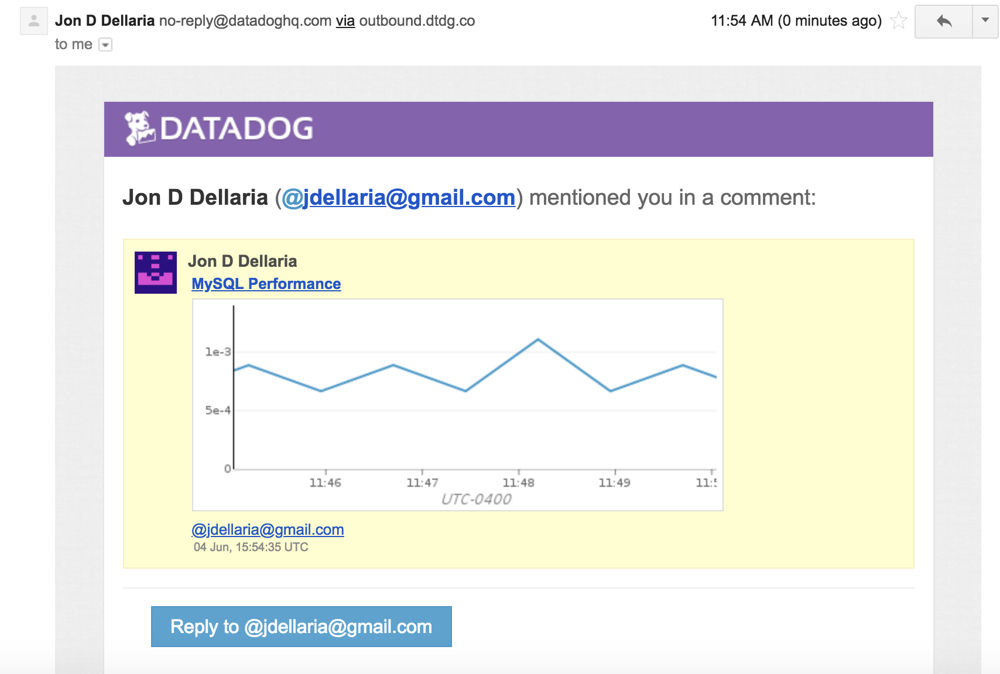
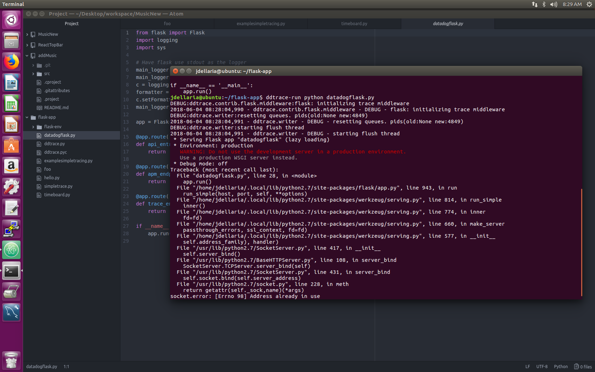
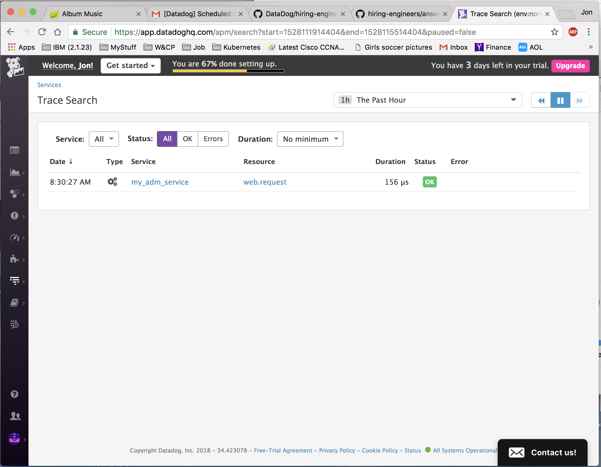

<h1>Prerequisites:  Setup the environment</h1>

I set up the originally set up a vagrant environment blindly using the defaults given in the link. These defaults provide Ubuntu 12.04. I didn't really run into any issues until I tried to configure the Collecting APM Data Section. This is when I started running into problems. I tried creating another image of 12.04 thinking that I poked around too much on the first image and may have caused a configuration issue. But I ran into the same issue of not being able to download the prerequisites to configure the software.

I then stopped using vagrant all together and used my Ubuntu 16.04 image that already had MySQL installed and installed the Datadog agent on that. Installation of the agent was super easy. I was able to download the prerequisites for Collecting APM Data Section. However, I was not able to get the given Flask application to execute properly. I was however able to run some test trigger successfully.

Collecting Metrics:

Add tags in the Agent config file and show us a screenshot of your host and its tags on the Host Map page in Datadog.
I added a tag in the /etc/datadog-agent/datadog.yaml file.
            tags: my_datadog_yaml_tag:jon

</img>

In order for these tags to be active, the process_config: element must be enabled by also placing the following statement in the  /etc/datadog-agent/datadog.yaml file.

            process_config:
             enabled: true

Install a database on your machine (MongoDB, MySQL, or PostgreSQL) and then install the respective Datadog integration for that database.

I installed MySql database and the agent onto the image. Configuration of the agent was very simple using the following commands:

            sudo mysql -u root -e "CREATE USER 'datadog'@'localhost' IDENTIFIED BY 'p_KOOye63XjZjSBRMwr2s2c8';"
            sudo mysql  -e "GRANT REPLICATION CLIENT ON *.* TO 'datadog'@'localhost' WITH MAX_USER_CONNECTIONS 5;"
            sudo mysql -e "GRANT PROCESS ON *.* TO 'datadog'@'localhost';"
            sudo mysql -e "GRANT SELECT ON performance_schema.* TO 'datadog'@'localhost';"

Running the following commands validated the the configuration was successful. AS you can see from the screen shot, both commands display "MySQL user - OK"

            mysql -u datadog --password='p_KOOye63XjZjSBRMwr2s2c8' -e "show status" | \
            grep Uptime && echo -e "\033[0;32mMySQL user - OK\033[0m" || \
            echo -e "\033[0;31mCannot connect to MySQL\033[0m"

            mysql -u datadog --password='p_KOOye63XjZjSBRMwr2s2c8' -e "show slave status" && \
            echo -e "\033[0;32mMySQL grant - OK\033[0m" || \
            echo -e "\033[0;31mMissing REPLICATION CLIENT grant\033[0m"

</img>

-------

Create a custom Agent check that submits a metric named my_metric with a random value between 0 and 1000.
Change your check's collection interval so that it only submits the metric once every 45 seconds.
Bonus Question Can you change the collection interval without modifying the Python check file you created?

As you can see from the two screenshots, the original configuration gave an interval of approximately 20 seconds. Where the 2 time stamps in each of the images show the consecutive time intervals as being approximately 45 (40) seconds.

</img>

By simply changing the configuration file to the following, I was able to change the collection interval to 45 seconds.

</img>

My intial configuation file for the agent was the following

conf.d/my_metric.yaml:
---------------------

        init_config:

        instances:

---------------------

checks.d/my_metric.py:
---------------------
        import random
        from checks import AgentCheck
        class MyMetric(AgentCheck):
            def check(self, instance):
                self.gauge('my_jon_metric', random.randint(0,1001))

conf.d/my_metric.yaml:  Version 2 - 45 second intervals
---------------------
        init_config:

          instances:
                - server: localhost
                  min_collection_interval: 45
---------------------

Changing the collection interval is also possible by using the python API, however, I think a best practice would be to change configuration files instead of python code. By taking this approach, I also completed the "Bonus Question"

Visualizing Data:
Utilize the Datadog API to create a Timeboard that contains:

Your custom metric scoped over your host.
Any metric from the Integration on your Database with the anomaly function applied.
Your custom metric with the rollup function applied to sum up all the points for the past hour into one bucket

Below is the screenshot of a TimeBoard that I created using the Datadog API.

</img>

Below is the screenshot of a code to create TimeBoard that I created using the Datadog API.
---------------------
from datadog import initialize, api

options = {'api_key': 'af2b8082fb980350e86df4a19a4fd9ed',
           'app_key': 'ac34eb26abfd2e78f995703427b71225ec0e21f9'}

initialize(**options)

title = "Jon's API Timeboard"
description = "An informative timeboard."
graphs = [{
    "definition": {
        "events": [],
        "requests": [
            {"q": "avg:system.mem.free{*}"}
        ],
        "viz": "timeseries"
    },
    "title": "Average Memory Free"
},
{
    "definition": {
    	"query": "avg(last_1h):anomalies(avg:avg:mysql.performance.cpu_time{*} by {host}, 'basic', 2, direction='both', alert_window='last_5m', interval=20, count_default_zero='true') >= 0.1",
    	"message": "An Anomaly has been detected on {{host.name}} @jdellaria@gmail.com",
        "events": [],
        "requests": [
            {"q": "mysql.performance.cpu_time{*}"}
        ],
        "viz": "timeseries"
    },
    "title": "MySQL Performance"
},
{
    "definition": {
        "events": [],
        "requests": [
            {"q": "my_jon_metric{*}"}
        ],
        "viz": "timeseries"
    },
    "title": "my_jon_metric"
}]

template_variables = [{
    "name": "host1",
    "prefix": "host",
    "default": "host:my-host"
}]

read_only = True
api.Timeboard.create(title=title,
                     description=description,
                     graphs=graphs,
                     template_variables=template_variables,
                     read_only=read_only)

---------------------

Here are the screenshot to the Timeboard set to 5 minutes and the associate email. Setting the 5 minute timframe was not avaialble in the drop down list but by simply clicking and dragging on any of the charts, you can set any length.

</img>

</img>

<b>Monitoring Data</b>

I created a Metric Monitor that watches the average of my custom metric (my_jon_metric) and will alert if it’s above the following values over the past 5 minutes: (code from above is included here for convenient reference)
---------------------
          import random
          from checks import AgentCheck
          class HelloCheck(AgentCheck):
              def check(self, instance):
                  self.gauge('my_jon_metric', random.randint(0,1001))
---------------------
Here are the emails that were generated for Alert, Warning and No Data.

</img>

</img>

</img>

Bonus Question: Since this monitor is going to alert pretty often, you don’t want to be alerted when you are out of the office. Set up two scheduled downtimes for this monitor:
One that silences it from 7pm to 9am daily on M-F,
And one that silences it all day on Sat-Sun.

Here are the screenshots of the configuration in the Datadog Web Site.

</img>

</img>

Here are the screenshots of the emails I received confirming the schedule the downtime.

</img>

</img>

Collecting APM Data:
Given the following Flask app (or any Python/Ruby/Go app of your choice) instrument this using Datadog’s APM solution:

Here is the screenshot when I tried to run the given Flask App. As you can see, it did not execute properly because the socket was in use.

</img>

Here is the screenshot of the sample trace application that I was able to generate a trace to the ADM Service.

</img>

my code for the sample tracer

---------------------
            from ddtrace import tracer

            with tracer.trace("web.request", service="my_adm_service") as span:
              span.set_tag("my_adm_tracer_tag", "my_adm_tracer_value")
---------------------

Final Question:
Datadog has been used in a lot of creative ways in the past. We’ve written some blog posts about using Datadog to monitor the NYC Subway System, Pokemon Go, and even office restroom availability! Is there anything creative you would use Datadog for?

I see an enormous amount of uses for Datadog. Here are just a few.
1. Gather temperature, atmospheric pressure etc, for a distributed Weather station.
2. Security Home Monitor
3. Fire Sensors
4. Connected vehicle applications
5. Detect anomalies in road/railroad (potholes, crashes, downed signs, imperfections, etc) using drones.
