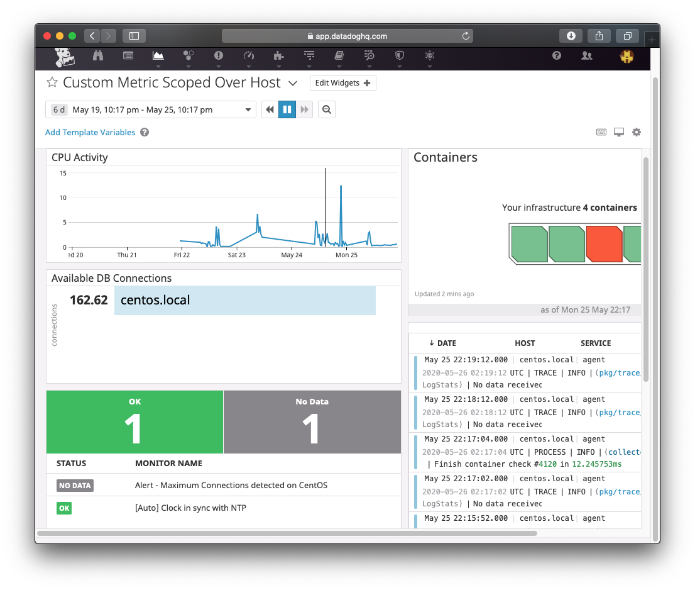
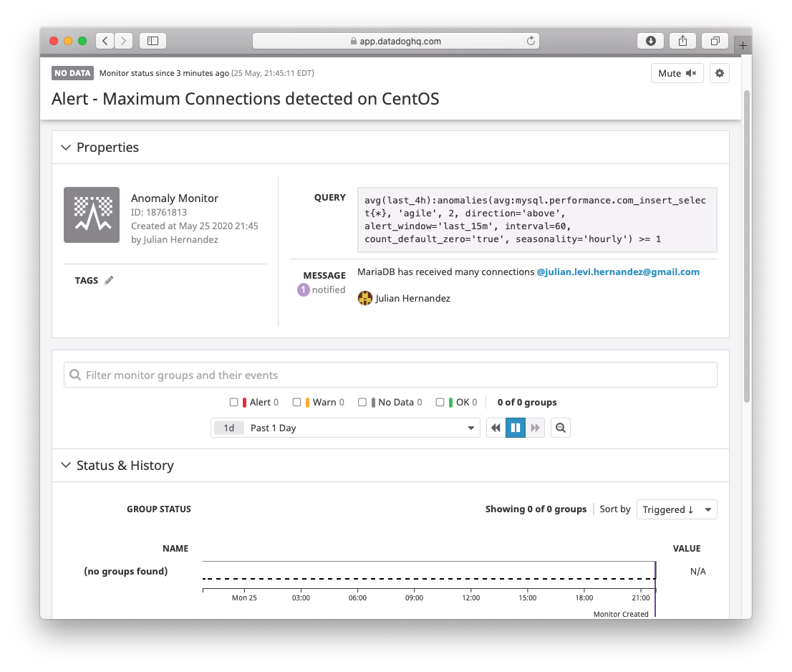
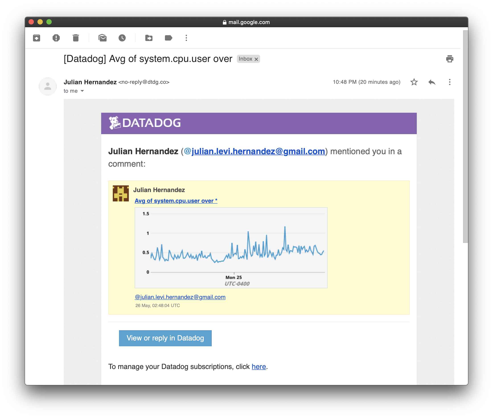

# DataDog Technical Exercise

#### By Julian Levi Hernandez

The current technical exercise walks throught the basic concepts of using DataDog, implementation and integration of agents, custom configurations, and custom monitoring of jobs. The integration of DataDog is easy to setup, however there might be small challenges with the the deployed apps and their environments. Installing DataDog is friendly enough for the DIYer or by outsourcing the work to experts for a faster deployment.  

From a developer perspective, it could be a bit difficult to grasp concepts for integration of containers, qualified domains, networking, and other areas meant for a systems architect. A basic knowledge on containers, ports, dns, authorization, os management, and development of code is useful to make for faster deployments.

## Technology Overview

For the current project, I have chosen over 20 tools for the following architectures to automate most of the deployment.


* Technologies
  * Ansible - Deployment automation from server host to Docker containers
      * Playbooks - Automate prerequisites and configurations to Vagrant VM and Docker containers 
  * Vagrant - Quick deployment of servers
  * CentoOS 7.7 - Operating system deployed by Vagrant
  * Bash - Handles environments and some installations
  * VirtualBox - Oracle's open source to run VMs
  * Docker - Vagrant VM 
      * MySQL - Docker container
      * WordPress - Docker container
      * WordPress CLI - Docker container
      * PHP MyAdmin - Docker container
      * DataDog - Monitor Docker containers
  * Docker Compose - Manage multiple Docker containers within one file manager
  * MariaDB - Running in Vagrant VM CentOS 7.7
  * DataDog Agent - Monitor databases, system, and extracts other metrics
  * DBeaver - Query databases running in Vagrant CentOS and inside Docker containers
  * KennelAPI - Custom wrapper created by Julian L Hernandez to call DataDog APIs
  * Python3 - Customize Flask profiler script for DataDog
  * DataDog - Cloud based application to vizualize and analyze data.


## Technical Challenge

* New account, API information, and getting started

After successful creation of an account, in DataDog, proceed to configure servers with the quick installer provided in `New Installation` item 1 `Use our easy one-step install`, for the operating system you wish to monitor.


My system architecture is composed of the following tools:

* Platform planning and deployment
  * Install and configure Vagrant
  * Ansible playbooks for deployment automation
  * Docker containers
      * Using docker-compose to simplify deployment
  * Configuration of DataDog agents
      * CentOS agent 
      * Docker agent
      * Embedded Docker agent


Every customer environment is completely different and their deployment could be on-premise, cloud, or hybrid mode. For my exercise, I proceeded to create an on-premise virtual environment that hosts applications and container applications.

## Collecting Metrics:

* Add tags in the Agent config file and show us a screenshot of your host and its tags on the Host Map page in Datadog.

> All Dashboards


* Install a database on your machine (MongoDB, MySQL, or PostgreSQL) and then install the respective Datadog integration for that database.
* Create a custom Agent check that submits a metric named my_metric with a random value between 0 and 1000. [Doc](https://docs.datadoghq.com/developers/write_agent_check/?tab=agentv6v7)

> Define the `/etc/datadog-agent/conf.d//my_metric.yaml` and set a 10 secon reporting interval

```yaml
init_config:

instances: 
  - min_collection_interval: 10
```

> Create the Hello World Python in `/etc/datadog-agent/checks.d` per doc: [Randomize Metric Submission](https://docs.datadoghq.com/developers/metrics/agent_metrics_submission/?tab=count)

```python
import random

from datadog_checks.base import AgentCheck

__version__ = "1.0.0"

class MyClass(AgentCheck):
    def check(self, instance):
        self.count(
            "my_metric.count",
            2,
            tags=["env:dev","metric_submission_type:count"],
        )
        self.count(
            "my_metric.decrement",
            -1,
            tags=["env:dev","metric_submission_type:count"],
        )
        self.count(
            "my_metric.increment",
            1,
            tags=["env:dev","metric_submission_type:count"],
        )
        self.rate(
            "my_metric.rate",
            1,
            tags=["env:dev","metric_submission_type:rate"],
        )
        self.gauge(
            "my_metric.gauge",
            random.randint(0, 1000),
            tags=["env:dev","metric_submission_type:gauge"],
        )
        self.monotonic_count(
            "my_metric.monotonic_count",
            2,
            tags=["env:dev","metric_submission_type:monotonic_count"],
        )

        # Calling the functions below twice simulates
        # several metrics submissions during one Agent run.
        self.histogram(
            "my_metric.histogram",
            random.randint(0, 1000),
            tags=["env:dev","metric_submission_type:histogram"],
        )
        self.histogram(
            "my_metric.histogram",
            random.randint(0, 1000),
            tags=["env:dev","metric_submission_type:histogram"],
        )
```

> Deploy files to the agent directory

```bash
[vagrant@centos DataDog]$ sudo cp my_metric.py /etc/datadog-agent/checks.d/
[vagrant@centos DataDog]$ sudo chmod 644 /etc/datadog-agent/checks.d/my_metric.py 
[vagrant@centos DataDog]$ sudo chown dd-agent:dd-agent /etc/datadog-agent/checks.d/my_metric.py     
[vagrant@centos DataDog]$ sudo cp ../../config/DataDog/agent-templates/my_metric.yaml /etc/datadog-agent/conf.d/my_metric.d/my_metric.yaml
[vagrant@centos DataDog]$ sudo chmod 644 /etc/datadog-agent/conf.d/my_metric.d/my_metric.yaml
[vagrant@centos DataDog]$ sudo chown dd-agent:dd-agent /etc/datadog-agent/conf.d/my_metric.d/my_metric.yaml
```


> Restart agent

```bash
[vagrant@centos DataDog]$ sudo systemctl restart datadog-agent.service
[vagrant@centos DataDog]$ sudo systemctl status datadog-agent.service
● datadog-agent.service - Datadog Agent
   Loaded: loaded (/usr/lib/systemd/system/datadog-agent.service; enabled; vendor preset: disabled)
   Active: active (running) since Mon 2020-05-25 20:44:51 UTC; 5s ago
 Main PID: 3888 (agent)
    Tasks: 9
   Memory: 41.0M
   CGroup: /system.slice/datadog-agent.service
           └─3888 /opt/datadog-agent/bin/agent/agent run -p /opt/datadog-agent/run/agent.pid
```

> Before deploying `my_metric`


> Deployment of `my_metric` in the server


> In DataDog search for the new `my_metric` in Metric Summary Page


* Change your check's collection interval so that it only submits the metric once every 45 seconds.

> Change interval to 45 seconds in the `/etc/datadog-agent/conf.d/my_metric.d/my_metric.yaml`

```yaml
init_config:

instances: 
  - min_collection_interval: 45
```


* **Bonus Question** Can you change the collection interval without modifying the Python check file you created?

Answer: The Python file does not have an interval hard coded for submission. It is the job of the `min_collection_interval` within the task name YAML hosted in the conf.d directory. Changing the collection interval can be performed by changing the integer value of `min_collection_interval`.

## Visualizing Data:

Utilize the Datadog API to create a Timeboard that contains:

* **NOTE:** In this step, I am using [KennelAPI](https://github.com/levihernandez/KennelAPI), a DataDog wrapper I created.

```bash
$ python3 KennelApi -c create_dashboard
Processing API endpoint transaction:  create_dashboard
JLHernandez - Custom Dashboard [{'definition': {'type': 'timeseries', 'requests': [{'q': 'avg:system.mem.free{*}'}], 'title': "'Average Memory Free'"}}] ordered Check the average free memory in the system. True ["'jlhernandez@demo.com'"] [{'name': 'centos', 'prefix': 'Centos', 'default': 'centos'}] [{'name': 'View for CentOS', 'template_variables': [{'name': 'hostname', 'value': 'centos.local'}]}]
$ 
```

* Your custom metric scoped over your host.

* Any metric from the Integration on your Database with the anomaly function applied.


* Your custom metric with the rollup function applied to sum up all the points for the past hour into one bucket


Please be sure, when submitting your hiring challenge, to include the script that you've used to create this Timeboard.

```python
from datadog import initialize, api

options = {
    'api_key': '<DATADOG_API_KEY>',
    'app_key': '<DATADOG_APPLICATION_KEY>'
}

initialize(**options)

title = 'JLHernandez - Custom Dashboard'
widgets = [{
    'definition': {
        'type': 'timeseries',
        'requests': [
            {'q': 'avg:system.mem.free{*}'}
        ],
        'title': 'Average Memory Free'
    }
}]
layout_type = 'ordered'
description = 'Check the average free memory in the system.'
is_read_only = True
notify_list = ['user@domain.com']
template_variables = [{
    'name': 'centos',
    'prefix': 'Centos',
    'default': 'centos'
}]

saved_view = [{
    'name': 'View for CentOS',
    'template_variables': [{'name': 'hostname', 'value': 'centos.local'}]}
]

api.Dashboard.create(title=title,
                     widgets=widgets,
                     layout_type=layout_type,
                     description=description,
                     is_read_only=is_read_only,
                     notify_list=notify_list,
                     template_variables=template_variables,
                     template_variable_presets=saved_view)
```

> Execute API `create dashboard`

`python3 create_dashboard.py`

Once this is created, access the Dashboard from your Dashboard List in the UI:

* Set the Timeboard's timeframe to the past 5 minutes


* Take a snapshot of this graph and use the @ notation to send it to yourself.


* **Bonus Question**: What is the Anomaly graph displaying?

Answer: It is displaying an unusually high activity in the system (CPU) due to high DB select statements being executed.

## Monitoring Data

Since you’ve already caught your test metric going above 800 once, you don’t want to have to continually watch this dashboard to be alerted when it goes above 800 again. So let’s make life easier by creating a monitor.

Create a new Metric Monitor that watches the average of your custom metric (my_metric) and will alert if it’s above the following values over the past 5 minutes:

* Warning threshold of 500
* Alerting threshold of 800
* And also ensure that it will notify you if there is No Data for this query over the past 10m.

Please configure the monitor’s message so that it will:

* Send you an email whenever the monitor triggers.
* Create different messages based on whether the monitor is in an Alert, Warning, or No Data state.
* Include the metric value that caused the monitor to trigger and host ip when the Monitor triggers an Alert state.
* When this monitor sends you an email notification, take a screenshot of the email that it sends you.

```python
{{#is_alert}} The threshold surpassed {{value}}  for the {{host.name}} {{/is_alert}} 
{{#is_warning}} The threshold is about to reach {{value}}  for the {{host.name}} {{/is_warning}} 
{{#is_no_data}} The server stop receiving data, this might be due to sender being down{{/is_no_data}} 
@julian.levi.hernandez@gmail.com
```

> Completed Metric Alert


> Email received from Metric's alert




* **Bonus Question**: Since this monitor is going to alert pretty often, you don’t want to be alerted when you are out of the office. Set up two scheduled downtimes for this monitor:

  * One that silences it from 7pm to 9am daily on M-F,
  

  * And one that silences it all day on Sat-Sun.
  
  
  * Make sure that your email is notified when you schedule the downtime and take a screenshot of that notification.
  
  
  
  
  
## Collecting APM Data:


* **Note**: Using both ddtrace-run and manually inserting the Middleware has been known to cause issues. Please only use one or the other.

* **Bonus Question**: What is the difference between a Service and a Resource?

Provide a link and a screenshot of a Dashboard with both APM and Infrastructure Metrics.

* [MyLoop APM](https://app.datadoghq.com/apm/service/unnamed-python-service/main.result?env=none&paused=false&start=1590498488051&end=1590502088051)

* [Infrastructure Metrics](https://app.datadoghq.com/dash/host/2503167754?from_ts=1590498675294&to_ts=1590502275294&live=true)


Please include your fully instrumented app in your submission, as well.

* Instrumented [myloop](docs/myloop.py) custom script with APM tracing


## Final Question:

Datadog has been used in a lot of creative ways in the past. We’ve written some blog posts about using Datadog to monitor the NYC Subway System, Pokemon Go, and even office restroom availability!

Is there anything creative you would use Datadog for?

Answer: DataDog has is a robust product to hold future data from many sources. With my background in Hadoop architecture, can immediately see the need to integrate DataDog to monitor cluster performance and possibly tracing individual applications like Spark and PySpark for data governance and lineage.
 
