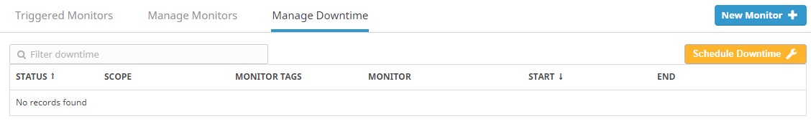
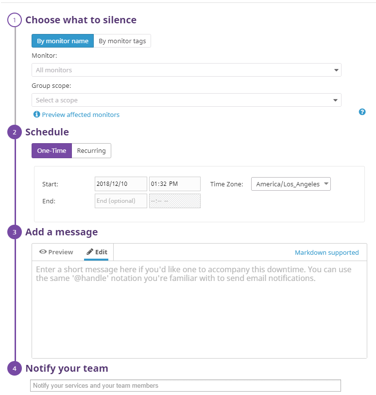

# Hiring Challenge for Data Dog:

## Setting the environment:

Before collecting the metrics, I needed to first set up the environment. To do this, I downloaded two tools, Vagrant and Virtual Box. I first installed Virtual Box as it needed to be opened before installing Vagrant. I went on the documentation on the Vagrant website that showcased the instructions of installing the application. As soon as I had followed  the instructions, I had Vagrant set up along with Precise64, which was a variation of Ubuntu.

## Collecting Metrics:

Once I had set up Ubuntu, I needed to register on the Data Dog website in order to download an agent, which should allow me to collect events and metrics from my Virtual Machine into Data Dog for monitoring and performance data.

In order to add tags, I needed to first follow the directions in setting up the agent by following the instructions labeled in the documentation. Once I've had that set up, and installed the agent on my virtual machine, I was able to get into the configuration files, which allowed me to edit the tags through the text editor vi.

### The location of the tags:


### The results:


Once I have verified that the tags were edited within the agent, I decided to work on setting up the MySQL integration with Datadog. To do this, I needed to first update Ubuntu to the latest version, then run an installer for MySQL server. As soon as MySQL was installed on my machine, I went to the list of integrators on Datadog, which allowed me to select a list of any sort of integrations I wanted to use within my agent. I selected MySQL, and followed the directions to allow me to create a connection between MySQL and my Datadog agent. To verify this, I went back to the Host Map, which shows my results:


I was also able to verify this by running the command line: sudo datadog-agent status, which returned this:


As soon as I was able to verify that mysql had been integrated within my agent, I finally started to work on collecting my metrics. 

To do this, I needed first understand the documentation for Metrics, which I was able to here: https://docs.datadoghq.com/developers/metrics/

And the documentation needed to write up an agent check:

https://docs.datadoghq.com/developers/write_agent_check/?tab=agentv6

Once I was able to understand the different types of metrics, I was able to begin the process. Since Python was utilized in a lot of the documentation, I decided to use the language in my approach.

Here is the script:

```
import random
from datadog_checks.checks import AgentCheck

class CustomCheck(AgentCheck):
    def check(self, instance):
        self.gauge('custom.mycheck', random.randint(0,1000))
```

Submitting a metric once every 45 seconds:

To do this, all you would need to do is changing the configuration file, so entering the conf, which I have named datadog.yaml. In the file, you would need to include the following under instances:

```
instances:
  - min_collection_interval: 45
```

Answer to bonus question: You wouldn't necessarily need to modify the python script that was created since all you would need to do is modify the configuration file.

## Visualizing Data:

To completely understand it from a UI perspective, I decided to go back to my agent on the Datadog website, which allowed me to create different timeboards with several different setups, ranging from System load to uptime. As soon as I was able to understand this better, I decided to look up the documentation, which in return allowed me to choose from three different languages of code. I chose Python, created a file called timeboard.py. Here is how the script currently looks like:

```
from datadog import initialize, api

options = {
    'api_key': 'e077d9fda7b7a9295973f330489e41b1',
    'app_key': '65141ce631b97da2c8a6615cf932a52f00ac04c5'
}

initialize(**options)

title = "Al's board"
description = "Timeboard for the hiring exercise"
graphs = [{
    "definition": {
        "events": [],
        "requests": [
            {"q": "avg:system.mem.free{*}"}
        ],
        "viz": "timeseries"
    },
    "title": "Average Memory Free"
}]

template_variables = [{
    "name": "host1",
    "prefix": "host",
    "default": "host:my-host"
}]

read_only = True
api.Timeboard.create(title=title,
                     description=description,
                     graphs=graphs,
                     template_variables=template_variables,
                     read_only=read_only)
```

In order to secure the API and APP keys, I had to go through settings on the Datadog UI which allowed me to not only see what my API key was, but also create an APP key. Once I was able to fill the script with the information necessary, I needed to work on running the script on my virtual machine. Once I had began running the script, I seem to have run into the following error:


I decided to check whether this was an issue with the script, or the virtual machine itself, but none of the solutions that I have found have worked properly so I felt it was best to tackle this issue from the perspective of the UI itself since I feel that is very important with not only from the perspective of the client, but to picture the inquiry properly.

On the UI, I decided to look at what I had done with past Timeboards to see the results of data during the test phases when setting up the environment. Once I was able to comprehend the features a bit better, I selected new Dashboards under the Dashboard header, which allows to select between the following two options:


I selected New Timeboard, which returned a new dashboard that allows me to add different graphs for metrics. I chose two different boards, one that measures my metrics, and the other that measures the System load.


In order to include a third graph, we must implement and define a timeboard which will allow us to use rollup. Normally, this would occur in the same timeboard, and look like the following:

```
from datadog import initialize, api

options = {
    'api_key': 'e077d9fda7b7a9295973f330489e41b1',
    'app_key': '65141ce631b97da2c8a6615cf932a52f00ac04c5'
}

initialize(**options)

title = "Al's board"
description = "Timeboard for the hiring exercise"
graphs = [{
    "definition": {
        "events": [],
        "requests": [
            {"q": "avg:custom.mycheck{*}"}
        ],
        "viz": "timeseries"
    },
    "title": "My_Metric"
}

 "definition": {
        "events": [],
        "requests": [
            {"q": "avg:system.load"}
        ],
        "viz": "timeseries"
    },
    "title": "My_Metric"

}

 "definition": {
        "events": [],
        "requests": [
            {"q": "avg:custom.mycheck{*}.rollup(sum,3600)"} #Based on Hours
        ],
        "viz": "timeseries"
    },
    "title": "My_Metric"
    
  }

]

template_variables = [{
    "name": "host1",
    "prefix": "host",
    "default": "host:my-host"
}]

read_only = True
api.Timeboard.create(title=title,
                     description=description,
                     graphs=graphs,
                     template_variables=template_variables,
                     read_only=read_only)
```

Since this happened to be the first time I used the rollup method, I had to look in the Datadog documentation to understand it as it is recommended only for experts. Datadog rollsup all the data points automatically based on two parameters that is being taken in within that function, the method and time. Since we are currently looking for the average, we want to be able to take in the sum of the function, and I chose 3600 as time is calculated in seconds. If the timeboard portion had worked properly, it should return graphs similar to the ones below:


What I'd like to do now is begin the process of settting the timeboard's time frame to the past 5 minutes. In order to begin this prcedure, I need to go back to my time series on the Datadog UI. From there, I would select one of the graphs, which will then open up a window of the same graph with more options. From there, you may select two different points, which will allow you to gather data between that time frame. Here is a snapshot of what it should look like:


To send a snapshot of a particular point on one of my graphs, I would need to select a point on the graph and annotate it.

it Here is a snapshot of the graph and the use of the @ notation to showcase that it was sent to myself:


Bonus: The anamoly graph displays the metric behavior that is different than normally, allowing you to see the different trends that occur based the day of the week and patterns during the time itself. These sort of graphs are very useful when strong trends and recurring patterns are difficult to monitor when using threshold-based altering. In lamens terms, an anomaly graph will assist you in decreasing the amount of possible errors that may occur based on an an anomaly.

## Metric Monitoring

To begin understanding the process, I continue to follow my method of reading through the documentation. After reading through it, I began by going into the Datadog UI, hovering over the monitors tab, I selected new Monitor, which will allow me to create any Monitor type. 


For this specific inquiry, I chose to do Metric Monitoring. Once this option has been selected, I followed a set of steps that assisted me with setting the monitoring process properly.


Because this inquiry specifies threshold, I chose threshold alert, and chose the specific metric that had been used for visualizing our data in the last exercise. Here is what the current setup looks like with our warning threshold being at 500, and the alerting threshold being at 800.


Once this is configured, I began tackling the next step, which allows me to create messages for my monitor. The exercise had asked for the following four configurations for this process:

```
-Send you an email whenever the monitor triggers.
-Create different messages based on whether the monitor is in an Alert, Warning, or No Data state.
-Include the metric value that caused the monitor to trigger and host ip when the Monitor triggers an Alert state.
-When this monitor sends you an email notification, take a screenshot of the email that it sends you.
```

Utilizing the variable templates given to me by Datadog, I was able to write up the following messages for my monitor:


To verify that email notifications were working properly, I have reeived the following on my email:


Bonus: Before beginning this bonus question, I started to notice how I had been receiving alerts pretty often, and realized that it may be an issue to receive alerts during times when they are unecessary. For this task, I will continue to use the Datadog UI to manage the following tasks:

```
-One that silences it from 7pm to 9am daily on M-F,
-And one that silences it all day on Sat-Sun.
-Make sure that your email is notified when you schedule the downtime and take a screenshot of that notification.
```

To begin configuring this with my current monitor, I want to first select it from the Monitor list. Once selected, I can begin choosing a tab above named Managed downtime, which will allow me to accomplish the tasks above. Here is what the interface currenly looks like after this step:



From here, I will need to select the option to Schedule Downtime for my monitor. This will return the following window:



After filling out all information needed, you will need to verify that everything is written properly:


At the moment, there seems to be an issue in which I am unable to select 12:00AM for the beginning time to allow silence all day on Saturday-Sunday, so to tackle this issue, I had done the following:


As you can see, I chose Friday and Saturday and didn't include Sunday as choosing 12:00AM as a beginning time wasn't possible. I decided on Friday and Saturday since the beginning time had been late at night, which would then end the following day.

What I found a little odd was if I chose a different timezone outside the United States, it will allow me to silence all 24 hours.


Nevertheless, I was able to tackle the task by choosing an alternative path way.


## Collecting APM Data:

In order to begin collecting APM data, I will first need to enable the configuration in the datadog.yaml, which should resemble this snapshot:


Once I have enabled it, I will need to verify that it was properly updated after restarting the agent. I have verified that there are no errors, which will mean that I may begin implementing the following app that had been given to me:

```
from flask import Flask
import logging
import sys

# Have flask use stdout as the logger
main_logger = logging.getLogger()
main_logger.setLevel(logging.DEBUG)
c = logging.StreamHandler(sys.stdout)
formatter = logging.Formatter('%(asctime)s - %(name)s - %(levelname)s - %(message)s')
c.setFormatter(formatter)
main_logger.addHandler(c)

app = Flask(__name__)

@app.route('/')
def api_entry():
    return 'Entrypoint to the Application'

@app.route('/api/apm')
def apm_endpoint():
    return 'Getting APM Started'

@app.route('/api/trace')
def trace_endpoint():
    return 'Posting Traces'

if __name__ == '__main__':
    app.run(host='0.0.0.0', port='5050')
```

I've created a file on my virtual machine, and have pasted the content in it. Once I had verified that everthing had been properly inserted with the correct syntax, I saved the file. Reading up on the documentation for python, I was able to run the app with the following command: ddtrace-run python apm.py which outputted:


At first, I wasn't too sure to what had been running, but then started to realize that the dashboard hasn't been created on my list of dashboards, and there happen to not be any services running. I started to then understand that there happened to be an error with this script which may have been caused by my virtual machine.

Bonus Question: Differences between a Service and Resource

-A service is defined as a sect of processes or actions that assist with the same job. An example used by Datadog is a web application that consists of two different services, one that happens to be a single web app service, and another that is a single database service.

-A resource is a particular query to a service. In lamens terms, a resource is used when a service happens to need some sort of action that needs to be trigged. One obvious example is if we utilize a single database service, the resource would likely be a query.

## Final Question:

Based on the importance of monitoring analytics in our world today, I certainly believe that measuring performance on different platforms is ideal for efficiency, so I would definitely use the Datadog API for that. There are many different examples for using the API for measuring certain aspects like trends online or traffic flow. Personally, I would love to learn more about the API itself and use it for ecommerce in order to track when traffic flow is the heaviest.


## References

### How to get started with Datadog

* [Datadog overview](https://docs.datadoghq.com/)
* [Guide to graphing in Datadog](https://docs.datadoghq.com/graphing/)
* [Guide to monitoring in Datadog](https://docs.datadoghq.com/monitors/)

### The Datadog Agent and Metrics

* [Guide to the Agent](https://docs.datadoghq.com/agent/)
* [Datadog Docker-image repo](https://hub.docker.com/r/datadog/docker-dd-agent/)
* [Writing an Agent check](https://docs.datadoghq.com/developers/write_agent_check/)
* [Datadog API](https://docs.datadoghq.com/api/)

### APM

* [Datadog Tracing Docs](https://docs.datadoghq.com/tracing)
* [Flask Introduction](http://flask.pocoo.org/docs/0.12/quickstart/)

### Vagrant

* [Setting Up Vagrant](https://www.vagrantup.com/intro/getting-started/)

### Other questions:

* [Datadog Help Center](https://help.datadoghq.com/hc/en-us)
* [Difference between Service and Resource](https://help.datadoghq.com/hc/en-us/articles/115000702546-What-is-the-Difference-Between-Type-Service-Resource-and-Name-)


