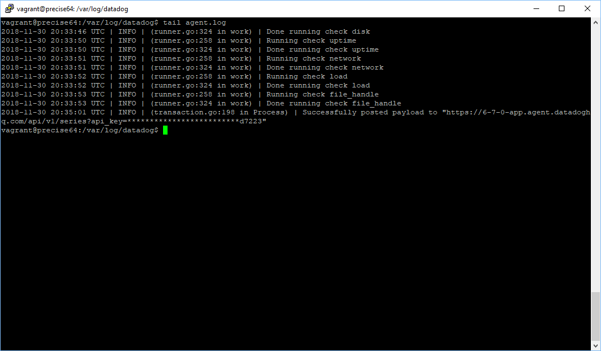
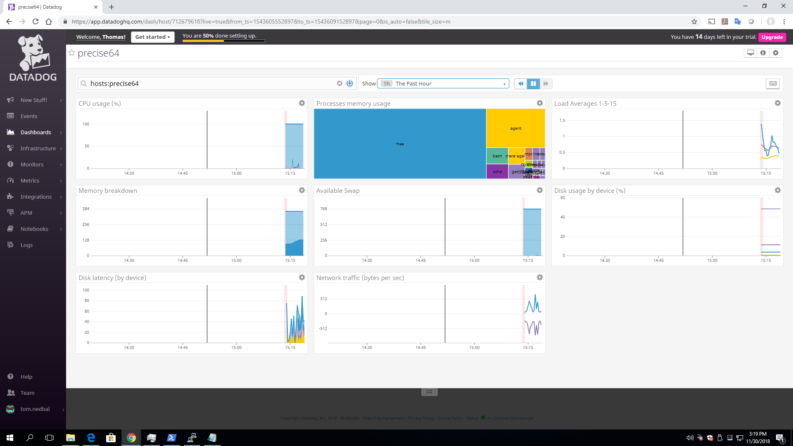
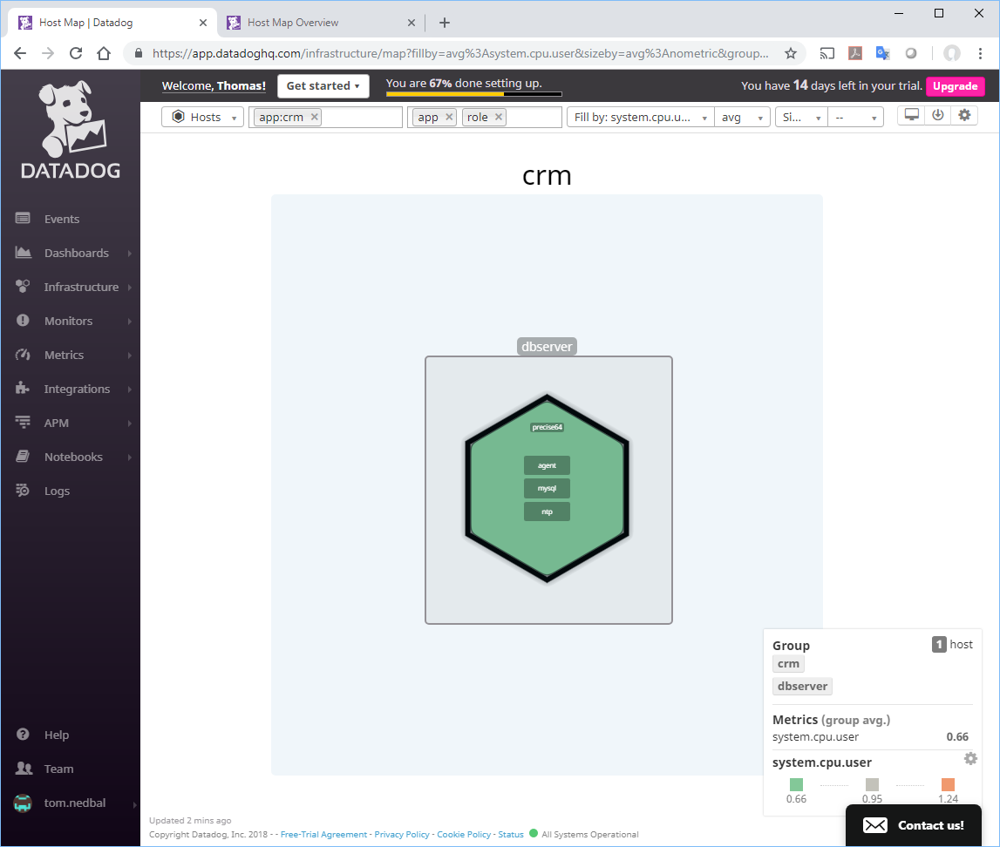
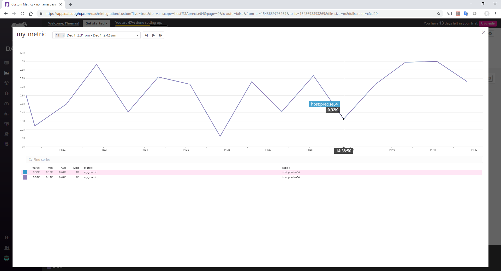
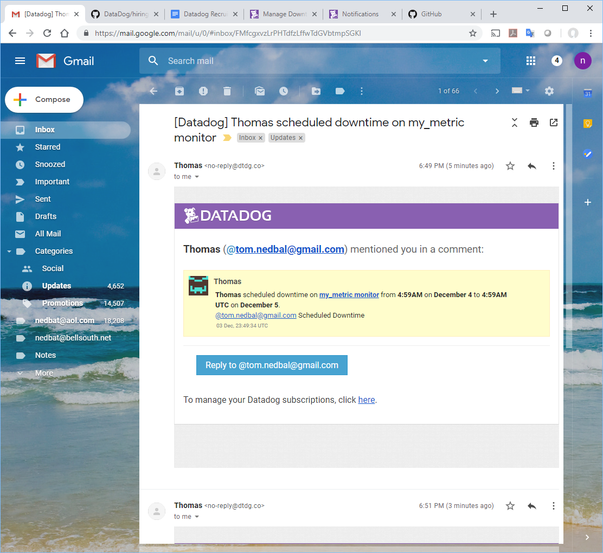
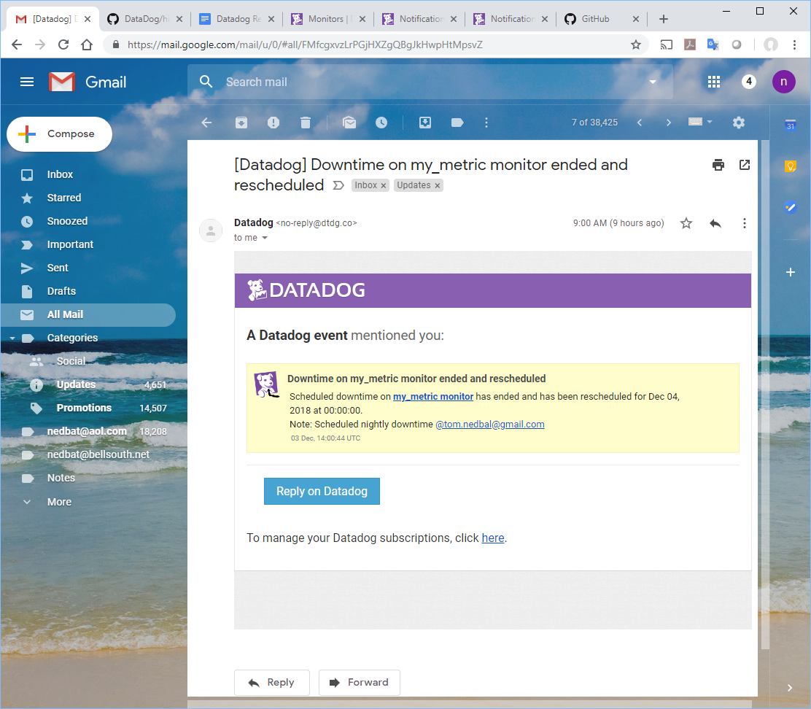
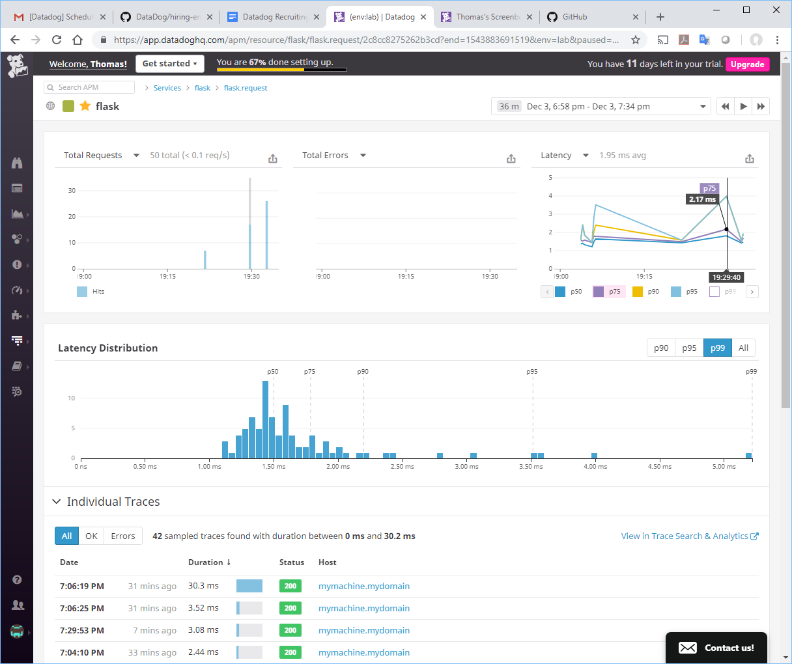
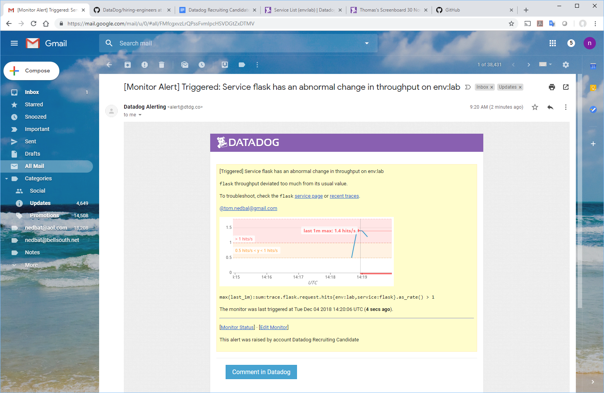
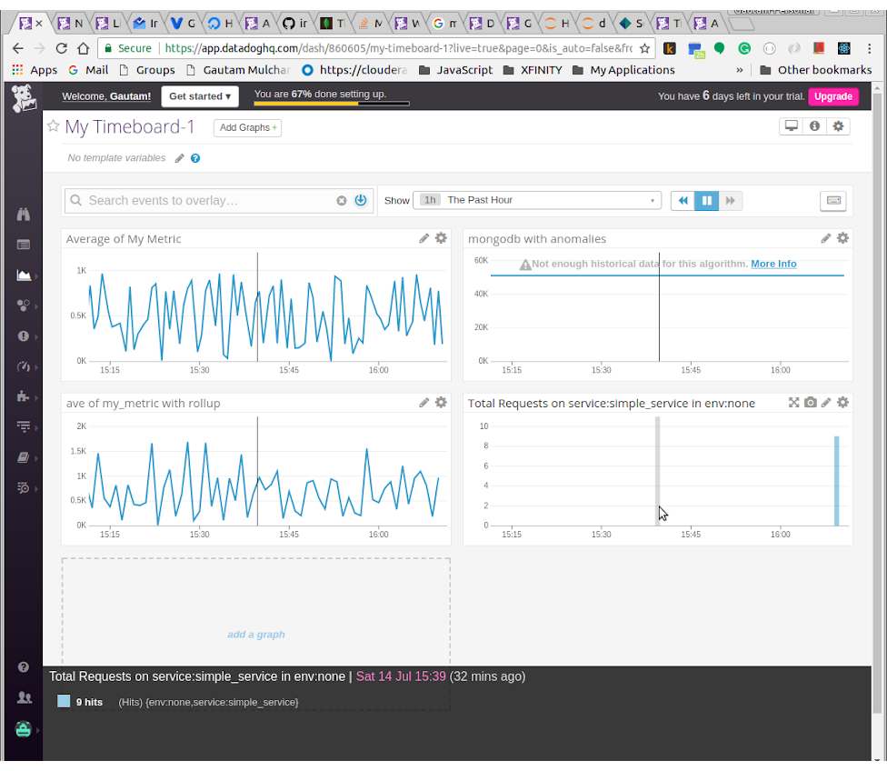

Prerequisites: Setup the environment

I have a ubuntu box and already had virtualbox installed. So decided to use vagrant to setup the environment. Instructions:

[https://www.vagrantup.com/downloads.html](https://www.vagrantup.com/downloads.html)

Screenshot:

Start vagrant:

Login to Vagrant, create account at datadog and Install Datadog agent. Datadog agent already has the right keys so that it can report to the correct account, the default hostname looks good. 

Screenshot of installing agent:

**Collecting metrics:**

* Add tags in the Agent config file and show us a screenshot of your host and its tags on the Host Map page in Datadog.

Assigning tags to components allows analytics on the reporting. One can slice and dice the reports, aggregate and group metrics based on tags (for example, dev/stage/prod envs). This is a concept from business analytics increasingly applied to operations and service management. Objective is to better understand metrics as a group of entities where the entities can be dynamically grouped using tags as a mechanism. Used mechanism of adding tags to the datadog.yaml file. Screenshot below:

[https://docs.datadoghq.com/getting_started/tagging/assigning_tags/](https://docs.datadoghq.com/getting_started/tagging/assigning_tags/)

And the tag shows up in datadog UI making it easier to search:

In this case there is only one host so benefits of tagging is only for searching. With larger amounts of data, tagging helps in reporting and analytics.

* Install a database on your machine (MongoDB, MySQL, or PostgreSQL) and then install the respective Datadog integration for that database.

Installed mongodb on the vagrant host.

Enabled access from datadog agent to query mongodb to collect metrics:

Change the config in the mongodb config file to monitor the local mongodb instance. Also enabled logs monitoring. 

Restarted agent after enabling mongodb monitoring. Hopefully should not need to restart agent after enabling/disabling any component. Agent should pick up the changes in config automatically. This needs to be done for every step. 

Mongodb metrics not showing up in datadog UI, looked at datadog agent log and saw an error:

Turned out a typo in the yaml file. In meantime also enabled the mongodb integration. 

It is unclear what integrations (in the UI) do. The documentation lists the over 200 integrations but does not explain what specifically is the purpose of integrations and how exactly the integration helps from a use case perspective. 

[https://docs.datadoghq.com/integrations/](https://docs.datadoghq.com/integrations/)

Here is mongodb dashboard:

Overall, very easy to setup monitoring for various infrastructure components with just a small config change in the agent and everything else in UI. 

* Create a custom Agent check that submits a metric named my_metric with a random value between 0 and 1000.

Same comment about Agent Checks as for the integrations, will be great to document the purpose and how it helps in monitoring.

[https://docs.datadoghq.com/developers/agent_checks/](https://docs.datadoghq.com/developers/agent_checks/)

**Visualizing Data:**

Datadog dashboarding capabilities look impressive. However creating them through APIs required some reading and understand of the various parameters. So it was very nice to create a dashboard in the UI and then plug in the JSON of each graph into the API call. Testing done in Jupyter notebook and screenshots below (Code also attached in different files):

Below, the My Timeboard-1 is created using datadog API and Gautam’s Timeboard was created directly in UI.

Last 5 minutes on graph:

Can send a graph in email by annotating it with @email address but not the entire timeboard.  The anomaly graph just shows not enough data - probably because it needs sufficient historical data points to compare to and make predictions on what is "normal". 

**Monitoring Data.**

The alert from the monitor that was setup is below. Setting up monitor and alert quite simple, even with different messages for warning, critical and no data. 

**Scheduling downtime:**

Important to provide a way to schedule downtime. Downtime can occur as a result of regular maintenance, for example during upgrade or changing hardware resources. If downtime is not scheduled, it can result in an alert storm where the alerts are meaningless. Also, does not help the operations team in reporting their SLAs. 

**Collecting APM Data**

Combining both APM and infrastructure monitoring into single dashboards is very powerful as one can quickly make time based correlations between the Business Services that are served by the Applications and the infrastructure components the applications rely upon. This helps in triaging and even diagnosing problems instead of multiple teams in development, operations, networks, databases pointing fingers at each other. Adding APM metrics to the existing dashboard was simple by just going to the APM screen and selecting Export to Timeboard and then selecting the Timeboard.

Also liked that there is no need for code changes. The datadog agent handles the instrumentation automatically. However, to add traces have to put the annotation in the source code. There might be another way to achieve the same through monkey patching. 

The modified source code for the Flask application is also uploaded. 

Link to Timeboard with both APM and Infra metrics. 

[https://app.datadoghq.com/dash/860605/my-timeboard-1?live=true&page=0&is_auto=false&from_ts=1531606346480&to_ts=1531609946480&tile_size=m](https://app.datadoghq.com/dash/860605/my-timeboard-1?live=true&page=0&is_auto=false&from_ts=1531606346480&to_ts=1531609946480&tile_size=m)

Screenshot:

Difference between Service and Resource:

[https://help.datadoghq.com/hc/en-us/articles/115000702546-What-is-the-Difference-Between-Type-Service-Resource-and-Name-](https://help.datadoghq.com/hc/en-us/articles/115000702546-What-is-the-Difference-Between-Type-Service-Resource-and-Name-)

At a high level, a Service is a logical entity that is implemented by an application. The service itself provides resources, each resource implemented by an API call.

**Is there anything creative you would use Datadog for?**

Looking at capabilities of datadog while performing the exercises, I would consider using it for predicting scenarios and taking action that are beneficial. 

1. For example, Mumbai city gets flooded during monsoon season as it happened in the last 1 week. Based on the amount of rainfall, water level of of certain streets, level of the sea tide, one can predict exactly which neighbourhood and streets will get flooded next and take preventive measures such as diverting traffic, pumping water out at certain intersections. This can bring relief to people who have to guess while navigating the heavy rainfall and still get to work. 

2. Measure the temperature, general weather patterns, vaccinations given to population and use that as a measure of how many patients will be admitted to hospitals. That will determine how many personnel are required - nurses, doctors as well as medications. Proactively have the resources ready or alerted so that the right amount of resources are available to people who need help. 

