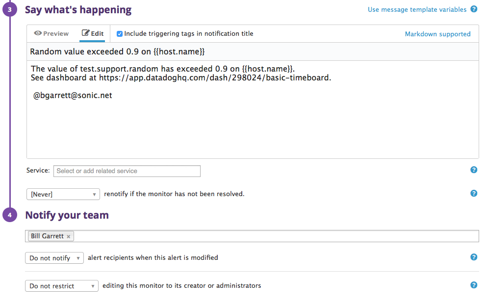
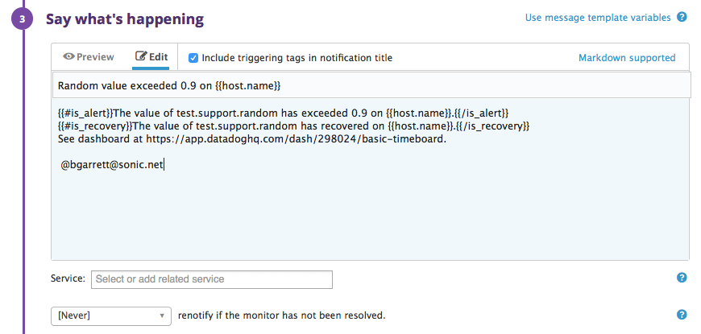

# Bill Garrett's Technical Exercise

These are answers from Bill Garrett (bgarrett@sonic.net) to the Solutions Engineer exercise, June 2017.

## Level 0 - Setting up an Ubuntu VM
I used the instructions provided to set up a fresh Ubuntu VM with Vagrant and connected to run a few quick smoke tests.
[Color commentary on VMs](#virtualization--automation-rock).

## Level 1 - Collecting Data

I installed an agent in my environment. Here's a screenshot from the Infrastructure dashboard:


There are two hosts here because I changed the hostname after seeing how it appears. Hashicorp's default of 'precise64' seemed dull, so I went with the more apropos dogpatch01. [Why dogpatch?](#the-dogpatch)

### What is an agent?

How I'd answer "What is an agent?" varies slightly depending on the audience.

**Executive explanation:** DataDog's agent is a light-weight service
that runs on each of your systems, collecting configurable metrics,
and sending them to DataDog's hosted service to display shareable,
customizable dashboards and reports.

**Techie addition:** The agent is a service, a set of daemon processes, that runs on each of your systems. For example, on a Linux system you'll see these processes:
```
root@dogpatch01:~# ps -ef | grep -i datadog
dd-agent   809     1  0 17:18 ?        00:00:00 /opt/datadog-agent/embedded/bin/python /opt/datadog-agent/bin/supervisord -c /etc/dd-agent/supervisor.conf --pidfile /opt/datadog-agent/run/datadog-supervisord.pid
dd-agent   813   809  0 17:18 ?        00:00:00 /opt/datadog-agent/bin/trace-agent
dd-agent   814   809  0 17:18 ?        00:00:01 /opt/datadog-agent/embedded/bin/python /opt/datadog-agent/agent/ddagent.py
dd-agent   815   809  0 17:18 ?        00:00:01 /opt/datadog-agent/embedded/bin/python /opt/datadog-agent/agent/dogstatsd.py --use-local-forwarder
dd-agent   818   809  0 17:18 ?        00:00:01 /opt/datadog-agent/embedded/bin/python /opt/datadog-agent/agent/agent.py foreground --use-local-forwarder
root      1683  1628  0 17:25 pts/0    00:00:00 grep --color=auto -i datadog
```
The agent is installed in `/opt/datadog-agent`.
The main configuration file is `/etc/dd-agent/datadog.conf`.

### Adding tags

I found the tag settings in `/etc/dd-agent/datadog.conf`. After a bit of experimentation and searching to learn how they work I settled on changing them to:
```
# Set the host's tags (optional)                                                                
tags: owner:bill, env:dev, role:database
```

Here's a screenshot of the host map showing these tags:


### Monitoring Postgres

I installed Postgres on my machine and added monitoring for it. See the following section for a simple dashboard I created.

### Custom Agent Check

I followed the instructions at http://docs.datadoghq.com/guides/agent_checks/ to create a custom agent check. Here's my (simple) code:

`/etc/dd-agent/conf.d/random.yaml`:
```
init_config:

instances:
    [{}]
```

`/etc/dd-agent/checks.d/random.py`:
```
import random
from checks import AgentCheck
class RandomCheck(AgentCheck):
    def check(self, instance):
        self.gauge('test.support.random', random.random())
```

Here's a screenshot of a simple timeboard I put together showing activity in my Postgres database and values from the random check:


## Level 2 - Visualizing Data

### Clone dashboard and add metrics

I cloned my original Basic TimeBoard and added a few extra metrics to it. The new version is called Slightly Less Basic Timeboard. :wink:


### TimeBoards vs. ScreenBoards

To answer the question about the difference between timeboards and screenboards I figured first I'd try creating a screenboard
to see how it work. Right away it leapt out at me that screenboards substantially more control over visual layout. Here's a basic
screenboard I created as I explored the functionality:


Screenboards seem to include all widgets available in timeboards plus several extra, including image and note.

Next I decided to search for a more authoritative description, such as a manual. The \#2 hit on my Google search was
the company's blog post from a few years ago introducing the feature:

https://www.datadoghq.com/blog/introducing-screenboards-your-data-your-way/

It confirmed that the purpose of screenboards is to provide customized layout control not offered in the dashboard feature. It
noted that customers were clamoring for more control, going so far as to use other dashboarding tools and populate them with
data from Datadog. Screenboards are certainly an improvement!

### Snapshot and @notification

First I tried a basic @notification on my random metric, as directed:


This didn't send me an email. As the docs note at https://help.datadoghq.com/hc/en-us/articles/203038119-What-do-notifications-do-in-Datadog-
you can't send an email to yourself. I added another comment using an a second email address...


...And this one worked (i.e., sent me an email):


## Level 3 - Alerting Data

I created a monitor for alerting per the instructions. Here's a screenshot of the first part of the setup...


And the second part of the setup:



As expected, I received an alert message not long thereafter. Here's a screenshot of the email:


To squelch messages after-hours I configured repeating downtime as per the instructions:


Since I was working on this exercise *during* the downtime hours the downtime wouldn't begin
until 5pm the following day. So I created another downtime plan triggering sooner. Here's
the email from that one:


I experimented a bit more with the monitors, including marking one as resolved.
Resolving it caused the system to send me an alert message implying the monitor had
been triggered! I quickly remembered the example conditional code I'd seen when
creating the monitor, checked the references on it, and updated the monitor body to
be:



Now when the monitor recovers, I get an email clarifying that it has recovered. 

# Color Commentary & Notes

### Virtualization & Automation *Rock*
It took me a little over an hour to set up a VM. More than half of that was
because I had to install Vagrant on my personal machine; I've only used it on
work machines before. Then, I had to download a system image over DSL. That
took about 20 minutes. Then another few minutes to initialize it. But that
was **awesome**.  Why?

Set your time machine to a time before widespread virtualization. It's not
even that long ago. I remember in 2005-2006 pitching in to help my company's
release manager image a bunch of systems for regression testing. My customers
were waiting on that release! Building out a few systems took me most of a
day, and even that was with tools like Ghost and install discs in hand.

Some of my customers had it worse. Those with big-name consulting firms doing
their IT were routinely quoted 3 days to configure a new system-- and that
was after the *months* it would take to get the hardware ordered, shipped,
and unboxed.

Now roll the clock in the time machine forward just a few years, to when
virtualization was first taking hold across companies for production
infrastructure. (I remember hearing about VMs as early as 1997 but it was
very research-y stuff back then.) The 3 days it used to take to build out a
server could be reduced to hours. 

And within the past few years, with automation tools layered atop virtualized
infrastructure, new environments can be tilted up in minutes. ...And that's just
the value from the perspective of time-to-readiness for a system. There's a
whole other dimenion of value in terms of number of environments supportable
per unit of electricity, cooling capacity, and floorspace. That's a story for
another day.

The future is awesome.

### The Dogpatch
The Dogpatch is a neighborhood in San Francisco. Long known as a tough part
of town, encompassing the docks area south of Giants Stadium, it's recently
become a hip hub for dozens of tech firms and gleaming residential towers.


