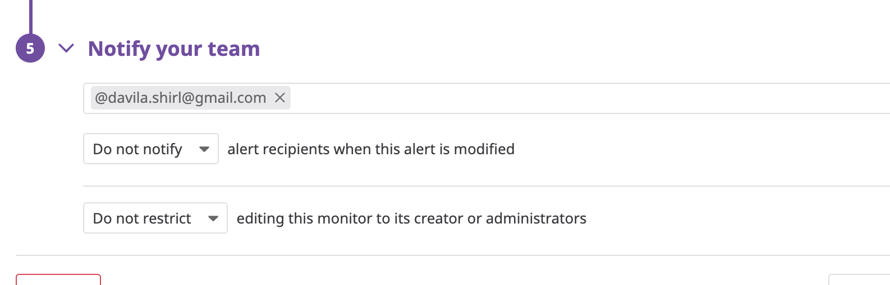
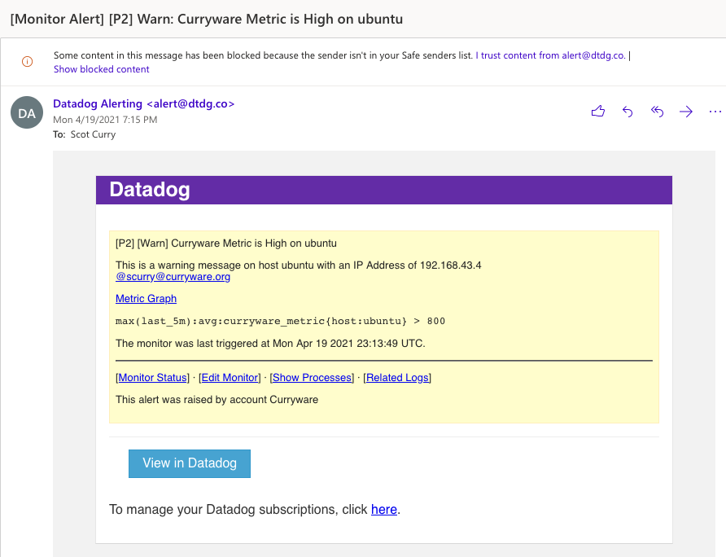

## Answers 


## 1. Prerequisites - Setup the environment

**Choose an environment!**
Decided to spin up a fresh linux VM via Vagrant.
Then signed up for  Datadog (used “Datadog Recruiting Candidate” in the “Company” field).

## 2. Collecting Metrics!

**Task: Add tags in the Agent config file and show us a screenshot of your host and its tags on the Host Map page in Datadog.**

###### What is an agent? ######
The agent is the software that reports back to the Data Dog tool. 

###### Where is it's config file? ######
The config file is the file datadog.yaml in the /etc/datadog-agent folder. 

###### Resources used: 
Two helpful guides https://docs.datadoghq.com/tagging/assigning_tags/?tab=agentv6v7#configuration-files & https://docs.datadoghq.com/tagging/ 

**Add tags to your agents config file aka datadog.yaml Search for "tags" and add them there.**
I added :
* staging 
* app:Postgres


**Next! Show a screenshot of your host and its tags on the Host Map page in Datadog to prove you did it!** 


**Task: Install a database on your machine (MongoDB, MySQL, or PostgreSQL) and then install the respective Datadog integration for that database.**
I installed MongoDB. 

###### Resources:
https://gist.github.com/shimar/13381bce5c5cbeb72d801d74099ba2ec 

After making sure MongoDB was running I proceeded to set up the integration for it following the instructions here: 
https://app.datadoghq.com/account/settings#integrations/mongodb

First step was creating the Data Dog user to the database!

On MongoDB 3.x or higher, use the createUser command.

```
 db.createUser({
   "user":"datadog",
  "pwd": "abc123",
  "roles" : [
    {role: 'read', db: 'admin' },
    {role: 'clusterMonitor', db: 'admin'},
    {role: 'read', db: 'local' }
  ]
 })
 ```


Second step was to create a new mongo.d/conf.yaml file in the conf.d folder and make the necessary changes to reflect my local servers information:


I then restarted the agent. 

**Task: Create a custom Agent check that submits a metric named my_metric with a random value between 0 and 1000.**
In order for you to create a custom Agent, you need to create two files. 

** Make sure the name of the files are the same in both directories. **

Create /etc/datadog-agent/conf.d/custom_mymetric.yaml containing the following: 
```
instances: [{}]
 ```
 and created custom_mymetric.py in /etc/datadog-agent/checks.d containing the following:
 
 ```
 ## the following try/except block will make the custom check compatible with any Agent version
try:
    # first, try to import the base class from new versions of the Agent...
    from datadog_checks.base import AgentCheck
except ImportError:
    # ...if the above failed, the check is running in Agent version < 6.6.0
    from checks import AgentCheck

# content of the special variable __version__ will be shown in the Agent status page
__version__ = "1.0.0"

import random 

class HelloCheck(AgentCheck):
    def check(self, instance):
        self.gauge('my_metric', random.randrange(0,1000), tags=['TAG_KEY:TAG_VALUE']) 
```
        
**Task: Change your check's collection interval so that it only submits the metric once every 45 seconds.**

```
init_config:
instances:
          - min_collection_interval: 45
```
###### Resource used: https://docs.datadoghq.com/developers/write_agent_check/?tab=agentv6v7
     
Bonus Question Can you change the collection interval without modifying the Python check file you created? Edit the yaml file.


## 3. Visualizing Data!
Utilize the Datadog API to create a Timeboard that contains:

Your custom metric scoped over your host.
Check CustomMetricAvgHost.py
```
from datadog import initialize, api

options = {
    'api_key': '**',
    'app_key': '**'
}

initialize(**options)

title = 'Avg Custom Metric'
widgets = [{
    'definition': {
        'type': 'timeseries',
        'requests': [
            {'q': 'avg:my_metric{host:shirleyswork}'}
        ],
        'title': 'Average of my custom metric'
    }
}]

layout_type = 'ordered'
description = 'A dashboard with memory info.'
is_read_only = True
notify_list = ['user@domain.com']
template_variables = [{
    'name': 'host1',
    'prefix': 'host',
    'default': 'my-host'
}]

saved_views = [{
    'name': 'Saved views for hostname 2',
    'template_variables': [{'name': 'host', 'value': '<HOSTNAME_2>'}]}
]

api.Dashboard.create(title=title,
                     widgets=widgets,
                     layout_type=layout_type,
                     description=description,
                     is_read_only=is_read_only,
                     notify_list=notify_list,
                     template_variables=template_variables,
                     template_variable_presets=saved_views)
```

Any metric from the Integration on your Database with the anomaly function applied.
Check AnyMetricAnomalyOverDB.py
```
from datadog import initialize, api

options = {
    'api_key': '**',
    'app_key': '**'
}

initialize(**options)

title = 'Anomalies in MongoDB'
widgets = [{
    'definition': {
        'type': 'timeseries',
        'requests': [
            {'q': "anomalies(avg:mongodb.asserts{*},'basic',2)"}
        ],
        'title': 'Anomalies in MongoDB'
    }
}]

layout_type = 'ordered'
description = 'A dashboard with memory info.'
is_read_only = True
notify_list = ['davila.shirl@gmail.com']
template_variables = [{
    'name': 'host1',
    'prefix': 'host',
    'default': 'my-host'
}]

saved_views = [{
    'name': 'Saved views for hostname 2',
    'template_variables': [{'name': 'host', 'value': '<HOSTNAME_2>'}]}
]

api.Dashboard.create(title=title,
                     widgets=widgets,
                     layout_type=layout_type,
                     description=description,
                     is_read_only=is_read_only,
                     notify_list=notify_list,
                     template_variables=template_variables,
                     template_variable_presets=saved_views)
```
                     
Your custom metric with the rollup function applied to sum up all the points for the past hour into one bucket
Check rollupsumdashboard.py

```
from datadog import initialize, api

options = {
    'api_key': '**',
    'app_key': '**'
}

initialize(**options)

title = 'Rollup sum of my metric'
widgets = [{
    'definition': {
        'type': 'timeseries',
        'requests': [
            {'q': 'sum:my_metric{host:shirleyswork}.rollup(sum,60)'}
        ],
        'title': 'Roll up sum of metric'
    }
}]

layout_type = 'ordered'
description = 'A dashboard with memory info.'
is_read_only = True
notify_list = ['davila.shirl@gmail.com']
template_variables = [{
    'name': 'host1',
    'prefix': 'host',
    'default': 'my-host'
}]

saved_views = [{
    'name': 'Saved views for hostname 2',
    'template_variables': [{'name': 'host', 'value': '<HOSTNAME_2>'}]}
]

api.Dashboard.create(title=title,
                     widgets=widgets,
                     layout_type=layout_type,
                     description=description,
                     is_read_only=is_read_only,
                     notify_list=notify_list,
                     template_variables=template_variables,
                     template_variable_presets=saved_views)
```

Please be sure, when submitting your hiring challenge, to include the script that you've used to create this Timeboard.
The file are in the repo!

Once this is created, access the Dashboard from your Dashboard List in the UI:


Set the Timeboard's timeframe to the past 5 minutes

Take a snapshot of this graph and use the @ notation to send it to yourself.


Bonus Question: What is the Anomaly graph displaying? It's displaying nothing for me! 

## 4. Monitoring Data:
Create a new Metric Monitor that watches the average of your custom metric (my_metric) and will alert if it’s above the following values over the past 5 minutes:

Warning threshold of 500
Alerting threshold of 800
And also ensure that it will notify you if there is No Data for this query over the past 10m.

**On the DataDog menu, click on "Manage Monitors"**


**Set up your configuration**


Please configure the monitor’s message so that it will:

Send you an email whenever the monitor triggers.


Create different messages based on whether the monitor is in an Alert, Warning, or No Data state.


Include the metric value that caused the monitor to trigger and host ip when the Monitor triggers an Alert state.


When this monitor sends you an email notification, take a screenshot of the email that it sends you.

**Alert Email**


**Warn Email**


**No Data Email**


**Bonus Question: Since this monitor is going to alert pretty often, you don’t want to be alerted when you are out of the office. Set up two scheduled downtimes for this monitor:

One that silences it from 7pm to 9am daily on M-F,

Click on "Manage Downtime" when you're on the "Manage Monitors" page


And one that silences it all day on Sat-Sun.


Make sure that your email is notified when you schedule the downtime and take a screenshot of that notification.

After you are done configuring the downtimes. You can see them on the Manage Downtime page. 


## 5. Collecting APM Data:

## 6. Final Question:
Datadog has been used in a lot of creative ways in the past. We’ve written some blog posts about using Datadog to monitor the NYC Subway System, Pokemon Go, and even office restroom availability!
Is there anything creative you would use Datadog for?
