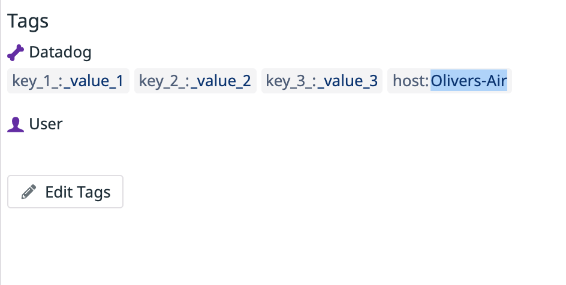

Your answers to the questions go here.

##You can utilize any OS/host that you would like to complete this exercise. However, we recommend one of the following approaches:

##You can spin up a fresh linux VM via Vagrant or other tools so that you don’t run into any OS or dependency issues. Here are instructions for setting up a Vagrant Ubuntu VM. We strongly recommend using minimum v. 16.04 to avoid dependency issues.
##You can utilize a Containerized approach with Docker for Linux and our dockerized Datadog Agent image.
##Then, sign up for Datadog (use “Datadog Recruiting Candidate” in the “Company” field), get the Agent reporting metrics from your local machine.

	-I chose to use both my local osx environment and a Vagrant + Virtual box envrionement to run datadog.

		-osx envrionment:
			-I first downloaded datadog into my local environment envrionment and ran it using the datadog icon located in my 'Applications' folder

		-you may also lauch datadog using the following commands:
			-datadog-agent launch-gui

	-Vagrant + Virtual box environment:

		-Did a fresh install into my ubuntu envrionment usind the following commands:

			- DD_API_KEY=YOUR_API_KEY bash -c "$(curl -L https://raw.githubusercontent.com/DataDog/datadog-agent/master/cmd/agent/install_script.sh)"
			- for the command, I replaced 'YOUR_API_KEY' with the API given to me by datadog
			- API key given: b4371073b027d86e3174258d84d52b8a

	-Starting datadog through the VM

##Add tags in the Agent config file and show us a screenshot of your host and its tags on the Host Map page in Datadog.

	-tags added in the datadog.yaml file

	-tags also added to the datadog UI

##Install a database on your machine (MongoDB, MySQL, or PostgreSQL) and then install the respective Datadog integration for that database.
	-I decided to instal MySQL server on my local osx machine and run the service

##Create custom agent

	-Ran the mysql service and ran the following commands to create user

		mysql> CREATE USER 'datadog'@'localhost' IDENTIFIED BY ‘h8R5BBH1MkDu?lv6xYqC1TEJ’;

	-Grant agent priveleges to collect metrics:
		mysql> ALTER USER 'datadog'@'localhost' WITH MAX_USER_CONNECTIONS 5; (since I am using SQL 8+)

	-Metric collected using the following commands:
		mysql> show databases like 'performance_schema';

##Create a custom Agent check that submits a metric named my_metric with a random value between 0 and 1000.

	-Metric collection in mysql.d/conf.yaml in local osx machine

	
init_config:

instances:
    # NOTE: Even if the server name is "localhost", the agent will connect to MySQL using TCP/IP, unless you also
    # provide a value for the sock key (below).
  - server: localhost
     user: root
     pass: root
     port: 3306             # Optional
     sock: /path/to/sock    # Connect via Unix Socket
     defaults_file: my.cnf  # Alternate configuration mechanism
     connect_timeout: None  # Optional integer seconds
    # tags:                  # Optional
    #   - optional_tag1
    #   - optional_tag2
     options:               # Optional
       replication: false
       replication_channel: channel_1  # If using multiple sources, the channel name to monitor
       replication_non_blocking_status: false  # grab slave count in non-blocking manner (req. performance_schema)
       galera_cluster: false
       extra_status_metrics: true
       extra_innodb_metrics: true
       extra_performance_metrics: true
       schema_size_metrics: false
       disable_innodb_metrics: false
    #

