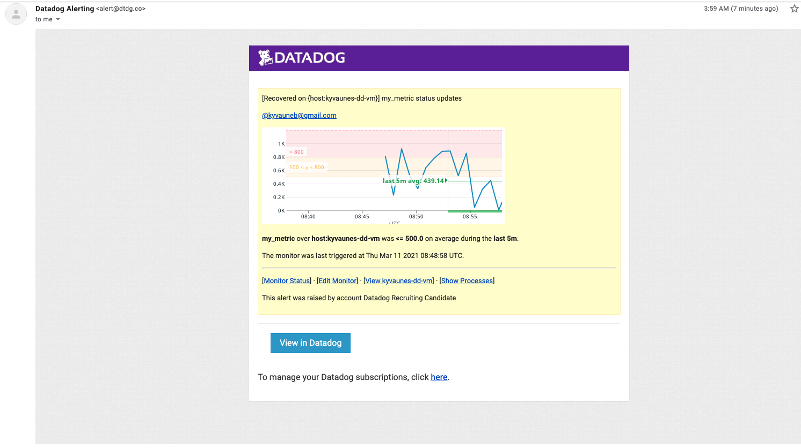

## Questions

Please provide screenshots and code snippets for all steps.

# Prerequisites - Setup the environment

You can utilize any OS/host that you would like to complete this exercise. However, we recommend one of the following approaches:

* You can spin up a fresh linux VM via Vagrant or other tools so that you don’t run into any OS or dependency issues. [Here are instructions](https://github.com/DataDog/hiring-engineers/blob/solutions-engineer/README.md#vagrant) for setting up a Vagrant Ubuntu VM. We strongly recommend using minimum `v. 16.04` to avoid dependency issues.

* You can utilize a Containerized approach with Docker for Linux and our dockerized Datadog Agent image.

Once this is ready, sign up for a trial Datadog at https://www.datadoghq.com/

**Please make sure to use “Datadog Recruiting Candidate” in [the “Company” field](https://a.cl.ly/wbuPdEBy)**

Then, get the Agent reporting metrics from your local machine and move on to the next section...

## Prerequisites - Configuring your environment (Kyvaune's Notes)

Step 1: Setup your Linux VM

See here (https://learn.hashicorp.com/tutorials/vagrant/getting-started-index?in=vagrant/getting-started) for more information on how to install Vagrant and Virtualbox.

After completing the quick-start guide, simply enter “vagrant ssh” into a terminal window. This should connect you to the newly created Linux VM, from which you will then be able to undertake the tasks outlined within this challenge :)

Step 2: Create a trial Datadog Account 

Simply navigate to https://www.datadoghq.com/, click the “Trial” button, and follow in the prompted steps. Be sure to use “Datadog Recruiting Candidate” in the “Company” field. Once your account is created and verified, you are ready to move on to the next step.

Step 3: Datadog Agent Installation

Now that your account is created and your Linux VM active, you are ready to install the Datadog Agent within your environment. The Agent will collect event and metric data from its host (the machine running it) to be ultimately sent to Datadog, for a robust monitoring and performance tracking experience. See here for more on the Datadog Agent (https://docs.datadoghq.com/agent/).

In our case, we will be installing the Agent on a VM running Ubuntu. Thus, we should follow the steps within the Agent 7 Installation Instructions for a Ubuntu instance found here (https://app.datadoghq.com/account/settings#agent/ubuntu). Generally, it is noteworthy that the Datadog Agent 7 is only compatible with Python 3 as of 3/8/21, meaning any custom checks (written in Python) and intended for use by Datadog should also be compatible with Python 3. If this is not possible, see instructions for Agent 6 or Agent 5 installation (also available within the previously shared link).

From this point onward, the Datadog Agent running on our Linux environment should be collecting metric and event data, and we should be ready to proceed with the hiring challenge tasks. The following commands can be used to control the execution of the Datadog Agent within your Linux environment:

```
sudo service datadog-agent start - to start the Datadog Agent service
sudo service datadog-agent stop - to stop the Datadog Agent service
sudo service datadog-agent restart - to restart the Datadog Agent service
sudo service datadog-agent status - to status the Datadog Agent service
```
As a final note, all keys have been removed from this document.

# Collecting Metrics:

* Add tags in the Agent config file and show us a screenshot of your host and its tags on the Host Map page in Datadog.

Step 1: Edit configuration file to include specified tags

Within your newly configured Linux VM, navigate to /etc/datadog-agent/ and use the command “sudo vi datadog.yaml” to open the .yaml file. This file will serve as the configuration for the Agent running on the host machine. Once within the vi editor, scroll to the end of the file, press the “i” key to enter insert mode, and enter the following (as well as any other tags deemed necessary):

```
tags: ["env:dev", "device:ubuntu_vm"]  
```

After entering the above, press the “escape” button to leave insert mode, then “shift + ;”, and finally type “x” and press “enter” to save your configuration changes. This is how we will edit configuration files for the duration of the challenge.

  

* Install a database on your machine (MongoDB, MySQL, or PostgreSQL) and then install the respective Datadog integration for that database.

Step 1: Install MySQL on your newly created Linux VM

To proceed with the below tasks, you will need to install a database on your newly created Linux VM. Follow the steps outlined here (https://phoenixnap.com/kb/how-to-install-mysql-on-ubuntu-18-04) to quickly get up and running.

Step 2: Install Datadog integration

Once a MySQL database is installed on your VM, you can then install it’s Datadog integration by following the steps outlined in documentation found here (https://docs.datadoghq.com/integrations/mysql/?tab=host#pagetitle).

You can check if the MySQL service is running with the command:
```
service --status-all
```

At this point, you should see both the datadog-agent and mysql amongst the services running
```
 [ + ]  datadog-agent
 [ + ]  datadog-agent-process
 [ - ]  datadog-agent-security
 [ + ]  datadog-agent-trace
 [ + ]  dbus
 [ + ]  ebtables
 [ + ]  grub-common
 [ - ]  hwclock.sh
 [ - ]  irqbalance
 [ + ]  iscsid
 [ - ]  keyboard-setup.sh
 [ + ]  kmod
 [ - ]  lvm2
 [ + ]  lvm2-lvmetad
 [ + ]  lvm2-lvmpolld
 [ + ]  lxcfs
 [ - ]  lxd
 [ - ]  mdadm
 [ - ]  mdadm-waitidle
 [ + ]  mysql
 [ - ]  nfs-common
 [ - ]  open-iscsi
 [ - ]  open-vm-tools
```

Tip: For log collection, paths values within mysql.d/conf.yaml should likely be set as the following:

```
<ERROR_LOG_FILE_PATH> to ”/var/log/mysql/error.log"
<SLOW_QUERY_LOG_FILE_PATH> to ”/var/log/mysql/mysql_slow.log"
<GENERAL_LOG_FILE_PATH> to ”/var/log/mysql/mysql.log"
```

This may vary based on your MySQL configuration.

After configuration configuration is complete, conf.d/mysql.d should look similar to as seen below:

  

```
init_config:

instances:
  - server: 127.0.0.1
    user: datadog
    pass: "" #removed for copy/paste
    port: "3306"
    options:
      replication: false
      galera_cluster: true
      extra_status_metrics: true
      extra_innodb_metrics: true
      extra_performance_metrics: true
      schema_size_metrics: false
      disable_innodb_metrics: false

logs:
  - type: file
    path: "/var/log/mysql/error.log"
    source: mysql

  - type: file
    path: "/var/log/mysql/mysql_slow.log"
    source: mysql
    log_processing_rules:
      - type: multi_line
        name: new_slow_query_log_entry
        pattern: "# Time:"

        # If mysqld was started with `--log-short-format`, use:
        # pattern: "# Query_time:"
        # If using mysql version <5.7, use the following rules instead:
        # - type: multi_line
        #   name: new_slow_query_log_entry
        #   pattern: "# Time|# User@Host"
        # - type: exclude_at_match
        #   name: exclude_timestamp_only_line
        #   pattern: "# Time:"

  - type: file
    path: "/var/log/mysql/mysql.log"
    source: mysql
 
    # For multiline logs, if they start by the date with the format yyyy-mm-dd uncomment the following processing rule
    # log_processing_rules:
    #   - type: multi_line
    #     name: new_log_start_with_date
    #     pattern: \d{4}\-(0?[1-9]|1[012])\-(0?[1-9]|[12][0-9]|3[01])
    # If the logs start with a date with the format yymmdd but include a timestamp with each new second, rather than with each log, uncomment the following processing rule
    # log_processing_rules:
    #   - type: multi_line
    #     name: new_logs_do_not_always_start_with_timestamp
    #     pattern: \t\t\s*\d+\s+|\d{6}\s+\d{,2}:\d{2}:\d{2}\t\s*\d+\s+

```

* Create a custom Agent check that submits a metric named my_metric with a random value between 0 and 1000.

Step 1: What is a custom Agent check?

For this step, we will leverage Python to create a customized check that will be performed on the Agent at a specified time interval. Doing so allows users to extend Datadog’s out-of-the-box functionality by writing Python programs to perform “checks” for specified metrics generated by custom applications or other systems. These metrics are then sent to Datadog and are viewable as any other check would be.

As long as the Datadog agent is installed correctly, no further installation is required to create a custom Agent check. The necessary configuration changes are outlined here, as well as how to create the custom Agent check (https://docs.datadoghq.com/developers/write_agent_check/?tab=agentv6v7).

Step 2: Writing a custom Agent check

Before writing our custom Agent check, as previously mentioned, it is important to note that if you are running Agent v7, the code comprising the custom Agent check should be Python 3 compatible. Otherwise, another Datadog Agent 6 (preferably) or 5 should be used.

Understanding this, we are ready to proceed. As dictated by our use case and after review of the Metric Submission: Custom Agent Check documentation (found here: https://docs.datadoghq.com/developers/metrics/agent_metrics_submission/?tab=gauge) we conclude a custom Agent check leveraging gauge() can address our need to submit a value of a metric at a given timestamp - in this case, being a random number between 0 and 1000 every 45 seconds assigned to metric, my_metric. 

Referring to the documentation (https://docs.datadoghq.com/developers/write_agent_check/?tab=agentv6v7), we see an example that very closely addresses our use case, with the only necessary changes being the import of the “random” Python library, and to the “value” parameter of gauge() to instead call randint(). You may also remove the “tags” parameter, as we have below. 

```
import random

# the following try/except block will make the custom check compatible with any Agent version
try:
    # first, try to import the base class from new versions of the Agent...
    from datadog_checks.base import AgentCheck
except ImportError:
    # ...if the above failed, the check is running in Agent version < 6.6.0
    from checks import AgentCheck

# content of the special variable __version__ will be shown in the Agent status page
__version__ = "1.0.0"

class RandomValueCheck(AgentCheck):
    def check(self, instance):
        self.gauge('my_metric', random.randint(0, 1000))
```

Equally worthy of mention is the recommended naming convention for custom checks. In order to avoid conflicts with pre-existing Datadog Agent integrations, it is recommended to prefix each check’s .py and .yaml file with “custom_”. More on integrations and why this is suggested can be found here (https://docs.datadoghq.com/developers/write_agent_check/?tab=agentv6v7).

* Change your check's collection interval so that it only submits the metric once every 45 seconds.

Step 1: Updating the newly created custom Agent check’s collection interval

A custom Agent check’s collection interval is the scheduled minimum time interval (in seconds) required before the aforementioned check can be ran and thus, the underlying metric value collected. It is important to note that the custom check will not necessarily run every x seconds (with x being the value the collection interval is set to), but rather that it will wait at the minimum of x seconds before the metric is queried again since its collection. If there are other integrations or checks enabled on the same Agent, they may be queued ahead of the custom check, thus increasing the amount of time before the metric is actually submitted. More on this can be found here (https://docs.datadoghq.com/developers/write_agent_check/?tab=agentv6v7#collection-interval).

To update the collection interval of our custom Agent check, we must update it’s associated .yaml file to include the following code:

```
init_config:

instances:
  - min_collection_interval: 45
```

After doing so, one should then restart the Datadog Agent service within the Linux VM to reflect any configuration changes.

* **Bonus Question** Can you change the collection interval without modifying the Python check file you created?

Yes, you are able to change the collection interval without modifying the created Python check. To do so, one must have access to the “Metrics Summary” page within the Datadog browser interface (found here: https://app.datadoghq.com/metric/summary). Once on the “Metrics Summary” page, a user can search the name of the metric to have its collection interval changed (in this case, “my_metric”), click on it amongst the search results, and edit the metric’s collection interval using the “Edit” feature.

  

# Visualizing Data:

## Prerequisites

In order to keep this document at reasonable length, we will not go over initial Python installation steps. More on how to install Python 3 on a Linux VM can be found here  (https://linuxize.com/post/how-to-install-python-3-7-on-ubuntu-18-04/). This will be necessary in upcoming tasks.

Before undertaking the tasks immediately below, it is helpful to install Python and Pycharm on a physical machine. Though personal preference, I recommend following the guidance outlined here (https://www.educademy.co.uk/how-to-install-python-and-pycharm-on-mac) if using mac os x and here (https://www.guru99.com/how-to-install-python.html) if using Windows.

Once Python is installed, we will then need to install the Datadog Python library. This can be done by entering the below command into your terminal:

```
pip install datadog
```

From here, one will need to create an app key that will be used to communicate with the Datadog API. Instructions on how to generate an app key can be found here (https://app.datadoghq.com/access/application-keys). An API key is also required, with more on this detailed here (https://app.datadoghq.com/account/settings#api).

It is recommended that any Python script leveraging Datadog’s API begin as seen below:

```
from datadog import initialize, api

options = {
    'api_key': '<DATADOG_APP_KEY>', 'app_key': '<DATADOG_APP_KEY>'
}

initialize(**options)
```

At this point, you should be able to proceed with the tasks outlined below.

Utilize the Datadog API to create a Timeboard that contains:

* Your custom metric scoped over your host.

```
from datadog import initialize, api

options = {
    'api_key': '', 'app_key': ''
}

initialize(**options)

title = "Kyvaune\'s Timeboard"
description = "An informative timeboard."
graphs = [{
    "definition": {
        "events": [],
        "requests": [
            {"q": "my_metric{*} by {host}"}
        ],
        "viz": "timeseries"
        },
    "title": "my_metric Scoped over Host"
    }
]

template_variables = [{
    "name": "kyvaunes-dd-vm",
    "prefix": "host",
    "default": "host:my-host"
}]

read_only = True
response = api.Timeboard.create(
                                 title=title,
                     description=description,
                     graphs=graphs,
                     template_variables=template_variables,
                     read_only=read_only)

print(response) # to check api response
```

* Any metric from the Integration on your Database with the anomaly function applied.

```
from datadog import initialize, api

options = {
    'api_key': '', 'app_key': ''
}

initialize(**options)

title = "Kyvaune\'s Timeboard"
description = "An informative timeboard."
graphs = [{
    "definition": {
        "events": [],
        "requests": [
            {"q": "my_metric{*} by {host}"}
        ],
        "viz": "timeseries"
        },
    "title": "my_metric Scoped over Host"
    },
    {'definition': {'events': [],
                    'requests': [{
                        'q': "anomalies(mysql.performance.kernel_time{*}, 'robust', 2)"}],
                    'viz': 'timeseries'},
     'title': 'Agile Anomaly Function (2 bound)'}
]

template_variables = [{
    "name": "kyvaunes-dd-vm",
    "prefix": "host",
    "default": "host:my-host"
}]

read_only = True
response = api.Timeboard.update(2785799,
                                 title=title,
                     description=description,
                     graphs=graphs,
                     template_variables=template_variables,
                     read_only=read_only)

print(response) # to check api response
```


* Your custom metric with the rollup function applied to sum up all the points for the past hour into one bucket
```
from datadog import initialize, api

options = {
    'api_key': '', 'app_key': ''
}

initialize(**options)

title = "Kyvaune\'s Timeboard"
description = "An informative timeboard."
graphs = [{
    "definition": {
        "events": [],
        "requests": [
            {"q": "my_metric{*} by {host}"}
        ],
        "viz": "timeseries"
        },
    "title": "my_metric Scoped over Host"
    },
    {'definition': {'events': [],
                    'requests': [{
                        'q': "anomalies(mysql.performance.kernel_time{*}, 'robust', 2)"}],
                    'viz': 'timeseries'},
     'title': 'Agile Anomaly Function (2 bound)'},
    {'definition': {'events': [],
                    'requests': [{
                        'q': "sum:my_metric{*}.rollup(sum, 3600)"}],
                    'viz': 'timeseries'},
     'title': 'my_metric over Last Hour'}
]

template_variables = [{
    "name": "kyvaunes-dd-vm",
    "prefix": "host",
    "default": "host:my-host"
}]

read_only = True
response = api.Timeboard.update(2785799,
                                 title=title,
                     description=description,
                     graphs=graphs,
                     template_variables=template_variables,
                     read_only=read_only)

print(response) # to check api response
```
Please be sure, when submitting your hiring challenge, to include the script that you've used to create this Timeboard.

Once this is created, access the Dashboard from your Dashboard List in the UI:

* Set the Timeboard's timeframe to the past 5 minutes - see below for screenshot
* Take a snapshot of this graph and use the @ notation to send it to yourself. - see below for screenshot


* **Bonus Question**: What is the Anomaly graph displaying?

The anomaly graph calls out when an underlying metric is behaving unlike it has in the past by leveraged past trends. There may be issues when using the anomaly function on a new metric, as prompted by the warning we see on our new dashboard.

# Monitoring Data

Since you’ve already caught your test metric going above 800 once, you don’t want to have to continually watch this dashboard to be alerted when it goes above 800 again. So let’s make life easier by creating a monitor.

Create a new Metric Monitor that watches the average of your custom metric (my_metric) and will alert if it’s above the following values over the past 5 minutes:

The below changes can be made by navigating to the “New Monitor” option under “Monitors” within the Datadog web app:

* Warning threshold of 500 - complete see below
* Alerting threshold of 800 - complete see below
* And also ensure that it will notify you if there is No Data for this query over the past 10m. - complete see below


Please configure the monitor’s message so that it will:

* Send you an email whenever the monitor triggers. - complete see above
* Create different messages based on whether the monitor is in an Alert, Warning, or No Data state. -complete see above
* Include the metric value that caused the monitor to trigger and host ip when the Monitor triggers an Alert state. - complete see above
* When this monitor sends you an email notification, take a screenshot of the email that it sends you. - complete see below



* **Bonus Question**: Since this monitor is going to alert pretty often, you don’t want to be alerted when you are out of the office. 

The below changes can be made by navigating to the “Manage Downtime” option under “Monitors” within the Datadog web app:

Set up two scheduled downtimes for this monitor:

  * One that silences it from 7pm to 9am daily on M-F, - complete see below
  * And one that silences it all day on Sat-Sun. - complete see below
  * Make sure that your email is notified when you schedule the downtime and take a screenshot of that notification. - complete, ss of notification setup as opposed to email due to time constraints
  

  


# Collecting APM Data:

## Prequisites

By now, your Linux VM should already have Python3 installed. Run the below commands to install the ddtrace library:

sudo apt update
sudo apt install python3-pip
pip3 install cython
pip3 install ddtrace

Followed by Flask: 

pip3 install flask

At this point, your Linux VM should be able to execute the below Flask application:

Given the following Flask app (or any Python/Ruby/Go app of your choice) instrument this using Datadog’s APM solution:

```python
from flask import Flask
import logging
import sys

# Have flask use stdout as the logger
main_logger = logging.getLogger()
main_logger.setLevel(logging.DEBUG)
c = logging.StreamHandler(sys.stdout)
formatter = logging.Formatter('%(asctime)s - %(name)s - %(levelname)s - %(message)s')
c.setFormatter(formatter)
main_logger.addHandler(c)

app = Flask(__name__)

@app.route('/')
def api_entry():
    return 'Entrypoint to the Application'

@app.route('/api/apm')
def apm_endpoint():
    return 'Getting APM Started'

@app.route('/api/trace')
def trace_endpoint():
    return 'Posting Traces'

if __name__ == '__main__':
    app.run(host='0.0.0.0', port='5050')
```

Assuming the above application is saved to “flask-app.py”, follow the steps listed here (https://docs.datadoghq.com/getting_started/tracing/#run) beginning at “Run”, replacing any instance of the word “hello” with “flask-app”. After a new command prompt has been opened and our Linux VM accessed, enter the below commands into the new window to hit the 3 endpoints provided by our flask app:

```
curl http://0.0.0.0:5050/
curl http://0.0.0.0:5050/api/apm
curl http://0.0.0.0:5050/api/trace
```

After a few moments, we should begin to see metrics such as Total Requests, Total Errors, and Latency, retrieved directly from our running application service. 

* **Note**: Using both ddtrace-run and manually inserting the Middleware has been known to cause issues. Please only use one or the other.

* **Bonus Question**: What is the difference between a Service and a Resource?

A service groups together endpoints, queries, or jobs for the purposes of building your application. A resource represents a particular domain of a customer application such as an instrumented web endpoint, database query, or background job.

* Provide a link and a screenshot of a Dashboard with both APM and Infrastructure Metrics.


See here for a timeboard containing both Infrastrucure and APM metrics (dd-trace-run):
https://p.datadoghq.com/sb/681bc5ca8pp8emul-99f5e7f94fc03ab7e18268f94f3399dc

  

See here for a timeboard containing both Infrastructure and APM metrics (custom instrumenting):
https://p.datadoghq.com/sb/681bc5ca8pp8emul-4e102b24a317e4ea08bbbdcd9dc3f8a7

  

Please include your fully instrumented app in your submission, as well.

```
from flask import Flask
import logging
import sys
from ddtrace import tracer

# Have flask use stdout as the logger
main_logger = logging.getLogger()
main_logger.setLevel(logging.DEBUG)
c = logging.StreamHandler(sys.stdout)
formatter = logging.Formatter('%(asctime)s - %(name)s - %(levelname)s - %(message)s')
c.setFormatter(formatter)
main_logger.addHandler(c)

app = Flask(__name__)

@app.route('/')
def api_entry():
    with tracer.trace('endpoint.source') as span:
        span.set_tag('from_entry_method', 'true')
        return 'Entrypoint to the Application'

@app.route('/api/apm')
def apm_endpoint():
    with tracer.trace('endpoint.source') as span:
        span.set_tag('from_apm_method', 'true')
        return 'Getting APM Started'

@app.route('/api/trace')
def trace_endpoint():
    with tracer.trace('endpoint.source') as span:
        span.set_tag('from_tracer_method', 'true')
        return 'Posting Traces'

if __name__ == '__main__':
    app.run(host='0.0.0.0', port='5050')
```

## Final Question:

Datadog has been used in a lot of creative ways in the past¬. We’ve written some blog posts about using Datadog to monitor the NYC Subway System, Pokemon Go, and even office restroom availability!

Is there anything creative you would use Datadog for?

I’d like to do a timeseries analysis measuring how much COVID-19 has impacted the growth of underprivileged communities. US historical data has shown unemployment being the lowest ever for such communities prior to the COVID-19 pandemic (source: https://www.cnbc.com/2019/10/04/black-and-hispanic-unemployment-is-at-a-record-low.html). Additionally, more recent research has shown that these same communities have been disproportionately impacted by the effects of the pandemic as well. I’d be curious to see how many years back, if any, the pandemic has set these underserved communities as society re-opens and things “return to normal”.  

## Instructions

If you have a question, create an issue in this repository.

To submit your answers:

* Fork this repo.
* Answer the questions in answers.md
* Commit as much code as you need to support your answers.
* Submit a pull request.
* Don't forget to include links to your dashboard(s), even better links and screenshots. We recommend that you include your screenshots inline with your answers.

